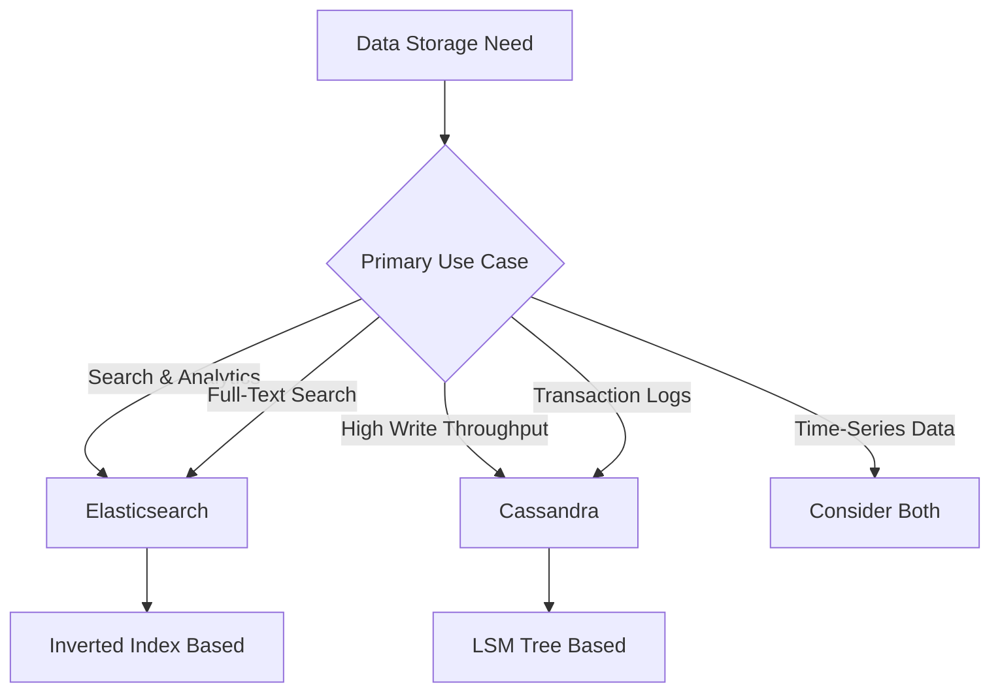
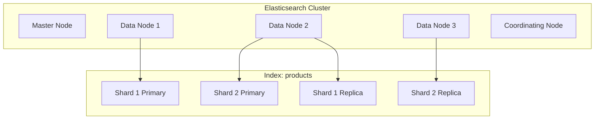
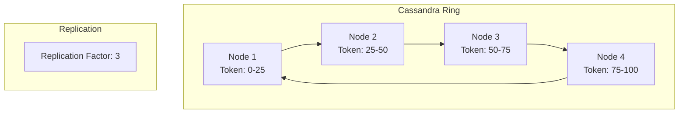
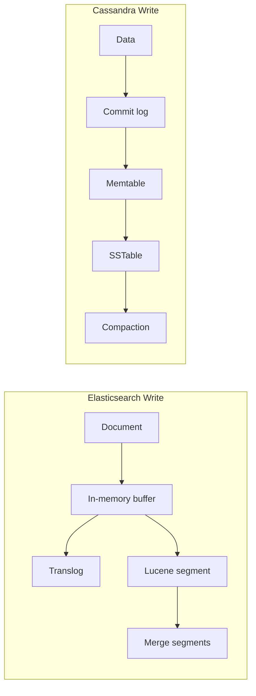
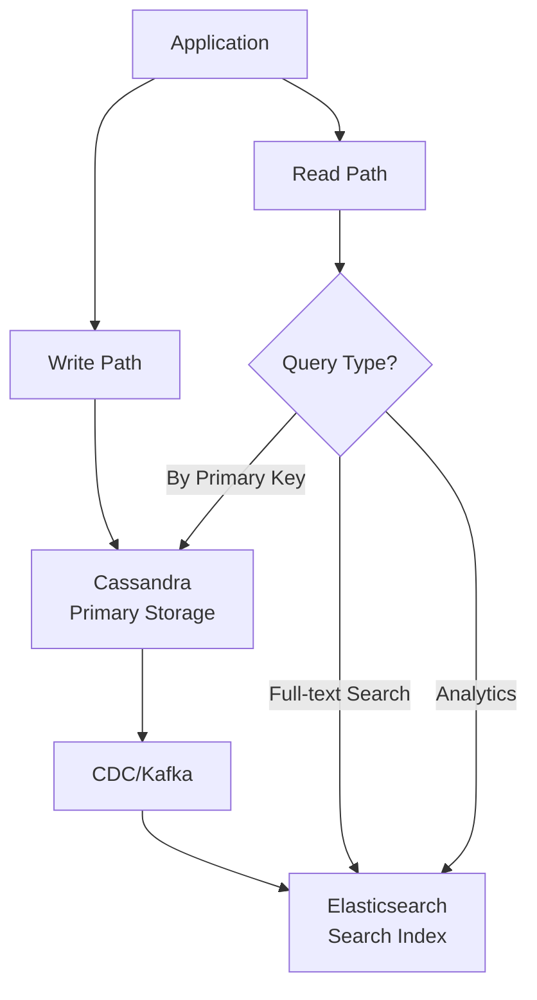
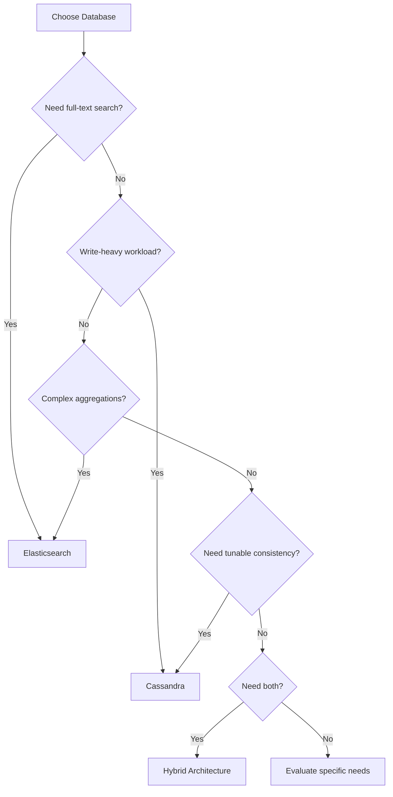

# How to Compare Elasticsearch vs Cassandra

Author: [nawazdhandala](https://www.github.com/nawazdhandala)

Tags: Elasticsearch, Cassandra, Database Comparison, NoSQL, Architecture, Performance

Description: A comprehensive comparison of Elasticsearch and Cassandra covering architecture, use cases, query capabilities, scalability, and when to choose each database for your application requirements.

Elasticsearch and Cassandra are both distributed NoSQL databases, but they serve fundamentally different purposes. Understanding their strengths and limitations helps you choose the right tool for your specific requirements.

## Fundamental Differences



| Aspect | Elasticsearch | Cassandra |
|--------|--------------|-----------|
| Primary Purpose | Search and analytics engine | High-availability distributed database |
| Data Model | Document-oriented (JSON) | Wide-column store |
| Query Language | Query DSL, SQL (via plugin) | CQL (Cassandra Query Language) |
| Indexing | Inverted index (all fields) | Primary key and secondary indexes |
| Consistency | Near real-time, eventual | Tunable consistency |
| Write Pattern | Index then search | Write-optimized (LSM trees) |

## Architecture Comparison

### Elasticsearch Architecture



Elasticsearch uses:
- **Shards**: Horizontal partitioning of indexes
- **Replicas**: Copies of shards for availability
- **Lucene segments**: Immutable index segments per shard
- **Near real-time search**: Documents searchable within ~1 second

### Cassandra Architecture



Cassandra uses:
- **Consistent hashing**: Data distributed by partition key
- **Replication factor**: Number of copies across nodes
- **LSM trees**: Write-optimized storage structure
- **Tunable consistency**: Choose between consistency and availability

## Data Modeling

### Elasticsearch Document

```json
// Index a product document
PUT /products/_doc/1
{
  "name": "Wireless Mouse",
  "description": "Ergonomic wireless mouse with long battery life",
  "price": 29.99,
  "category": "electronics",
  "tags": ["wireless", "ergonomic", "computer accessories"],
  "specs": {
    "battery_life_hours": 120,
    "connection": "2.4GHz",
    "dpi": 1600
  },
  "created_at": "2024-01-15T10:30:00Z"
}
```

### Cassandra Table

```sql
-- Create keyspace
CREATE KEYSPACE ecommerce WITH replication = {
  'class': 'NetworkTopologyStrategy',
  'dc1': 3
};

-- Create table
CREATE TABLE ecommerce.products (
  product_id UUID,
  category TEXT,
  name TEXT,
  description TEXT,
  price DECIMAL,
  tags SET<TEXT>,
  specs MAP<TEXT, TEXT>,
  created_at TIMESTAMP,
  PRIMARY KEY ((category), created_at, product_id)
) WITH CLUSTERING ORDER BY (created_at DESC);

-- Insert data
INSERT INTO ecommerce.products (
  product_id, category, name, description, price, tags, specs, created_at
) VALUES (
  uuid(),
  'electronics',
  'Wireless Mouse',
  'Ergonomic wireless mouse with long battery life',
  29.99,
  {'wireless', 'ergonomic', 'computer accessories'},
  {'battery_life_hours': '120', 'connection': '2.4GHz', 'dpi': '1600'},
  toTimestamp(now())
);
```

## Query Capabilities

### Elasticsearch Queries

Elasticsearch excels at complex searches:

```json
// Full-text search with filters and aggregations
GET /products/_search
{
  "query": {
    "bool": {
      "must": [
        {
          "multi_match": {
            "query": "wireless ergonomic",
            "fields": ["name^2", "description", "tags"]
          }
        }
      ],
      "filter": [
        { "term": { "category": "electronics" } },
        { "range": { "price": { "lte": 50 } } }
      ]
    }
  },
  "aggs": {
    "price_ranges": {
      "range": {
        "field": "price",
        "ranges": [
          { "to": 25 },
          { "from": 25, "to": 50 },
          { "from": 50 }
        ]
      }
    },
    "by_tags": {
      "terms": { "field": "tags.keyword" }
    }
  },
  "highlight": {
    "fields": {
      "description": {}
    }
  }
}
```

### Cassandra Queries

Cassandra queries are optimized for known access patterns:

```sql
-- Query by partition key (fast)
SELECT * FROM products WHERE category = 'electronics';

-- Query with clustering column (fast)
SELECT * FROM products
WHERE category = 'electronics'
AND created_at > '2024-01-01';

-- Query specific partition and row
SELECT * FROM products
WHERE category = 'electronics'
AND created_at = '2024-01-15 10:30:00'
AND product_id = some-uuid;

-- ALLOW FILTERING (slow, not recommended for production)
SELECT * FROM products
WHERE price < 50
ALLOW FILTERING;
```

## Performance Characteristics

### Write Performance



| Metric | Elasticsearch | Cassandra |
|--------|--------------|-----------|
| Write latency | 10-100ms | 1-10ms |
| Write throughput | 10K-50K docs/sec | 50K-200K ops/sec |
| Write consistency | Eventual | Tunable |
| Durability | Translog | Commit log |

### Read Performance

| Metric | Elasticsearch | Cassandra |
|--------|--------------|-----------|
| Point lookup | 1-10ms | <1ms |
| Full-text search | 10-100ms | Not supported |
| Range scan | 10-500ms | 1-50ms |
| Aggregations | 50-5000ms | Limited |

## Use Case Comparison

### When to Choose Elasticsearch

1. **Full-text search requirements**

```json
// Search across product catalog
GET /products/_search
{
  "query": {
    "match": {
      "description": "lightweight comfortable running"
    }
  },
  "suggest": {
    "text": "runnng shoes",
    "simple_phrase": {
      "phrase": {
        "field": "description"
      }
    }
  }
}
```

2. **Log analytics and observability**

```json
// Analyze error patterns
GET /logs-*/_search
{
  "query": {
    "bool": {
      "must": [
        { "match": { "level": "ERROR" } },
        { "range": { "@timestamp": { "gte": "now-1h" } } }
      ]
    }
  },
  "aggs": {
    "errors_over_time": {
      "date_histogram": {
        "field": "@timestamp",
        "fixed_interval": "5m"
      }
    },
    "by_service": {
      "terms": { "field": "service.keyword" }
    }
  }
}
```

3. **Real-time dashboards with complex aggregations**

```json
// Dashboard metrics
GET /metrics/_search
{
  "size": 0,
  "aggs": {
    "percentiles": {
      "percentiles": {
        "field": "response_time",
        "percents": [50, 90, 95, 99]
      }
    },
    "by_endpoint": {
      "terms": { "field": "endpoint.keyword" },
      "aggs": {
        "avg_response": { "avg": { "field": "response_time" } }
      }
    }
  }
}
```

### When to Choose Cassandra

1. **High write throughput with time-series data**

```sql
-- IoT sensor data
CREATE TABLE iot.sensor_readings (
  sensor_id UUID,
  bucket_date DATE,
  reading_time TIMESTAMP,
  temperature DOUBLE,
  humidity DOUBLE,
  PRIMARY KEY ((sensor_id, bucket_date), reading_time)
) WITH CLUSTERING ORDER BY (reading_time DESC);

-- Fast writes for streaming data
INSERT INTO iot.sensor_readings (
  sensor_id, bucket_date, reading_time, temperature, humidity
) VALUES (
  ?, ?, toTimestamp(now()), ?, ?
);
```

2. **User activity and event storage**

```sql
-- User activity timeline
CREATE TABLE social.user_timeline (
  user_id UUID,
  activity_time TIMESTAMP,
  activity_type TEXT,
  activity_data TEXT,
  PRIMARY KEY ((user_id), activity_time)
) WITH CLUSTERING ORDER BY (activity_time DESC);

-- Get recent activity
SELECT * FROM social.user_timeline
WHERE user_id = ?
LIMIT 50;
```

3. **Shopping cart and session storage**

```sql
-- Shopping cart
CREATE TABLE ecommerce.shopping_cart (
  user_id UUID,
  product_id UUID,
  quantity INT,
  added_at TIMESTAMP,
  PRIMARY KEY ((user_id), product_id)
);

-- Fast cart operations
UPDATE ecommerce.shopping_cart
SET quantity = quantity + 1
WHERE user_id = ? AND product_id = ?;
```

## Hybrid Architecture

Many applications benefit from using both:



### Implementation Example

```python
from cassandra.cluster import Cluster
from elasticsearch import Elasticsearch

# Initialize clients
cassandra = Cluster(['cassandra-host']).connect('ecommerce')
es = Elasticsearch(['http://elasticsearch-host:9200'])

class ProductService:
    def create_product(self, product):
        """Write to both Cassandra and Elasticsearch."""

        # Primary storage in Cassandra
        cassandra.execute("""
            INSERT INTO products (product_id, category, name, price, description)
            VALUES (%s, %s, %s, %s, %s)
        """, (product['id'], product['category'], product['name'],
              product['price'], product['description']))

        # Index for search in Elasticsearch
        es.index(
            index='products',
            id=product['id'],
            body=product
        )

    def get_by_id(self, product_id):
        """Fast lookup from Cassandra."""
        result = cassandra.execute(
            "SELECT * FROM products WHERE product_id = %s",
            (product_id,)
        )
        return dict(result.one()) if result else None

    def search(self, query_text, filters=None):
        """Full-text search via Elasticsearch."""
        body = {
            "query": {
                "bool": {
                    "must": [
                        {"match": {"description": query_text}}
                    ]
                }
            }
        }

        if filters:
            body["query"]["bool"]["filter"] = filters

        return es.search(index='products', body=body)
```

## Operational Comparison

| Aspect | Elasticsearch | Cassandra |
|--------|--------------|-----------|
| Backup | Snapshots to repository | Incremental backups, snapshots |
| Scaling | Add nodes, rebalance shards | Add nodes to ring |
| Schema changes | Dynamic mapping | ALTER TABLE |
| Upgrades | Rolling upgrades | Rolling upgrades |
| Monitoring | /_cluster/health, /_stats | nodetool, JMX |

### Elasticsearch Cluster Health

```json
GET /_cluster/health

{
  "cluster_name": "production",
  "status": "green",
  "number_of_nodes": 6,
  "number_of_data_nodes": 4,
  "active_primary_shards": 50,
  "active_shards": 100,
  "unassigned_shards": 0
}
```

### Cassandra Node Status

```bash
nodetool status

Datacenter: dc1
===============
Status=Up/Down
State=Normal/Leaving/Joining/Moving
--  Address       Load       Tokens  Owns    Host ID
UN  192.168.1.1   150.5 GB   256     25.0%   uuid-1
UN  192.168.1.2   148.2 GB   256     25.0%   uuid-2
UN  192.168.1.3   151.8 GB   256     25.0%   uuid-3
UN  192.168.1.4   149.1 GB   256     25.0%   uuid-4
```

## Cost and Resource Comparison

| Resource | Elasticsearch | Cassandra |
|----------|--------------|-----------|
| Memory | High (heap for indexing) | Moderate (off-heap bloom filters) |
| Storage | Higher (inverted indexes) | Lower (compressed SSTables) |
| CPU | Search-intensive | Write-intensive |
| Network | Moderate | High (replication) |

## Decision Matrix



## Conclusion

Elasticsearch and Cassandra serve different primary purposes:

**Choose Elasticsearch when you need:**
- Full-text search capabilities
- Complex aggregations and analytics
- Log analysis and observability
- Near real-time search requirements

**Choose Cassandra when you need:**
- High write throughput
- Linear scalability
- Tunable consistency
- Time-series data storage
- Geographic distribution

**Consider both when you need:**
- Primary storage with search capabilities
- High write throughput with complex queries
- Best of both worlds for different access patterns

The best choice depends on your specific requirements, and often the answer is to use both in a complementary architecture.

---

**Related Reading:**

- [How to Bulk Index JSON Data in Elasticsearch](https://oneuptime.com/blog/post/2025-12-19-bulk-index-json-data-elasticsearch/view)
- [How to Handle Unassigned Shards in Elasticsearch](https://oneuptime.com/blog/post/2025-12-19-handle-unassigned-shards-elasticsearch/view)
- [How to Match vs Term Query in Elasticsearch](https://oneuptime.com/blog/post/2025-12-19-match-vs-term-query-elasticsearch/view)
