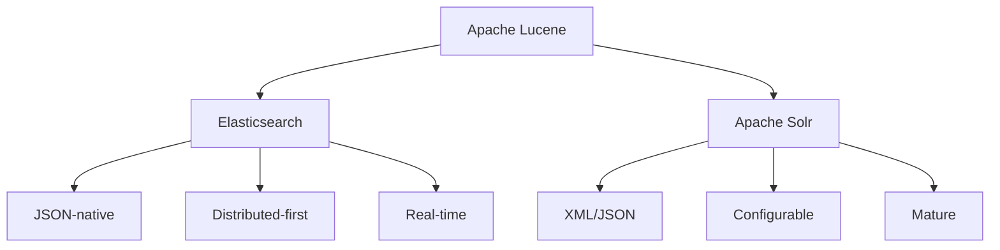
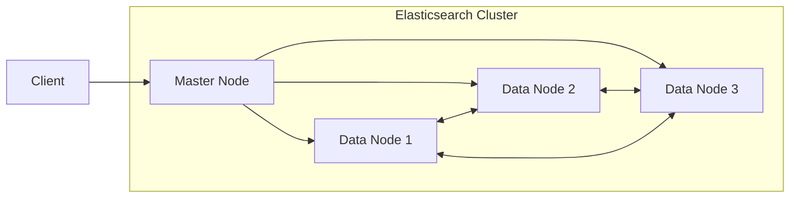
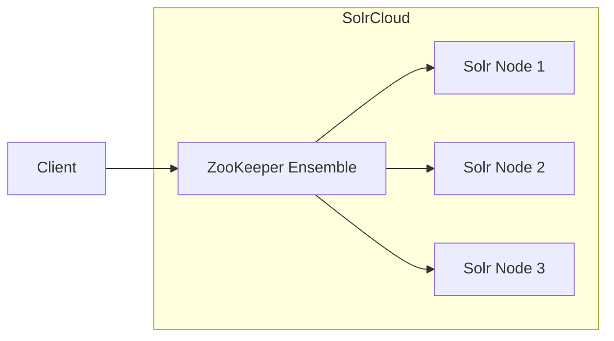

# How to Choose Between Elasticsearch and Solr

Author: [nawazdhandala](https://www.github.com/nawazdhandala)

Tags: Elasticsearch, Solr, Search, Comparison, Lucene, Full-Text Search

Description: A comprehensive comparison between Elasticsearch and Solr to help you choose the right search engine for your project. Covers architecture, features, performance, and real-world use cases.

---

## Overview

Both Elasticsearch and Solr are built on Apache Lucene and offer powerful full-text search capabilities. However, they differ significantly in architecture, operational model, and ecosystem.



## Quick Comparison

| Feature | Elasticsearch | Solr |
|---------|--------------|------|
| License | SSPL / Elastic License | Apache 2.0 |
| API | REST + JSON | REST + XML/JSON |
| Configuration | Dynamic | Static (schema.xml) |
| Clustering | Built-in | SolrCloud (ZooKeeper) |
| Real-time indexing | Native | Near real-time |
| Analytics | Aggregations | Faceting + Stats |
| Machine Learning | X-Pack ML | Limited |
| Community | Commercial + Open | Pure Apache |

## Architecture Differences

### Elasticsearch Architecture

Elasticsearch is designed distributed from the ground up:



- **Masterless discovery** - Nodes find each other automatically
- **Automatic shard allocation** - No manual configuration needed
- **Dynamic mapping** - Schema is inferred from documents

### Solr Architecture

Solr uses ZooKeeper for coordination in SolrCloud mode:



- **ZooKeeper dependency** - External coordination service required
- **Collection/Core model** - More explicit configuration
- **Schema-driven** - Define fields before indexing

## Configuration Approach

### Elasticsearch: Dynamic by Default

Create index and start indexing immediately:

```json
POST /products/_doc
{
  "name": "Laptop",
  "price": 999.99,
  "category": "Electronics",
  "created": "2024-01-15"
}
```

Elasticsearch infers types automatically. You can also define explicit mappings:

```json
PUT /products
{
  "mappings": {
    "properties": {
      "name": {"type": "text"},
      "price": {"type": "float"},
      "category": {"type": "keyword"},
      "created": {"type": "date"}
    }
  }
}
```

### Solr: Schema Required

Solr traditionally requires schema definition upfront in `schema.xml`:

```xml
<schema name="products" version="1.6">
  <field name="id" type="string" indexed="true" stored="true" required="true"/>
  <field name="name" type="text_general" indexed="true" stored="true"/>
  <field name="price" type="pfloat" indexed="true" stored="true"/>
  <field name="category" type="string" indexed="true" stored="true"/>
  <field name="created" type="pdate" indexed="true" stored="true"/>

  <uniqueKey>id</uniqueKey>
</schema>
```

Modern Solr supports schemaless mode, but explicit schemas are still recommended.

## Query Syntax

### Elasticsearch Query DSL

```json
GET /products/_search
{
  "query": {
    "bool": {
      "must": [
        {"match": {"name": "laptop"}}
      ],
      "filter": [
        {"range": {"price": {"lte": 1500}}},
        {"term": {"category": "Electronics"}}
      ]
    }
  },
  "sort": [{"price": "asc"}],
  "size": 10
}
```

### Solr Query Syntax

```
GET /solr/products/select?
  q=name:laptop
  &fq=price:[* TO 1500]
  &fq=category:Electronics
  &sort=price asc
  &rows=10
  &wt=json
```

Or with JSON request handler:

```json
{
  "query": "name:laptop",
  "filter": [
    "price:[* TO 1500]",
    "category:Electronics"
  ],
  "sort": "price asc",
  "limit": 10
}
```

## Analytics and Aggregations

### Elasticsearch Aggregations

```json
GET /products/_search
{
  "size": 0,
  "aggs": {
    "categories": {
      "terms": {"field": "category"},
      "aggs": {
        "avg_price": {"avg": {"field": "price"}},
        "price_ranges": {
          "range": {
            "field": "price",
            "ranges": [
              {"to": 100},
              {"from": 100, "to": 500},
              {"from": 500}
            ]
          }
        }
      }
    }
  }
}
```

### Solr Faceting

```
GET /solr/products/select?
  q=*:*
  &facet=true
  &facet.field=category
  &facet.range=price
  &facet.range.start=0
  &facet.range.end=1000
  &facet.range.gap=100
  &stats=true
  &stats.field=price
```

Elasticsearch aggregations are generally more powerful and flexible than Solr faceting.

## Performance Characteristics

### Indexing Performance

| Scenario | Elasticsearch | Solr |
|----------|--------------|------|
| Bulk indexing | Very fast | Fast |
| Single document | Fast | Moderate |
| Near real-time search | < 1 second | Configurable |
| Index refresh | Automatic | Manual commit |

### Search Performance

Both are comparable for most search workloads. Differences emerge at scale:

- **Elasticsearch** - Better for log analytics and time-series data
- **Solr** - Optimized for traditional enterprise search

## Cluster Management

### Elasticsearch

```json
// Check cluster health
GET /_cluster/health

// Node info
GET /_nodes/stats

// Shard allocation
GET /_cat/shards?v
```

Elasticsearch provides rich APIs for cluster management without external tools.

### Solr

```bash
# Collection management
bin/solr create -c products -s 2 -rf 2

# Cluster status
curl http://localhost:8983/solr/admin/collections?action=CLUSTERSTATUS
```

Requires ZooKeeper administration knowledge for production clusters.

## Ecosystem and Integrations

### Elasticsearch Ecosystem

- **Kibana** - Visualization and dashboards
- **Logstash** - Data ingestion pipeline
- **Beats** - Lightweight data shippers
- **X-Pack** - Security, ML, alerting (commercial)
- **APM** - Application performance monitoring

### Solr Ecosystem

- **Banana** - Kibana port for Solr
- **Apache NiFi** - Data flow automation
- **Hadoop Integration** - HDFS storage
- **Streaming API** - Real-time data processing

## Use Case Recommendations

### Choose Elasticsearch When:

1. **Log analytics** - ELK stack is industry standard
2. **Real-time search** - Automatic refresh, no commit needed
3. **JSON-native APIs** - Modern application development
4. **Observability** - Metrics, traces, and logs together
5. **Rapid prototyping** - Dynamic mapping speeds development
6. **Managed cloud** - AWS OpenSearch, Elastic Cloud

### Choose Solr When:

1. **True open source** - Apache 2.0 license matters
2. **Enterprise search** - Mature faceting and highlighting
3. **eCommerce** - Strong merchandising features
4. **Document-heavy** - PDF/Word extraction built-in
5. **Existing Hadoop** - Deep integration
6. **On-premises** - Full control, no license concerns

## Migration Considerations

### Migrating Solr to Elasticsearch

```python
from pysolr import Solr
from elasticsearch import Elasticsearch, helpers

solr = Solr('http://localhost:8983/solr/products')
es = Elasticsearch(['http://localhost:9200'])

def migrate():
    # Fetch from Solr
    results = solr.search('*:*', rows=1000)

    # Transform for Elasticsearch
    actions = [
        {
            '_index': 'products',
            '_id': doc['id'],
            '_source': {k: v for k, v in doc.items() if k != 'id'}
        }
        for doc in results
    ]

    # Bulk index to Elasticsearch
    helpers.bulk(es, actions)
```

### Migrating Elasticsearch to Solr

```python
from elasticsearch import Elasticsearch
import pysolr

es = Elasticsearch(['http://localhost:9200'])
solr = Solr('http://localhost:8983/solr/products')

def migrate():
    # Scroll through Elasticsearch
    results = es.search(
        index='products',
        scroll='2m',
        size=1000,
        body={'query': {'match_all': {}}}
    )

    while results['hits']['hits']:
        docs = [
            {**hit['_source'], 'id': hit['_id']}
            for hit in results['hits']['hits']
        ]
        solr.add(docs)

        results = es.scroll(
            scroll_id=results['_scroll_id'],
            scroll='2m'
        )

    solr.commit()
```

## Cost Considerations

| Factor | Elasticsearch | Solr |
|--------|--------------|------|
| License | SSPL (self-managed) or Elastic License | Apache 2.0 |
| Cloud offering | Elastic Cloud, AWS OpenSearch | Limited managed options |
| Support | Elastic subscription | Lucidworks, community |
| Operational overhead | Lower | Higher (ZooKeeper) |

## Conclusion

Both Elasticsearch and Solr are excellent search engines with different strengths. Elasticsearch excels in modern cloud-native environments with its developer-friendly APIs and integrated observability stack. Solr remains strong in traditional enterprise search with its pure Apache license and mature feature set.

For new projects in 2024+, Elasticsearch or OpenSearch is often the default choice due to better tooling and easier operations. However, if license terms are critical or you have existing Hadoop infrastructure, Solr remains a solid option.

Choose based on your specific requirements: real-time analytics favor Elasticsearch, while traditional enterprise search with complex faceting might lean toward Solr.
