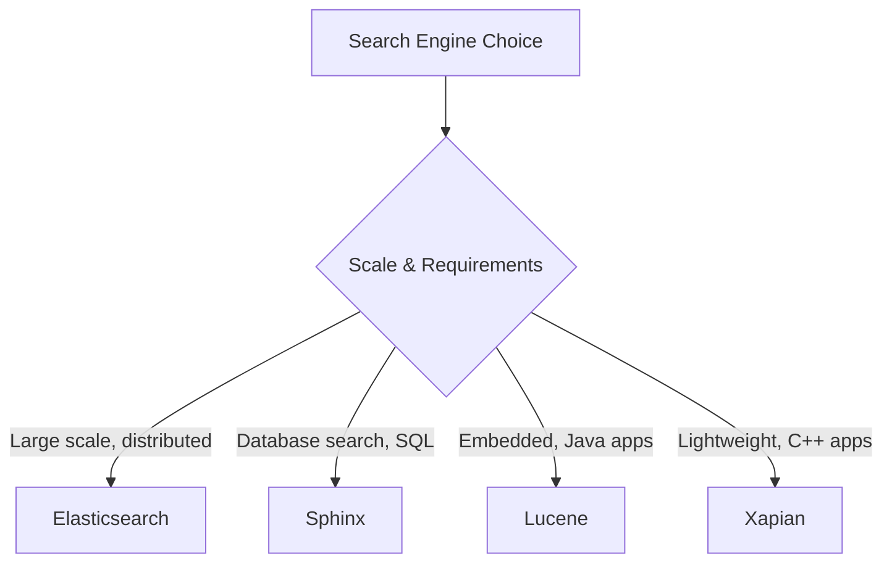
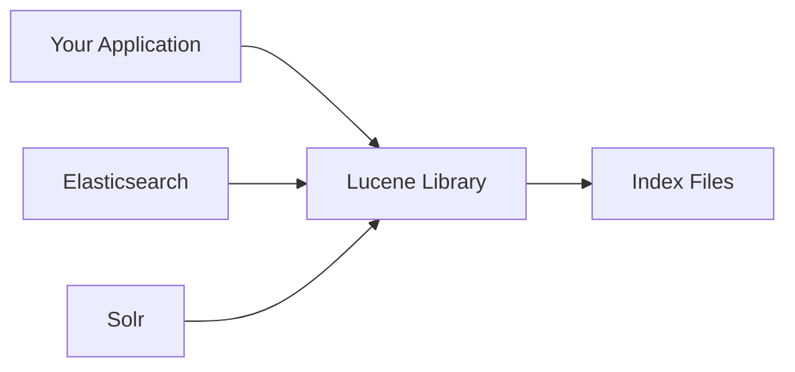
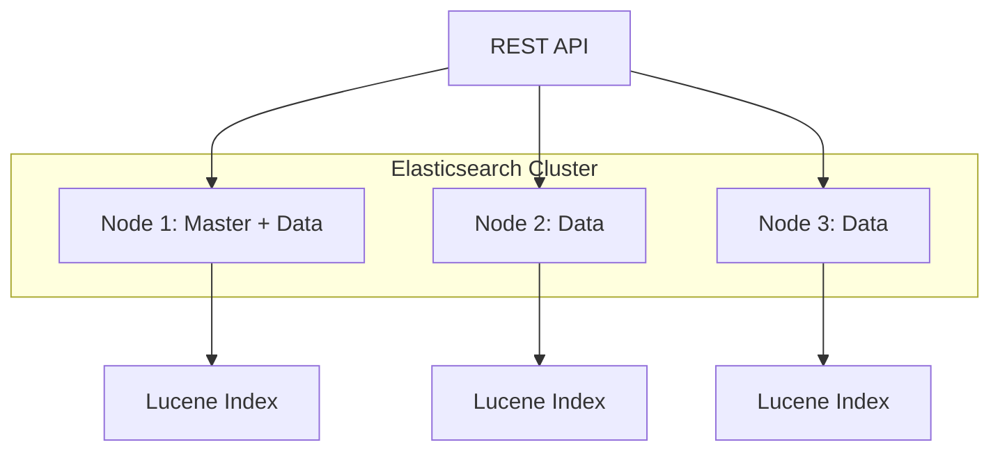
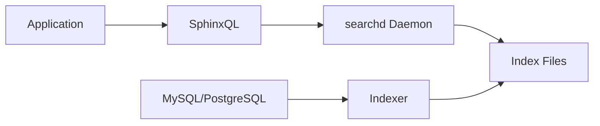
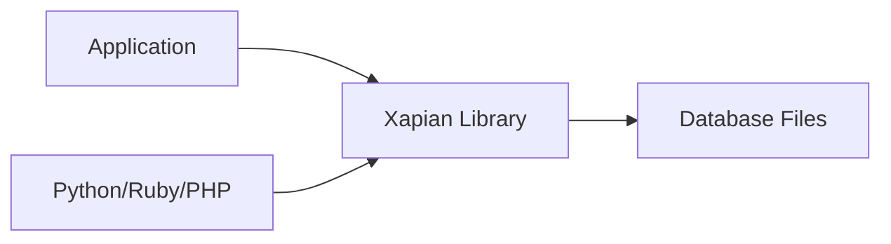
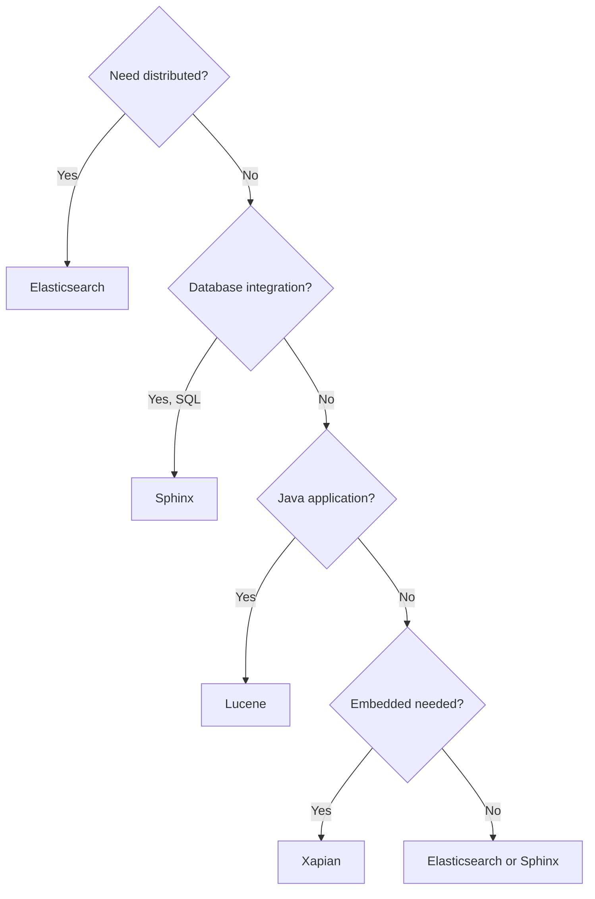

# How to Compare Elasticsearch vs Sphinx vs Lucene vs Xapian

Author: [nawazdhandala](https://www.github.com/nawazdhandala)

Tags: Elasticsearch, Sphinx, Lucene, Xapian, Search Engines, Full-Text Search, Comparison

Description: A detailed comparison of popular search engines - Elasticsearch, Sphinx, Lucene, and Xapian. Learn their architectures, strengths, weaknesses, and ideal use cases to choose the right one for your project.

---

## Overview of Search Engines

Each search engine serves different needs and scales. Here is how they compare at a high level:



## Quick Comparison Table

| Feature | Elasticsearch | Sphinx | Lucene | Xapian |
|---------|--------------|--------|--------|--------|
| Language | Java | C++ | Java | C++ |
| Architecture | Distributed | Standalone/Cluster | Library | Library |
| API | REST | SphinxQL/Binary | Java API | C++/Bindings |
| Scaling | Horizontal | Limited | Manual | Manual |
| Real-time | Yes | Delta indexes | Yes | Yes |
| License | SSPL | GPL v2 | Apache 2.0 | GPL v2 |
| Learning Curve | Medium | Low | High | Medium |

## Apache Lucene

Lucene is the foundation - a Java library for full-text search.

### What is Lucene?

Lucene is not a standalone server but a search library. Both Elasticsearch and Solr are built on top of Lucene.



### When to Use Lucene Directly

- **Embedded search** - Search within your Java application
- **Maximum control** - Custom ranking, analyzers, index formats
- **No network overhead** - Direct library access
- **Resource constrained** - No server overhead

### Basic Lucene Example

```java
import org.apache.lucene.analysis.standard.StandardAnalyzer;
import org.apache.lucene.document.*;
import org.apache.lucene.index.*;
import org.apache.lucene.queryparser.classic.QueryParser;
import org.apache.lucene.search.*;
import org.apache.lucene.store.FSDirectory;

public class LuceneExample {

    public void indexDocuments() throws Exception {
        FSDirectory directory = FSDirectory.open(Paths.get("/index"));
        StandardAnalyzer analyzer = new StandardAnalyzer();
        IndexWriterConfig config = new IndexWriterConfig(analyzer);
        IndexWriter writer = new IndexWriter(directory, config);

        Document doc = new Document();
        doc.add(new TextField("title", "Introduction to Search", Field.Store.YES));
        doc.add(new TextField("content", "Full text search explained", Field.Store.YES));
        doc.add(new StringField("category", "tutorial", Field.Store.YES));

        writer.addDocument(doc);
        writer.close();
    }

    public void searchDocuments() throws Exception {
        FSDirectory directory = FSDirectory.open(Paths.get("/index"));
        IndexReader reader = DirectoryReader.open(directory);
        IndexSearcher searcher = new IndexSearcher(reader);

        StandardAnalyzer analyzer = new StandardAnalyzer();
        QueryParser parser = new QueryParser("content", analyzer);
        Query query = parser.parse("search");

        TopDocs results = searcher.search(query, 10);
        for (ScoreDoc scoreDoc : results.scoreDocs) {
            Document doc = searcher.doc(scoreDoc.doc);
            System.out.println(doc.get("title") + " - " + scoreDoc.score);
        }

        reader.close();
    }
}
```

### Lucene Pros and Cons

**Pros:**
- Maximum performance (no network)
- Complete control over indexing
- Extensive documentation
- Foundation for other tools

**Cons:**
- Java only (native)
- No clustering built-in
- Complex to implement correctly
- Must handle persistence yourself

## Elasticsearch

Elasticsearch wraps Lucene with distribution, REST APIs, and operational tools.

### Architecture



### When to Use Elasticsearch

- **Large scale search** - Billions of documents
- **Log analytics** - ELK stack
- **Real-time search** - Near instant indexing
- **REST APIs** - Language agnostic
- **Managed infrastructure** - Cloud options

### Elasticsearch Example

```json
PUT /articles/_doc/1
{
  "title": "Introduction to Search",
  "content": "Full text search explained",
  "category": "tutorial"
}

GET /articles/_search
{
  "query": {
    "match": {
      "content": "search"
    }
  }
}
```

### Elasticsearch Pros and Cons

**Pros:**
- Distributed by design
- Rich query language
- Excellent tooling (Kibana)
- Active development

**Cons:**
- Resource intensive
- JVM overhead
- License concerns (SSPL)
- Operational complexity at scale

## Sphinx Search

Sphinx is optimized for database-driven applications with SQL-like queries.

### Architecture



### When to Use Sphinx

- **Database search** - Direct MySQL/PostgreSQL integration
- **SQL familiarity** - SphinxQL syntax
- **Limited resources** - Low memory footprint
- **Simple deployment** - Single binary

### Sphinx Configuration

```ini
# sphinx.conf
source articles
{
    type = mysql
    sql_host = localhost
    sql_user = root
    sql_pass = secret
    sql_db = myapp

    sql_query = SELECT id, title, content, category FROM articles

    sql_attr_string = category
}

index articles_index
{
    source = articles
    path = /var/sphinx/articles

    min_word_len = 3
    morphology = stem_en
}

searchd
{
    listen = 9306:mysql41
    pid_file = /var/sphinx/searchd.pid
}
```

### Sphinx Queries (SphinxQL)

```sql
-- Connect via MySQL protocol
mysql -h 127.0.0.1 -P 9306

-- Search query
SELECT * FROM articles_index
WHERE MATCH('full text search')
ORDER BY WEIGHT() DESC
LIMIT 10;

-- With filtering
SELECT * FROM articles_index
WHERE MATCH('search')
  AND category = 'tutorial'
ORDER BY WEIGHT() DESC;
```

### Real-Time Indexes in Sphinx

```sql
-- Create real-time index
CREATE TABLE rt_articles (
    id BIGINT,
    title TEXT,
    content TEXT,
    category STRING
);

-- Insert documents
INSERT INTO rt_articles (id, title, content, category)
VALUES (1, 'Search Guide', 'How to search effectively', 'tutorial');

-- Search
SELECT * FROM rt_articles WHERE MATCH('search');
```

### Sphinx Pros and Cons

**Pros:**
- SQL-like syntax (familiar)
- Low resource usage
- Fast indexing
- MySQL protocol support

**Cons:**
- Limited scaling options
- Smaller community
- Less active development
- Basic analytics

## Xapian

Xapian is a lightweight C++ search library with bindings for many languages.

### Architecture



### When to Use Xapian

- **Embedded search** - Within your application
- **Multi-language** - Python, Ruby, PHP, etc.
- **Lightweight** - Minimal dependencies
- **Offline applications** - Desktop/mobile search

### Xapian Python Example

```python
import xapian

# Create and populate index
db = xapian.WritableDatabase('/var/xapian/articles', xapian.DB_CREATE_OR_OPEN)
indexer = xapian.TermGenerator()
stemmer = xapian.Stem("english")
indexer.set_stemmer(stemmer)

# Index a document
doc = xapian.Document()
doc.set_data('{"title": "Search Guide", "content": "How to search"}')

indexer.set_document(doc)
indexer.index_text("Search Guide", 1, "S")  # Title with prefix
indexer.index_text("How to search effectively")  # Content

doc.add_boolean_term("Ctutorial")  # Category filter

db.add_document(doc)
db.commit()

# Search
db = xapian.Database('/var/xapian/articles')
queryparser = xapian.QueryParser()
queryparser.set_stemmer(stemmer)
queryparser.set_database(db)

query = queryparser.parse_query("search")
enquire = xapian.Enquire(db)
enquire.set_query(query)

for match in enquire.get_mset(0, 10):
    print(f"Doc {match.docid}: {match.document.get_data()}")
```

### Xapian Features

```python
# Boolean queries
query = xapian.Query(
    xapian.Query.OP_AND,
    xapian.Query("search"),
    xapian.Query("Ctutorial")  # Category filter
)

# Phrase queries
query = queryparser.parse_query(
    '"full text search"',
    xapian.QueryParser.FLAG_PHRASE
)

# Wildcard queries
query = queryparser.parse_query(
    "search*",
    xapian.QueryParser.FLAG_WILDCARD
)

# Value ranges
query = xapian.Query(
    xapian.Query.OP_VALUE_RANGE,
    0,  # Value slot
    "2024-01-01",
    "2024-12-31"
)
```

### Xapian Pros and Cons

**Pros:**
- Lightweight and fast
- Many language bindings
- No server required
- Probabilistic ranking

**Cons:**
- No clustering
- Limited tooling
- Smaller ecosystem
- Manual scaling

## Performance Comparison

### Indexing Speed

| Engine | 1M docs | 10M docs | Notes |
|--------|---------|----------|-------|
| Elasticsearch | 5-10 min | 50-100 min | Bulk API |
| Sphinx | 2-5 min | 20-50 min | Batch indexer |
| Lucene | 3-8 min | 30-80 min | Direct API |
| Xapian | 4-10 min | 40-100 min | Single thread |

### Search Latency

| Engine | Simple query | Complex query | Notes |
|--------|-------------|---------------|-------|
| Elasticsearch | 5-20ms | 50-200ms | Network overhead |
| Sphinx | 1-10ms | 20-100ms | SphinxQL |
| Lucene | 0.1-5ms | 10-50ms | No network |
| Xapian | 0.5-10ms | 20-80ms | No network |

### Memory Usage

| Engine | Base | Per 1M docs |
|--------|------|-------------|
| Elasticsearch | 1-2 GB | 0.5-1 GB |
| Sphinx | 50-100 MB | 200-500 MB |
| Lucene | 100-500 MB | 300-800 MB |
| Xapian | 10-50 MB | 100-300 MB |

## Decision Matrix



## Recommendation Summary

| Use Case | Recommended Engine |
|----------|-------------------|
| Web-scale search | Elasticsearch |
| Log analytics | Elasticsearch |
| Database-driven site | Sphinx |
| Java application | Lucene |
| Python/Ruby application | Xapian |
| Desktop application | Xapian |
| Maximum performance | Lucene |
| Simplest deployment | Sphinx |

## Conclusion

Each search engine excels in different scenarios:

- **Elasticsearch**: Best for large-scale, distributed search with rich analytics
- **Sphinx**: Ideal for database-driven applications with SQL familiarity
- **Lucene**: Perfect for embedded search in Java applications requiring maximum control
- **Xapian**: Great for lightweight, embedded search in non-Java applications

Consider your scale requirements, team expertise, and deployment constraints when making your choice. For most modern web applications, Elasticsearch provides the best balance of features and ease of use, but simpler requirements may be better served by Sphinx or an embedded solution.
