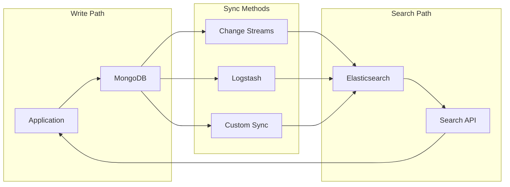

# How to Use Elasticsearch with MongoDB

Author: [nawazdhandala](https://www.github.com/nawazdhandala)

Tags: Elasticsearch, MongoDB, Data Sync, Search, Integration, Change Streams

Description: Learn how to integrate Elasticsearch with MongoDB for powerful full-text search capabilities using change streams, Logstash, and custom sync solutions.

---

MongoDB excels at flexible document storage while Elasticsearch provides superior full-text search and analytics capabilities. Combining them gives you the best of both worlds. This guide covers multiple integration patterns with their trade-offs.

## Integration Architecture



## Why Combine MongoDB and Elasticsearch?

| Feature | MongoDB | Elasticsearch |
|---------|---------|---------------|
| Document storage | Excellent | Good |
| Full-text search | Basic | Excellent |
| Aggregations | Good | Excellent |
| Real-time analytics | Limited | Excellent |
| Faceted search | Limited | Excellent |
| Geospatial | Good | Excellent |

## Method 1: MongoDB Change Streams with Custom Sync

Change streams provide real-time notifications of data changes.

### Python Sync Service

```python
from pymongo import MongoClient
from elasticsearch import Elasticsearch
from elasticsearch.helpers import bulk
import threading
import time
from datetime import datetime

# MongoDB connection
mongo_client = MongoClient("mongodb://localhost:27017")
mongo_db = mongo_client["myapp"]

# Elasticsearch connection
es = Elasticsearch(
    ["https://localhost:9200"],
    basic_auth=("elastic", "password"),
    verify_certs=False
)

class MongoToElasticsearchSync:
    """Sync MongoDB collection to Elasticsearch index."""

    def __init__(self, collection_name: str, index_name: str):
        self.collection = mongo_db[collection_name]
        self.index_name = index_name
        self.running = False
        self.resume_token = None

    def transform_document(self, doc):
        """Transform MongoDB document for Elasticsearch."""
        # Convert ObjectId to string
        doc_id = str(doc.pop("_id"))

        # Handle dates
        for key, value in doc.items():
            if isinstance(value, datetime):
                doc[key] = value.isoformat()

        return doc_id, doc

    def initial_sync(self, batch_size: int = 1000):
        """Perform initial full sync of all documents."""
        print(f"Starting initial sync of {self.collection.name}...")

        # Create index if not exists
        if not es.indices.exists(index=self.index_name):
            es.indices.create(
                index=self.index_name,
                body={
                    "settings": {
                        "number_of_shards": 1,
                        "number_of_replicas": 0
                    }
                }
            )

        def generate_actions():
            cursor = self.collection.find({})
            for doc in cursor:
                doc_id, transformed = self.transform_document(doc)
                yield {
                    "_index": self.index_name,
                    "_id": doc_id,
                    "_source": transformed
                }

        success, errors = bulk(es, generate_actions(), chunk_size=batch_size)
        print(f"Initial sync complete: {success} documents, {len(errors)} errors")

    def process_change(self, change):
        """Process a single change event."""
        operation = change["operationType"]
        doc_id = str(change["documentKey"]["_id"])

        if operation == "insert":
            doc = change["fullDocument"]
            _, transformed = self.transform_document(doc)
            es.index(index=self.index_name, id=doc_id, document=transformed)
            print(f"Inserted: {doc_id}")

        elif operation == "update":
            if "fullDocument" in change:
                doc = change["fullDocument"]
                _, transformed = self.transform_document(doc)
                es.index(index=self.index_name, id=doc_id, document=transformed)
            else:
                # Partial update - fetch full document
                doc = self.collection.find_one({"_id": change["documentKey"]["_id"]})
                if doc:
                    _, transformed = self.transform_document(doc)
                    es.index(index=self.index_name, id=doc_id, document=transformed)
            print(f"Updated: {doc_id}")

        elif operation == "delete":
            es.delete(index=self.index_name, id=doc_id, ignore=[404])
            print(f"Deleted: {doc_id}")

        elif operation == "replace":
            doc = change["fullDocument"]
            _, transformed = self.transform_document(doc)
            es.index(index=self.index_name, id=doc_id, document=transformed)
            print(f"Replaced: {doc_id}")

    def watch_changes(self):
        """Watch for changes using change streams."""
        print(f"Watching changes on {self.collection.name}...")
        self.running = True

        pipeline = [
            {"$match": {"operationType": {"$in": ["insert", "update", "delete", "replace"]}}}
        ]

        options = {"full_document": "updateLookup"}
        if self.resume_token:
            options["resume_after"] = self.resume_token

        with self.collection.watch(pipeline, **options) as stream:
            while self.running:
                if stream.alive:
                    change = stream.try_next()
                    if change:
                        self.resume_token = stream.resume_token
                        try:
                            self.process_change(change)
                        except Exception as e:
                            print(f"Error processing change: {e}")
                else:
                    break
                time.sleep(0.1)

    def start(self, initial_sync: bool = True):
        """Start the sync process."""
        if initial_sync:
            self.initial_sync()

        watch_thread = threading.Thread(target=self.watch_changes)
        watch_thread.daemon = True
        watch_thread.start()
        return watch_thread

    def stop(self):
        """Stop the sync process."""
        self.running = False


# Usage
sync = MongoToElasticsearchSync("products", "products")
sync.start(initial_sync=True)

# Keep main thread alive
try:
    while True:
        time.sleep(1)
except KeyboardInterrupt:
    sync.stop()
    print("Sync stopped")
```

## Method 2: Logstash MongoDB Input

Use Logstash for a configuration-based approach.

### Logstash Configuration

```ruby
# /etc/logstash/conf.d/mongodb-to-elasticsearch.conf

input {
  mongodb {
    uri => "mongodb://localhost:27017/myapp"
    placeholder_db_dir => "/var/lib/logstash/mongodb/"
    placeholder_db_name => "logstash_sqlite.db"
    collection => "products"
    batch_size => 1000
    generateId => true
  }
}

filter {
  # Parse the MongoDB document
  json {
    source => "message"
    target => "doc"
  }

  # Extract fields
  mutate {
    rename => { "[doc][_id][$oid]" => "mongo_id" }
    remove_field => ["message", "@version", "host"]
  }

  # Handle nested ObjectIds
  ruby {
    code => '
      def convert_oids(obj)
        case obj
        when Hash
          if obj.key?("$oid")
            return obj["$oid"]
          else
            obj.each { |k, v| obj[k] = convert_oids(v) }
          end
        when Array
          obj.map! { |v| convert_oids(v) }
        end
        obj
      end
      event.set("doc", convert_oids(event.get("doc")))
    '
  }
}

output {
  elasticsearch {
    hosts => ["https://localhost:9200"]
    user => "elastic"
    password => "password"
    ssl => true
    ssl_certificate_verification => false
    index => "products"
    document_id => "%{mongo_id}"
  }
}
```

### Start Logstash

```bash
/usr/share/logstash/bin/logstash -f /etc/logstash/conf.d/mongodb-to-elasticsearch.conf
```

## Method 3: Monstache (Dedicated Tool)

Monstache is a purpose-built tool for MongoDB to Elasticsearch sync.

### Monstache Configuration

```toml
# config.toml

# MongoDB connection
mongo-url = "mongodb://localhost:27017"

# Elasticsearch connection
elasticsearch-urls = ["https://localhost:9200"]
elasticsearch-user = "elastic"
elasticsearch-password = "password"

# Sync settings
direct-read-namespaces = ["myapp.products", "myapp.orders"]
change-stream-namespaces = ["myapp.products", "myapp.orders"]

# Index name mapping
[[mapping]]
namespace = "myapp.products"
index = "products"

[[mapping]]
namespace = "myapp.orders"
index = "orders"

# Optional: Transform documents
[[script]]
namespace = "myapp.products"
script = """
module.exports = function(doc) {
  doc.indexed_at = new Date();
  return doc;
}
"""

# Resume from last position after restart
resume = true
resume-name = "monstache"

# Dropped database/collection handling
dropped-databases = true
dropped-collections = true
```

### Run Monstache

```bash
monstache -f config.toml
```

## Querying Both Systems

### Search Service Pattern

```python
from pymongo import MongoClient
from elasticsearch import Elasticsearch
from bson import ObjectId

class HybridSearch:
    """Search Elasticsearch, return MongoDB documents."""

    def __init__(self):
        self.mongo = MongoClient("mongodb://localhost:27017")["myapp"]
        self.es = Elasticsearch(
            ["https://localhost:9200"],
            basic_auth=("elastic", "password"),
            verify_certs=False
        )

    def search(self, collection: str, query: str, size: int = 10):
        """Search in Elasticsearch, fetch from MongoDB."""

        # Search Elasticsearch for IDs
        es_response = self.es.search(
            index=collection,
            body={
                "query": {
                    "multi_match": {
                        "query": query,
                        "fields": ["name^2", "description", "tags"]
                    }
                },
                "size": size,
                "_source": False
            }
        )

        # Get MongoDB IDs and scores
        hits = es_response["hits"]["hits"]
        ids = [ObjectId(hit["_id"]) for hit in hits]
        scores = {hit["_id"]: hit["_score"] for hit in hits}

        # Fetch full documents from MongoDB
        docs = list(self.mongo[collection].find({"_id": {"$in": ids}}))

        # Sort by Elasticsearch score
        docs.sort(key=lambda d: scores.get(str(d["_id"]), 0), reverse=True)

        return docs

    def aggregate_search(self, collection: str, query: str, facets: list):
        """Search with faceted aggregations."""

        aggs = {
            facet: {"terms": {"field": f"{facet}.keyword", "size": 10}}
            for facet in facets
        }

        es_response = self.es.search(
            index=collection,
            body={
                "query": {
                    "multi_match": {
                        "query": query,
                        "fields": ["name^2", "description"]
                    }
                },
                "size": 20,
                "aggs": aggs
            }
        )

        # Get documents from MongoDB
        ids = [ObjectId(hit["_id"]) for hit in es_response["hits"]["hits"]]
        docs = list(self.mongo[collection].find({"_id": {"$in": ids}}))

        return {
            "documents": docs,
            "facets": {
                name: agg["buckets"]
                for name, agg in es_response["aggregations"].items()
            },
            "total": es_response["hits"]["total"]["value"]
        }


# Usage
search = HybridSearch()

# Simple search
products = search.search("products", "wireless headphones")
for p in products:
    print(f"{p['name']}: {p['price']}")

# Faceted search
results = search.aggregate_search("products", "laptop", ["brand", "category"])
print(f"Total: {results['total']}")
print(f"Brands: {results['facets']['brand']}")
```

## Handling Schema Differences

### Field Mapping Configuration

```python
FIELD_MAPPINGS = {
    "products": {
        "elasticsearch_index": "products",
        "field_transforms": {
            "_id": lambda x: str(x),
            "price": lambda x: float(x) if x else 0.0,
            "created_at": lambda x: x.isoformat() if x else None,
            "tags": lambda x: x if isinstance(x, list) else [x] if x else []
        },
        "exclude_fields": ["internal_notes", "cost_price"],
        "elasticsearch_mapping": {
            "properties": {
                "name": {
                    "type": "text",
                    "fields": {"keyword": {"type": "keyword"}}
                },
                "description": {"type": "text"},
                "price": {"type": "float"},
                "brand": {"type": "keyword"},
                "category": {"type": "keyword"},
                "tags": {"type": "keyword"},
                "created_at": {"type": "date"}
            }
        }
    }
}

def transform_document(doc, config):
    """Transform MongoDB document for Elasticsearch."""
    result = {}

    for key, value in doc.items():
        if key in config.get("exclude_fields", []):
            continue

        transform = config.get("field_transforms", {}).get(key)
        if transform:
            result[key] = transform(value)
        else:
            result[key] = value

    return result
```

## Docker Compose Setup

```yaml
version: '3.8'

services:
  mongodb:
    image: mongo:6.0
    command: ["--replSet", "rs0", "--bind_ip_all"]
    ports:
      - "27017:27017"
    volumes:
      - mongodb_data:/data/db

  mongo-init:
    image: mongo:6.0
    depends_on:
      - mongodb
    command: >
      mongosh --host mongodb --eval "
        rs.initiate({
          _id: 'rs0',
          members: [{_id: 0, host: 'mongodb:27017'}]
        })
      "

  elasticsearch:
    image: docker.elastic.co/elasticsearch/elasticsearch:8.11.0
    environment:
      - discovery.type=single-node
      - xpack.security.enabled=false
      - "ES_JAVA_OPTS=-Xms512m -Xmx512m"
    ports:
      - "9200:9200"
    volumes:
      - es_data:/usr/share/elasticsearch/data

  sync-service:
    build: ./sync-service
    depends_on:
      - mongodb
      - elasticsearch
    environment:
      - MONGODB_URI=mongodb://mongodb:27017
      - ELASTICSEARCH_URL=http://elasticsearch:9200

volumes:
  mongodb_data:
  es_data:
```

## Best Practices

1. **Use replica sets** - Change streams require MongoDB replica sets
2. **Store resume tokens** - Persist tokens for reliable restart
3. **Handle schema evolution** - Plan for document structure changes
4. **Monitor sync lag** - Alert on synchronization delays
5. **Use bulk operations** - Batch updates for efficiency
6. **Index only searchable fields** - Do not sync unnecessary data

## Troubleshooting

| Issue | Solution |
|-------|----------|
| Change stream not working | Ensure MongoDB is a replica set |
| Missing updates | Check resume token persistence |
| Sync lag | Increase batch size, check network |
| ID mismatches | Ensure consistent ID conversion |

## Conclusion

Integrating MongoDB with Elasticsearch provides powerful search capabilities:

1. **Change Streams** - Real-time sync with custom logic
2. **Logstash** - Configuration-based ETL
3. **Monstache** - Purpose-built sync tool
4. **Hybrid queries** - Search ES, fetch from MongoDB

Choose based on your requirements for latency, complexity, and control.
