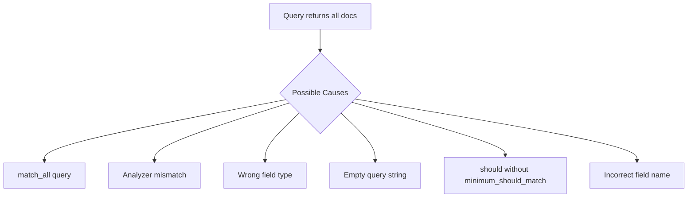

# How to Fix Elasticsearch Returning Every Document

Author: [nawazdhandala](https://www.github.com/nawazdhandala)

Tags: Elasticsearch, Troubleshooting, Query DSL, Search, Debugging, Analysis

Description: Learn how to diagnose and fix the common issue of Elasticsearch queries returning every document instead of filtered results. Covers analyzer mismatches, mapping issues, and query structure problems.

---

## The Problem

You write what seems like a valid query, but Elasticsearch returns every document in the index. This frustrating issue usually stems from one of several common causes.



## Cause 1: Accidental match_all Query

Check if your query is actually a `match_all`:

```json
GET /products/_search
{
  "query": {
    "match_all": {}
  }
}
```

This explicitly returns everything. Also watch for empty query objects:

```json
GET /products/_search
{
  "query": {}
}
```

An empty query defaults to match_all.

### Fix

Ensure your query contains actual conditions:

```json
GET /products/_search
{
  "query": {
    "match": {
      "title": "laptop"
    }
  }
}
```

## Cause 2: Analyzer Mismatch

This is the most common cause. Your index analyzer and search analyzer produce different tokens.

### Diagnosing the Problem

Check how your field is analyzed:

```json
POST /products/_analyze
{
  "field": "title",
  "text": "MacBook Pro"
}
```

Response:
```json
{
  "tokens": [
    {"token": "macbook", "position": 0},
    {"token": "pro", "position": 1}
  ]
}
```

Now check how your query is analyzed:

```json
POST /products/_analyze
{
  "analyzer": "standard",
  "text": "MacBook Pro"
}
```

If these produce different tokens, searches will fail or match incorrectly.

### Common Analyzer Mismatches

**Problem: Case sensitivity**

Index stores "macbook" (lowercase), but search for "MacBook" on a keyword field:

```json
GET /products/_search
{
  "query": {
    "term": {
      "title.keyword": "MacBook Pro"
    }
  }
}
```

This returns nothing because keyword fields are case-sensitive.

### Fix

Use the correct field type:

```json
GET /products/_search
{
  "query": {
    "match": {
      "title": "MacBook Pro"
    }
  }
}
```

Or make keyword searches case-insensitive:

```json
GET /products/_search
{
  "query": {
    "term": {
      "title.keyword": {
        "value": "macbook pro",
        "case_insensitive": true
      }
    }
  }
}
```

## Cause 3: Wrong Field Type

Searching a `keyword` field with `match` or a `text` field with `term` can cause unexpected results.

### Check Field Mapping

```json
GET /products/_mapping
```

Response:
```json
{
  "products": {
    "mappings": {
      "properties": {
        "title": {
          "type": "text",
          "fields": {
            "keyword": {"type": "keyword"}
          }
        },
        "category": {
          "type": "keyword"
        }
      }
    }
  }
}
```

### Common Mistakes

**Using match on keyword field:**

```json
{
  "query": {
    "match": {
      "category": "Electronics & Computers"
    }
  }
}
```

Match analyzes the query, splitting "Electronics & Computers" into tokens. But category is a keyword field that expects exact match.

**Using term on text field:**

```json
{
  "query": {
    "term": {
      "title": "MacBook Pro"
    }
  }
}
```

Term does not analyze the query, but title is stored as lowercase tokens.

### Fix

Match query type to field type:

```json
{
  "query": {
    "term": {
      "category": "Electronics & Computers"
    }
  }
}

{
  "query": {
    "match": {
      "title": "MacBook Pro"
    }
  }
}
```

## Cause 4: Should Clauses Without minimum_should_match

When `must` is empty or absent, `should` clauses become purely optional:

```json
GET /products/_search
{
  "query": {
    "bool": {
      "should": [
        {"term": {"brand": "apple"}},
        {"term": {"brand": "samsung"}}
      ]
    }
  }
}
```

This returns ALL documents because should clauses are optional when no must exists.

### Fix

Add `minimum_should_match`:

```json
GET /products/_search
{
  "query": {
    "bool": {
      "should": [
        {"term": {"brand": "apple"}},
        {"term": {"brand": "samsung"}}
      ],
      "minimum_should_match": 1
    }
  }
}
```

Or add a must clause:

```json
GET /products/_search
{
  "query": {
    "bool": {
      "must": [
        {"term": {"in_stock": true}}
      ],
      "should": [
        {"term": {"brand": "apple"}},
        {"term": {"brand": "samsung"}}
      ]
    }
  }
}
```

## Cause 5: Empty or Whitespace Query String

Empty strings can match everything:

```json
GET /products/_search
{
  "query": {
    "match": {
      "title": ""
    }
  }
}
```

Or whitespace-only:

```json
GET /products/_search
{
  "query": {
    "match": {
      "title": "   "
    }
  }
}
```

### Fix

Validate input before querying:

```python
def search_products(query_string):
    if not query_string or not query_string.strip():
        return {"error": "Query string required"}

    return es.search(
        index="products",
        body={
            "query": {
                "match": {
                    "title": query_string.strip()
                }
            }
        }
    )
```

## Cause 6: Field Name Typos or Non-Existent Fields

Querying a field that does not exist returns all documents:

```json
GET /products/_search
{
  "query": {
    "match": {
      "titl": "laptop"
    }
  }
}
```

Elasticsearch does not error - it just finds no matches in "titl" field.

### Fix

Enable strict mapping:

```json
PUT /products/_settings
{
  "index.query.default_field": "title"
}
```

Or use index mapping to validate fields exist:

```python
def search_with_validation(index, field, query):
    # Get mapping
    mapping = es.indices.get_mapping(index=index)
    fields = mapping[index]['mappings']['properties'].keys()

    if field not in fields:
        raise ValueError(f"Field '{field}' does not exist in index '{index}'")

    return es.search(
        index=index,
        body={"query": {"match": {field: query}}}
    )
```

## Cause 7: Wildcard or Regex Matching Everything

Overly broad patterns:

```json
GET /products/_search
{
  "query": {
    "wildcard": {
      "title": "*"
    }
  }
}
```

### Fix

Validate patterns before execution:

```python
def safe_wildcard_search(field, pattern):
    if pattern in ['*', '?', '']:
        raise ValueError("Pattern too broad")

    return es.search(
        index="products",
        body={
            "query": {
                "wildcard": {
                    field: pattern
                }
            }
        }
    )
```

## Debugging Techniques

### 1. Use Explain API

```json
GET /products/_explain/1
{
  "query": {
    "match": {
      "title": "laptop"
    }
  }
}
```

This shows exactly why a document matched or did not match.

### 2. Check Query with Profile

```json
GET /products/_search
{
  "profile": true,
  "query": {
    "match": {
      "title": "laptop"
    }
  }
}
```

### 3. Validate Query

```json
GET /products/_validate/query?explain=true
{
  "query": {
    "match": {
      "title": "laptop"
    }
  }
}
```

### 4. Analyze Your Terms

```json
POST /products/_analyze
{
  "field": "title",
  "text": "your search term"
}
```

## Common Fixes Summary

| Problem | Solution |
|---------|----------|
| Empty query | Validate input, check for match_all |
| Analyzer mismatch | Match query type to field type |
| Wrong field type | Use match for text, term for keyword |
| Optional should | Add minimum_should_match or must |
| Typo in field name | Validate fields against mapping |
| Broad wildcard | Validate pattern complexity |

## Prevention Best Practices

1. **Use explicit mappings** - Define all fields with correct types
2. **Validate input** - Check for empty/whitespace queries
3. **Test with explain** - Verify query behavior during development
4. **Log actual queries** - Capture what is sent to Elasticsearch
5. **Set default_field** - Control which field is searched by default
6. **Use query validation** - Catch issues before production

## Conclusion

When Elasticsearch returns every document, the cause is usually one of these issues: accidental match_all, analyzer mismatches, wrong field types, missing minimum_should_match, or non-existent fields. Use the debugging techniques - explain API, analyze API, and query validation - to diagnose the specific issue. Most problems stem from not understanding how analyzers process your data and queries differently.
