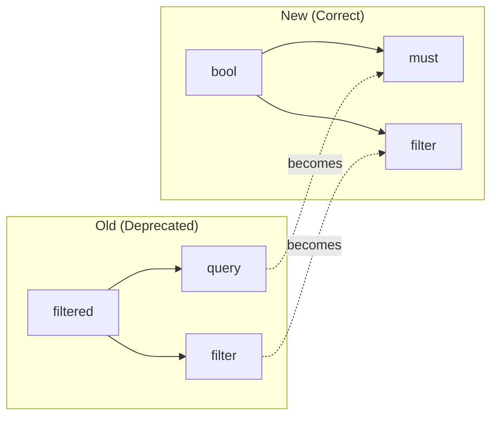

# How to Fix 'no [query] registered for [filtered]' Errors

Author: [nawazdhandala](https://www.github.com/nawazdhandala)

Tags: Elasticsearch, Error Handling, Query DSL, Migration, Troubleshooting

Description: Learn how to fix the 'no [query] registered for [filtered]' error in Elasticsearch. This error occurs when using deprecated filtered query syntax from older versions. Includes migration guide and examples.

---

## Understanding the Error

When you see this error:

```json
{
  "error": {
    "root_cause": [
      {
        "type": "parsing_exception",
        "reason": "no [query] registered for [filtered]"
      }
    ],
    "type": "parsing_exception",
    "reason": "no [query] registered for [filtered]"
  },
  "status": 400
}
```

It means you are using the `filtered` query syntax that was deprecated in Elasticsearch 2.x and removed in 5.0+.

## The Problem: Deprecated Filtered Query

The old syntax looked like this:

```json
GET /products/_search
{
  "query": {
    "filtered": {
      "query": {
        "match": {
          "title": "laptop"
        }
      },
      "filter": {
        "term": {
          "status": "active"
        }
      }
    }
  }
}
```

This syntax is no longer valid in modern Elasticsearch versions.

## The Solution: Use Bool Query

Replace `filtered` with `bool` query. The `bool` query provides the same functionality with clearer semantics.



### Migrated Query

```json
GET /products/_search
{
  "query": {
    "bool": {
      "must": [
        {
          "match": {
            "title": "laptop"
          }
        }
      ],
      "filter": [
        {
          "term": {
            "status": "active"
          }
        }
      ]
    }
  }
}
```

## Migration Examples

### Example 1: Simple Filtered Query

**Old syntax:**
```json
{
  "query": {
    "filtered": {
      "query": {
        "match_all": {}
      },
      "filter": {
        "term": {
          "category": "electronics"
        }
      }
    }
  }
}
```

**New syntax:**
```json
{
  "query": {
    "bool": {
      "must": [
        {
          "match_all": {}
        }
      ],
      "filter": [
        {
          "term": {
            "category": "electronics"
          }
        }
      ]
    }
  }
}
```

### Example 2: Multiple Filters

**Old syntax:**
```json
{
  "query": {
    "filtered": {
      "query": {
        "multi_match": {
          "query": "gaming laptop",
          "fields": ["title", "description"]
        }
      },
      "filter": {
        "and": [
          {"term": {"brand": "dell"}},
          {"range": {"price": {"lte": 1500}}},
          {"term": {"in_stock": true}}
        ]
      }
    }
  }
}
```

**New syntax:**
```json
{
  "query": {
    "bool": {
      "must": [
        {
          "multi_match": {
            "query": "gaming laptop",
            "fields": ["title", "description"]
          }
        }
      ],
      "filter": [
        {"term": {"brand": "dell"}},
        {"range": {"price": {"lte": 1500}}},
        {"term": {"in_stock": true}}
      ]
    }
  }
}
```

Note: The `and` filter is also deprecated. Multiple clauses in `filter` are implicitly ANDed.

### Example 3: Nested Filtered Queries

**Old syntax:**
```json
{
  "query": {
    "filtered": {
      "query": {
        "filtered": {
          "query": {
            "match": {"title": "laptop"}
          },
          "filter": {
            "term": {"category": "electronics"}
          }
        }
      },
      "filter": {
        "range": {"price": {"gte": 500, "lte": 2000}}
      }
    }
  }
}
```

**New syntax:**
```json
{
  "query": {
    "bool": {
      "must": [
        {
          "match": {"title": "laptop"}
        }
      ],
      "filter": [
        {"term": {"category": "electronics"}},
        {"range": {"price": {"gte": 500, "lte": 2000}}}
      ]
    }
  }
}
```

### Example 4: Filter Only (No Query)

**Old syntax:**
```json
{
  "query": {
    "filtered": {
      "filter": {
        "term": {"status": "published"}
      }
    }
  }
}
```

**New syntax:**
```json
{
  "query": {
    "bool": {
      "filter": [
        {
          "term": {"status": "published"}
        }
      ]
    }
  }
}
```

Or simply use constant_score for pure filtering:

```json
{
  "query": {
    "constant_score": {
      "filter": {
        "term": {"status": "published"}
      }
    }
  }
}
```

## Bool Query Structure Reference

The `bool` query has four clause types:

| Clause | Purpose | Affects Score |
|--------|---------|---------------|
| `must` | Required matches | Yes |
| `filter` | Required matches | No (cached) |
| `should` | Optional matches | Yes |
| `must_not` | Excluded matches | No |

```json
{
  "query": {
    "bool": {
      "must": [
        {"match": {"title": "laptop"}}
      ],
      "filter": [
        {"term": {"status": "active"}},
        {"range": {"price": {"lte": 1000}}}
      ],
      "should": [
        {"term": {"featured": true}}
      ],
      "must_not": [
        {"term": {"discontinued": true}}
      ]
    }
  }
}
```

## Other Deprecated Query Types

While fixing `filtered`, check for these other deprecated queries:

### Or Filter (Deprecated)

**Old:**
```json
{
  "filter": {
    "or": [
      {"term": {"color": "red"}},
      {"term": {"color": "blue"}}
    ]
  }
}
```

**New:**
```json
{
  "query": {
    "bool": {
      "filter": [
        {
          "bool": {
            "should": [
              {"term": {"color": "red"}},
              {"term": {"color": "blue"}}
            ]
          }
        }
      ]
    }
  }
}
```

Or use `terms` query:

```json
{
  "query": {
    "bool": {
      "filter": [
        {"terms": {"color": ["red", "blue"]}}
      ]
    }
  }
}
```

### And Filter (Deprecated)

**Old:**
```json
{
  "filter": {
    "and": [
      {"term": {"brand": "apple"}},
      {"term": {"category": "phones"}}
    ]
  }
}
```

**New:**
```json
{
  "query": {
    "bool": {
      "filter": [
        {"term": {"brand": "apple"}},
        {"term": {"category": "phones"}}
      ]
    }
  }
}
```

### Not Filter (Deprecated)

**Old:**
```json
{
  "filter": {
    "not": {
      "term": {"status": "deleted"}
    }
  }
}
```

**New:**
```json
{
  "query": {
    "bool": {
      "must_not": [
        {"term": {"status": "deleted"}}
      ]
    }
  }
}
```

## Automated Migration Script

Here is a Python script to help migrate old queries:

```python
import json
import re

def migrate_filtered_query(query):
    """Migrate deprecated filtered query to bool query."""

    if not isinstance(query, dict):
        return query

    # Recursively process nested structures
    for key, value in list(query.items()):
        if isinstance(value, dict):
            query[key] = migrate_filtered_query(value)
        elif isinstance(value, list):
            query[key] = [migrate_filtered_query(item) for item in value]

    # Check for filtered query
    if 'filtered' in query:
        filtered = query.pop('filtered')

        bool_query = {'bool': {}}

        if 'query' in filtered:
            inner_query = migrate_filtered_query(filtered['query'])
            if inner_query != {'match_all': {}}:
                bool_query['bool']['must'] = [inner_query]

        if 'filter' in filtered:
            filter_clause = migrate_filtered_query(filtered['filter'])

            # Handle deprecated and/or filters
            if isinstance(filter_clause, dict):
                if 'and' in filter_clause:
                    bool_query['bool']['filter'] = filter_clause['and']
                elif 'or' in filter_clause:
                    bool_query['bool']['filter'] = [{
                        'bool': {'should': filter_clause['or']}
                    }]
                else:
                    bool_query['bool']['filter'] = [filter_clause]
            else:
                bool_query['bool']['filter'] = [filter_clause]

        query.update(bool_query)

    return query

# Usage
old_query = {
    "query": {
        "filtered": {
            "query": {"match": {"title": "laptop"}},
            "filter": {"term": {"status": "active"}}
        }
    }
}

new_query = migrate_filtered_query(old_query)
print(json.dumps(new_query, indent=2))
```

## Best Practices

1. **Use filter for non-scoring clauses** - Filters are cached and faster
2. **Combine multiple filters** - Put all filter conditions in one filter array
3. **Test after migration** - Verify results match before and after
4. **Update client libraries** - Older Elasticsearch clients may generate deprecated syntax
5. **Check application code** - Search for "filtered" in your codebase

## Conclusion

The "no [query] registered for [filtered]" error indicates you are using deprecated query syntax. The fix is straightforward - replace `filtered` queries with `bool` queries. Use `must` for scoring queries and `filter` for non-scoring filters. This migration improves query clarity and takes advantage of filter caching for better performance.
