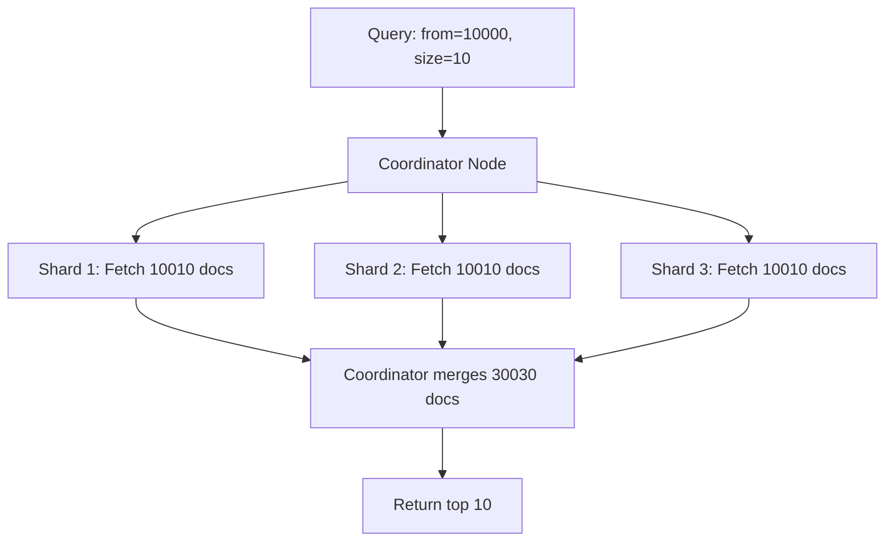
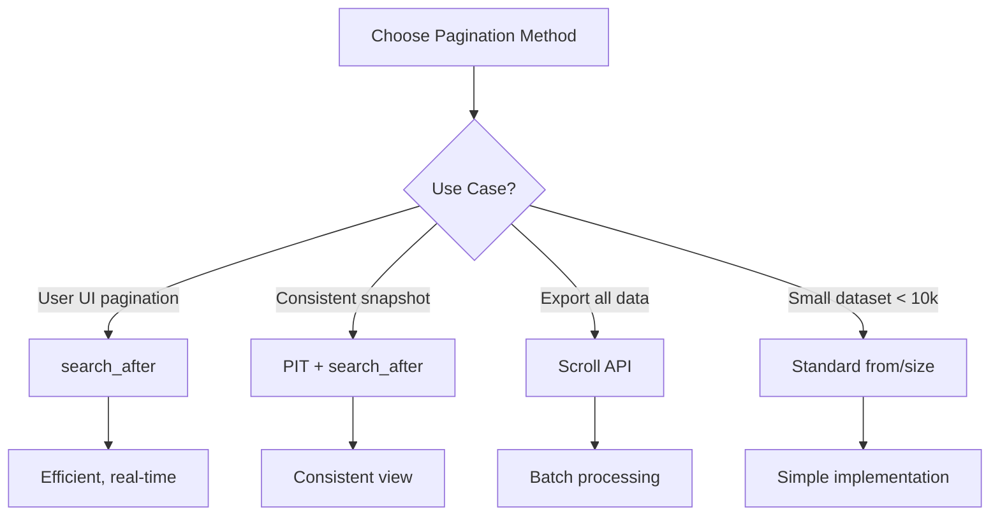

# How to Fix 'Result window is too large' Errors in Elasticsearch

Author: [nawazdhandala](https://www.github.com/nawazdhandala)

Tags: Elasticsearch, Pagination, Performance, Search, Troubleshooting

Description: Learn how to fix the 'Result window is too large' error in Elasticsearch. This guide covers pagination strategies including scroll API, search_after, and point in time for handling large result sets efficiently.

The "Result window is too large" error is one of the most common Elasticsearch errors encountered when paginating through large result sets. This guide explains why this error occurs and provides multiple solutions for different use cases.

## Understanding the Error

The error occurs when you try to access results beyond the default limit:

```json
{
  "error": {
    "root_cause": [
      {
        "type": "query_phase_execution_exception",
        "reason": "Result window is too large, from + size must be less than or equal to: [10000] but was [15000]. See the scroll api for a more efficient way to request large data sets."
      }
    ]
  }
}
```

This happens because Elasticsearch limits deep pagination by default:

```json
// This fails - from + size > 10000
GET /products/_search
{
  "from": 10000,
  "size": 100
}
```

## Why This Limit Exists

Deep pagination is expensive in distributed systems:



Each shard must return `from + size` documents, which the coordinator then merges and re-sorts. For a 5-shard index, requesting page 1000 (from=10000, size=10) means:
- Each shard returns 10,010 documents
- Coordinator processes 50,050 documents
- Only 10 are returned to the client

## Solution 1: Increase the Limit (Not Recommended)

You can increase `max_result_window`, but this is usually the wrong solution:

```json
PUT /products/_settings
{
  "index.max_result_window": 100000
}
```

**Why this is problematic:**

- Increases memory usage on every shard
- Can cause cluster instability
- Slows down queries
- Doesn't scale - you'll hit the new limit eventually

Only use this for small indexes with limited data:

```json
// Only appropriate for small reference data indexes
PUT /country-codes/_settings
{
  "index.max_result_window": 50000
}
```

## Solution 2: Search After (Recommended for UI Pagination)

The `search_after` parameter provides efficient pagination for user-facing applications:

```json
// First page - no search_after needed
GET /products/_search
{
  "size": 20,
  "query": {
    "match": { "category": "electronics" }
  },
  "sort": [
    { "created_at": "desc" },
    { "_id": "asc" }
  ]
}
```

The response includes sort values for each hit:

```json
{
  "hits": {
    "hits": [
      {
        "_id": "abc123",
        "_source": { ... },
        "sort": [1703001600000, "abc123"]
      },
      {
        "_id": "def456",
        "_source": { ... },
        "sort": [1702915200000, "def456"]
      }
    ]
  }
}
```

Use the last hit's sort values for the next page:

```json
// Second page
GET /products/_search
{
  "size": 20,
  "query": {
    "match": { "category": "electronics" }
  },
  "sort": [
    { "created_at": "desc" },
    { "_id": "asc" }
  ],
  "search_after": [1702915200000, "def456"]
}
```

### Implementation Example

```python
from elasticsearch import Elasticsearch

es = Elasticsearch("http://localhost:9200")

def paginate_with_search_after(index, query, page_size=20):
    """Generator that yields all documents using search_after."""
    search_after = None

    while True:
        body = {
            "size": page_size,
            "query": query,
            "sort": [
                {"created_at": "desc"},
                {"_id": "asc"}
            ]
        }

        if search_after:
            body["search_after"] = search_after

        response = es.search(index=index, body=body)
        hits = response["hits"]["hits"]

        if not hits:
            break

        for hit in hits:
            yield hit["_source"]

        search_after = hits[-1]["sort"]

# Usage
query = {"match": {"category": "electronics"}}
for product in paginate_with_search_after("products", query):
    print(product["name"])
```

### Node.js Implementation

```javascript
const { Client } = require('@elastic/elasticsearch');
const client = new Client({ node: 'http://localhost:9200' });

async function* paginateWithSearchAfter(index, query, pageSize = 20) {
  let searchAfter = null;

  while (true) {
    const body = {
      size: pageSize,
      query,
      sort: [
        { created_at: 'desc' },
        { _id: 'asc' }
      ]
    };

    if (searchAfter) {
      body.search_after = searchAfter;
    }

    const response = await client.search({ index, body });
    const hits = response.hits.hits;

    if (hits.length === 0) break;

    for (const hit of hits) {
      yield hit._source;
    }

    searchAfter = hits[hits.length - 1].sort;
  }
}

// Usage
async function processAllProducts() {
  const query = { match: { category: 'electronics' } };

  for await (const product of paginateWithSearchAfter('products', query)) {
    console.log(product.name);
  }
}
```

## Solution 3: Point in Time (PIT) with Search After

For consistent pagination during concurrent updates, use Point in Time:

```json
// Step 1: Open a Point in Time
POST /products/_pit?keep_alive=5m

// Response
{
  "id": "46ToAwMDaWR5BXV1aWQy..."
}
```

```json
// Step 2: Search with PIT
GET /_search
{
  "size": 20,
  "query": {
    "match": { "category": "electronics" }
  },
  "pit": {
    "id": "46ToAwMDaWR5BXV1aWQy...",
    "keep_alive": "5m"
  },
  "sort": [
    { "created_at": "desc" },
    { "_shard_doc": "asc" }
  ]
}
```

```json
// Step 3: Continue pagination
GET /_search
{
  "size": 20,
  "query": {
    "match": { "category": "electronics" }
  },
  "pit": {
    "id": "46ToAwMDaWR5BXV1aWQy...",
    "keep_alive": "5m"
  },
  "sort": [
    { "created_at": "desc" },
    { "_shard_doc": "asc" }
  ],
  "search_after": [1702915200000, 42]
}
```

```json
// Step 4: Close PIT when done
DELETE /_pit
{
  "id": "46ToAwMDaWR5BXV1aWQy..."
}
```

### PIT Implementation

```python
from elasticsearch import Elasticsearch

es = Elasticsearch("http://localhost:9200")

class PITPaginator:
    def __init__(self, index, query, page_size=20, keep_alive="5m"):
        self.index = index
        self.query = query
        self.page_size = page_size
        self.keep_alive = keep_alive
        self.pit_id = None

    def __enter__(self):
        # Open PIT
        response = es.open_point_in_time(
            index=self.index,
            keep_alive=self.keep_alive
        )
        self.pit_id = response["id"]
        return self

    def __exit__(self, exc_type, exc_val, exc_tb):
        # Close PIT
        if self.pit_id:
            es.close_point_in_time(id=self.pit_id)

    def pages(self):
        search_after = None

        while True:
            body = {
                "size": self.page_size,
                "query": self.query,
                "pit": {
                    "id": self.pit_id,
                    "keep_alive": self.keep_alive
                },
                "sort": [
                    {"created_at": "desc"},
                    {"_shard_doc": "asc"}
                ]
            }

            if search_after:
                body["search_after"] = search_after

            response = es.search(body=body)
            hits = response["hits"]["hits"]

            # Update PIT ID (may change between requests)
            self.pit_id = response["pit_id"]

            if not hits:
                break

            yield [hit["_source"] for hit in hits]
            search_after = hits[-1]["sort"]

# Usage
query = {"match": {"category": "electronics"}}

with PITPaginator("products", query) as paginator:
    for page in paginator.pages():
        for product in page:
            print(product["name"])
```

## Solution 4: Scroll API (For Export/Batch Processing)

The Scroll API is designed for processing large result sets, not user pagination:

```json
// Initial scroll request
POST /products/_search?scroll=5m
{
  "size": 1000,
  "query": {
    "match_all": {}
  }
}

// Response includes scroll_id
{
  "_scroll_id": "DXF1ZXJ5QW5kRmV0Y2gB...",
  "hits": {
    "hits": [...]
  }
}
```

```json
// Continue scrolling
POST /_search/scroll
{
  "scroll": "5m",
  "scroll_id": "DXF1ZXJ5QW5kRmV0Y2gB..."
}
```

```json
// Clear scroll when done
DELETE /_search/scroll
{
  "scroll_id": "DXF1ZXJ5QW5kRmV0Y2gB..."
}
```

### Scroll Implementation

```python
def export_with_scroll(es, index, query, batch_size=1000):
    """Export all documents using scroll API."""

    # Initial search
    response = es.search(
        index=index,
        scroll="5m",
        size=batch_size,
        body={"query": query}
    )

    scroll_id = response["_scroll_id"]
    hits = response["hits"]["hits"]

    try:
        while hits:
            for hit in hits:
                yield hit["_source"]

            # Get next batch
            response = es.scroll(scroll_id=scroll_id, scroll="5m")
            scroll_id = response["_scroll_id"]
            hits = response["hits"]["hits"]
    finally:
        # Always clear scroll
        es.clear_scroll(scroll_id=scroll_id)

# Usage for export
with open("export.json", "w") as f:
    for doc in export_with_scroll(es, "products", {"match_all": {}}):
        f.write(json.dumps(doc) + "\n")
```

## Solution Comparison



| Method | Best For | Limitations |
|--------|----------|-------------|
| from/size | Small result sets (<10k) | Can't go beyond max_result_window |
| search_after | UI pagination | Can't jump to arbitrary pages |
| PIT + search_after | Consistent pagination | Requires PIT management |
| Scroll | Bulk export | Keeps search context open |

## Jumping to Pages with Search After

One limitation of `search_after` is you can't jump directly to page 50. Here's a workaround:

```python
def get_page_cursor(es, index, query, page_number, page_size):
    """Get the search_after cursor for a specific page."""

    # Calculate how many documents to skip
    skip = (page_number - 1) * page_size

    if skip == 0:
        return None

    # Use a single request to get the cursor
    response = es.search(
        index=index,
        body={
            "size": 1,
            "query": query,
            "sort": [
                {"created_at": "desc"},
                {"_id": "asc"}
            ],
            "_source": False,
            "track_total_hits": True
        },
        from_=skip - 1  # Get the last doc before our page
    )

    hits = response["hits"]["hits"]
    if not hits:
        return None

    return hits[0]["sort"]

def get_page(es, index, query, page_number, page_size):
    """Get a specific page of results."""

    if page_number <= 500:  # Within safe from/size range
        return es.search(
            index=index,
            body={
                "size": page_size,
                "query": query,
                "sort": [
                    {"created_at": "desc"},
                    {"_id": "asc"}
                ]
            },
            from_=(page_number - 1) * page_size
        )

    # Beyond safe range, use search_after
    cursor = get_page_cursor(es, index, query, page_number, page_size)

    body = {
        "size": page_size,
        "query": query,
        "sort": [
            {"created_at": "desc"},
            {"_id": "asc"}
        ]
    }

    if cursor:
        body["search_after"] = cursor

    return es.search(index=index, body=body)
```

## Best Practices

### 1. Use Appropriate Sort Fields

Always include a tiebreaker field for consistent ordering:

```json
{
  "sort": [
    { "created_at": "desc" },
    { "_id": "asc" }  // Tiebreaker for documents with same timestamp
  ]
}
```

### 2. Limit Total Accessible Results

For UI applications, consider capping total accessible results:

```python
MAX_ACCESSIBLE_RESULTS = 10000

def search_with_limit(es, index, query, from_, size):
    if from_ + size > MAX_ACCESSIBLE_RESULTS:
        raise ValueError(f"Cannot access beyond {MAX_ACCESSIBLE_RESULTS} results")

    return es.search(
        index=index,
        body={
            "from": from_,
            "size": size,
            "query": query,
            "track_total_hits": True
        }
    )
```

### 3. Show Total Count Accurately

Use `track_total_hits` for accurate counts:

```json
GET /products/_search
{
  "track_total_hits": true,
  "query": { "match_all": {} }
}

// Response shows exact count
{
  "hits": {
    "total": {
      "value": 1523847,
      "relation": "eq"
    }
  }
}
```

### 4. Cache Cursors for Back Navigation

```python
class PaginationSession:
    def __init__(self):
        self.cursors = {}  # page_number -> cursor

    def get_page(self, es, index, query, page_number, page_size):
        # Check if we have the cursor cached
        if page_number in self.cursors:
            cursor = self.cursors[page_number]
        elif page_number == 1:
            cursor = None
        else:
            # Need to navigate from nearest cached cursor
            cursor = self._find_cursor(es, index, query, page_number, page_size)

        response = self._search(es, index, query, cursor, page_size)

        # Cache the cursor for next page
        if response["hits"]["hits"]:
            next_cursor = response["hits"]["hits"][-1]["sort"]
            self.cursors[page_number + 1] = next_cursor

        return response
```

## Conclusion

The "Result window is too large" error is a safeguard against expensive deep pagination. Instead of increasing the limit, use the appropriate pagination strategy:

1. **Standard pagination** for small result sets (<10k)
2. **search_after** for user-facing infinite scroll or pagination
3. **PIT + search_after** when you need consistent snapshots
4. **Scroll API** for batch processing and exports

Each approach has trade-offs, so choose based on your specific requirements. For most applications, `search_after` provides the best balance of efficiency and usability.

---

**Related Reading:**

- [How to Match vs Term Query in Elasticsearch](https://oneuptime.com/blog/post/2025-12-19-match-vs-term-query-elasticsearch/view)
- [How to Handle Unassigned Shards in Elasticsearch](https://oneuptime.com/blog/post/2025-12-19-handle-unassigned-shards-elasticsearch/view)
- [How to Bulk Index JSON Data in Elasticsearch](https://oneuptime.com/blog/post/2025-12-19-bulk-index-json-data-elasticsearch/view)
