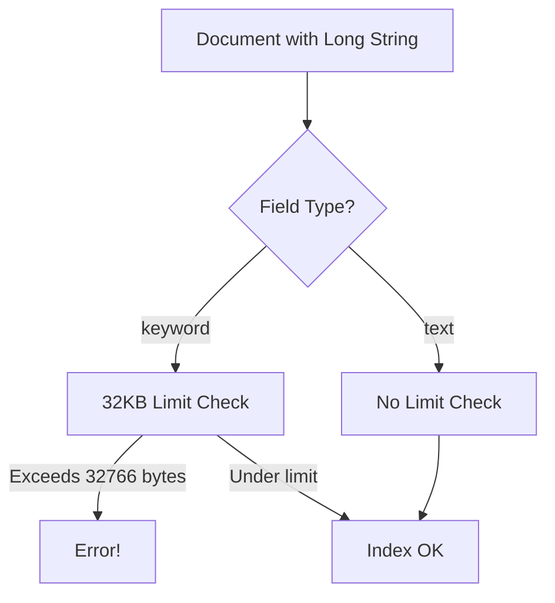
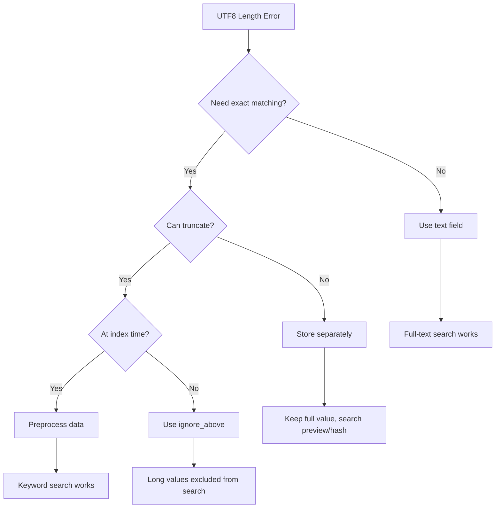

# How to Fix 'UTF8 encoding is longer than max length' Errors in Elasticsearch

Author: [nawazdhandala](https://www.github.com/nawazdhandala)

Tags: Elasticsearch, UTF-8, Encoding, Troubleshooting, Keyword Fields, Mapping

Description: Learn how to fix the 'UTF8 encoding is longer than the max length' error in Elasticsearch. This guide covers causes, solutions including ignore_above, text fields, and data preprocessing strategies.

The "UTF8 encoding is longer than the max length" error occurs when trying to index a keyword field value that exceeds Elasticsearch's limit. This guide explains why it happens and provides multiple solutions.

## Understanding the Error

The full error message typically looks like:

```json
{
  "error": {
    "type": "mapper_parsing_exception",
    "reason": "failed to parse field [field_name] of type [keyword]",
    "caused_by": {
      "type": "illegal_argument_exception",
      "reason": "UTF8 encoding is longer than the max length 32766"
    }
  }
}
```



## Why This Limit Exists

Keyword fields in Elasticsearch use Lucene's doc values for sorting and aggregations. Lucene has a hard limit of 32,766 bytes for keyword terms due to internal data structure constraints.

| Field Type | Max Value Length | Use Case |
|------------|-----------------|----------|
| keyword | 32,766 bytes | Exact matching, sorting, aggregations |
| text | Unlimited | Full-text search |

## Solution 1: Use ignore_above Setting

The simplest solution is to configure `ignore_above` in your mapping:

```json
PUT /my_index
{
  "mappings": {
    "properties": {
      "description": {
        "type": "keyword",
        "ignore_above": 10000
      }
    }
  }
}
```

When a value exceeds `ignore_above`:
- The document is still indexed
- The field value is stored in `_source`
- The value is NOT indexed for searching/sorting/aggregations

### Dynamic Template with ignore_above

Apply to all keyword fields:

```json
PUT /my_index
{
  "mappings": {
    "dynamic_templates": [
      {
        "strings_as_keywords": {
          "match_mapping_type": "string",
          "mapping": {
            "type": "keyword",
            "ignore_above": 256
          }
        }
      }
    ]
  }
}
```

## Solution 2: Change to Text Field

If you need full-text search rather than exact matching:

```json
PUT /articles
{
  "mappings": {
    "properties": {
      "content": {
        "type": "text"
      }
    }
  }
}
```

### Multi-Field Mapping

Keep both keyword and text capabilities:

```json
PUT /articles
{
  "mappings": {
    "properties": {
      "description": {
        "type": "text",
        "fields": {
          "keyword": {
            "type": "keyword",
            "ignore_above": 256
          }
        }
      }
    }
  }
}
```

This allows:
- Full-text search on `description`
- Exact matching on `description.keyword` (up to 256 chars)

## Solution 3: Truncate Data Before Indexing

Preprocess your data to fit within limits:

### Python Implementation

```python
from elasticsearch import Elasticsearch
import json

es = Elasticsearch("http://localhost:9200")

MAX_KEYWORD_BYTES = 32000  # Leave some buffer

def truncate_to_bytes(text, max_bytes):
    """Truncate string to fit within byte limit."""
    if text is None:
        return None

    encoded = text.encode('utf-8')
    if len(encoded) <= max_bytes:
        return text

    # Truncate bytes and decode safely
    truncated = encoded[:max_bytes]

    # Handle partial multi-byte characters
    while truncated:
        try:
            return truncated.decode('utf-8')
        except UnicodeDecodeError:
            truncated = truncated[:-1]

    return ""

def preprocess_document(doc, keyword_fields):
    """Truncate keyword fields to safe length."""
    processed = doc.copy()

    for field in keyword_fields:
        if field in processed and isinstance(processed[field], str):
            processed[field] = truncate_to_bytes(
                processed[field],
                MAX_KEYWORD_BYTES
            )

    return processed

# Usage
doc = {
    "title": "Short title",
    "content": "Very long content..." * 10000  # Long string
}

keyword_fields = ["title"]  # Fields mapped as keyword
processed_doc = preprocess_document(doc, keyword_fields)

es.index(index="articles", body=processed_doc)
```

### Node.js Implementation

```javascript
const { Client } = require('@elastic/elasticsearch');
const client = new Client({ node: 'http://localhost:9200' });

const MAX_KEYWORD_BYTES = 32000;

function truncateToBytes(text, maxBytes) {
  if (!text) return text;

  const encoder = new TextEncoder();
  const encoded = encoder.encode(text);

  if (encoded.length <= maxBytes) {
    return text;
  }

  // Truncate and decode
  const truncated = encoded.slice(0, maxBytes);
  const decoder = new TextDecoder('utf-8', { fatal: false });

  // Handle partial multi-byte characters
  let result = decoder.decode(truncated);

  // Remove potential replacement character at end
  if (result.endsWith('\uFFFD')) {
    result = result.slice(0, -1);
  }

  return result;
}

function preprocessDocument(doc, keywordFields) {
  const processed = { ...doc };

  for (const field of keywordFields) {
    if (processed[field] && typeof processed[field] === 'string') {
      processed[field] = truncateToBytes(processed[field], MAX_KEYWORD_BYTES);
    }
  }

  return processed;
}

// Usage
async function indexDocument(doc, keywordFields) {
  const processed = preprocessDocument(doc, keywordFields);

  await client.index({
    index: 'articles',
    body: processed
  });
}
```

## Solution 4: Store Long Values Separately

For very long values you need to keep intact:

```json
PUT /documents
{
  "mappings": {
    "properties": {
      "content": {
        "type": "text",
        "index": false,
        "store": true
      },
      "content_preview": {
        "type": "keyword",
        "ignore_above": 500
      },
      "content_hash": {
        "type": "keyword"
      }
    }
  }
}
```

```python
import hashlib

def index_long_content(es, content):
    """Index long content with searchable preview and hash."""

    # Create preview for keyword field
    preview = content[:500] if len(content) > 500 else content

    # Create hash for exact matching
    content_hash = hashlib.sha256(content.encode()).hexdigest()

    doc = {
        "content": content,  # Full content in text field (not indexed)
        "content_preview": preview,
        "content_hash": content_hash
    }

    es.index(index="documents", body=doc)
```

## Solution 5: Update Existing Index

If you're hitting this error on an existing index:

### Option A: Reindex with Updated Mapping

```json
// Step 1: Create new index with proper mapping
PUT /my_index_v2
{
  "mappings": {
    "properties": {
      "long_field": {
        "type": "keyword",
        "ignore_above": 10000
      }
    }
  }
}

// Step 2: Reindex data
POST /_reindex
{
  "source": {
    "index": "my_index_v1"
  },
  "dest": {
    "index": "my_index_v2"
  }
}

// Step 3: Update alias
POST /_aliases
{
  "actions": [
    { "remove": { "index": "my_index_v1", "alias": "my_index" } },
    { "add": { "index": "my_index_v2", "alias": "my_index" } }
  ]
}
```

### Option B: Update Template for New Indexes

```json
PUT /_index_template/my_template
{
  "index_patterns": ["logs-*"],
  "template": {
    "mappings": {
      "properties": {
        "message": {
          "type": "text",
          "fields": {
            "keyword": {
              "type": "keyword",
              "ignore_above": 256
            }
          }
        }
      }
    }
  }
}
```

## Solution 6: Bulk Indexing with Error Handling

Handle errors gracefully during bulk operations:

```python
from elasticsearch import Elasticsearch
from elasticsearch.helpers import streaming_bulk

es = Elasticsearch("http://localhost:9200")

def safe_bulk_index(documents, index_name):
    """Bulk index with error handling for long values."""

    success_count = 0
    error_docs = []

    for ok, result in streaming_bulk(
        es,
        ({"_index": index_name, "_source": doc} for doc in documents),
        raise_on_error=False
    ):
        if ok:
            success_count += 1
        else:
            action = result.get('index', {})
            error = action.get('error', {})
            error_type = error.get('type', '')

            if 'UTF8 encoding is longer than the max length' in str(error):
                # Handle specifically
                doc_id = action.get('_id')
                error_docs.append({
                    'id': doc_id,
                    'error': 'Field value too long',
                    'solution': 'Truncate or change field type'
                })
            else:
                error_docs.append({
                    'id': action.get('_id'),
                    'error': str(error)
                })

    return {
        'success': success_count,
        'errors': error_docs
    }

# With automatic retry after truncation
def bulk_index_with_retry(documents, index_name, keyword_fields):
    """Try to index, truncate on failure, retry."""

    success = 0
    failed = []

    for doc in documents:
        try:
            es.index(index=index_name, body=doc)
            success += 1
        except Exception as e:
            if 'UTF8 encoding is longer than the max length' in str(e):
                # Truncate and retry
                truncated_doc = preprocess_document(doc, keyword_fields)
                try:
                    es.index(index=index_name, body=truncated_doc)
                    success += 1
                except Exception as retry_error:
                    failed.append({'doc': doc, 'error': str(retry_error)})
            else:
                failed.append({'doc': doc, 'error': str(e)})

    return success, failed
```

## Choosing the Right Solution



| Scenario | Best Solution |
|----------|--------------|
| Need full-text search | Change to text field |
| Truncation acceptable | Use ignore_above or preprocess |
| Need exact match on full value | Store separately with hash |
| Legacy data causing issues | Reindex with updated mapping |
| Bulk import with some long values | Error handling with retry |

## Monitoring for This Issue

Create an alert for indexing failures:

```json
// Search for indexing errors in monitoring
GET /.monitoring-es-*/_search
{
  "query": {
    "bool": {
      "must": [
        { "match": { "error.type": "mapper_parsing_exception" } },
        { "match": { "error.reason": "UTF8 encoding" } }
      ]
    }
  },
  "sort": [{ "@timestamp": "desc" }],
  "size": 10
}
```

## Prevention Best Practices

1. **Define explicit mappings** - Don't rely on dynamic mapping for production
2. **Use ignore_above** - Set reasonable limits on keyword fields
3. **Validate data** - Check string lengths before indexing
4. **Use multi-fields** - Combine text and keyword with limits
5. **Monitor index errors** - Set up alerts for mapping exceptions

## Conclusion

The "UTF8 encoding is longer than the max length" error is a safeguard against keyword fields that exceed Lucene's 32KB limit. The best solution depends on your use case:

1. **ignore_above** - Easiest for most cases where long values are rare
2. **text fields** - When you need full-text search anyway
3. **Data preprocessing** - When you need control over truncation
4. **Separate storage** - When you must preserve full values

Understanding why this limit exists helps you design better mappings from the start and handle edge cases gracefully.

---

**Related Reading:**

- [How to Handle Unassigned Shards in Elasticsearch](https://oneuptime.com/blog/post/2025-12-19-handle-unassigned-shards-elasticsearch/view)
- [How to Bulk Index JSON Data in Elasticsearch](https://oneuptime.com/blog/post/2025-12-19-bulk-index-json-data-elasticsearch/view)
- [How to Match vs Term Query in Elasticsearch](https://oneuptime.com/blog/post/2025-12-19-match-vs-term-query-elasticsearch/view)
