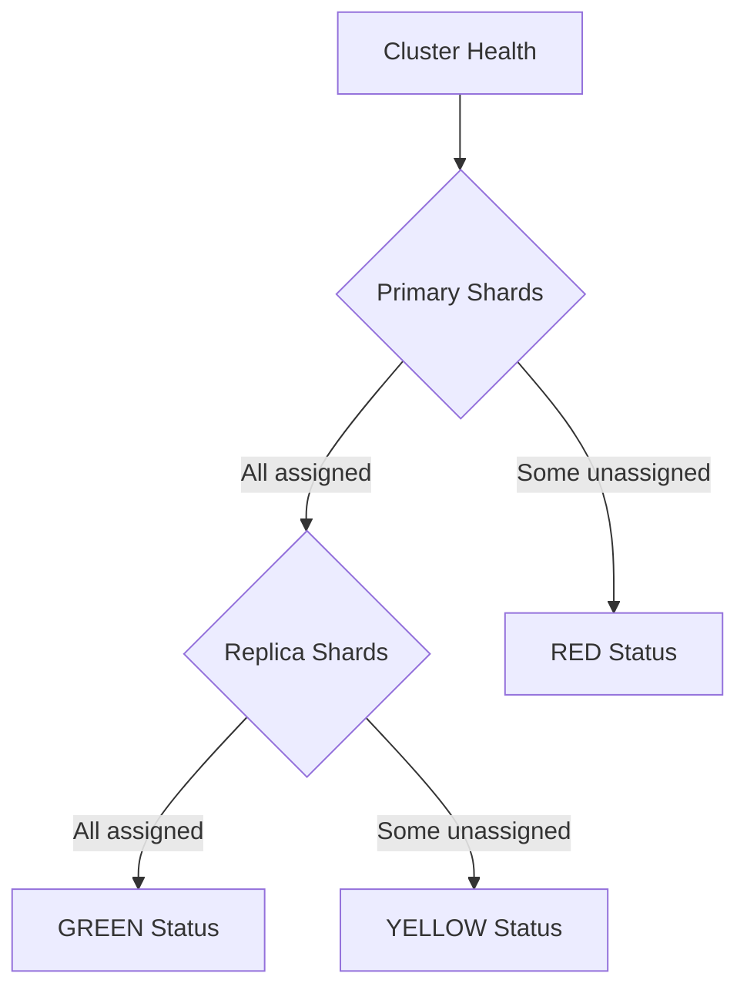
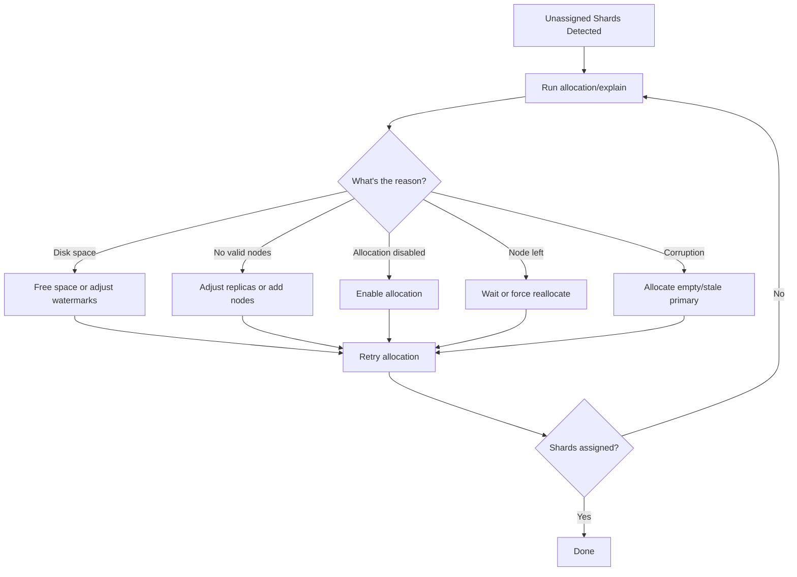

# How to Handle Unassigned Shards in Elasticsearch

Author: [nawazdhandala](https://www.github.com/nawazdhandala)

Tags: Elasticsearch, Cluster Health, Shards, Operations, Troubleshooting, DevOps

Description: Learn how to diagnose and fix unassigned shards in Elasticsearch. This guide covers common causes, diagnostic commands, resolution strategies, and prevention best practices for maintaining cluster health.

Unassigned shards are one of the most common Elasticsearch cluster issues. They cause the cluster to report yellow or red health status and can impact search and indexing operations. This guide explains how to identify causes and resolve unassigned shard issues.

## Understanding Cluster Health

Cluster health is determined by shard allocation:



| Status | Meaning | Impact |
|--------|---------|--------|
| Green | All shards assigned | Fully operational |
| Yellow | Primary shards OK, some replicas unassigned | Reduced redundancy |
| Red | Some primary shards unassigned | Data unavailable |

## Diagnosing Unassigned Shards

### Check Cluster Health

```json
GET /_cluster/health

{
  "cluster_name": "production",
  "status": "yellow",
  "number_of_nodes": 3,
  "number_of_data_nodes": 3,
  "active_primary_shards": 50,
  "active_shards": 95,
  "relocating_shards": 0,
  "initializing_shards": 0,
  "unassigned_shards": 5,
  "delayed_unassigned_shards": 0
}
```

### List Unassigned Shards

```json
GET /_cat/shards?v&h=index,shard,prirep,state,unassigned.reason&s=state

index     shard prirep state      unassigned.reason
products  0     p      STARTED
products  0     r      STARTED
products  1     p      STARTED
products  1     r      UNASSIGNED ALLOCATION_FAILED
logs      2     p      UNASSIGNED NODE_LEFT
```

### Get Detailed Allocation Explanation

```json
GET /_cluster/allocation/explain
{
  "index": "products",
  "shard": 1,
  "primary": false
}
```

Response shows why the shard can't be allocated:

```json
{
  "index": "products",
  "shard": 1,
  "primary": false,
  "current_state": "unassigned",
  "unassigned_info": {
    "reason": "ALLOCATION_FAILED",
    "at": "2024-01-15T10:30:00.000Z",
    "failed_allocation_attempts": 5,
    "details": "failed to create shard, failure IOException..."
  },
  "can_allocate": "no",
  "allocate_explanation": "cannot allocate because allocation is not permitted...",
  "node_allocation_decisions": [
    {
      "node_id": "node_1",
      "node_name": "es-node-1",
      "node_decision": "no",
      "deciders": [
        {
          "decider": "same_shard",
          "decision": "NO",
          "explanation": "a copy of this shard is already allocated to this node"
        }
      ]
    }
  ]
}
```

## Common Causes and Solutions

### 1. Not Enough Nodes for Replicas

**Cause**: Replica count exceeds available nodes.

```json
// Check index settings
GET /products/_settings

{
  "products": {
    "settings": {
      "index": {
        "number_of_shards": "5",
        "number_of_replicas": "2"
      }
    }
  }
}
// With 2 data nodes, replica=2 means 1 replica can't be assigned
```

**Solution**: Reduce replica count or add nodes.

```json
// Reduce replicas
PUT /products/_settings
{
  "index": {
    "number_of_replicas": 1
  }
}
```

### 2. Disk Space Threshold Exceeded

**Cause**: Elasticsearch won't allocate shards when disk usage exceeds thresholds.

```json
// Check disk usage
GET /_cat/allocation?v

shards disk.indices disk.used disk.avail disk.total disk.percent host          ip            node
    25       100gb    450gb      50gb      500gb           90   192.168.1.1   192.168.1.1   node-1
```

**Solution**: Free disk space or adjust thresholds.

```json
// Temporarily adjust watermarks
PUT /_cluster/settings
{
  "transient": {
    "cluster.routing.allocation.disk.watermark.low": "90%",
    "cluster.routing.allocation.disk.watermark.high": "95%",
    "cluster.routing.allocation.disk.watermark.flood_stage": "97%"
  }
}
```

Or clean up old data:

```json
// Delete old indices
DELETE /logs-2023-*

// Force merge to reclaim space
POST /products/_forcemerge?max_num_segments=1
```

### 3. Node Left the Cluster

**Cause**: A node crashed or was removed.

```json
GET /_cat/shards?v&h=index,shard,prirep,state,unassigned.reason | grep NODE_LEFT
```

**Solution**: Wait for node to return or reallocate.

```json
// If node won't return, trigger reallocation
POST /_cluster/reroute?retry_failed=true
```

### 4. Allocation Disabled

**Cause**: Cluster allocation is disabled (often during maintenance).

```json
GET /_cluster/settings

{
  "persistent": {
    "cluster.routing.allocation.enable": "none"
  }
}
```

**Solution**: Re-enable allocation.

```json
PUT /_cluster/settings
{
  "persistent": {
    "cluster.routing.allocation.enable": "all"
  }
}
```

### 5. Shard Allocation Filtering

**Cause**: Index has allocation filters that exclude available nodes.

```json
GET /products/_settings

{
  "products": {
    "settings": {
      "index": {
        "routing": {
          "allocation": {
            "require": {
              "_name": "node-that-doesnt-exist"
            }
          }
        }
      }
    }
  }
}
```

**Solution**: Remove or update allocation filters.

```json
PUT /products/_settings
{
  "index.routing.allocation.require._name": null
}
```

### 6. Corrupted Shard Data

**Cause**: Underlying shard data is corrupted.

```json
// Allocation explain shows corruption
{
  "allocate_explanation": "shard has exceeded the maximum number of retries [5] on failed allocation attempts"
}
```

**Solution**: For replicas, just reallocate. For primaries, you may need to accept data loss.

```json
// Allocate empty primary (DATA LOSS WARNING)
POST /_cluster/reroute
{
  "commands": [
    {
      "allocate_empty_primary": {
        "index": "products",
        "shard": 1,
        "node": "es-node-1",
        "accept_data_loss": true
      }
    }
  ]
}

// Or allocate stale primary (less data loss)
POST /_cluster/reroute
{
  "commands": [
    {
      "allocate_stale_primary": {
        "index": "products",
        "shard": 1,
        "node": "es-node-1",
        "accept_data_loss": true
      }
    }
  ]
}
```

### 7. Maximum Retry Attempts Exceeded

**Cause**: Allocation failed too many times.

```json
// Retry failed allocations
POST /_cluster/reroute?retry_failed=true
```

## Step-by-Step Resolution Process



## Automated Monitoring Script

```python
from elasticsearch import Elasticsearch
import time

es = Elasticsearch("http://localhost:9200")

def check_cluster_health():
    """Monitor cluster health and unassigned shards."""

    health = es.cluster.health()

    status = {
        "status": health["status"],
        "unassigned_shards": health["unassigned_shards"],
        "active_shards": health["active_shards"]
    }

    if health["unassigned_shards"] > 0:
        # Get details on unassigned shards
        unassigned = []

        cat_shards = es.cat.shards(format="json")
        for shard in cat_shards:
            if shard["state"] == "UNASSIGNED":
                unassigned.append({
                    "index": shard["index"],
                    "shard": shard["shard"],
                    "primary": shard["prirep"] == "p",
                    "reason": shard.get("unassigned.reason", "unknown")
                })

        status["unassigned_details"] = unassigned

        # Get allocation explanation for first unassigned
        if unassigned:
            first = unassigned[0]
            try:
                explanation = es.cluster.allocation_explain(
                    index=first["index"],
                    shard=int(first["shard"]),
                    primary=first["primary"]
                )
                status["allocation_explanation"] = {
                    "reason": explanation.get("unassigned_info", {}).get("reason"),
                    "can_allocate": explanation.get("can_allocate"),
                    "explanation": explanation.get("allocate_explanation")
                }
            except Exception as e:
                status["explanation_error"] = str(e)

    return status

def auto_fix_common_issues():
    """Attempt to automatically fix common issues."""

    fixes_applied = []

    # Check if allocation is disabled
    settings = es.cluster.get_settings()
    allocation_enabled = settings.get("persistent", {}).get(
        "cluster.routing.allocation.enable", "all"
    )

    if allocation_enabled != "all":
        es.cluster.put_settings(body={
            "persistent": {
                "cluster.routing.allocation.enable": "all"
            }
        })
        fixes_applied.append("Re-enabled cluster allocation")

    # Retry failed allocations
    health = es.cluster.health()
    if health["unassigned_shards"] > 0:
        es.cluster.reroute(retry_failed=True)
        fixes_applied.append("Triggered retry of failed allocations")

    return fixes_applied

def monitor_loop(interval=60):
    """Continuous monitoring loop."""

    while True:
        status = check_cluster_health()

        print(f"\nCluster Status: {status['status']}")
        print(f"Active Shards: {status['active_shards']}")
        print(f"Unassigned Shards: {status['unassigned_shards']}")

        if status["unassigned_shards"] > 0:
            print("\nUnassigned Shard Details:")
            for shard in status.get("unassigned_details", []):
                shard_type = "PRIMARY" if shard["primary"] else "REPLICA"
                print(f"  {shard['index']}[{shard['shard']}] {shard_type}: {shard['reason']}")

            if "allocation_explanation" in status:
                exp = status["allocation_explanation"]
                print(f"\nAllocation Explanation:")
                print(f"  Reason: {exp.get('reason')}")
                print(f"  Can Allocate: {exp.get('can_allocate')}")

            # Attempt auto-fix
            fixes = auto_fix_common_issues()
            if fixes:
                print(f"\nAuto-fixes applied: {fixes}")

        time.sleep(interval)

# Run monitoring
if __name__ == "__main__":
    monitor_loop()
```

## Node.js Implementation

```javascript
const { Client } = require('@elastic/elasticsearch');
const client = new Client({ node: 'http://localhost:9200' });

async function getUnassignedShardInfo() {
  const health = await client.cluster.health();

  if (health.unassigned_shards === 0) {
    return { status: 'healthy', unassigned: [] };
  }

  const shards = await client.cat.shards({ format: 'json' });
  const unassigned = shards.filter(s => s.state === 'UNASSIGNED');

  const details = await Promise.all(
    unassigned.slice(0, 5).map(async shard => {
      try {
        const explanation = await client.cluster.allocationExplain({
          index: shard.index,
          shard: parseInt(shard.shard),
          primary: shard.prirep === 'p'
        });

        return {
          index: shard.index,
          shard: shard.shard,
          primary: shard.prirep === 'p',
          reason: explanation.unassigned_info?.reason,
          canAllocate: explanation.can_allocate,
          explanation: explanation.allocate_explanation
        };
      } catch (error) {
        return {
          index: shard.index,
          shard: shard.shard,
          error: error.message
        };
      }
    })
  );

  return {
    status: health.status,
    totalUnassigned: health.unassigned_shards,
    details
  };
}

async function attemptFix() {
  const fixes = [];

  // Enable allocation if disabled
  const settings = await client.cluster.getSettings();
  const allocationEnabled = settings.persistent?.['cluster.routing.allocation.enable'];

  if (allocationEnabled && allocationEnabled !== 'all') {
    await client.cluster.putSettings({
      body: {
        persistent: {
          'cluster.routing.allocation.enable': 'all'
        }
      }
    });
    fixes.push('Enabled cluster allocation');
  }

  // Retry failed allocations
  await client.cluster.reroute({ retry_failed: true });
  fixes.push('Triggered allocation retry');

  return fixes;
}

// Usage
async function main() {
  const info = await getUnassignedShardInfo();
  console.log('Cluster Status:', info.status);
  console.log('Unassigned Shards:', info.totalUnassigned);

  if (info.details) {
    info.details.forEach(d => {
      console.log(`  ${d.index}[${d.shard}]: ${d.reason || d.error}`);
    });
  }

  if (info.totalUnassigned > 0) {
    const fixes = await attemptFix();
    console.log('Fixes applied:', fixes);
  }
}

main().catch(console.error);
```

## Prevention Best Practices

### 1. Right-Size Replicas

```json
// For single-node development
PUT /dev-index
{
  "settings": {
    "number_of_replicas": 0
  }
}

// For production with 3+ nodes
PUT /prod-index
{
  "settings": {
    "number_of_replicas": 1
  }
}
```

### 2. Monitor Disk Space

Set up alerts before hitting watermarks:

```json
// Check current watermark settings
GET /_cluster/settings?include_defaults=true&filter_path=defaults.cluster.routing.allocation.disk*

// Typical defaults:
// low: 85%
// high: 90%
// flood_stage: 95%
```

### 3. Use Allocation Awareness

Spread shards across availability zones:

```yaml
# elasticsearch.yml
node.attr.zone: us-east-1a

# Index setting
PUT /products
{
  "settings": {
    "index.routing.allocation.awareness.attributes": "zone"
  }
}
```

### 4. Configure Delayed Allocation

Allow time for nodes to rejoin before reallocating:

```json
PUT /_all/_settings
{
  "settings": {
    "index.unassigned.node_left.delayed_timeout": "5m"
  }
}
```

## Emergency Recovery Commands

```json
// Force allocate replica shard
POST /_cluster/reroute
{
  "commands": [
    {
      "allocate_replica": {
        "index": "products",
        "shard": 0,
        "node": "es-node-1"
      }
    }
  ]
}

// Move shard from one node to another
POST /_cluster/reroute
{
  "commands": [
    {
      "move": {
        "index": "products",
        "shard": 0,
        "from_node": "es-node-1",
        "to_node": "es-node-2"
      }
    }
  ]
}

// Cancel shard allocation
POST /_cluster/reroute
{
  "commands": [
    {
      "cancel": {
        "index": "products",
        "shard": 0,
        "node": "es-node-1"
      }
    }
  ]
}
```

## Conclusion

Unassigned shards indicate allocation problems that need investigation. The resolution process is:

1. **Diagnose** using `_cluster/allocation/explain`
2. **Identify** the root cause (disk, nodes, settings, corruption)
3. **Apply** the appropriate fix
4. **Verify** with `_cluster/health`
5. **Prevent** with proper monitoring and configuration

Most unassigned shard issues resolve quickly once the cause is identified. Keep monitoring in place to catch issues before they impact your cluster's ability to serve requests.

---

**Related Reading:**

- [How to Bulk Index JSON Data in Elasticsearch](https://oneuptime.com/blog/post/2025-12-19-bulk-index-json-data-elasticsearch/view)
- [How to Compare Elasticsearch vs Cassandra](https://oneuptime.com/blog/post/2025-12-19-elasticsearch-vs-cassandra-comparison/view)
- [How to Fix "Result window is too large" Errors](https://oneuptime.com/blog/post/2025-12-19-fix-result-window-too-large-elasticsearch/view)
