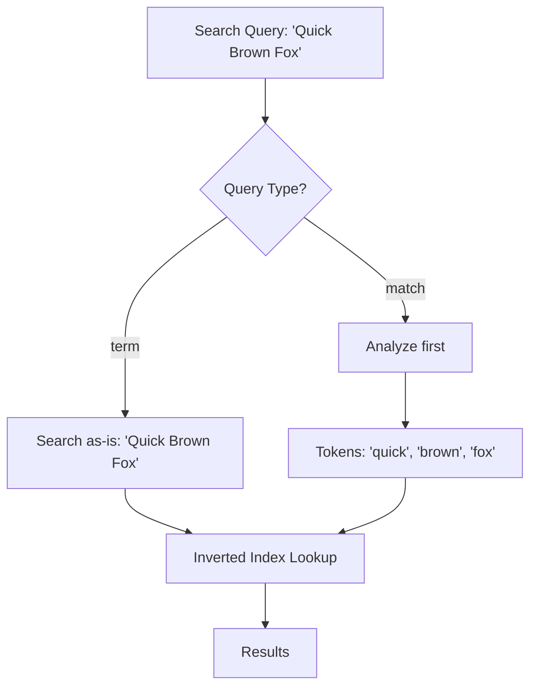
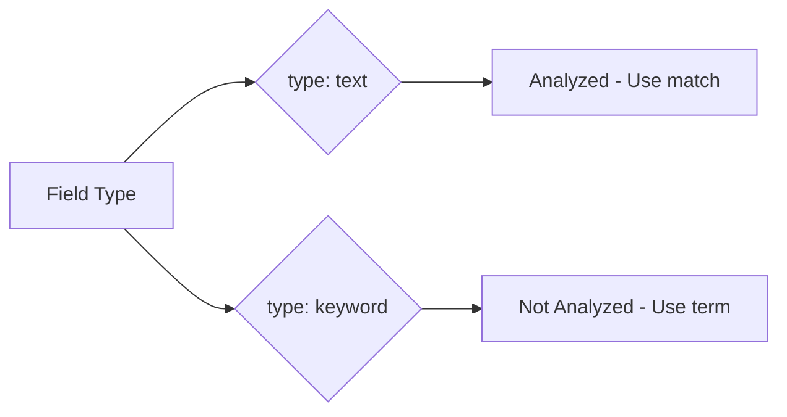
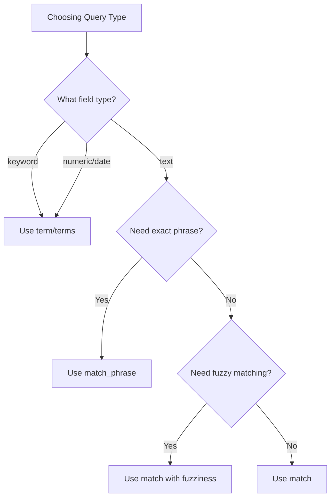

# How to Match vs Term Query in Elasticsearch

Author: [nawazdhandala](https://www.github.com/nawazdhandala)

Tags: Elasticsearch, Query DSL, Search, Text Analysis, Full-Text Search

Description: Learn the critical differences between match and term queries in Elasticsearch. This guide explains when to use each query type, how text analysis affects results, and common pitfalls to avoid.

Understanding the difference between `match` and `term` queries is fundamental to effective Elasticsearch usage. Using the wrong query type is one of the most common mistakes and can lead to confusing results where documents that should match don't appear in results.

## The Core Difference

The fundamental difference lies in text analysis:

- **term query**: Searches for the exact value in the inverted index (no analysis)
- **match query**: Analyzes the search text first, then searches for the analyzed tokens



## How Text Analysis Works

When you index a text field, Elasticsearch applies an analyzer that:

1. Tokenizes the text (splits into words)
2. Lowercases tokens
3. Removes stop words (optionally)
4. Applies stemming (optionally)

```json
// Indexing "The Quick Brown Fox"
// After standard analyzer:
// Stored tokens: ["the", "quick", "brown", "fox"]

PUT /articles/_doc/1
{
  "title": "The Quick Brown Fox"
}
```

## Term Query Explained

The `term` query looks for exact matches in the inverted index without any analysis:

```json
// This will NOT find the document above
GET /articles/_search
{
  "query": {
    "term": {
      "title": "The Quick Brown Fox"
    }
  }
}
// Returns 0 hits because "The Quick Brown Fox" doesn't exist in the index
// The index contains: "the", "quick", "brown", "fox" (lowercased tokens)

// This WILL find the document
GET /articles/_search
{
  "query": {
    "term": {
      "title": "quick"
    }
  }
}
// Returns the document because "quick" exists in the inverted index
```

### When to Use Term Query

Use `term` queries for:

1. **Keyword fields** (not analyzed)
2. **Exact matching** on IDs, codes, enums
3. **Numeric fields**
4. **Date fields**
5. **Boolean fields**

```json
// Keyword field - perfect for term queries
GET /products/_search
{
  "query": {
    "term": {
      "status": "active"
    }
  }
}

// Numeric field
GET /products/_search
{
  "query": {
    "term": {
      "price": 29.99
    }
  }
}

// ID lookup
GET /users/_search
{
  "query": {
    "term": {
      "user_id": "usr_abc123"
    }
  }
}
```

## Match Query Explained

The `match` query analyzes the search text using the same analyzer as the field, then searches for the resulting tokens:

```json
// This WILL find the document
GET /articles/_search
{
  "query": {
    "match": {
      "title": "The Quick Brown Fox"
    }
  }
}
// Analyzes search text to: ["the", "quick", "brown", "fox"]
// Finds documents containing any of these tokens
```

### Match Query Operators

By default, `match` uses OR logic between tokens. You can change this:

```json
// OR logic (default) - matches if ANY token is found
GET /articles/_search
{
  "query": {
    "match": {
      "title": {
        "query": "quick fox",
        "operator": "or"
      }
    }
  }
}

// AND logic - matches only if ALL tokens are found
GET /articles/_search
{
  "query": {
    "match": {
      "title": {
        "query": "quick fox",
        "operator": "and"
      }
    }
  }
}
```

### Minimum Should Match

Control how many terms must match:

```json
GET /articles/_search
{
  "query": {
    "match": {
      "title": {
        "query": "quick brown fox jumps",
        "minimum_should_match": "75%"
      }
    }
  }
}
// Must match at least 3 of the 4 terms
```

## Field Mappings Matter

Your field mapping determines whether analysis occurs:

```json
PUT /products
{
  "mappings": {
    "properties": {
      "name": {
        "type": "text"
      },
      "name_exact": {
        "type": "keyword"
      },
      "category": {
        "type": "keyword"
      },
      "description": {
        "type": "text",
        "analyzer": "english"
      }
    }
  }
}
```



### Multi-Field Mapping

A common pattern is to index both analyzed and non-analyzed versions:

```json
PUT /products
{
  "mappings": {
    "properties": {
      "name": {
        "type": "text",
        "fields": {
          "keyword": {
            "type": "keyword"
          }
        }
      }
    }
  }
}

// Use match for full-text search
GET /products/_search
{
  "query": {
    "match": {
      "name": "wireless mouse"
    }
  }
}

// Use term on .keyword for exact match
GET /products/_search
{
  "query": {
    "term": {
      "name.keyword": "Wireless Gaming Mouse"
    }
  }
}
```

## Common Pitfalls

### Pitfall 1: Term Query on Text Fields

```json
// WRONG: Term query on text field
GET /articles/_search
{
  "query": {
    "term": {
      "title": "Elasticsearch Guide"  // Won't match!
    }
  }
}

// CORRECT: Use match query
GET /articles/_search
{
  "query": {
    "match": {
      "title": "Elasticsearch Guide"
    }
  }
}
```

### Pitfall 2: Match Query on Keyword Fields

```json
// This works but is inefficient
GET /products/_search
{
  "query": {
    "match": {
      "status": "active"
    }
  }
}

// Better: Use term query for keywords
GET /products/_search
{
  "query": {
    "term": {
      "status": "active"
    }
  }
}
```

### Pitfall 3: Case Sensitivity with Term

```json
// Won't find "Active" or "ACTIVE"
GET /products/_search
{
  "query": {
    "term": {
      "status": "active"
    }
  }
}

// Solution: Normalize at index time
PUT /products
{
  "mappings": {
    "properties": {
      "status": {
        "type": "keyword",
        "normalizer": "lowercase_normalizer"
      }
    }
  },
  "settings": {
    "analysis": {
      "normalizer": {
        "lowercase_normalizer": {
          "type": "custom",
          "filter": ["lowercase"]
        }
      }
    }
  }
}
```

## Query Variants

### Terms Query (Multiple Values)

```json
GET /products/_search
{
  "query": {
    "terms": {
      "status": ["active", "pending", "processing"]
    }
  }
}
```

### Match Phrase Query

When word order matters:

```json
// Matches "quick brown fox" but not "brown quick fox"
GET /articles/_search
{
  "query": {
    "match_phrase": {
      "title": "quick brown fox"
    }
  }
}

// Allow some flexibility with slop
GET /articles/_search
{
  "query": {
    "match_phrase": {
      "title": {
        "query": "quick fox",
        "slop": 1
      }
    }
  }
}
// Matches "quick brown fox" (1 word between)
```

### Multi-Match Query

Search across multiple fields:

```json
GET /products/_search
{
  "query": {
    "multi_match": {
      "query": "wireless mouse",
      "fields": ["name^2", "description", "category"],
      "type": "best_fields"
    }
  }
}
```

## Performance Comparison

| Query Type | Analysis | Cache Friendly | Best For |
|------------|----------|----------------|----------|
| term | No | Yes | Exact matches, filters |
| match | Yes | Varies | Full-text search |
| terms | No | Yes | Multiple exact values |
| match_phrase | Yes | Less | Phrase matching |

### Filter Context for Better Performance

Use term queries in filter context for caching:

```json
GET /products/_search
{
  "query": {
    "bool": {
      "must": {
        "match": {
          "description": "wireless bluetooth"
        }
      },
      "filter": [
        { "term": { "status": "active" } },
        { "term": { "category": "electronics" } },
        { "range": { "price": { "lte": 100 } } }
      ]
    }
  }
}
```

## Implementation Examples

### Python

```python
from elasticsearch import Elasticsearch

es = Elasticsearch("http://localhost:9200")

# Term query for exact match
def find_by_status(status):
    return es.search(
        index="products",
        body={
            "query": {
                "term": {
                    "status": status
                }
            }
        }
    )

# Match query for full-text search
def search_products(query_text):
    return es.search(
        index="products",
        body={
            "query": {
                "match": {
                    "description": {
                        "query": query_text,
                        "operator": "and"
                    }
                }
            }
        }
    )

# Combined approach
def search_active_products(query_text, category=None):
    must_clauses = [
        {"match": {"description": query_text}}
    ]

    filter_clauses = [
        {"term": {"status": "active"}}
    ]

    if category:
        filter_clauses.append({"term": {"category": category}})

    return es.search(
        index="products",
        body={
            "query": {
                "bool": {
                    "must": must_clauses,
                    "filter": filter_clauses
                }
            }
        }
    )
```

### Node.js

```javascript
const { Client } = require('@elastic/elasticsearch');
const client = new Client({ node: 'http://localhost:9200' });

// Term query for exact matching
async function findByStatus(status) {
  return client.search({
    index: 'products',
    body: {
      query: {
        term: { status }
      }
    }
  });
}

// Match query with options
async function searchProducts(queryText, options = {}) {
  const { operator = 'or', fuzziness = 'AUTO' } = options;

  return client.search({
    index: 'products',
    body: {
      query: {
        match: {
          description: {
            query: queryText,
            operator,
            fuzziness
          }
        }
      }
    }
  });
}

// Smart query builder
async function smartSearch(text, filters = {}) {
  const boolQuery = {
    must: [],
    filter: []
  };

  // Full-text search on text fields
  if (text) {
    boolQuery.must.push({
      multi_match: {
        query: text,
        fields: ['name^2', 'description'],
        type: 'best_fields'
      }
    });
  }

  // Exact filters on keyword fields
  Object.entries(filters).forEach(([field, value]) => {
    if (Array.isArray(value)) {
      boolQuery.filter.push({ terms: { [field]: value } });
    } else {
      boolQuery.filter.push({ term: { [field]: value } });
    }
  });

  return client.search({
    index: 'products',
    body: {
      query: { bool: boolQuery }
    }
  });
}
```

## Analyze API for Debugging

Use the Analyze API to understand how text is processed:

```json
// See how text is analyzed
POST /products/_analyze
{
  "field": "description",
  "text": "The Quick Brown Fox"
}

// Response shows tokens
{
  "tokens": [
    { "token": "the", "position": 0 },
    { "token": "quick", "position": 1 },
    { "token": "brown", "position": 2 },
    { "token": "fox", "position": 3 }
  ]
}

// Test with specific analyzer
POST /_analyze
{
  "analyzer": "english",
  "text": "running quickly"
}

// Shows stemming
{
  "tokens": [
    { "token": "run", "position": 0 },
    { "token": "quick", "position": 1 }
  ]
}
```

## Decision Guide



## Summary

| Scenario | Query Type | Example |
|----------|------------|---------|
| Search by ID | term | `{"term": {"user_id": "123"}}` |
| Search by status | term | `{"term": {"status": "active"}}` |
| Full-text search | match | `{"match": {"description": "wireless mouse"}}` |
| Phrase search | match_phrase | `{"match_phrase": {"title": "quick brown fox"}}` |
| Multiple values | terms | `{"terms": {"status": ["active", "pending"]}}` |
| Cross-field search | multi_match | `{"multi_match": {"query": "...", "fields": [...]}}` |

## Conclusion

The distinction between match and term queries is crucial for effective Elasticsearch usage:

- **Use term queries** for keyword fields, IDs, enums, and exact matches
- **Use match queries** for text fields where you want full-text search behavior
- **Check your mappings** to understand which fields are analyzed
- **Use the Analyze API** to debug unexpected results
- **Combine both** in bool queries for powerful filtering and searching

Mastering this distinction will help you avoid the most common Elasticsearch query mistakes and build more effective search experiences.

---

**Related Reading:**

- [How to Return Only Certain Fields in Elasticsearch](https://oneuptime.com/blog/post/2025-12-19-return-certain-fields-elasticsearch/view)
- [How to Fix "Result window is too large" Errors](https://oneuptime.com/blog/post/2025-12-19-fix-result-window-too-large-elasticsearch/view)
- [How to Update Multiple Documents by Query in Elasticsearch](https://oneuptime.com/blog/post/2025-12-19-update-multiple-documents-query-elasticsearch/view)
