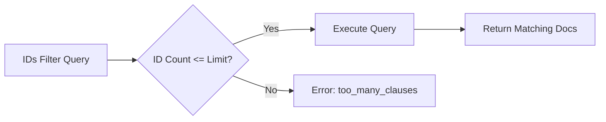
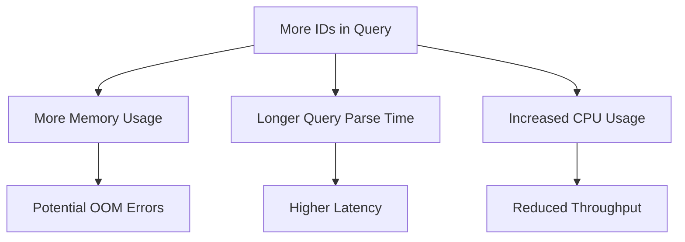
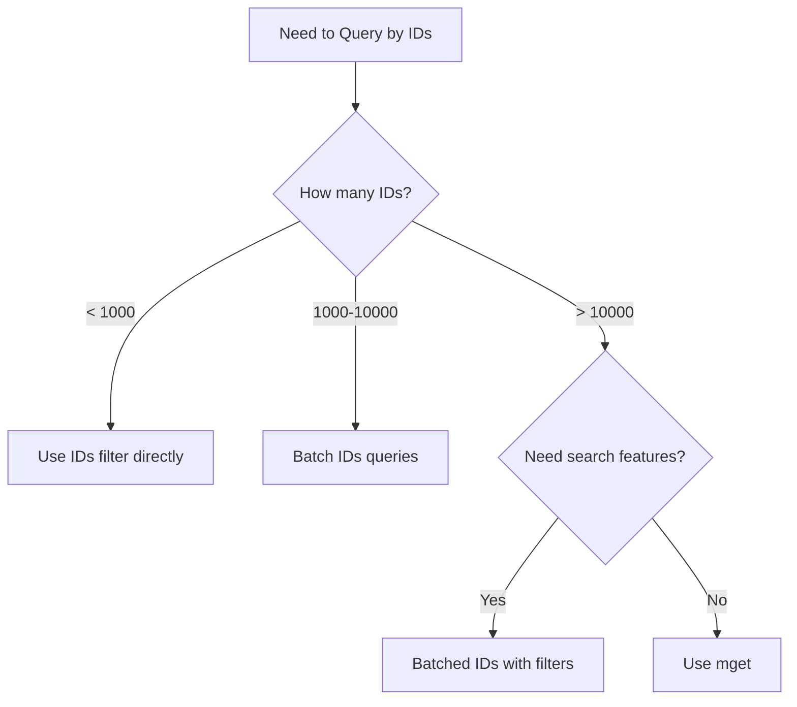

# How to Set Max Limit on IDs Filter Values in Elasticsearch

Author: [nawazdhandala](https://www.github.com/nawazdhandala)

Tags: Elasticsearch, IDs Filter, Query Optimization, Performance, Configuration

Description: Learn how to configure and work with the IDs filter limit in Elasticsearch. This guide covers the max_terms_count setting, performance implications, and alternative approaches for filtering large numbers of document IDs.

The IDs filter in Elasticsearch allows you to query documents by their `_id` field. However, there's a default limit on how many IDs you can include in a single query. This guide explains how to configure this limit and provides alternatives for large ID sets.

## Understanding the IDs Filter

The IDs filter retrieves documents by their document IDs:

```json
GET /products/_search
{
  "query": {
    "ids": {
      "values": ["doc1", "doc2", "doc3", "doc4", "doc5"]
    }
  }
}
```



## Default Limits

Elasticsearch has a default limit of 65,536 for the maximum number of terms in a query:

```json
// This error occurs when exceeding the limit
{
  "error": {
    "type": "query_shard_exception",
    "reason": "failed to create query: maxClauseCount is set to 65536"
  }
}
```

The IDs filter internally creates a terms query, so it's subject to the same limits.

## Configuring the Limit

### Index-Level Setting

Set the limit for a specific index:

```json
PUT /my_index/_settings
{
  "index.max_terms_count": 100000
}
```

### Cluster-Level Setting

Apply to all indexes:

```json
PUT /_cluster/settings
{
  "persistent": {
    "indices.query.bool.max_clause_count": 100000
  }
}
```

### At Index Creation

```json
PUT /products
{
  "settings": {
    "index.max_terms_count": 100000
  },
  "mappings": {
    "properties": {
      "name": { "type": "text" },
      "category": { "type": "keyword" }
    }
  }
}
```

## Performance Considerations

Increasing the limit has trade-offs:



| ID Count | Memory Impact | Query Latency | Recommendation |
|----------|--------------|---------------|----------------|
| < 1,000 | Minimal | Fast | Good for most cases |
| 1,000 - 10,000 | Moderate | Acceptable | Use with caution |
| 10,000 - 65,536 | High | Slower | Consider alternatives |
| > 65,536 | Very High | Very Slow | Use batch approach |

## Alternative Approaches

### 1. Batch the Queries

Split large ID sets into smaller batches:

```python
from elasticsearch import Elasticsearch
from concurrent.futures import ThreadPoolExecutor

es = Elasticsearch("http://localhost:9200")

def batch_ids_query(index, ids, batch_size=1000):
    """Query documents by IDs in batches."""

    all_results = []

    # Split IDs into batches
    batches = [ids[i:i + batch_size] for i in range(0, len(ids), batch_size)]

    for batch in batches:
        response = es.search(
            index=index,
            body={
                "query": {
                    "ids": {
                        "values": batch
                    }
                },
                "size": len(batch)
            }
        )
        all_results.extend(response["hits"]["hits"])

    return all_results

# Usage
ids = ["id1", "id2", ..., "id50000"]  # Large ID list
results = batch_ids_query("products", ids, batch_size=5000)
```

### Parallel Batch Queries

```python
def parallel_batch_ids_query(index, ids, batch_size=1000, max_workers=4):
    """Query documents by IDs using parallel batches."""

    batches = [ids[i:i + batch_size] for i in range(0, len(ids), batch_size)]

    def query_batch(batch):
        return es.search(
            index=index,
            body={
                "query": {"ids": {"values": batch}},
                "size": len(batch)
            }
        )["hits"]["hits"]

    with ThreadPoolExecutor(max_workers=max_workers) as executor:
        results = list(executor.map(query_batch, batches))

    # Flatten results
    return [doc for batch_result in results for doc in batch_result]
```

### 2. Use Multi-Get (mget)

For retrieving specific documents by ID, mget is more efficient:

```json
GET /_mget
{
  "docs": [
    { "_index": "products", "_id": "1" },
    { "_index": "products", "_id": "2" },
    { "_index": "products", "_id": "3" }
  ]
}

// Or for single index
GET /products/_mget
{
  "ids": ["1", "2", "3", "4", "5"]
}
```

### Python mget Implementation

```python
def get_documents_by_ids(es, index, ids, batch_size=1000):
    """Retrieve documents using mget in batches."""

    all_docs = []
    batches = [ids[i:i + batch_size] for i in range(0, len(ids), batch_size)]

    for batch in batches:
        response = es.mget(
            index=index,
            body={"ids": batch}
        )

        for doc in response["docs"]:
            if doc.get("found"):
                all_docs.append({
                    "id": doc["_id"],
                    "source": doc["_source"]
                })

    return all_docs

# Usage
ids = ["id1", "id2", ..., "id100000"]
documents = get_documents_by_ids(es, "products", ids)
```

### 3. Use a Secondary Index for Lookups

Store ID relationships in a separate index:

```json
// Create lookup index
PUT /user_products
{
  "mappings": {
    "properties": {
      "user_id": { "type": "keyword" },
      "product_ids": { "type": "keyword" }
    }
  }
}

// Store user's product IDs
PUT /user_products/_doc/user_123
{
  "user_id": "user_123",
  "product_ids": ["prod_1", "prod_2", "prod_3", ..., "prod_1000"]
}

// Query: First get product IDs, then query products
GET /user_products/_doc/user_123

// Then use those IDs (in batches if needed)
GET /products/_mget
{
  "ids": ["prod_1", "prod_2", ...]
}
```

### 4. Use Terms Lookup

If IDs are stored in another document:

```json
// Store IDs in a lookup document
PUT /lookups/_doc/featured_products
{
  "product_ids": ["prod_1", "prod_2", "prod_3"]
}

// Query using terms lookup
GET /products/_search
{
  "query": {
    "terms": {
      "_id": {
        "index": "lookups",
        "id": "featured_products",
        "path": "product_ids"
      }
    }
  }
}
```

### 5. Use Scroll API for Large Result Sets

When you need to process all matching documents:

```python
def scroll_by_ids(es, index, ids, batch_size=5000, scroll_time="2m"):
    """Use scroll to process large ID sets."""

    all_documents = []

    # Initial search
    response = es.search(
        index=index,
        scroll=scroll_time,
        size=batch_size,
        body={
            "query": {
                "ids": {
                    "values": ids[:65000]  # Respect limit
                }
            }
        }
    )

    scroll_id = response["_scroll_id"]
    hits = response["hits"]["hits"]

    while hits:
        all_documents.extend(hits)

        response = es.scroll(
            scroll_id=scroll_id,
            scroll=scroll_time
        )

        scroll_id = response["_scroll_id"]
        hits = response["hits"]["hits"]

    # Clear scroll
    es.clear_scroll(scroll_id=scroll_id)

    return all_documents
```

## Node.js Implementation

```javascript
const { Client } = require('@elastic/elasticsearch');
const client = new Client({ node: 'http://localhost:9200' });

async function batchIdsQuery(index, ids, batchSize = 1000) {
  const results = [];

  for (let i = 0; i < ids.length; i += batchSize) {
    const batch = ids.slice(i, i + batchSize);

    const response = await client.search({
      index,
      body: {
        query: {
          ids: { values: batch }
        },
        size: batch.length
      }
    });

    results.push(...response.hits.hits);
  }

  return results;
}

async function mgetWithBatching(index, ids, batchSize = 1000) {
  const documents = [];

  for (let i = 0; i < ids.length; i += batchSize) {
    const batch = ids.slice(i, i + batchSize);

    const response = await client.mget({
      index,
      body: { ids: batch }
    });

    response.docs.forEach(doc => {
      if (doc.found) {
        documents.push({
          id: doc._id,
          source: doc._source
        });
      }
    });
  }

  return documents;
}

// Parallel execution
async function parallelMget(index, ids, batchSize = 1000, concurrency = 4) {
  const batches = [];
  for (let i = 0; i < ids.length; i += batchSize) {
    batches.push(ids.slice(i, i + batchSize));
  }

  const results = [];

  // Process in chunks of 'concurrency' batches
  for (let i = 0; i < batches.length; i += concurrency) {
    const chunk = batches.slice(i, i + concurrency);

    const responses = await Promise.all(
      chunk.map(batch =>
        client.mget({ index, body: { ids: batch } })
      )
    );

    responses.forEach(response => {
      response.docs.forEach(doc => {
        if (doc.found) {
          results.push({ id: doc._id, source: doc._source });
        }
      });
    });
  }

  return results;
}

// Usage
async function main() {
  const largeIdList = Array.from({ length: 100000 }, (_, i) => `doc_${i}`);

  // Option 1: Batched search
  const searchResults = await batchIdsQuery('products', largeIdList);
  console.log(`Found ${searchResults.length} documents via search`);

  // Option 2: Batched mget (faster for retrieval)
  const mgetResults = await mgetWithBatching('products', largeIdList);
  console.log(`Found ${mgetResults.length} documents via mget`);

  // Option 3: Parallel mget (fastest)
  const parallelResults = await parallelMget('products', largeIdList);
  console.log(`Found ${parallelResults.length} documents via parallel mget`);
}

main().catch(console.error);
```

## Monitoring and Tuning

### Check Current Settings

```json
GET /products/_settings/index.max_terms_count

GET /_cluster/settings?include_defaults=true&filter_path=*.*.indices.query.bool.max_clause_count
```

### Monitor Query Performance

```json
// Enable slow log for queries
PUT /products/_settings
{
  "index.search.slowlog.threshold.query.warn": "10s",
  "index.search.slowlog.threshold.query.info": "5s",
  "index.search.slowlog.threshold.query.debug": "2s"
}

// Check slow logs
GET /_cat/indices/*slowlog*?v
```

## Best Practices

### 1. Choose the Right Approach



### 2. Pre-filter When Possible

```json
// Instead of querying 50,000 IDs
GET /products/_search
{
  "query": {
    "ids": { "values": ["id1", "id2", ..., "id50000"] }
  }
}

// Add filters to reduce result set first
GET /products/_search
{
  "query": {
    "bool": {
      "must": [
        { "ids": { "values": ["id1", "id2", ...] } }
      ],
      "filter": [
        { "term": { "status": "active" } },
        { "range": { "stock": { "gt": 0 } } }
      ]
    }
  }
}
```

### 3. Cache Results When Appropriate

```python
import redis
import json

redis_client = redis.Redis()

def get_documents_cached(es, index, ids, cache_ttl=300):
    """Get documents with Redis caching."""

    results = {}
    uncached_ids = []

    # Check cache first
    for doc_id in ids:
        cache_key = f"doc:{index}:{doc_id}"
        cached = redis_client.get(cache_key)

        if cached:
            results[doc_id] = json.loads(cached)
        else:
            uncached_ids.append(doc_id)

    # Fetch uncached from Elasticsearch
    if uncached_ids:
        response = es.mget(index=index, body={"ids": uncached_ids})

        for doc in response["docs"]:
            if doc.get("found"):
                doc_id = doc["_id"]
                doc_data = doc["_source"]
                results[doc_id] = doc_data

                # Cache the result
                cache_key = f"doc:{index}:{doc_id}"
                redis_client.setex(cache_key, cache_ttl, json.dumps(doc_data))

    return results
```

## Conclusion

Working with large ID sets in Elasticsearch requires understanding the limitations and choosing the right approach:

1. **For small ID sets** (< 1000): Use the IDs filter directly
2. **For medium sets** (1000-10000): Batch the queries
3. **For large sets** (> 10000): Use mget or parallel batching
4. **For very large sets**: Consider terms lookup or secondary indexes

Increasing `max_terms_count` is possible but not recommended for very large values due to performance implications. Instead, use batching, mget, or architectural solutions like lookup indexes.

---

**Related Reading:**

- [How to Return Only Certain Fields in Elasticsearch](https://oneuptime.com/blog/post/2025-12-19-return-certain-fields-elasticsearch/view)
- [How to Fix "Result window is too large" Errors](https://oneuptime.com/blog/post/2025-12-19-fix-result-window-too-large-elasticsearch/view)
- [How to Bulk Index JSON Data in Elasticsearch](https://oneuptime.com/blog/post/2025-12-19-bulk-index-json-data-elasticsearch/view)
