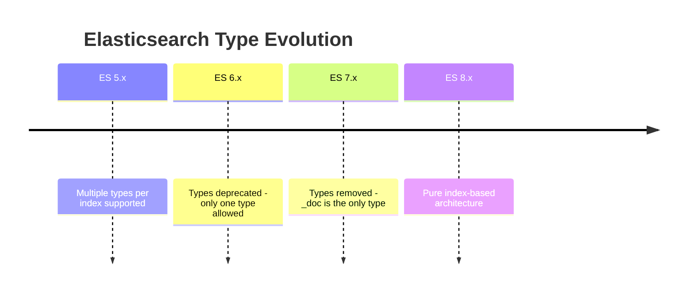
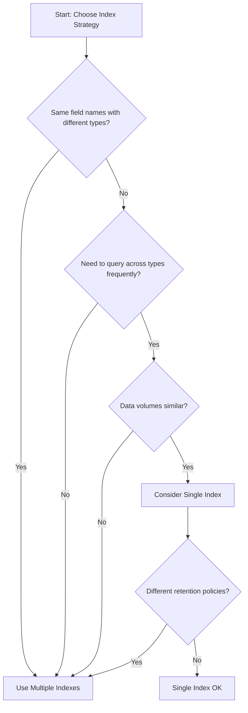

# How to Use Multiple Indexes vs One Index with Types in Elasticsearch

Author: [nawazdhandala](https://www.github.com/nawazdhandala)

Tags: Elasticsearch, Index Design, Architecture, Data Modeling, Performance

Description: Learn when to use multiple indexes versus a single index in Elasticsearch. This guide covers index design patterns, performance considerations, and migration strategies for different data modeling scenarios.

One of the most important decisions in Elasticsearch is how to structure your indexes. Should you use multiple indexes for different data types or consolidate everything into a single index? This guide covers the considerations, patterns, and best practices for making this decision.

## Historical Context: The Deprecation of Types

Elasticsearch originally supported multiple types within a single index, allowing you to store different document structures together. However, types were deprecated in Elasticsearch 6.x and removed in 7.x due to fundamental issues with how Lucene handles fields.



The key problem was that fields with the same name across different types shared the same underlying Lucene field, causing conflicts when field mappings differed.

## Multiple Indexes vs Single Index

Now the question is: should you use separate indexes for different data entities, or consolidate them into one index with a discriminator field?

### Pattern 1: Multiple Indexes (Recommended)

Create separate indexes for each distinct data type:

```json
// Users index
PUT /users
{
  "mappings": {
    "properties": {
      "username": { "type": "keyword" },
      "email": { "type": "keyword" },
      "full_name": { "type": "text" },
      "created_at": { "type": "date" }
    }
  }
}

// Orders index
PUT /orders
{
  "mappings": {
    "properties": {
      "order_id": { "type": "keyword" },
      "user_id": { "type": "keyword" },
      "total": { "type": "float" },
      "items": {
        "type": "nested",
        "properties": {
          "product_id": { "type": "keyword" },
          "quantity": { "type": "integer" },
          "price": { "type": "float" }
        }
      },
      "created_at": { "type": "date" }
    }
  }
}

// Products index
PUT /products
{
  "mappings": {
    "properties": {
      "name": { "type": "text" },
      "sku": { "type": "keyword" },
      "price": { "type": "float" },
      "category": { "type": "keyword" },
      "description": { "type": "text" }
    }
  }
}
```

**Query across indexes when needed:**

```json
GET /users,orders/_search
{
  "query": {
    "bool": {
      "should": [
        { "term": { "username": "john_doe" } },
        { "term": { "user_id": "user_123" } }
      ]
    }
  }
}
```

### Pattern 2: Single Index with Discriminator

Consolidate related data into one index with a type field:

```json
PUT /ecommerce
{
  "mappings": {
    "properties": {
      "doc_type": { "type": "keyword" },

      // User fields
      "username": { "type": "keyword" },
      "email": { "type": "keyword" },
      "full_name": { "type": "text" },

      // Order fields
      "order_id": { "type": "keyword" },
      "user_id": { "type": "keyword" },
      "total": { "type": "float" },

      // Product fields
      "name": { "type": "text" },
      "sku": { "type": "keyword" },
      "price": { "type": "float" },
      "category": { "type": "keyword" },

      // Common fields
      "created_at": { "type": "date" }
    }
  }
}
```

**Query with discriminator:**

```json
GET /ecommerce/_search
{
  "query": {
    "bool": {
      "must": [
        { "term": { "doc_type": "order" } },
        { "range": { "total": { "gte": 100 } } }
      ]
    }
  }
}
```

## Decision Framework

Use this framework to decide which pattern fits your use case:



### When to Use Multiple Indexes

1. **Different Field Types**: When the same field name needs different mappings

```json
// In a users index, 'status' might be a keyword
"status": { "type": "keyword" }  // active, inactive, suspended

// In an orders index, 'status' might need different values
"status": { "type": "keyword" }  // pending, processing, shipped, delivered
```

2. **Different Retention Policies**: When data has different lifecycle requirements

```json
// Logs need short retention with ILM
PUT /logs-2024.01
{
  "settings": {
    "index.lifecycle.name": "logs-policy",
    "index.lifecycle.rollover_alias": "logs"
  }
}

// Audit records need long-term storage
PUT /audit-records
{
  "settings": {
    "index.lifecycle.name": "audit-policy"
  }
}
```

3. **Different Scaling Needs**: When data volumes vary significantly

```json
// High-volume events index
PUT /events
{
  "settings": {
    "number_of_shards": 10,
    "number_of_replicas": 2
  }
}

// Low-volume configuration index
PUT /configurations
{
  "settings": {
    "number_of_shards": 1,
    "number_of_replicas": 1
  }
}
```

4. **Security Isolation**: When different users need access to different data

```json
// Role for users data
{
  "indices": [
    {
      "names": ["users"],
      "privileges": ["read"]
    }
  ]
}

// Role for financial data
{
  "indices": [
    {
      "names": ["transactions", "payments"],
      "privileges": ["read"],
      "field_security": {
        "grant": ["*"],
        "except": ["credit_card_number"]
      }
    }
  ]
}
```

### When to Use Single Index

1. **Highly Related Data**: When data is always queried together

```json
// Content management where articles, pages, and posts are similar
PUT /content
{
  "mappings": {
    "properties": {
      "content_type": { "type": "keyword" },
      "title": { "type": "text" },
      "body": { "type": "text" },
      "author_id": { "type": "keyword" },
      "tags": { "type": "keyword" },
      "published_at": { "type": "date" }
    }
  }
}
```

2. **Similar Schemas**: When documents share most fields

```json
// Different log sources with similar structure
PUT /application-logs
{
  "mappings": {
    "properties": {
      "source": { "type": "keyword" },
      "timestamp": { "type": "date" },
      "level": { "type": "keyword" },
      "message": { "type": "text" },
      "metadata": { "type": "object" }
    }
  }
}
```

3. **Unified Search Experience**: When users search across all data types

```json
GET /content/_search
{
  "query": {
    "multi_match": {
      "query": "elasticsearch tutorial",
      "fields": ["title^2", "body", "tags"]
    }
  },
  "aggs": {
    "by_type": {
      "terms": { "field": "content_type" }
    }
  }
}
```

## Index Patterns and Aliases

Use index patterns and aliases for flexible multi-index access:

### Index Aliases

```json
// Create aliases for logical groupings
POST /_aliases
{
  "actions": [
    {
      "add": {
        "index": "users",
        "alias": "ecommerce-read"
      }
    },
    {
      "add": {
        "index": "orders",
        "alias": "ecommerce-read"
      }
    },
    {
      "add": {
        "index": "products",
        "alias": "ecommerce-read"
      }
    }
  ]
}

// Query all through alias
GET /ecommerce-read/_search
{
  "query": {
    "range": {
      "created_at": {
        "gte": "now-7d"
      }
    }
  }
}
```

### Filtered Aliases

```json
// Create filtered alias for specific doc types
POST /_aliases
{
  "actions": [
    {
      "add": {
        "index": "content",
        "alias": "articles",
        "filter": {
          "term": { "content_type": "article" }
        }
      }
    },
    {
      "add": {
        "index": "content",
        "alias": "pages",
        "filter": {
          "term": { "content_type": "page" }
        }
      }
    }
  ]
}
```

## Time-Based Indexes

For time-series data, use time-based indexes with rollover:

```json
// Create initial index
PUT /logs-000001
{
  "aliases": {
    "logs": {
      "is_write_index": true
    },
    "logs-read": {}
  }
}

// Configure rollover policy
PUT /_ilm/policy/logs-policy
{
  "policy": {
    "phases": {
      "hot": {
        "actions": {
          "rollover": {
            "max_size": "50gb",
            "max_age": "1d"
          }
        }
      },
      "warm": {
        "min_age": "7d",
        "actions": {
          "shrink": {
            "number_of_shards": 1
          }
        }
      },
      "delete": {
        "min_age": "30d",
        "actions": {
          "delete": {}
        }
      }
    }
  }
}
```

## Implementation Examples

### Python Multi-Index Search

```python
from elasticsearch import Elasticsearch

es = Elasticsearch("http://localhost:9200")

# Search across multiple indexes
def search_all_entities(query_text):
    response = es.search(
        index="users,orders,products",
        body={
            "query": {
                "multi_match": {
                    "query": query_text,
                    "fields": [
                        "username",
                        "full_name",
                        "order_id",
                        "name",
                        "description"
                    ]
                }
            }
        }
    )

    # Group results by index
    results_by_index = {}
    for hit in response["hits"]["hits"]:
        index = hit["_index"]
        if index not in results_by_index:
            results_by_index[index] = []
        results_by_index[index].append(hit["_source"])

    return results_by_index
```

### Node.js Index Management

```javascript
const { Client } = require('@elastic/elasticsearch');
const client = new Client({ node: 'http://localhost:9200' });

// Create indexes with appropriate settings
async function setupIndexes() {
  const indexes = {
    users: {
      properties: {
        username: { type: 'keyword' },
        email: { type: 'keyword' },
        full_name: { type: 'text' }
      }
    },
    orders: {
      properties: {
        order_id: { type: 'keyword' },
        user_id: { type: 'keyword' },
        total: { type: 'float' }
      }
    }
  };

  for (const [indexName, mappings] of Object.entries(indexes)) {
    const exists = await client.indices.exists({ index: indexName });

    if (!exists) {
      await client.indices.create({
        index: indexName,
        body: {
          mappings: { properties: mappings.properties }
        }
      });
      console.log(`Created index: ${indexName}`);
    }
  }
}

// Search with index-specific handling
async function search(query) {
  const response = await client.search({
    index: ['users', 'orders'],
    body: {
      query: {
        bool: {
          should: [
            { match: { full_name: query } },
            { match: { order_id: query } }
          ]
        }
      }
    }
  });

  return response.hits.hits.map(hit => ({
    index: hit._index,
    id: hit._id,
    data: hit._source
  }));
}
```

## Performance Considerations

### Shard Count Matters

Each index has overhead. Too many small indexes can hurt performance:

```json
// Bad: Many tiny indexes
PUT /logs-2024-01-01
PUT /logs-2024-01-02
PUT /logs-2024-01-03
// ... creates thousands of shards

// Better: Daily rollover with controlled shards
PUT /logs-000001
{
  "settings": {
    "number_of_shards": 5
  },
  "aliases": {
    "logs-write": { "is_write_index": true }
  }
}
```

### Query Routing

When using multiple indexes, query routing can improve performance:

```json
// Index with routing
PUT /orders/_doc/order_123?routing=user_456
{
  "order_id": "order_123",
  "user_id": "user_456",
  "total": 99.99
}

// Search with routing
GET /orders/_search?routing=user_456
{
  "query": {
    "term": { "user_id": "user_456" }
  }
}
```

## Migration Strategy

If migrating from types to multiple indexes:

```json
// Step 1: Create new indexes
PUT /users_v2
{
  "mappings": {
    "properties": {
      "username": { "type": "keyword" },
      "email": { "type": "keyword" }
    }
  }
}

// Step 2: Reindex data
POST /_reindex
{
  "source": {
    "index": "old_combined_index",
    "query": {
      "term": { "_type": "user" }
    }
  },
  "dest": {
    "index": "users_v2"
  }
}

// Step 3: Update aliases
POST /_aliases
{
  "actions": [
    { "remove": { "index": "old_combined_index", "alias": "users" } },
    { "add": { "index": "users_v2", "alias": "users" } }
  ]
}
```

## Best Practices Summary

| Factor | Multiple Indexes | Single Index |
|--------|-----------------|--------------|
| Field mapping conflicts | Required | Not possible |
| Different retention | Easy to manage | Complex |
| Cross-type queries | Use aliases | Natural |
| Shard management | More complex | Simpler |
| Security isolation | Native support | Field-level only |
| Schema evolution | Independent | Coordinated |

## Conclusion

The choice between multiple indexes and a single index depends on your specific requirements. In most cases, multiple indexes provide better flexibility, clearer separation of concerns, and easier management. Use aliases and index patterns to maintain query flexibility across multiple indexes.

Key takeaways:

1. **Default to multiple indexes** for distinct data types
2. **Use aliases** for unified access when needed
3. **Consider time-based indexes** for time-series data
4. **Plan shard counts** to avoid overhead from too many small indexes
5. **Test query patterns** to validate your design decisions

---

**Related Reading:**

- [How to Return Only Certain Fields in Elasticsearch](https://oneuptime.com/blog/post/2025-12-19-return-certain-fields-elasticsearch/view)
- [How to Handle Unassigned Shards in Elasticsearch](https://oneuptime.com/blog/post/2025-12-19-handle-unassigned-shards-elasticsearch/view)
- [How to Bulk Index JSON Data in Elasticsearch](https://oneuptime.com/blog/post/2025-12-19-bulk-index-json-data-elasticsearch/view)
