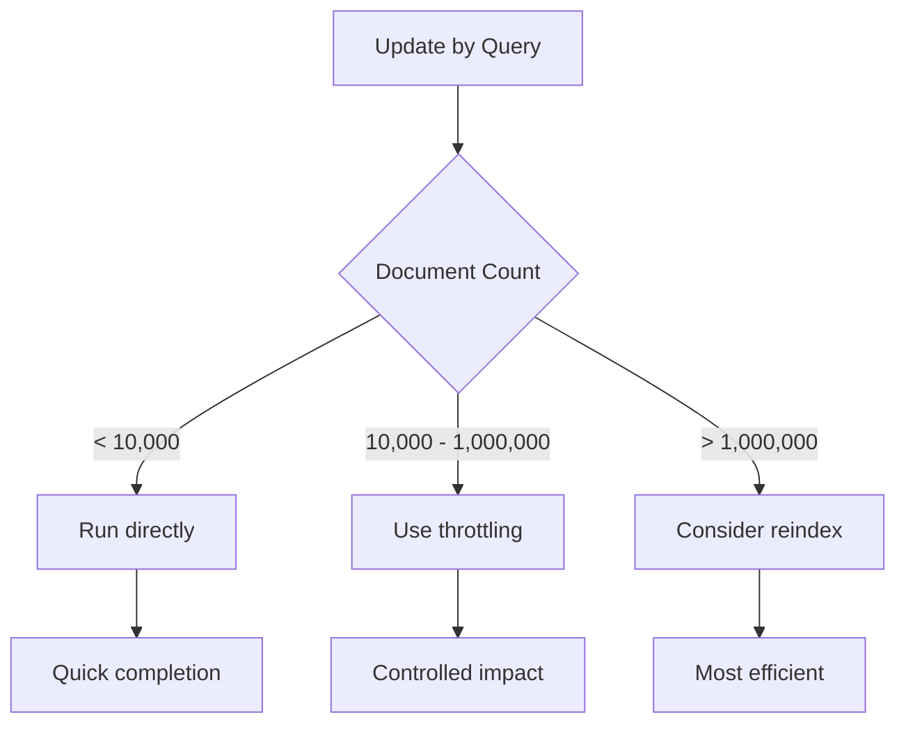

# How to Remove a Field from Elasticsearch Documents

Author: [nawazdhandala](https://www.github.com/nawazdhandala)

Tags: Elasticsearch, Data Management, Update API, Scripting, Index Operations

Description: Learn multiple methods to remove fields from Elasticsearch documents including update API, update by query, painless scripts, and reindexing strategies with practical examples and performance considerations.

Removing fields from Elasticsearch documents is a common maintenance task, whether you're cleaning up deprecated data, removing sensitive information, or restructuring your documents. This guide covers multiple approaches with their trade-offs.

## Understanding Document Updates in Elasticsearch

Elasticsearch documents are immutable. When you "update" a document, Elasticsearch actually:

1. Retrieves the existing document
2. Applies your changes
3. Reindexes the modified document
4. Marks the old document as deleted


## Method 1: Update API with Script (Single Document)

For removing a field from a single document, use the Update API with a Painless script:

```json
POST /products/_update/product_123
{
  "script": {
    "source": "ctx._source.remove('deprecated_field')"
  }
}
```

### Remove Multiple Fields

```json
POST /products/_update/product_123
{
  "script": {
    "source": """
      ctx._source.remove('field_one');
      ctx._source.remove('field_two');
      ctx._source.remove('field_three');
    """
  }
}
```

### Remove Nested Field

```json
POST /products/_update/product_123
{
  "script": {
    "source": "ctx._source.metadata.remove('internal_id')"
  }
}
```

### Conditional Removal

```json
POST /products/_update/product_123
{
  "script": {
    "source": """
      if (ctx._source.containsKey('deprecated_field')) {
        ctx._source.remove('deprecated_field');
      }
    """
  }
}
```

## Method 2: Update by Query (Multiple Documents)

To remove a field from multiple documents matching a query:

```json
POST /products/_update_by_query
{
  "query": {
    "exists": {
      "field": "deprecated_field"
    }
  },
  "script": {
    "source": "ctx._source.remove('deprecated_field')"
  }
}
```

### With Conflict Handling

```json
POST /products/_update_by_query?conflicts=proceed
{
  "query": {
    "match_all": {}
  },
  "script": {
    "source": "ctx._source.remove('deprecated_field')"
  }
}
```

The `conflicts=proceed` parameter continues processing even if some documents were modified by other operations.

### Throttled Update for Large Indexes

```json
POST /products/_update_by_query?scroll_size=1000&requests_per_second=500
{
  "query": {
    "match_all": {}
  },
  "script": {
    "source": "ctx._source.remove('deprecated_field')"
  }
}
```

### Async Update for Very Large Indexes

```json
POST /products/_update_by_query?wait_for_completion=false
{
  "query": {
    "match_all": {}
  },
  "script": {
    "source": "ctx._source.remove('deprecated_field')"
  }
}

// Response includes task ID
{
  "task": "node_id:123456"
}

// Check task status
GET /_tasks/node_id:123456
```

## Method 3: Reindex with Field Exclusion

For removing fields from an entire index, reindexing is often more efficient:

```json
POST /_reindex
{
  "source": {
    "index": "products_old",
    "_source": {
      "excludes": ["deprecated_field", "internal_notes"]
    }
  },
  "dest": {
    "index": "products_new"
  }
}
```

### With Transformation Script

```json
POST /_reindex
{
  "source": {
    "index": "products_old"
  },
  "dest": {
    "index": "products_new"
  },
  "script": {
    "source": """
      ctx._source.remove('deprecated_field');
      if (ctx._source.containsKey('metadata')) {
        ctx._source.metadata.remove('internal_id');
      }
    """
  }
}
```

### Reindex with Alias Swap

```json
// Step 1: Create new index with same mapping
PUT /products_v2
{
  "mappings": {
    "properties": {
      "name": { "type": "text" },
      "price": { "type": "float" }
      // deprecated_field is not included
    }
  }
}

// Step 2: Reindex data
POST /_reindex
{
  "source": {
    "index": "products_v1",
    "_source": {
      "excludes": ["deprecated_field"]
    }
  },
  "dest": {
    "index": "products_v2"
  }
}

// Step 3: Swap alias atomically
POST /_aliases
{
  "actions": [
    { "remove": { "index": "products_v1", "alias": "products" } },
    { "add": { "index": "products_v2", "alias": "products" } }
  ]
}

// Step 4: Delete old index (optional)
DELETE /products_v1
```

## Method 4: Partial Document Update

Replace the entire document without the field:

```json
// Get current document
GET /products/_doc/product_123

// Index new version without the field
PUT /products/_doc/product_123
{
  "name": "Product Name",
  "price": 29.99
  // deprecated_field is simply not included
}
```

### With Optimistic Concurrency Control

```json
// Get document with version info
GET /products/_doc/product_123

// Response
{
  "_index": "products",
  "_id": "product_123",
  "_seq_no": 42,
  "_primary_term": 1,
  "_source": {
    "name": "Product",
    "price": 29.99,
    "deprecated_field": "old value"
  }
}

// Update with version check
PUT /products/_doc/product_123?if_seq_no=42&if_primary_term=1
{
  "name": "Product",
  "price": 29.99
}
```

## Implementation Examples

### Python Bulk Field Removal

```python
from elasticsearch import Elasticsearch
from elasticsearch.helpers import bulk, scan

es = Elasticsearch("http://localhost:9200")

def remove_field_from_index(index, field_name, batch_size=1000):
    """Remove a field from all documents in an index."""

    def generate_actions():
        # Find all documents with the field
        query = {
            "query": {
                "exists": {
                    "field": field_name
                }
            }
        }

        for doc in scan(es, index=index, query=query):
            yield {
                "_op_type": "update",
                "_index": index,
                "_id": doc["_id"],
                "script": {
                    "source": f"ctx._source.remove('{field_name}')"
                }
            }

    success, failed = bulk(
        es,
        generate_actions(),
        chunk_size=batch_size,
        raise_on_error=False
    )

    return success, failed

# Usage
success, failed = remove_field_from_index("products", "deprecated_field")
print(f"Updated {success} documents, {len(failed)} failures")
```

### Python Reindex Approach

```python
from elasticsearch import Elasticsearch

es = Elasticsearch("http://localhost:9200")

def remove_field_via_reindex(source_index, dest_index, fields_to_remove):
    """Remove fields by reindexing to a new index."""

    # Get source mapping
    mapping = es.indices.get_mapping(index=source_index)
    source_mapping = mapping[source_index]["mappings"]

    # Remove fields from mapping
    if "properties" in source_mapping:
        for field in fields_to_remove:
            if field in source_mapping["properties"]:
                del source_mapping["properties"][field]

    # Create destination index
    es.indices.create(
        index=dest_index,
        body={"mappings": source_mapping}
    )

    # Reindex without the fields
    response = es.reindex(
        body={
            "source": {
                "index": source_index,
                "_source": {
                    "excludes": fields_to_remove
                }
            },
            "dest": {
                "index": dest_index
            }
        },
        wait_for_completion=True
    )

    return response

# Usage
response = remove_field_via_reindex(
    "products_v1",
    "products_v2",
    ["deprecated_field", "internal_id"]
)
print(f"Reindexed {response['total']} documents")
```

### Node.js Implementation

```javascript
const { Client } = require('@elastic/elasticsearch');
const client = new Client({ node: 'http://localhost:9200' });

async function removeFieldFromDocuments(index, fieldName, query = { match_all: {} }) {
  const response = await client.updateByQuery({
    index,
    conflicts: 'proceed',
    refresh: true,
    body: {
      query,
      script: {
        source: `ctx._source.remove('${fieldName}')`
      }
    }
  });

  return {
    updated: response.updated,
    failures: response.failures
  };
}

async function removeNestedField(index, parentField, nestedField) {
  const response = await client.updateByQuery({
    index,
    body: {
      query: {
        nested: {
          path: parentField,
          query: {
            exists: { field: `${parentField}.${nestedField}` }
          }
        }
      },
      script: {
        source: `ctx._source.${parentField}.remove('${nestedField}')`
      }
    }
  });

  return response;
}

// Usage
async function main() {
  // Remove simple field
  const result = await removeFieldFromDocuments(
    'products',
    'deprecated_field',
    { term: { status: 'archived' } }
  );
  console.log(`Updated ${result.updated} documents`);

  // Remove nested field
  await removeNestedField('products', 'metadata', 'internal_id');
}
```

## Removing Fields from Mapping

Note that removing documents' fields doesn't remove them from the mapping. To clean up the mapping:

### Option 1: Reindex to New Index

As shown above, create a new index without the field in the mapping.

### Option 2: Close and Reopen (Limited)

You cannot remove fields from a mapping directly. However, you can add new fields:

```json
// This ADDS a field - you cannot remove fields this way
PUT /products/_mapping
{
  "properties": {
    "new_field": { "type": "keyword" }
  }
}
```

### Option 3: Index Template for Future Indexes

Prevent the field from appearing in new indexes:

```json
PUT /_index_template/products_template
{
  "index_patterns": ["products-*"],
  "template": {
    "mappings": {
      "properties": {
        "name": { "type": "text" },
        "price": { "type": "float" }
        // deprecated_field not included
      }
    }
  }
}
```

## Performance Considerations

### Update by Query Performance



### Batch Size Tuning

```json
// Smaller batches = less memory, slower overall
POST /products/_update_by_query?scroll_size=500&requests_per_second=100
{
  "query": { "match_all": {} },
  "script": { "source": "ctx._source.remove('field')" }
}

// Larger batches = more memory, faster overall
POST /products/_update_by_query?scroll_size=5000&requests_per_second=1000
{
  "query": { "match_all": {} },
  "script": { "source": "ctx._source.remove('field')" }
}
```

## Common Pitfalls

### 1. Field Doesn't Exist Error

```json
// This fails if field doesn't exist
POST /products/_update/product_123
{
  "script": {
    "source": "ctx._source.remove('nonexistent_field')"
  }
}

// Safe version - check first
POST /products/_update/product_123
{
  "script": {
    "source": """
      if (ctx._source.containsKey('nonexistent_field')) {
        ctx._source.remove('nonexistent_field');
      }
    """
  }
}
```

### 2. Nested Object Path Issues

```json
// Wrong - will fail if metadata doesn't exist
"ctx._source.metadata.remove('internal_id')"

// Safe version
{
  "script": {
    "source": """
      if (ctx._source.containsKey('metadata') && ctx._source.metadata.containsKey('internal_id')) {
        ctx._source.metadata.remove('internal_id');
      }
    """
  }
}
```

### 3. Version Conflicts

```json
// Handle conflicts gracefully
POST /products/_update_by_query?conflicts=proceed&refresh=true
{
  "query": { "match_all": {} },
  "script": { "source": "ctx._source.remove('field')" }
}
```

## Verification

After removing fields, verify the changes:

```json
// Check if any documents still have the field
GET /products/_search
{
  "query": {
    "exists": {
      "field": "deprecated_field"
    }
  },
  "size": 0
}

// Should return total: 0
{
  "hits": {
    "total": {
      "value": 0,
      "relation": "eq"
    }
  }
}
```

## Conclusion

Removing fields from Elasticsearch documents can be accomplished through several methods:

1. **Update API with script** - Best for single documents
2. **Update by query** - Best for batch updates with specific criteria
3. **Reindex** - Best for large-scale changes or mapping cleanup
4. **Partial document update** - Best when you have the full document available

Choose the method based on your scale and requirements. For large indexes, reindexing is often the most efficient approach despite requiring more planning. Always test on a subset of data first and have a rollback plan ready.

---

**Related Reading:**

- [How to Update Multiple Documents by Query in Elasticsearch](https://oneuptime.com/blog/post/2025-12-19-update-multiple-documents-query-elasticsearch/view)
- [How to Bulk Index JSON Data in Elasticsearch](https://oneuptime.com/blog/post/2025-12-19-bulk-index-json-data-elasticsearch/view)
- [How to Handle Unassigned Shards in Elasticsearch](https://oneuptime.com/blog/post/2025-12-19-handle-unassigned-shards-elasticsearch/view)
