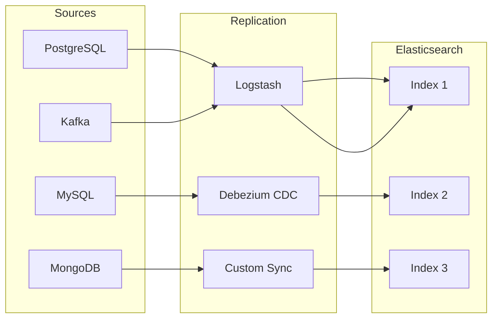

# How to Replicate Data from Other Systems to Elasticsearch

Author: [nawazdhandala](https://www.github.com/nawazdhandala)

Tags: Elasticsearch, Data Replication, ETL, Data Sync, Logstash, Search

Description: Learn how to replicate data from databases, message queues, and other systems to Elasticsearch for powerful search capabilities. Covers real-time sync, batch processing, and change data capture patterns.

---

## Why Replicate Data to Elasticsearch?

Elasticsearch excels at full-text search, analytics, and fast queries across large datasets. However, your source of truth often lives in relational databases, NoSQL stores, or message queues. Replicating data to Elasticsearch gives you:

- Fast full-text search without impacting your primary database
- Advanced analytics and aggregations
- Real-time dashboards and monitoring
- Decoupled search infrastructure that scales independently

## Data Replication Architecture



## Method 1: Using Logstash for Batch Replication

Logstash is the most common way to replicate data from databases to Elasticsearch.

### PostgreSQL to Elasticsearch

First, install the JDBC input plugin:

```bash
bin/logstash-plugin install logstash-input-jdbc
```

Create a Logstash configuration file:

```ruby
# postgres-to-elasticsearch.conf
input {
  jdbc {
    jdbc_driver_library => "/path/to/postgresql-42.2.5.jar"
    jdbc_driver_class => "org.postgresql.Driver"
    jdbc_connection_string => "jdbc:postgresql://localhost:5432/mydb"
    jdbc_user => "postgres"
    jdbc_password => "${POSTGRES_PASSWORD}"

    # Track last synced record
    use_column_value => true
    tracking_column => "updated_at"
    tracking_column_type => "timestamp"
    last_run_metadata_path => "/var/logstash/postgres_last_run"

    # Run every minute
    schedule => "* * * * *"

    statement => "SELECT id, title, content, category, updated_at
                  FROM articles
                  WHERE updated_at > :sql_last_value
                  ORDER BY updated_at ASC"
  }
}

filter {
  mutate {
    remove_field => ["@version", "@timestamp"]
  }
}

output {
  elasticsearch {
    hosts => ["http://localhost:9200"]
    index => "articles"
    document_id => "%{id}"
    action => "index"
  }
}
```

Run Logstash:

```bash
bin/logstash -f postgres-to-elasticsearch.conf
```

## Method 2: Change Data Capture with Debezium

For real-time replication, use Change Data Capture (CDC). Debezium captures row-level changes from your database transaction log.

### Set Up Debezium with Kafka Connect

```json
{
  "name": "postgres-connector",
  "config": {
    "connector.class": "io.debezium.connector.postgresql.PostgresConnector",
    "database.hostname": "localhost",
    "database.port": "5432",
    "database.user": "postgres",
    "database.password": "secret",
    "database.dbname": "mydb",
    "database.server.name": "dbserver1",
    "table.include.list": "public.articles,public.users",
    "plugin.name": "pgoutput",
    "slot.name": "debezium_slot",
    "publication.name": "dbz_publication"
  }
}
```

### Kafka to Elasticsearch Sink Connector

```json
{
  "name": "elasticsearch-sink",
  "config": {
    "connector.class": "io.confluent.connect.elasticsearch.ElasticsearchSinkConnector",
    "topics": "dbserver1.public.articles",
    "connection.url": "http://localhost:9200",
    "type.name": "_doc",
    "key.ignore": "false",
    "schema.ignore": "true",
    "behavior.on.null.values": "delete",
    "transforms": "unwrap",
    "transforms.unwrap.type": "io.debezium.transforms.ExtractNewRecordState",
    "transforms.unwrap.drop.tombstones": "false"
  }
}
```

## Method 3: Custom Sync with Application Code

For fine-grained control, implement sync logic in your application.

### Python Sync Script

```python
from elasticsearch import Elasticsearch, helpers
import psycopg2
from datetime import datetime
import json

class ElasticsearchSync:
    def __init__(self, pg_config, es_config):
        self.pg_conn = psycopg2.connect(**pg_config)
        self.es = Elasticsearch(**es_config)
        self.batch_size = 1000

    def get_last_sync_time(self, index_name):
        """Get the last sync timestamp from Elasticsearch."""
        try:
            result = self.es.search(
                index=index_name,
                body={
                    "size": 1,
                    "sort": [{"updated_at": "desc"}],
                    "_source": ["updated_at"]
                }
            )
            if result['hits']['hits']:
                return result['hits']['hits'][0]['_source']['updated_at']
        except Exception:
            pass
        return "1970-01-01T00:00:00"

    def fetch_changed_records(self, table, last_sync):
        """Fetch records changed since last sync."""
        cursor = self.pg_conn.cursor()
        cursor.execute(f"""
            SELECT id, title, content, category,
                   created_at, updated_at
            FROM {table}
            WHERE updated_at > %s
            ORDER BY updated_at ASC
            LIMIT %s
        """, (last_sync, self.batch_size))

        columns = [desc[0] for desc in cursor.description]
        for row in cursor:
            yield dict(zip(columns, row))
        cursor.close()

    def transform_record(self, record):
        """Transform record for Elasticsearch."""
        return {
            "_index": "articles",
            "_id": record['id'],
            "_source": {
                "id": record['id'],
                "title": record['title'],
                "content": record['content'],
                "category": record['category'],
                "created_at": record['created_at'].isoformat(),
                "updated_at": record['updated_at'].isoformat()
            }
        }

    def sync(self, table, index_name):
        """Run incremental sync."""
        last_sync = self.get_last_sync_time(index_name)
        print(f"Syncing records updated after {last_sync}")

        records = self.fetch_changed_records(table, last_sync)
        actions = (self.transform_record(r) for r in records)

        success, errors = helpers.bulk(
            self.es,
            actions,
            raise_on_error=False
        )

        print(f"Synced {success} records, {len(errors)} errors")
        return success, errors

# Usage
sync = ElasticsearchSync(
    pg_config={
        'host': 'localhost',
        'database': 'mydb',
        'user': 'postgres',
        'password': 'secret'
    },
    es_config={
        'hosts': ['http://localhost:9200']
    }
)

sync.sync('articles', 'articles')
```

## Method 4: Real-Time Sync with Message Queues

When your application already publishes events to a message queue, consume them to update Elasticsearch.

### Kafka Consumer for Elasticsearch

```python
from kafka import KafkaConsumer
from elasticsearch import Elasticsearch
import json

consumer = KafkaConsumer(
    'article-events',
    bootstrap_servers=['localhost:9092'],
    group_id='elasticsearch-sync',
    auto_offset_reset='earliest',
    value_deserializer=lambda x: json.loads(x.decode('utf-8'))
)

es = Elasticsearch(['http://localhost:9200'])

for message in consumer:
    event = message.value

    if event['type'] == 'create' or event['type'] == 'update':
        es.index(
            index='articles',
            id=event['data']['id'],
            body=event['data']
        )
    elif event['type'] == 'delete':
        es.delete(
            index='articles',
            id=event['data']['id'],
            ignore=[404]
        )

    consumer.commit()
```

## Handling Deletes

Deletes are tricky because deleted records no longer exist in the source. Options include:

### Soft Deletes

Add a `deleted_at` column to your source table:

```sql
ALTER TABLE articles ADD COLUMN deleted_at TIMESTAMP;
```

Update your sync to mark documents as deleted:

```python
def sync_with_soft_deletes(self):
    # Fetch deleted records
    cursor.execute("""
        SELECT id FROM articles
        WHERE deleted_at > %s AND deleted_at IS NOT NULL
    """, (last_sync,))

    for row in cursor:
        es.update(
            index='articles',
            id=row[0],
            body={"doc": {"deleted": True}}
        )
```

### Tombstone Events in CDC

Debezium sends tombstone events (null value) for deleted records. Configure your sink to handle them:

```json
{
  "behavior.on.null.values": "delete"
}
```

## Monitoring Your Sync Pipeline

Track these metrics to ensure healthy replication:

| Metric | Description | Alert Threshold |
|--------|-------------|-----------------|
| Sync Lag | Time between source change and ES update | > 5 minutes |
| Error Rate | Failed sync operations | > 1% |
| Document Count Delta | Difference between source and ES | > 100 |
| Replication Throughput | Documents synced per second | < expected |

## Best Practices

1. **Use incremental sync** - Track the last synced timestamp to avoid full table scans
2. **Batch operations** - Use bulk API for better performance
3. **Handle failures gracefully** - Implement retries with exponential backoff
4. **Monitor lag** - Alert when sync falls behind
5. **Version your mappings** - Use index aliases for zero-downtime updates
6. **Test data consistency** - Periodically verify source and Elasticsearch match

## Conclusion

Data replication to Elasticsearch enables powerful search capabilities while keeping your source of truth intact. Choose your replication method based on your latency requirements - batch sync for minutes-level freshness, CDC for near real-time. Always monitor your pipeline and handle deletes explicitly to maintain data consistency.
