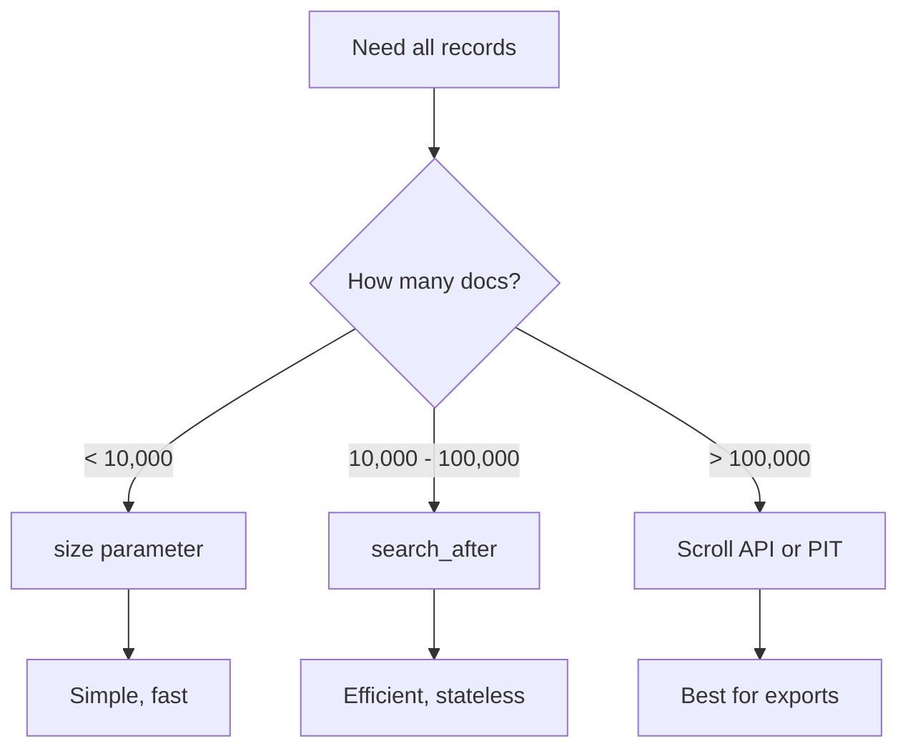

# How to Return All Records in Elasticsearch

Author: [nawazdhandala](https://www.github.com/nawazdhandala)

Tags: Elasticsearch, Pagination, Scroll API, Search After, Bulk Operations, Performance

Description: Learn the different methods to retrieve all records from Elasticsearch - from simple approaches for small datasets to scroll API and search_after for large-scale data extraction.

---

## The Challenge

By default, Elasticsearch returns only 10 results. Getting all records requires understanding pagination limits and choosing the right approach based on data volume.



## Method 1: Size Parameter (Small Datasets)

For small datasets, simply increase the size parameter:

```json
GET /products/_search
{
  "size": 1000,
  "query": {
    "match_all": {}
  }
}
```

### Maximum Size Limit

By default, `size` is capped at 10,000. You can increase this:

```json
PUT /products/_settings
{
  "index.max_result_window": 50000
}
```

Then query:

```json
GET /products/_search
{
  "size": 50000,
  "query": {
    "match_all": {}
  }
}
```

### Warning

Increasing `max_result_window` significantly impacts memory. Only use for small indices.

## Method 2: From/Size Pagination (Moderate Datasets)

Traditional pagination with `from` and `size`:

```json
GET /products/_search
{
  "from": 0,
  "size": 100,
  "query": {
    "match_all": {}
  }
}

GET /products/_search
{
  "from": 100,
  "size": 100,
  "query": {
    "match_all": {}
  }
}
```

### Python Implementation

```python
from elasticsearch import Elasticsearch

es = Elasticsearch(['http://localhost:9200'])

def get_all_with_pagination(index, page_size=100):
    """Retrieve all documents using from/size pagination."""
    all_docs = []
    offset = 0

    while True:
        response = es.search(
            index=index,
            body={
                "from": offset,
                "size": page_size,
                "query": {"match_all": {}}
            }
        )

        hits = response['hits']['hits']
        if not hits:
            break

        all_docs.extend(hits)
        offset += page_size

        # Safety check against max_result_window
        if offset >= 10000:
            print("Warning: Reached max_result_window limit")
            break

    return all_docs

docs = get_all_with_pagination('products')
print(f"Retrieved {len(docs)} documents")
```

### Limitations

- Cannot exceed `max_result_window` (default 10,000)
- Deep pagination is slow and memory-intensive
- Results can shift if index changes during pagination

## Method 3: Scroll API (Large Datasets)

The scroll API maintains a consistent snapshot for iterating through large result sets.

```json
POST /products/_search?scroll=5m
{
  "size": 1000,
  "query": {
    "match_all": {}
  }
}
```

Response includes a `_scroll_id`:

```json
{
  "_scroll_id": "DXF1ZXJ5QW5kRmV0Y2gBAAAAAA...",
  "hits": {
    "hits": [...]
  }
}
```

Continue scrolling:

```json
POST /_search/scroll
{
  "scroll": "5m",
  "scroll_id": "DXF1ZXJ5QW5kRmV0Y2gBAAAAAA..."
}
```

### Python Scroll Implementation

```python
from elasticsearch import Elasticsearch

es = Elasticsearch(['http://localhost:9200'])

def get_all_with_scroll(index, page_size=1000, scroll_timeout='5m'):
    """Retrieve all documents using scroll API."""
    all_docs = []

    # Initial search
    response = es.search(
        index=index,
        scroll=scroll_timeout,
        size=page_size,
        body={"query": {"match_all": {}}}
    )

    scroll_id = response['_scroll_id']
    hits = response['hits']['hits']

    while hits:
        all_docs.extend(hits)

        # Get next batch
        response = es.scroll(
            scroll_id=scroll_id,
            scroll=scroll_timeout
        )

        scroll_id = response['_scroll_id']
        hits = response['hits']['hits']

    # Clean up scroll context
    es.clear_scroll(scroll_id=scroll_id)

    return all_docs

docs = get_all_with_scroll('products')
print(f"Retrieved {len(docs)} documents")
```

### Using helpers.scan

The official client includes a helper:

```python
from elasticsearch import Elasticsearch
from elasticsearch.helpers import scan

es = Elasticsearch(['http://localhost:9200'])

def get_all_with_scan(index):
    """Use the scan helper for easy scrolling."""
    docs = list(scan(
        es,
        index=index,
        query={"query": {"match_all": {}}},
        scroll='5m',
        size=1000
    ))
    return docs

docs = get_all_with_scan('products')
print(f"Retrieved {len(docs)} documents")
```

### Scroll API Best Practices

1. **Clear scroll contexts** - Always clean up when done
2. **Use reasonable timeout** - 5-10 minutes is usually sufficient
3. **Process in batches** - Do not load all into memory at once
4. **Monitor scroll contexts** - Too many open scrolls impacts cluster

Check active scrolls:

```json
GET /_nodes/stats/indices/search
```

## Method 4: Search After (Recommended for Most Cases)

`search_after` provides stateless pagination using sort values.

```json
GET /products/_search
{
  "size": 1000,
  "query": {
    "match_all": {}
  },
  "sort": [
    {"created_at": "asc"},
    {"_id": "asc"}
  ]
}
```

Use the last document's sort values for the next page:

```json
GET /products/_search
{
  "size": 1000,
  "query": {
    "match_all": {}
  },
  "sort": [
    {"created_at": "asc"},
    {"_id": "asc"}
  ],
  "search_after": ["2024-01-15T10:30:00Z", "product_1234"]
}
```

### Python search_after Implementation

```python
from elasticsearch import Elasticsearch

es = Elasticsearch(['http://localhost:9200'])

def get_all_with_search_after(index, page_size=1000):
    """Retrieve all documents using search_after."""
    all_docs = []
    search_after = None

    while True:
        body = {
            "size": page_size,
            "query": {"match_all": {}},
            "sort": [
                {"_id": "asc"}
            ]
        }

        if search_after:
            body["search_after"] = search_after

        response = es.search(index=index, body=body)
        hits = response['hits']['hits']

        if not hits:
            break

        all_docs.extend(hits)
        search_after = hits[-1]['sort']

    return all_docs

docs = get_all_with_search_after('products')
print(f"Retrieved {len(docs)} documents")
```

### Advantages of search_after

- Stateless - no scroll context to manage
- Resilient to index changes
- No timeout concerns
- Works with Point in Time for consistency

## Method 5: Point in Time + search_after (Best for Consistency)

For consistent results during pagination, use Point in Time (PIT):

```json
POST /products/_pit?keep_alive=5m
```

Response:

```json
{
  "id": "46ToAwMDaWR5BXV1aWQyKwZub2RlXzMAAAAAAAAAACoBYwAD..."
}
```

Use PIT with search_after:

```json
GET /_search
{
  "size": 1000,
  "query": {
    "match_all": {}
  },
  "pit": {
    "id": "46ToAwMDaWR5BXV1aWQyKwZub2RlXzMAAAAAAAAAACoBYwAD...",
    "keep_alive": "5m"
  },
  "sort": [
    {"_shard_doc": "asc"}
  ]
}
```

### Python PIT Implementation

```python
from elasticsearch import Elasticsearch

es = Elasticsearch(['http://localhost:9200'])

def get_all_with_pit(index, page_size=1000):
    """Retrieve all documents using PIT + search_after."""
    all_docs = []

    # Open PIT
    pit = es.open_point_in_time(index=index, keep_alive='5m')
    pit_id = pit['id']

    search_after = None

    try:
        while True:
            body = {
                "size": page_size,
                "query": {"match_all": {}},
                "pit": {
                    "id": pit_id,
                    "keep_alive": "5m"
                },
                "sort": [{"_shard_doc": "asc"}]
            }

            if search_after:
                body["search_after"] = search_after

            response = es.search(body=body)
            hits = response['hits']['hits']

            if not hits:
                break

            all_docs.extend(hits)
            search_after = hits[-1]['sort']

            # Update PIT ID (may change)
            pit_id = response['pit_id']

    finally:
        # Close PIT
        es.close_point_in_time(id=pit_id)

    return all_docs

docs = get_all_with_pit('products')
print(f"Retrieved {len(docs)} documents")
```

## Streaming Results (Memory Efficient)

For very large datasets, stream results instead of collecting all:

```python
from elasticsearch import Elasticsearch
from elasticsearch.helpers import scan

es = Elasticsearch(['http://localhost:9200'])

def stream_all_documents(index):
    """Generator that yields documents one at a time."""
    for doc in scan(
        es,
        index=index,
        query={"query": {"match_all": {}}},
        scroll='5m',
        size=1000
    ):
        yield doc

# Process documents without loading all into memory
for doc in stream_all_documents('products'):
    process_document(doc)  # Your processing logic
```

## Export to File

For data export, write directly to file:

```python
import json
from elasticsearch import Elasticsearch
from elasticsearch.helpers import scan

es = Elasticsearch(['http://localhost:9200'])

def export_to_jsonl(index, output_file):
    """Export all documents to JSON Lines file."""
    count = 0

    with open(output_file, 'w') as f:
        for doc in scan(
            es,
            index=index,
            query={"query": {"match_all": {}}},
            scroll='5m',
            size=1000
        ):
            f.write(json.dumps(doc['_source']) + '\n')
            count += 1

            if count % 10000 == 0:
                print(f"Exported {count} documents...")

    print(f"Total exported: {count} documents")
    return count

export_to_jsonl('products', 'products_export.jsonl')
```

## Comparison Table

| Method | Max Records | Memory | Consistency | Complexity |
|--------|-------------|--------|-------------|------------|
| size | 10,000 | High | No | Low |
| from/size | 10,000 | High | No | Low |
| Scroll | Unlimited | Medium | Yes (snapshot) | Medium |
| search_after | Unlimited | Low | No | Medium |
| PIT + search_after | Unlimited | Low | Yes | High |

## Best Practices

1. **Never use from/size for deep pagination** - Use search_after instead
2. **Clear scroll contexts** - Prevent memory leaks
3. **Stream large datasets** - Do not load millions of docs into memory
4. **Use _source filtering** - Only retrieve needed fields
5. **Consider timing** - Run large exports during low-traffic periods
6. **Monitor cluster** - Watch for memory pressure during large operations

### Source Filtering Example

```json
GET /products/_search
{
  "size": 1000,
  "_source": ["title", "price", "category"],
  "query": {
    "match_all": {}
  }
}
```

## Conclusion

Retrieving all records from Elasticsearch requires choosing the right method based on your data volume. For small datasets, simple size increases work. For large datasets, use search_after with or without Point in Time for efficient, memory-friendly pagination. Always stream results when dealing with millions of documents to avoid memory issues. The scroll API, while still valid, is being superseded by PIT + search_after for most use cases.
