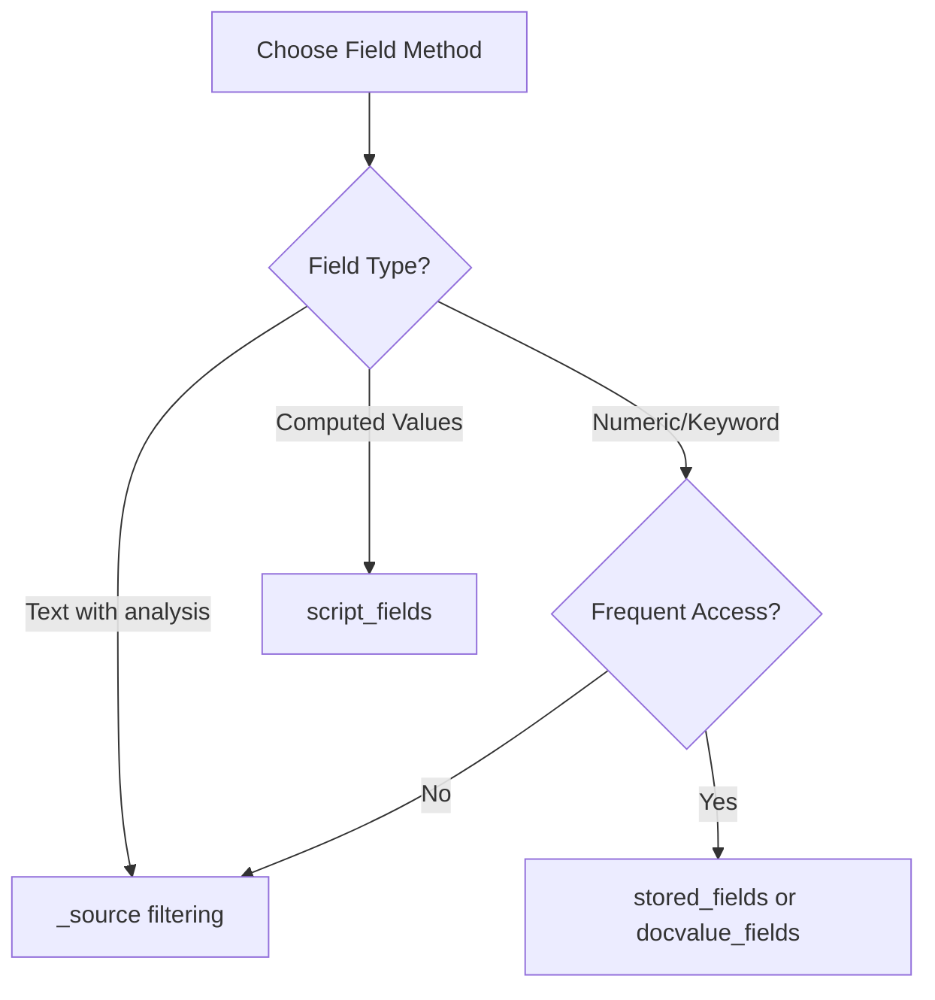

# How to Return Only Certain Fields in Elasticsearch

Author: [nawazdhandala](https://www.github.com/nawazdhandala)

Tags: Elasticsearch, Search, Performance, Query Optimization, API

Description: Learn how to return only specific fields from Elasticsearch queries to reduce network overhead, improve performance, and simplify data processing using _source filtering, stored fields, and docvalue_fields.

When querying Elasticsearch, the default behavior returns the entire `_source` document for each hit. For large documents or high-volume queries, this can create unnecessary network overhead and slow down your application. This guide covers multiple techniques to return only the fields you need.

## Why Return Only Certain Fields?

Returning all fields when you only need a few creates several problems:

1. **Network Overhead**: Large documents mean more data transferred over the network
2. **Memory Usage**: Your application must parse and store unnecessary data
3. **Processing Time**: Serializing and deserializing large JSON objects takes time
4. **Security Concerns**: You might accidentally expose sensitive fields


## Method 1: _source Filtering

The most common approach is `_source` filtering. This tells Elasticsearch which fields to include or exclude from the response.

### Include Specific Fields

Use the `includes` parameter to specify exactly which fields you want:

```json
GET /products/_search
{
  "query": {
    "match": {
      "category": "electronics"
    }
  },
  "_source": {
    "includes": ["name", "price", "sku"]
  }
}
```

The response will only contain the specified fields:

```json
{
  "hits": {
    "hits": [
      {
        "_index": "products",
        "_id": "1",
        "_score": 1.2,
        "_source": {
          "name": "Wireless Mouse",
          "price": 29.99,
          "sku": "WM-001"
        }
      }
    ]
  }
}
```

### Exclude Specific Fields

When you want most fields but need to exclude a few (like sensitive data), use `excludes`:

```json
GET /users/_search
{
  "query": {
    "match_all": {}
  },
  "_source": {
    "excludes": ["password_hash", "api_key", "internal_notes"]
  }
}
```

### Shorthand Syntax

For simple cases, you can use shorthand syntax:

```json
// Include only these fields
GET /products/_search
{
  "_source": ["name", "price"],
  "query": { "match_all": {} }
}

// Disable _source entirely
GET /products/_search
{
  "_source": false,
  "query": { "match_all": {} }
}
```

### Wildcard Patterns

Use wildcards to match multiple fields with similar names:

```json
GET /logs/_search
{
  "_source": {
    "includes": ["timestamp", "level", "message", "context.*"],
    "excludes": ["context.password", "context.token"]
  },
  "query": {
    "range": {
      "timestamp": {
        "gte": "now-1h"
      }
    }
  }
}
```

This includes all fields under `context` except sensitive ones.

## Method 2: Stored Fields

If you have fields configured as `store: true` in your mapping, you can retrieve them directly without accessing `_source`. This is useful for large documents where you frequently need only a few small fields.

### Configure Stored Fields in Mapping

First, define which fields should be stored:

```json
PUT /articles
{
  "mappings": {
    "properties": {
      "title": {
        "type": "text",
        "store": true
      },
      "author": {
        "type": "keyword",
        "store": true
      },
      "published_date": {
        "type": "date",
        "store": true
      },
      "content": {
        "type": "text"
      }
    }
  }
}
```

### Query with Stored Fields

Request the stored fields in your query:

```json
GET /articles/_search
{
  "stored_fields": ["title", "author", "published_date"],
  "_source": false,
  "query": {
    "match": {
      "content": "elasticsearch performance"
    }
  }
}
```

Response format differs slightly:

```json
{
  "hits": {
    "hits": [
      {
        "_index": "articles",
        "_id": "1",
        "_score": 2.5,
        "fields": {
          "title": ["Optimizing Elasticsearch Queries"],
          "author": ["John Doe"],
          "published_date": ["2024-01-15T00:00:00.000Z"]
        }
      }
    ]
  }
}
```

Note that stored fields return arrays, even for single values.

## Method 3: docvalue_fields

For numeric, date, keyword, and other doc-values enabled fields, you can use `docvalue_fields`. This reads directly from column-oriented storage, which can be more efficient than `_source`.

```json
GET /metrics/_search
{
  "docvalue_fields": [
    "timestamp",
    "cpu_usage",
    "memory_percent",
    {
      "field": "timestamp",
      "format": "yyyy-MM-dd HH:mm:ss"
    }
  ],
  "_source": false,
  "query": {
    "range": {
      "timestamp": {
        "gte": "now-1d"
      }
    }
  }
}
```

You can specify custom formats for date fields within the query.

## Method 4: Script Fields

When you need computed values or transformations, use `script_fields`:

```json
GET /orders/_search
{
  "_source": ["order_id", "status"],
  "script_fields": {
    "total_with_tax": {
      "script": {
        "source": "doc['subtotal'].value * 1.08"
      }
    },
    "full_name": {
      "script": {
        "source": "doc['first_name'].value + ' ' + doc['last_name'].value"
      }
    }
  },
  "query": {
    "term": {
      "status": "completed"
    }
  }
}
```

## Combining Multiple Methods

You can combine different field retrieval methods in a single query:

```json
GET /products/_search
{
  "_source": {
    "includes": ["name", "description"]
  },
  "docvalue_fields": ["price", "stock_count"],
  "script_fields": {
    "price_with_discount": {
      "script": {
        "source": "doc['price'].value * 0.9"
      }
    }
  },
  "query": {
    "bool": {
      "must": [
        { "match": { "category": "electronics" } },
        { "range": { "stock_count": { "gte": 1 } } }
      ]
    }
  }
}
```

## Implementation in Different Languages

### Python with elasticsearch-py

```python
from elasticsearch import Elasticsearch

es = Elasticsearch("http://localhost:9200")

# Using _source filtering
response = es.search(
    index="products",
    body={
        "query": {
            "match": {"category": "electronics"}
        },
        "_source": ["name", "price", "sku"]
    }
)

# Using source parameter directly
response = es.search(
    index="products",
    source=["name", "price"],
    query={
        "match": {"category": "electronics"}
    }
)

# Process only the fields you requested
for hit in response["hits"]["hits"]:
    product = hit["_source"]
    print(f"{product['name']}: ${product['price']}")
```

### Node.js with @elastic/elasticsearch

```javascript
const { Client } = require('@elastic/elasticsearch');
const client = new Client({ node: 'http://localhost:9200' });

async function searchProducts() {
  const response = await client.search({
    index: 'products',
    body: {
      query: {
        match: { category: 'electronics' }
      },
      _source: {
        includes: ['name', 'price', 'sku'],
        excludes: ['internal_*']
      }
    }
  });

  response.hits.hits.forEach(hit => {
    const { name, price, sku } = hit._source;
    console.log(`${name} (${sku}): $${price}`);
  });
}
```

### Java with Elasticsearch Java Client

```java
SearchRequest searchRequest = new SearchRequest.Builder()
    .index("products")
    .query(q -> q
        .match(m -> m
            .field("category")
            .query("electronics")
        )
    )
    .source(s -> s
        .filter(f -> f
            .includes("name", "price", "sku")
        )
    )
    .build();

SearchResponse<Product> response = client.search(searchRequest, Product.class);

for (Hit<Product> hit : response.hits().hits()) {
    Product product = hit.source();
    System.out.println(product.getName() + ": $" + product.getPrice());
}
```

## Performance Comparison

Here's a comparison of different methods for a document with 50 fields and 10KB average size:

| Method | Response Size | Latency | Best Use Case |
|--------|--------------|---------|---------------|
| Full _source | 10KB | Baseline | Need all fields |
| _source filtering | 500B | 10% faster | Most common, flexible |
| stored_fields | 300B | 15% faster | Frequently accessed small fields |
| docvalue_fields | 200B | 20% faster | Numeric/keyword aggregations |



## Best Practices

### 1. Always Filter in Production

Never return full documents in production queries unless absolutely necessary:

```json
// Good - explicit field selection
GET /logs/_search
{
  "_source": ["timestamp", "level", "message"],
  "query": { ... }
}

// Bad - returns everything
GET /logs/_search
{
  "query": { ... }
}
```

### 2. Use Wildcards Carefully

Wildcards can inadvertently include new fields as your schema evolves:

```json
// Risky - might include sensitive fields added later
"_source": ["user.*"]

// Safer - explicit with exclusions
"_source": {
  "includes": ["user.*"],
  "excludes": ["user.password*", "user.token*"]
}
```

### 3. Consider Index Mapping Design

If you frequently need only certain fields, consider storing them separately:

```json
PUT /products
{
  "mappings": {
    "properties": {
      "summary": {
        "type": "object",
        "properties": {
          "name": { "type": "text" },
          "price": { "type": "float" },
          "sku": { "type": "keyword" }
        }
      },
      "details": {
        "type": "object",
        "enabled": false
      }
    }
  }
}
```

### 4. Profile Your Queries

Use the Profile API to understand field retrieval costs:

```json
GET /products/_search
{
  "profile": true,
  "_source": ["name", "price"],
  "query": {
    "match": { "category": "electronics" }
  }
}
```

## Common Pitfalls

### Nested Objects Require Full Path

```json
// Wrong - won't work for nested objects
"_source": ["address"]

// Correct - use dot notation
"_source": ["address.street", "address.city"]

// Or use wildcards
"_source": ["address.*"]
```

### Empty _source with stored_fields

If you disable `_source` but request non-stored fields, they won't be returned:

```json
// This returns empty results if 'price' isn't stored
GET /products/_search
{
  "stored_fields": ["price"],
  "_source": false,
  "query": { "match_all": {} }
}
```

## Conclusion

Returning only the fields you need from Elasticsearch is a simple but effective optimization technique. Choose the appropriate method based on your use case:

- **_source filtering**: Most flexible, works with any field
- **stored_fields**: Best for frequently accessed, small fields
- **docvalue_fields**: Efficient for numeric and keyword fields
- **script_fields**: For computed or transformed values

Start by identifying which fields your application actually uses, then implement appropriate filtering in all your queries. This small change can significantly improve your application's performance and reduce infrastructure costs.

---

**Related Reading:**

- [How to Match vs Term Query in Elasticsearch](https://oneuptime.com/blog/post/2025-12-19-match-vs-term-query-elasticsearch/view)
- [How to Fix "Result window is too large" Errors in Elasticsearch](https://oneuptime.com/blog/post/2025-12-19-fix-result-window-too-large-elasticsearch/view)
- [How to Bulk Index JSON Data in Elasticsearch](https://oneuptime.com/blog/post/2025-12-19-bulk-index-json-data-elasticsearch/view)
