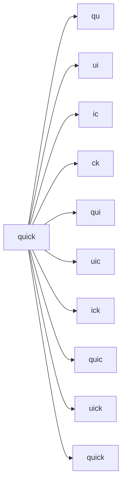

# How to Search for Part of a Word in Elasticsearch

Author: [nawazdhandala](https://www.github.com/nawazdhandala)

Tags: Elasticsearch, Partial Search, Wildcard, NGram, Search, Text Analysis

Description: Learn multiple techniques to search for partial words in Elasticsearch including wildcards, ngrams, edge ngrams, and prefix queries. Understand the trade-offs and choose the right approach for your use case.

---

## The Partial Search Challenge

By default, Elasticsearch matches whole words. Searching for "quick" finds "quick" but not "quickly" or "quicksand". This guide covers multiple approaches to enable partial word matching.

## Method 1: Wildcard Queries

The simplest approach uses wildcard patterns with `*` (any characters) or `?` (single character).

```json
GET /products/_search
{
  "query": {
    "wildcard": {
      "name": {
        "value": "*phone*",
        "case_insensitive": true
      }
    }
  }
}
```

This matches "smartphone", "telephone", "iphone", and "phone".

### Wildcard Limitations

- **Performance**: Leading wildcards (`*phone`) scan all terms - very slow on large indices
- **No scoring**: Results are not ranked by relevance
- **Memory intensive**: Can cause high memory usage

Use wildcards only for small datasets or when other options are not feasible.

## Method 2: Prefix Queries

For matching word beginnings, use prefix queries:

```json
GET /products/_search
{
  "query": {
    "prefix": {
      "name.keyword": {
        "value": "smart"
      }
    }
  }
}
```

This matches "smartphone", "smartwatch", "smarttv".

Prefix queries are faster than wildcards because they only scan terms starting with the prefix, but they still do not support scoring by default.

## Method 3: NGram Tokenizer

For full partial matching with relevance scoring, use ngram tokenization at index time.

### How NGrams Work



An ngram of "quick" with min=2, max=5 creates tokens: "qu", "ui", "ic", "ck", "qui", "uic", "ick", "quic", "uick", "quick".

### Create Index with NGram Analyzer

```json
PUT /products
{
  "settings": {
    "analysis": {
      "analyzer": {
        "ngram_analyzer": {
          "type": "custom",
          "tokenizer": "ngram_tokenizer",
          "filter": ["lowercase"]
        },
        "search_analyzer": {
          "type": "custom",
          "tokenizer": "standard",
          "filter": ["lowercase"]
        }
      },
      "tokenizer": {
        "ngram_tokenizer": {
          "type": "ngram",
          "min_gram": 2,
          "max_gram": 4,
          "token_chars": ["letter", "digit"]
        }
      }
    },
    "index": {
      "max_ngram_diff": 2
    }
  },
  "mappings": {
    "properties": {
      "name": {
        "type": "text",
        "analyzer": "ngram_analyzer",
        "search_analyzer": "search_analyzer"
      }
    }
  }
}
```

### Index and Search

```json
POST /products/_doc
{
  "name": "smartphone"
}

GET /products/_search
{
  "query": {
    "match": {
      "name": "artph"
    }
  }
}
```

This matches "smartphone" because "artph" appears within it.

### NGram Considerations

| Aspect | Impact |
|--------|--------|
| Index Size | 3-10x larger due to token proliferation |
| Index Speed | Slower - more tokens to index |
| Search Speed | Fast - uses inverted index |
| Scoring | Full relevance scoring |

## Method 4: Edge NGrams for Prefix Matching

Edge ngrams only generate tokens from the beginning of words - perfect for autocomplete.

```json
PUT /products
{
  "settings": {
    "analysis": {
      "analyzer": {
        "edge_ngram_analyzer": {
          "type": "custom",
          "tokenizer": "edge_ngram_tokenizer",
          "filter": ["lowercase"]
        }
      },
      "tokenizer": {
        "edge_ngram_tokenizer": {
          "type": "edge_ngram",
          "min_gram": 1,
          "max_gram": 20,
          "token_chars": ["letter", "digit"]
        }
      }
    }
  },
  "mappings": {
    "properties": {
      "name": {
        "type": "text",
        "analyzer": "edge_ngram_analyzer",
        "search_analyzer": "standard"
      }
    }
  }
}
```

"smartphone" becomes: "s", "sm", "sma", "smar", "smart", "smartp", "smartph", "smartpho", "smartphon", "smartphone".

Search with "smart" matches instantly.

## Method 5: Regex Queries

For complex patterns, use regex queries:

```json
GET /products/_search
{
  "query": {
    "regexp": {
      "name.keyword": {
        "value": ".*phone.*",
        "flags": "ALL",
        "case_insensitive": true
      }
    }
  }
}
```

Regex queries are powerful but very slow. Avoid in production with large datasets.

## Method 6: Match Phrase Prefix

For phrase-based partial matching:

```json
GET /products/_search
{
  "query": {
    "match_phrase_prefix": {
      "name": {
        "query": "smart pho",
        "max_expansions": 50
      }
    }
  }
}
```

This matches "smart phone", "smart photography", etc.

## Combining Approaches with Multi-Match

Use multiple fields with different analyzers for flexible search:

```json
PUT /products
{
  "settings": {
    "analysis": {
      "analyzer": {
        "ngram_analyzer": {
          "type": "custom",
          "tokenizer": "ngram_tokenizer",
          "filter": ["lowercase"]
        },
        "edge_analyzer": {
          "type": "custom",
          "tokenizer": "edge_tokenizer",
          "filter": ["lowercase"]
        }
      },
      "tokenizer": {
        "ngram_tokenizer": {
          "type": "ngram",
          "min_gram": 3,
          "max_gram": 4
        },
        "edge_tokenizer": {
          "type": "edge_ngram",
          "min_gram": 1,
          "max_gram": 10
        }
      }
    }
  },
  "mappings": {
    "properties": {
      "name": {
        "type": "text",
        "fields": {
          "ngram": {
            "type": "text",
            "analyzer": "ngram_analyzer"
          },
          "edge": {
            "type": "text",
            "analyzer": "edge_analyzer",
            "search_analyzer": "standard"
          },
          "keyword": {
            "type": "keyword"
          }
        }
      }
    }
  }
}
```

Search across all fields:

```json
GET /products/_search
{
  "query": {
    "multi_match": {
      "query": "phone",
      "fields": [
        "name^3",
        "name.edge^2",
        "name.ngram"
      ],
      "type": "best_fields"
    }
  }
}
```

Exact matches score highest, then prefix matches, then partial matches.

## Performance Comparison

| Method | Index Size | Search Speed | Scoring | Use Case |
|--------|-----------|--------------|---------|----------|
| Wildcard | Normal | Slow | No | Small datasets, ad-hoc |
| Prefix | Normal | Medium | No | Start-of-word matching |
| NGram | Large | Fast | Yes | Full partial matching |
| Edge NGram | Medium | Fast | Yes | Autocomplete |
| Regex | Normal | Very Slow | No | Complex patterns |

## Best Practices

1. **Avoid leading wildcards** - Use ngrams instead for production systems
2. **Keep ngram size small** - min_gram=2, max_gram=4 is usually sufficient
3. **Use different search analyzer** - Prevents query terms from being ngrammed
4. **Consider index size** - NGrams significantly increase storage requirements
5. **Test with real data** - Performance varies based on your specific dataset
6. **Use field boosting** - Prioritize exact matches over partial matches

## Conclusion

Partial word search in Elasticsearch requires careful consideration of trade-offs. For small datasets, wildcards work fine. For production search with relevance scoring, ngrams provide the best user experience despite increased index size. Edge ngrams offer a good middle ground for autocomplete use cases. Always test with your actual data volume to ensure acceptable performance.
