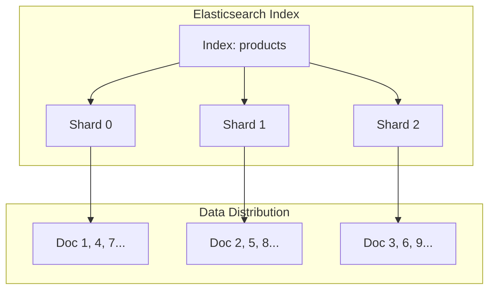
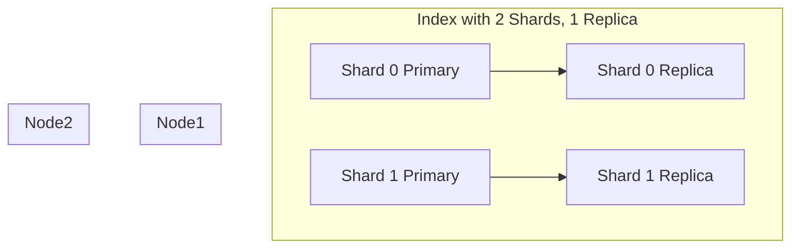
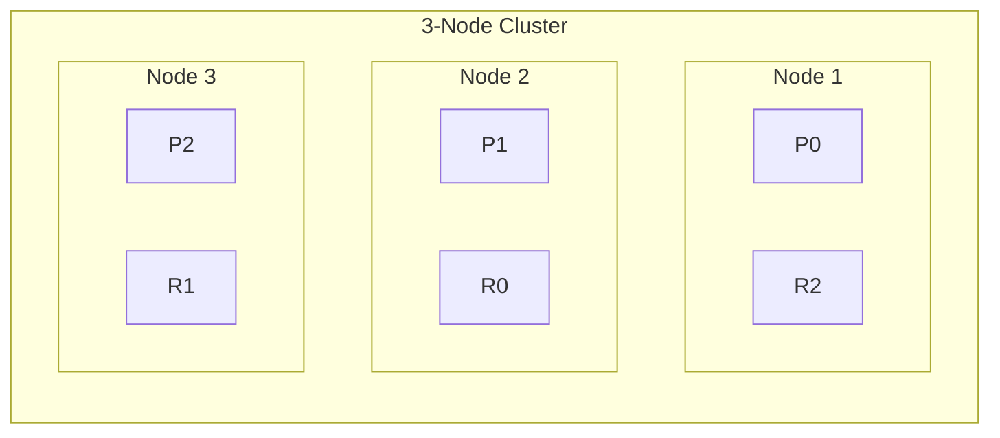

# How to Understand Shards and Replicas in Elasticsearch

Author: [nawazdhandala](https://www.github.com/nawazdhandala)

Tags: Elasticsearch, Shards, Replicas, Scaling, Architecture, Performance

Description: A comprehensive guide to understanding shards and replicas in Elasticsearch. Learn how data is distributed, how to choose the right shard count, and how replicas provide fault tolerance and read scaling.

---

## What are Shards?

A shard is a self-contained Lucene index that holds a subset of your data. When you create an index in Elasticsearch, you choose how many shards to split it into.



When you index a document, Elasticsearch determines which shard receives it using this formula:

```
shard = hash(document_id) % number_of_shards
```

This ensures even distribution across shards.

## What are Replicas?

Replicas are copies of shards. Each shard can have zero or more replica copies.



Replicas serve two purposes:
1. **Fault tolerance** - If a node fails, replicas on other nodes take over
2. **Read scaling** - Search requests can be served by any replica

## Primary vs Replica Shards

| Aspect | Primary Shard | Replica Shard |
|--------|--------------|---------------|
| Writes | Handles all writes | Receives copies from primary |
| Reads | Can serve reads | Can serve reads |
| Failure handling | If lost, replica promoted | Rebuilt from primary |
| Count | Fixed at index creation | Can be changed anytime |

## Creating an Index with Shards and Replicas

```json
PUT /products
{
  "settings": {
    "number_of_shards": 3,
    "number_of_replicas": 1
  }
}
```

This creates:
- 3 primary shards
- 3 replica shards (1 replica per primary)
- Total: 6 shards

## Viewing Shard Allocation

```json
GET /_cat/shards/products?v
```

Output:
```
index    shard prirep state   docs  store ip         node
products 0     p      STARTED 1000  5.2mb 10.0.0.1   node-1
products 0     r      STARTED 1000  5.2mb 10.0.0.2   node-2
products 1     p      STARTED 1050  5.4mb 10.0.0.2   node-2
products 1     r      STARTED 1050  5.4mb 10.0.0.3   node-3
products 2     p      STARTED 950   5.1mb 10.0.0.3   node-3
products 2     r      STARTED 950   5.1mb 10.0.0.1   node-1
```

## How Elasticsearch Distributes Shards

Elasticsearch uses a shard allocator that considers:

1. **Balance** - Spread shards evenly across nodes
2. **Replica separation** - Primary and replica on different nodes
3. **Disk space** - Avoid nodes with low disk space
4. **Awareness attributes** - Keep replicas in different zones/racks



## Choosing the Right Number of Shards

### Shard Sizing Guidelines

| Shard Size | Recommendation |
|------------|---------------|
| < 1 GB | Too small, consider fewer shards |
| 1-10 GB | Good for most use cases |
| 10-50 GB | Acceptable for time-based data |
| > 50 GB | Consider splitting into more shards |

### Calculate Shard Count

```
Number of shards = Estimated index size / Target shard size
```

Example:
- Expected data: 300 GB
- Target shard size: 30 GB
- Shards needed: 300 / 30 = 10 shards

### Shard Count Considerations

**Too few shards:**
- Cannot scale horizontally beyond shard count
- Large shards slow down recovery and rebalancing
- Search queries cannot parallelize effectively

**Too many shards:**
- Memory overhead (each shard uses ~10-50MB heap)
- Slower searches due to coordination overhead
- Cluster state bloat

### The Oversharding Problem

A common mistake is creating too many shards. Consider this calculation:

```
1000 indices x 5 shards x 1 replica = 10,000 shards
```

With 10 nodes, that is 1,000 shards per node. Each shard uses heap memory for:
- Field data caches
- Segment metadata
- Query caches

Rule of thumb: Keep shards per node under 20 per GB of heap.

## Dynamic Replica Management

Unlike shard count, replicas can be changed anytime:

```json
PUT /products/_settings
{
  "number_of_replicas": 2
}
```

### Replica Strategies

**Development:**
```json
{
  "number_of_replicas": 0
}
```
Faster indexing, no fault tolerance.

**Production (small cluster):**
```json
{
  "number_of_replicas": 1
}
```
Basic fault tolerance.

**Production (high availability):**
```json
{
  "number_of_replicas": 2
}
```
Survives two node failures.

## Shard Allocation Awareness

For multi-zone deployments, use allocation awareness:

```json
PUT /_cluster/settings
{
  "persistent": {
    "cluster.routing.allocation.awareness.attributes": "zone"
  }
}
```

Configure each node:
```yaml
node.attr.zone: zone-a
```

This ensures replicas are placed in different zones.

## Index Lifecycle and Shards

For time-series data, use rolling indices:

```json
PUT _ilm/policy/logs_policy
{
  "policy": {
    "phases": {
      "hot": {
        "actions": {
          "rollover": {
            "max_size": "50GB",
            "max_age": "1d"
          }
        }
      },
      "warm": {
        "actions": {
          "shrink": {
            "number_of_shards": 1
          },
          "forcemerge": {
            "max_num_segments": 1
          }
        }
      }
    }
  }
}
```

This creates new indices at 50GB or daily, then shrinks old indices.

## Reindexing to Change Shard Count

Since primary shard count is fixed, you must reindex to change it:

```json
POST _reindex
{
  "source": {
    "index": "products"
  },
  "dest": {
    "index": "products_new"
  }
}
```

Then use aliases for zero-downtime migration:

```json
POST /_aliases
{
  "actions": [
    {"remove": {"index": "products", "alias": "products_alias"}},
    {"add": {"index": "products_new", "alias": "products_alias"}}
  ]
}
```

## Monitoring Shard Health

Check cluster health:

```json
GET /_cluster/health
```

```json
{
  "cluster_name": "production",
  "status": "green",
  "number_of_nodes": 3,
  "active_primary_shards": 15,
  "active_shards": 30,
  "relocating_shards": 0,
  "initializing_shards": 0,
  "unassigned_shards": 0
}
```

Health status meanings:
- **Green** - All primary and replica shards allocated
- **Yellow** - All primaries allocated, some replicas unassigned
- **Red** - Some primary shards unassigned (data unavailable)

## Best Practices Summary

1. **Start with fewer shards** - Easier to add later via reindexing than to reduce
2. **Target 10-50GB per shard** - Balance between parallelism and overhead
3. **Use at least 1 replica in production** - Essential for fault tolerance
4. **Monitor shard count** - Keep total shards manageable (< 20 per GB heap per node)
5. **Use time-based indices** - For logs/metrics, roll over rather than grow forever
6. **Enable allocation awareness** - For multi-zone deployments
7. **Plan for growth** - Consider data retention and growth rate

## Conclusion

Shards and replicas are fundamental to Elasticsearch scalability and reliability. Shards enable horizontal scaling and parallel processing, while replicas provide fault tolerance and read throughput. The key is finding the right balance - enough shards for parallelism without the overhead of oversharding, and enough replicas for your availability requirements without wasting resources.
