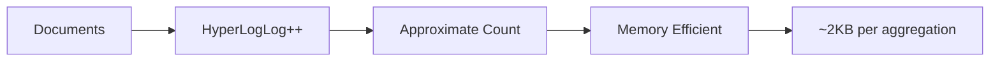

# How to Get Unique Count in Kibana with Elasticsearch

Author: [nawazdhandala](https://www.github.com/nawazdhandala)

Tags: Elasticsearch, Kibana, Aggregations, Cardinality, Analytics, Visualization

Description: Learn how to calculate unique counts (cardinality) in Kibana and Elasticsearch using cardinality aggregations, understand precision trade-offs, and build visualizations for counting distinct values.

Counting unique values (distinct count or cardinality) is a fundamental analytics operation. In Elasticsearch, this is handled by the cardinality aggregation, which uses the HyperLogLog++ algorithm for efficient approximate counting. This guide covers how to use cardinality in both direct queries and Kibana visualizations.

## Understanding Cardinality in Elasticsearch

The cardinality aggregation counts approximate distinct values:

```json
GET /logs/_search
{
  "size": 0,
  "aggs": {
    "unique_users": {
      "cardinality": {
        "field": "user_id"
      }
    }
  }
}

// Response
{
  "aggregations": {
    "unique_users": {
      "value": 15234
    }
  }
}
```



## Why Approximate Counting?

Exact distinct counting requires storing all unique values, which doesn't scale:

| Approach | Memory for 1M unique values | Speed |
|----------|----------------------------|-------|
| Exact (HashSet) | ~40MB | Slow |
| HyperLogLog++ | ~2KB | Fast |

The trade-off is precision - HyperLogLog provides configurable accuracy:

```json
GET /logs/_search
{
  "size": 0,
  "aggs": {
    "unique_users": {
      "cardinality": {
        "field": "user_id",
        "precision_threshold": 40000
      }
    }
  }
}
```

### Precision Threshold

| precision_threshold | Memory | Error Rate |
|--------------------|--------|------------|
| 100 | ~100 bytes | ~6% |
| 1000 | ~1.5KB | ~2% |
| 10000 | ~15KB | ~0.5% |
| 40000 (max) | ~60KB | ~0.25% |

## Basic Cardinality Queries

### Count Unique Users

```json
GET /events/_search
{
  "size": 0,
  "aggs": {
    "unique_visitors": {
      "cardinality": {
        "field": "user_id.keyword"
      }
    }
  }
}
```

### Count Unique Values per Time Period

```json
GET /events/_search
{
  "size": 0,
  "aggs": {
    "daily_unique_users": {
      "date_histogram": {
        "field": "@timestamp",
        "calendar_interval": "day"
      },
      "aggs": {
        "unique_users": {
          "cardinality": {
            "field": "user_id.keyword"
          }
        }
      }
    }
  }
}
```

### Count Unique Values by Category

```json
GET /products/_search
{
  "size": 0,
  "aggs": {
    "by_category": {
      "terms": {
        "field": "category.keyword",
        "size": 20
      },
      "aggs": {
        "unique_brands": {
          "cardinality": {
            "field": "brand.keyword"
          }
        }
      }
    }
  }
}
```

### Multiple Unique Counts

```json
GET /events/_search
{
  "size": 0,
  "query": {
    "range": {
      "@timestamp": {
        "gte": "now-7d"
      }
    }
  },
  "aggs": {
    "unique_users": {
      "cardinality": {
        "field": "user_id.keyword"
      }
    },
    "unique_sessions": {
      "cardinality": {
        "field": "session_id.keyword"
      }
    },
    "unique_pages": {
      "cardinality": {
        "field": "page_url.keyword"
      }
    },
    "unique_countries": {
      "cardinality": {
        "field": "geo.country.keyword"
      }
    }
  }
}
```

## Kibana Visualizations

### Creating a Unique Count Metric

In Kibana Lens or Visualize:

1. Create new visualization
2. Select "Metric" visualization type
3. Choose your index pattern
4. For the metric, select "Unique count" aggregation
5. Select the field to count (e.g., user_id)

### Unique Users Over Time (Line Chart)

Configuration:
- **Y-axis**: Unique count of `user_id`
- **X-axis**: Date histogram on `@timestamp`

```json
// Equivalent Elasticsearch query
GET /events/_search
{
  "size": 0,
  "aggs": {
    "over_time": {
      "date_histogram": {
        "field": "@timestamp",
        "fixed_interval": "1h"
      },
      "aggs": {
        "unique_users": {
          "cardinality": {
            "field": "user_id.keyword",
            "precision_threshold": 10000
          }
        }
      }
    }
  }
}
```

### Unique Count with Filters

Create a Kibana dashboard with filters:

```json
GET /events/_search
{
  "size": 0,
  "query": {
    "bool": {
      "filter": [
        { "term": { "event_type": "purchase" } },
        { "range": { "@timestamp": { "gte": "now-30d" } } }
      ]
    }
  },
  "aggs": {
    "unique_buyers": {
      "cardinality": {
        "field": "user_id.keyword"
      }
    }
  }
}
```

### Comparison Dashboard

Show unique counts across different dimensions:

```json
GET /events/_search
{
  "size": 0,
  "aggs": {
    "by_platform": {
      "terms": {
        "field": "platform.keyword"
      },
      "aggs": {
        "unique_users": {
          "cardinality": {
            "field": "user_id.keyword"
          }
        },
        "unique_devices": {
          "cardinality": {
            "field": "device_id.keyword"
          }
        }
      }
    }
  }
}
```

## Advanced Cardinality Patterns

### Funnel Analysis with Unique Counts

```json
GET /events/_search
{
  "size": 0,
  "aggs": {
    "funnel": {
      "filters": {
        "filters": {
          "visited": { "term": { "event": "page_view" } },
          "added_to_cart": { "term": { "event": "add_to_cart" } },
          "purchased": { "term": { "event": "purchase" } }
        }
      },
      "aggs": {
        "unique_users": {
          "cardinality": {
            "field": "user_id.keyword"
          }
        }
      }
    }
  }
}

// Response shows conversion funnel
{
  "aggregations": {
    "funnel": {
      "buckets": {
        "visited": { "unique_users": { "value": 10000 } },
        "added_to_cart": { "unique_users": { "value": 2500 } },
        "purchased": { "unique_users": { "value": 500 } }
      }
    }
  }
}
```

### Rolling Unique Users (Weekly Active Users)

```json
GET /events/_search
{
  "size": 0,
  "aggs": {
    "daily": {
      "date_histogram": {
        "field": "@timestamp",
        "calendar_interval": "day"
      },
      "aggs": {
        "weekly_active": {
          "filter": {
            "range": {
              "@timestamp": {
                "gte": "now-7d/d"
              }
            }
          },
          "aggs": {
            "unique_users": {
              "cardinality": {
                "field": "user_id.keyword"
              }
            }
          }
        }
      }
    }
  }
}
```

### Scripted Cardinality

Count unique combinations of fields:

```json
GET /orders/_search
{
  "size": 0,
  "aggs": {
    "unique_user_product_pairs": {
      "cardinality": {
        "script": {
          "source": "doc['user_id.keyword'].value + '_' + doc['product_id.keyword'].value"
        }
      }
    }
  }
}
```

## Implementation Examples

### Python - Analytics Dashboard Data

```python
from elasticsearch import Elasticsearch
from datetime import datetime, timedelta

es = Elasticsearch("http://localhost:9200")

def get_dashboard_metrics(index, days=30):
    """Get key unique count metrics for dashboard."""

    end_date = datetime.utcnow()
    start_date = end_date - timedelta(days=days)

    response = es.search(
        index=index,
        body={
            "size": 0,
            "query": {
                "range": {
                    "@timestamp": {
                        "gte": start_date.isoformat(),
                        "lte": end_date.isoformat()
                    }
                }
            },
            "aggs": {
                "unique_users": {
                    "cardinality": {
                        "field": "user_id.keyword",
                        "precision_threshold": 40000
                    }
                },
                "unique_sessions": {
                    "cardinality": {
                        "field": "session_id.keyword",
                        "precision_threshold": 40000
                    }
                },
                "daily_breakdown": {
                    "date_histogram": {
                        "field": "@timestamp",
                        "calendar_interval": "day"
                    },
                    "aggs": {
                        "dau": {
                            "cardinality": {
                                "field": "user_id.keyword"
                            }
                        }
                    }
                }
            }
        }
    )

    aggs = response["aggregations"]

    return {
        "total_unique_users": aggs["unique_users"]["value"],
        "total_unique_sessions": aggs["unique_sessions"]["value"],
        "daily_active_users": [
            {
                "date": bucket["key_as_string"],
                "users": bucket["dau"]["value"]
            }
            for bucket in aggs["daily_breakdown"]["buckets"]
        ]
    }

# Usage
metrics = get_dashboard_metrics("events-*", days=30)
print(f"MAU: {metrics['total_unique_users']}")
```

### Node.js - Real-time Unique Visitor Counter

```javascript
const { Client } = require('@elastic/elasticsearch');
const client = new Client({ node: 'http://localhost:9200' });

async function getUniqueVisitors(index, timeRange = '24h') {
  const response = await client.search({
    index,
    body: {
      size: 0,
      query: {
        range: {
          '@timestamp': {
            gte: `now-${timeRange}`
          }
        }
      },
      aggs: {
        unique_visitors: {
          cardinality: {
            field: 'visitor_id.keyword',
            precision_threshold: 10000
          }
        },
        by_hour: {
          date_histogram: {
            field: '@timestamp',
            fixed_interval: '1h'
          },
          aggs: {
            visitors: {
              cardinality: {
                field: 'visitor_id.keyword'
              }
            }
          }
        }
      }
    }
  });

  return {
    total: response.aggregations.unique_visitors.value,
    byHour: response.aggregations.by_hour.buckets.map(b => ({
      hour: b.key_as_string,
      visitors: b.visitors.value
    }))
  };
}

// Usage
getUniqueVisitors('pageviews', '7d')
  .then(data => {
    console.log(`Unique visitors (7 days): ${data.total}`);
    data.byHour.forEach(h => {
      console.log(`  ${h.hour}: ${h.visitors}`);
    });
  });
```

### Retention Analysis

```python
def calculate_retention(es, index, cohort_date, periods=7):
    """Calculate user retention from a cohort."""

    cohort_start = datetime.strptime(cohort_date, "%Y-%m-%d")

    # Get users who were active on cohort date
    cohort_response = es.search(
        index=index,
        body={
            "size": 0,
            "query": {
                "range": {
                    "@timestamp": {
                        "gte": cohort_start.isoformat(),
                        "lt": (cohort_start + timedelta(days=1)).isoformat()
                    }
                }
            },
            "aggs": {
                "cohort_users": {
                    "terms": {
                        "field": "user_id.keyword",
                        "size": 100000
                    }
                }
            }
        }
    )

    cohort_users = [
        bucket["key"]
        for bucket in cohort_response["aggregations"]["cohort_users"]["buckets"]
    ]

    cohort_size = len(cohort_users)

    # Check retention for each period
    retention = []
    for period in range(periods):
        period_start = cohort_start + timedelta(days=period)
        period_end = period_start + timedelta(days=1)

        period_response = es.search(
            index=index,
            body={
                "size": 0,
                "query": {
                    "bool": {
                        "must": [
                            {
                                "terms": {
                                    "user_id.keyword": cohort_users
                                }
                            },
                            {
                                "range": {
                                    "@timestamp": {
                                        "gte": period_start.isoformat(),
                                        "lt": period_end.isoformat()
                                    }
                                }
                            }
                        ]
                    }
                },
                "aggs": {
                    "retained_users": {
                        "cardinality": {
                            "field": "user_id.keyword"
                        }
                    }
                }
            }
        )

        retained = period_response["aggregations"]["retained_users"]["value"]
        retention_rate = (retained / cohort_size * 100) if cohort_size > 0 else 0

        retention.append({
            "day": period,
            "retained_users": retained,
            "retention_rate": round(retention_rate, 2)
        })

    return {
        "cohort_date": cohort_date,
        "cohort_size": cohort_size,
        "retention": retention
    }
```

## Kibana Dashboard Best Practices

### 1. Use Appropriate Time Filters

Always add time range filters to your dashboards to limit the data scanned:

```json
{
  "query": {
    "range": {
      "@timestamp": {
        "gte": "now-30d",
        "lte": "now"
      }
    }
  }
}
```

### 2. Set Precision Based on Expected Cardinality

```json
// For low cardinality (< 100 unique values)
{ "precision_threshold": 100 }

// For medium cardinality (100-10000)
{ "precision_threshold": 1000 }

// For high cardinality (10000+)
{ "precision_threshold": 40000 }
```

### 3. Combine with Other Metrics

```json
GET /events/_search
{
  "size": 0,
  "aggs": {
    "by_page": {
      "terms": {
        "field": "page.keyword",
        "size": 10,
        "order": { "unique_users": "desc" }
      },
      "aggs": {
        "unique_users": {
          "cardinality": { "field": "user_id.keyword" }
        },
        "total_views": {
          "value_count": { "field": "user_id.keyword" }
        },
        "views_per_user": {
          "bucket_script": {
            "buckets_path": {
              "views": "total_views",
              "users": "unique_users"
            },
            "script": "params.views / params.users"
          }
        }
      }
    }
  }
}
```

## Common Issues and Solutions

### Issue: Cardinality on Text Fields

```json
// Wrong - text fields can't be used for cardinality
GET /logs/_search
{
  "aggs": {
    "unique": {
      "cardinality": { "field": "message" }  // Error!
    }
  }
}

// Correct - use keyword subfield
GET /logs/_search
{
  "aggs": {
    "unique": {
      "cardinality": { "field": "message.keyword" }
    }
  }
}
```

### Issue: Memory Pressure

For very high cardinality fields across many buckets:

```json
// This can cause memory issues
GET /logs/_search
{
  "aggs": {
    "by_minute": {
      "date_histogram": {
        "field": "@timestamp",
        "fixed_interval": "1m"  // Many buckets
      },
      "aggs": {
        "unique_ips": {
          "cardinality": {
            "field": "client_ip.keyword",
            "precision_threshold": 40000  // High precision
          }
        }
      }
    }
  }
}

// Better - reduce precision or increase interval
GET /logs/_search
{
  "aggs": {
    "by_hour": {
      "date_histogram": {
        "field": "@timestamp",
        "fixed_interval": "1h"  // Fewer buckets
      },
      "aggs": {
        "unique_ips": {
          "cardinality": {
            "field": "client_ip.keyword",
            "precision_threshold": 3000  // Lower precision
          }
        }
      }
    }
  }
}
```

## Conclusion

Unique count (cardinality) aggregations in Elasticsearch and Kibana provide powerful capabilities for analytics:

1. **Use cardinality aggregation** for distinct count calculations
2. **Tune precision_threshold** based on expected cardinality and accuracy needs
3. **Combine with date_histogram** for time-series analysis
4. **Use keyword fields** - text fields don't support cardinality
5. **Be mindful of memory** when combining high cardinality with many buckets

Understanding the approximate nature of cardinality and its precision controls allows you to build accurate, performant analytics dashboards.

---

**Related Reading:**

- [How to Return Only Certain Fields in Elasticsearch](https://oneuptime.com/blog/post/2025-12-19-return-certain-fields-elasticsearch/view)
- [How to Match vs Term Query in Elasticsearch](https://oneuptime.com/blog/post/2025-12-19-match-vs-term-query-elasticsearch/view)
- [How to Fix "Result window is too large" Errors](https://oneuptime.com/blog/post/2025-12-19-fix-result-window-too-large-elasticsearch/view)
