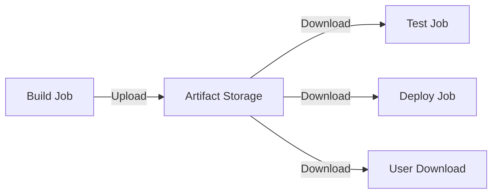

# How to Use Artifacts in GitHub Actions

Author: [nawazdhandala](https://www.github.com/nawazdhandala)

Tags: GitHub Actions, Artifacts, CI/CD, DevOps, Build Automation, Storage

Description: Learn how to use GitHub Actions artifacts to share build outputs between jobs, persist test results, and store deployment packages. This guide covers upload, download, retention, and optimization strategies.

---

Artifacts let you persist files from workflow runs - build outputs, test results, logs, and packages. They enable job-to-job data passing and provide downloadable outputs for debugging or deployment. Understanding artifacts is essential for complex CI/CD pipelines.

## Artifact Flow



## Basic Upload and Download

Upload artifacts from a job:

```yaml
jobs:
  build:
    runs-on: ubuntu-latest
    steps:
      - uses: actions/checkout@v4

      - name: Build application
        run: npm ci && npm run build

      - name: Upload build artifacts
        uses: actions/upload-artifact@v4
        with:
          name: build-output
          path: dist/
```

Download in another job:

```yaml
jobs:
  build:
    runs-on: ubuntu-latest
    steps:
      - uses: actions/checkout@v4
      - run: npm ci && npm run build
      - uses: actions/upload-artifact@v4
        with:
          name: build-output
          path: dist/

  deploy:
    needs: build
    runs-on: ubuntu-latest
    steps:
      - name: Download artifacts
        uses: actions/download-artifact@v4
        with:
          name: build-output
          path: dist/

      - name: Deploy
        run: ./deploy.sh dist/
```

## Multiple Artifacts

Upload multiple named artifacts:

```yaml
jobs:
  build:
    runs-on: ubuntu-latest
    steps:
      - uses: actions/checkout@v4

      - name: Build frontend
        run: cd frontend && npm ci && npm run build

      - name: Build backend
        run: cd backend && npm ci && npm run build

      - name: Upload frontend
        uses: actions/upload-artifact@v4
        with:
          name: frontend-dist
          path: frontend/dist/

      - name: Upload backend
        uses: actions/upload-artifact@v4
        with:
          name: backend-dist
          path: backend/dist/
```

Download all artifacts at once:

```yaml
jobs:
  deploy:
    needs: build
    runs-on: ubuntu-latest
    steps:
      - name: Download all artifacts
        uses: actions/download-artifact@v4
        with:
          path: artifacts/

      - name: List downloaded files
        run: ls -la artifacts/
        # Creates:
        # artifacts/frontend-dist/
        # artifacts/backend-dist/
```

## Matrix Build Artifacts

Collect artifacts from matrix jobs:

```yaml
jobs:
  build:
    strategy:
      matrix:
        os: [ubuntu-latest, macos-latest, windows-latest]
    runs-on: ${{ matrix.os }}
    steps:
      - uses: actions/checkout@v4

      - name: Build
        run: npm ci && npm run build

      - name: Upload artifact
        uses: actions/upload-artifact@v4
        with:
          name: build-${{ matrix.os }}
          path: dist/

  release:
    needs: build
    runs-on: ubuntu-latest
    steps:
      - name: Download all builds
        uses: actions/download-artifact@v4
        with:
          pattern: build-*
          merge-multiple: true
          path: all-builds/
```

## Test Results as Artifacts

Upload test results for analysis:

```yaml
jobs:
  test:
    runs-on: ubuntu-latest
    steps:
      - uses: actions/checkout@v4

      - name: Run tests
        run: npm test -- --reporter=junit --outputFile=test-results.xml
        continue-on-error: true

      - name: Upload test results
        uses: actions/upload-artifact@v4
        if: always()
        with:
          name: test-results
          path: test-results.xml

      - name: Upload coverage
        uses: actions/upload-artifact@v4
        if: always()
        with:
          name: coverage-report
          path: coverage/
```

## Artifact Retention

Control how long artifacts are kept:

```yaml
- uses: actions/upload-artifact@v4
  with:
    name: build-output
    path: dist/
    retention-days: 5  # Default is 90 days
```

For production releases, use longer retention:

```yaml
- uses: actions/upload-artifact@v4
  with:
    name: release-v${{ github.ref_name }}
    path: dist/
    retention-days: 365
```

## Compression and Size

Artifacts are automatically compressed. Control compression level:

```yaml
- uses: actions/upload-artifact@v4
  with:
    name: large-artifact
    path: data/
    compression-level: 9  # 0-9, higher = smaller but slower
```

For already-compressed files, skip compression:

```yaml
- uses: actions/upload-artifact@v4
  with:
    name: docker-image
    path: image.tar.gz
    compression-level: 0
```

## Conditional Uploads

Upload only on failure for debugging:

```yaml
jobs:
  test:
    runs-on: ubuntu-latest
    steps:
      - uses: actions/checkout@v4

      - name: Run tests
        id: test
        run: npm test
        continue-on-error: true

      - name: Upload debug logs on failure
        if: steps.test.outcome == 'failure'
        uses: actions/upload-artifact@v4
        with:
          name: debug-logs
          path: |
            logs/
            screenshots/
```

Upload on success for releases:

```yaml
- name: Upload release artifact
  if: github.event_name == 'push' && startsWith(github.ref, 'refs/tags/')
  uses: actions/upload-artifact@v4
  with:
    name: release
    path: dist/
```

## Path Patterns

Use glob patterns for flexible file selection:

```yaml
- uses: actions/upload-artifact@v4
  with:
    name: build-output
    path: |
      dist/**/*.js
      dist/**/*.css
      !dist/**/*.map
```

Exclude patterns with `!`:

```yaml
- uses: actions/upload-artifact@v4
  with:
    name: source-code
    path: |
      src/
      !src/**/*.test.ts
      !src/**/__mocks__/
```

## Large Artifacts

For very large artifacts, split them:

```yaml
jobs:
  build:
    runs-on: ubuntu-latest
    steps:
      - name: Build large output
        run: ./build.sh

      - name: Split artifact
        run: split -b 100M large-file.tar.gz part-

      - name: Upload parts
        uses: actions/upload-artifact@v4
        with:
          name: large-artifact
          path: part-*

  deploy:
    needs: build
    runs-on: ubuntu-latest
    steps:
      - name: Download parts
        uses: actions/download-artifact@v4
        with:
          name: large-artifact

      - name: Reassemble
        run: cat part-* > large-file.tar.gz
```

## Cross-Workflow Artifacts

Download artifacts from other workflow runs:

```yaml
jobs:
  deploy:
    runs-on: ubuntu-latest
    steps:
      - name: Download from another workflow
        uses: dawidd6/action-download-artifact@v3
        with:
          workflow: build.yml
          name: build-output
          path: dist/
```

## Artifact Cleanup

Remove artifacts programmatically:

```yaml
jobs:
  cleanup:
    runs-on: ubuntu-latest
    steps:
      - name: Delete old artifacts
        uses: actions/github-script@v7
        with:
          script: |
            const artifacts = await github.rest.actions.listArtifactsForRepo({
              owner: context.repo.owner,
              repo: context.repo.repo,
              per_page: 100
            });

            const cutoff = new Date();
            cutoff.setDate(cutoff.getDate() - 7);

            for (const artifact of artifacts.data.artifacts) {
              if (new Date(artifact.created_at) < cutoff) {
                await github.rest.actions.deleteArtifact({
                  owner: context.repo.owner,
                  repo: context.repo.repo,
                  artifact_id: artifact.id
                });
                console.log(`Deleted ${artifact.name}`);
              }
            }
```

## Complete Example

```yaml
name: Build and Deploy

on:
  push:
    branches: [main]
    tags: ['v*']
  pull_request:
    branches: [main]

jobs:
  build:
    runs-on: ubuntu-latest
    steps:
      - uses: actions/checkout@v4

      - uses: actions/setup-node@v4
        with:
          node-version: '20'
          cache: 'npm'

      - run: npm ci
      - run: npm run build
      - run: npm test -- --coverage

      - name: Upload build
        uses: actions/upload-artifact@v4
        with:
          name: dist
          path: dist/
          retention-days: ${{ github.event_name == 'push' && startsWith(github.ref, 'refs/tags/') && 365 || 7 }}

      - name: Upload coverage
        uses: actions/upload-artifact@v4
        if: always()
        with:
          name: coverage
          path: coverage/
          retention-days: 7

  test-e2e:
    needs: build
    runs-on: ubuntu-latest
    steps:
      - uses: actions/checkout@v4

      - uses: actions/download-artifact@v4
        with:
          name: dist
          path: dist/

      - name: Run E2E tests
        run: npm run test:e2e
        continue-on-error: true

      - name: Upload E2E results
        uses: actions/upload-artifact@v4
        if: always()
        with:
          name: e2e-results
          path: |
            test-results/
            screenshots/

  deploy:
    if: github.event_name == 'push' && github.ref == 'refs/heads/main'
    needs: [build, test-e2e]
    runs-on: ubuntu-latest
    steps:
      - uses: actions/download-artifact@v4
        with:
          name: dist
          path: dist/

      - name: Deploy to staging
        run: ./deploy.sh staging dist/

  release:
    if: startsWith(github.ref, 'refs/tags/')
    needs: [build, test-e2e]
    runs-on: ubuntu-latest
    permissions:
      contents: write
    steps:
      - uses: actions/download-artifact@v4
        with:
          name: dist
          path: dist/

      - name: Create tarball
        run: tar -czf release.tar.gz dist/

      - name: Upload to release
        uses: softprops/action-gh-release@v2
        with:
          files: release.tar.gz
```

---

Artifacts are fundamental to multi-job workflows. Use them to pass build outputs between jobs, preserve test results for debugging, and store release packages. Set appropriate retention periods, use compression wisely, and clean up old artifacts to manage storage costs.
