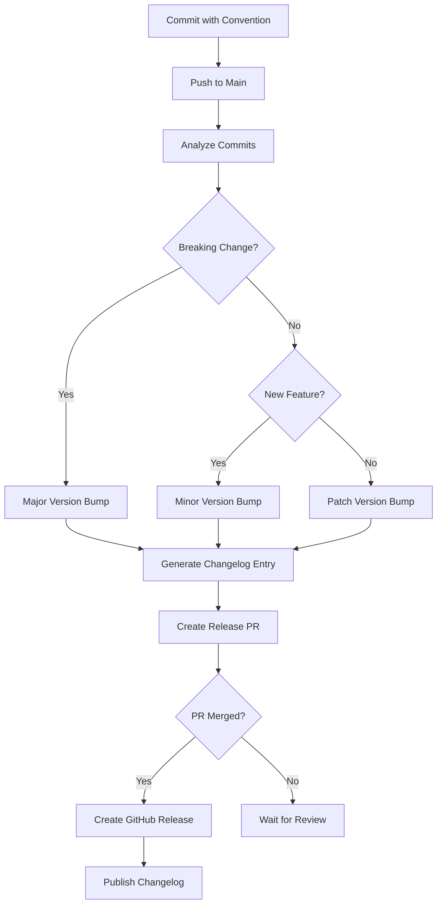

# How to Set Up Changelog Generation in GitHub Actions

Author: [nawazdhandala](https://www.github.com/nawazdhandala)

Tags: GitHub Actions, CI/CD, Changelog, Release Management, Automation, DevOps

Description: Learn how to automatically generate changelogs in GitHub Actions using conventional commits, release-please, and custom scripts.

> A good changelog tells users what changed and why it matters. Automation ensures it stays current.

Maintaining changelogs manually is tedious and error-prone. Automated changelog generation from commit history produces consistent, accurate release notes that help users understand what changed between versions. This guide covers setting up automated changelog generation using conventional commits, semantic release, and custom solutions.

## Changelog Generation Flow



## Conventional Commits Format

The foundation of automated changelogs is structured commit messages:

```
<type>(<scope>): <description>

[optional body]

[optional footer(s)]
```

Types and their changelog sections:

| Type | Section | Version Impact |
|------|---------|----------------|
| `feat` | Features | Minor |
| `fix` | Bug Fixes | Patch |
| `docs` | Documentation | None |
| `style` | Styles | None |
| `refactor` | Code Refactoring | None |
| `perf` | Performance | Patch |
| `test` | Tests | None |
| `build` | Build System | None |
| `ci` | CI | None |
| `chore` | Chores | None |
| `BREAKING CHANGE` | Breaking Changes | Major |

## Release Please Setup

Google's release-please automates releases based on conventional commits:

```yaml
# .github/workflows/release-please.yml
name: Release Please

on:
  push:
    branches:
      - main

permissions:
  contents: write
  pull-requests: write

jobs:
  release-please:
    runs-on: ubuntu-latest
    steps:
      - uses: google-github-actions/release-please-action@v4
        with:
          release-type: node
          package-name: my-package
```

This creates a release PR that accumulates changes:

```markdown
## [1.2.0](https://github.com/owner/repo/compare/v1.1.0...v1.2.0) (2025-12-20)

### Features

* add user authentication ([#123](https://github.com/owner/repo/issues/123)) ([abc1234](https://github.com/owner/repo/commit/abc1234))
* implement dark mode ([#125](https://github.com/owner/repo/issues/125)) ([def5678](https://github.com/owner/repo/commit/def5678))

### Bug Fixes

* fix memory leak in worker ([#124](https://github.com/owner/repo/issues/124)) ([ghi9012](https://github.com/owner/repo/commit/ghi9012))
```

## Semantic Release Setup

Semantic-release provides more customization:

```yaml
# .github/workflows/release.yml
name: Release

on:
  push:
    branches:
      - main

jobs:
  release:
    runs-on: ubuntu-latest
    steps:
      - uses: actions/checkout@v4
        with:
          fetch-depth: 0
          persist-credentials: false

      - uses: actions/setup-node@v4
        with:
          node-version: '20'

      - name: Install dependencies
        run: npm ci

      - name: Release
        env:
          GITHUB_TOKEN: ${{ secrets.GITHUB_TOKEN }}
          NPM_TOKEN: ${{ secrets.NPM_TOKEN }}
        run: npx semantic-release
```

Configure in `package.json` or `.releaserc`:

```json
{
  "release": {
    "branches": ["main"],
    "plugins": [
      "@semantic-release/commit-analyzer",
      "@semantic-release/release-notes-generator",
      [
        "@semantic-release/changelog",
        {
          "changelogFile": "CHANGELOG.md"
        }
      ],
      [
        "@semantic-release/npm",
        {
          "npmPublish": true
        }
      ],
      [
        "@semantic-release/git",
        {
          "assets": ["CHANGELOG.md", "package.json"],
          "message": "chore(release): ${nextRelease.version} [skip ci]\n\n${nextRelease.notes}"
        }
      ],
      "@semantic-release/github"
    ]
  }
}
```

## Custom Changelog Generation

For full control, build your own changelog generator:

```yaml
name: Generate Changelog

on:
  push:
    branches: [main]
  workflow_dispatch:

jobs:
  changelog:
    runs-on: ubuntu-latest
    steps:
      - uses: actions/checkout@v4
        with:
          fetch-depth: 0

      - name: Generate changelog
        id: changelog
        run: |
          # Get the latest tag
          LATEST_TAG=$(git describe --tags --abbrev=0 2>/dev/null || echo "")

          if [ -z "$LATEST_TAG" ]; then
            COMMITS=$(git log --pretty=format:"%h %s" --no-merges)
          else
            COMMITS=$(git log ${LATEST_TAG}..HEAD --pretty=format:"%h %s" --no-merges)
          fi

          # Parse conventional commits
          FEATURES=""
          FIXES=""
          BREAKING=""
          OTHER=""

          while IFS= read -r line; do
            HASH=$(echo "$line" | cut -d' ' -f1)
            MSG=$(echo "$line" | cut -d' ' -f2-)

            if [[ "$MSG" == feat:* ]] || [[ "$MSG" == feat\(*\):* ]]; then
              FEATURES="${FEATURES}\n- ${MSG#feat*: } (${HASH})"
            elif [[ "$MSG" == fix:* ]] || [[ "$MSG" == fix\(*\):* ]]; then
              FIXES="${FIXES}\n- ${MSG#fix*: } (${HASH})"
            elif [[ "$MSG" == *"BREAKING CHANGE"* ]]; then
              BREAKING="${BREAKING}\n- ${MSG} (${HASH})"
            elif [[ "$MSG" != chore:* ]] && [[ "$MSG" != ci:* ]]; then
              OTHER="${OTHER}\n- ${MSG} (${HASH})"
            fi
          done <<< "$COMMITS"

          # Build changelog
          CHANGELOG="## Changelog\n\n"

          if [ -n "$BREAKING" ]; then
            CHANGELOG="${CHANGELOG}### Breaking Changes\n${BREAKING}\n\n"
          fi

          if [ -n "$FEATURES" ]; then
            CHANGELOG="${CHANGELOG}### Features\n${FEATURES}\n\n"
          fi

          if [ -n "$FIXES" ]; then
            CHANGELOG="${CHANGELOG}### Bug Fixes\n${FIXES}\n\n"
          fi

          if [ -n "$OTHER" ]; then
            CHANGELOG="${CHANGELOG}### Other Changes\n${OTHER}\n\n"
          fi

          echo "changelog<<EOF" >> $GITHUB_OUTPUT
          echo -e "$CHANGELOG" >> $GITHUB_OUTPUT
          echo "EOF" >> $GITHUB_OUTPUT

      - name: Update CHANGELOG.md
        run: |
          DATE=$(date +%Y-%m-%d)
          VERSION="Unreleased"

          HEADER="# Changelog\n\n## [$VERSION] - $DATE\n"

          echo -e "$HEADER" > CHANGELOG.new.md
          echo -e "${{ steps.changelog.outputs.changelog }}" >> CHANGELOG.new.md

          if [ -f CHANGELOG.md ]; then
            tail -n +3 CHANGELOG.md >> CHANGELOG.new.md
          fi

          mv CHANGELOG.new.md CHANGELOG.md

      - name: Create Pull Request
        uses: peter-evans/create-pull-request@v6
        with:
          token: ${{ secrets.GITHUB_TOKEN }}
          commit-message: 'docs: update changelog'
          title: 'docs: update changelog'
          body: 'Automated changelog update based on recent commits.'
          branch: automated/changelog-update
```

## Changelog with Version Bumping

Combine changelog generation with version management:

```yaml
name: Version and Changelog

on:
  push:
    branches: [main]

jobs:
  version:
    runs-on: ubuntu-latest
    outputs:
      new_version: ${{ steps.version.outputs.new_version }}
      changelog: ${{ steps.changelog.outputs.changelog }}

    steps:
      - uses: actions/checkout@v4
        with:
          fetch-depth: 0

      - name: Get current version
        id: current
        run: |
          VERSION=$(cat package.json | jq -r .version)
          echo "version=$VERSION" >> $GITHUB_OUTPUT

      - name: Determine version bump
        id: bump
        run: |
          COMMITS=$(git log $(git describe --tags --abbrev=0)..HEAD --pretty=format:"%s")

          if echo "$COMMITS" | grep -q "BREAKING CHANGE"; then
            echo "bump=major" >> $GITHUB_OUTPUT
          elif echo "$COMMITS" | grep -qE "^feat"; then
            echo "bump=minor" >> $GITHUB_OUTPUT
          else
            echo "bump=patch" >> $GITHUB_OUTPUT
          fi

      - name: Calculate new version
        id: version
        run: |
          CURRENT="${{ steps.current.outputs.version }}"
          BUMP="${{ steps.bump.outputs.bump }}"

          IFS='.' read -r MAJOR MINOR PATCH <<< "$CURRENT"

          case $BUMP in
            major)
              MAJOR=$((MAJOR + 1))
              MINOR=0
              PATCH=0
              ;;
            minor)
              MINOR=$((MINOR + 1))
              PATCH=0
              ;;
            patch)
              PATCH=$((PATCH + 1))
              ;;
          esac

          NEW_VERSION="${MAJOR}.${MINOR}.${PATCH}"
          echo "new_version=$NEW_VERSION" >> $GITHUB_OUTPUT

      - name: Generate changelog
        id: changelog
        uses: actions/github-script@v7
        with:
          script: |
            const { execSync } = require('child_process');

            const tag = execSync('git describe --tags --abbrev=0 2>/dev/null || echo ""').toString().trim();
            const range = tag ? `${tag}..HEAD` : 'HEAD';
            const commits = execSync(`git log ${range} --pretty=format:"%H|%s|%an"`).toString().trim().split('\n');

            const sections = {
              breaking: [],
              features: [],
              fixes: [],
              other: []
            };

            commits.forEach(commit => {
              const [hash, message, author] = commit.split('|');
              const short = hash.substring(0, 7);

              if (message.includes('BREAKING CHANGE')) {
                sections.breaking.push(`- ${message} (${short})`);
              } else if (message.startsWith('feat')) {
                sections.features.push(`- ${message.replace(/^feat(\([^)]+\))?:\s*/, '')} (${short})`);
              } else if (message.startsWith('fix')) {
                sections.fixes.push(`- ${message.replace(/^fix(\([^)]+\))?:\s*/, '')} (${short})`);
              }
            });

            let changelog = '';

            if (sections.breaking.length) {
              changelog += '### Breaking Changes\n\n' + sections.breaking.join('\n') + '\n\n';
            }
            if (sections.features.length) {
              changelog += '### Features\n\n' + sections.features.join('\n') + '\n\n';
            }
            if (sections.fixes.length) {
              changelog += '### Bug Fixes\n\n' + sections.fixes.join('\n') + '\n\n';
            }

            core.setOutput('changelog', changelog);

  release:
    needs: version
    runs-on: ubuntu-latest
    steps:
      - uses: actions/checkout@v4

      - name: Update version
        run: |
          npm version ${{ needs.version.outputs.new_version }} --no-git-tag-version

      - name: Update CHANGELOG.md
        run: |
          VERSION="${{ needs.version.outputs.new_version }}"
          DATE=$(date +%Y-%m-%d)

          cat > CHANGELOG.new.md << 'EOF'
          # Changelog

          ## [$VERSION] - $DATE

          ${{ needs.version.outputs.changelog }}
          EOF

          if [ -f CHANGELOG.md ]; then
            tail -n +3 CHANGELOG.md >> CHANGELOG.new.md
          fi

          mv CHANGELOG.new.md CHANGELOG.md

      - name: Create Release PR
        uses: peter-evans/create-pull-request@v6
        with:
          commit-message: 'chore: release ${{ needs.version.outputs.new_version }}'
          title: 'Release ${{ needs.version.outputs.new_version }}'
          body: |
            ## Release ${{ needs.version.outputs.new_version }}

            ${{ needs.version.outputs.changelog }}
          branch: release/${{ needs.version.outputs.new_version }}
```

## GitHub Release Notes

Automatically create GitHub releases with notes:

```yaml
name: Create Release

on:
  push:
    tags:
      - 'v*'

jobs:
  release:
    runs-on: ubuntu-latest
    steps:
      - uses: actions/checkout@v4
        with:
          fetch-depth: 0

      - name: Get previous tag
        id: prev_tag
        run: |
          PREV=$(git describe --tags --abbrev=0 HEAD^ 2>/dev/null || echo "")
          echo "tag=$PREV" >> $GITHUB_OUTPUT

      - name: Generate release notes
        id: notes
        run: |
          CURRENT=${{ github.ref_name }}
          PREV=${{ steps.prev_tag.outputs.tag }}

          if [ -z "$PREV" ]; then
            RANGE="HEAD"
          else
            RANGE="${PREV}..${CURRENT}"
          fi

          # Generate notes
          NOTES=$(git log $RANGE --pretty=format:"- %s (%h)" --no-merges)

          echo "notes<<EOF" >> $GITHUB_OUTPUT
          echo "$NOTES" >> $GITHUB_OUTPUT
          echo "EOF" >> $GITHUB_OUTPUT

      - name: Create GitHub Release
        uses: actions/github-script@v7
        with:
          script: |
            const tag = context.ref.replace('refs/tags/', '');
            const notes = `${{ steps.notes.outputs.notes }}`;

            await github.rest.repos.createRelease({
              owner: context.repo.owner,
              repo: context.repo.repo,
              tag_name: tag,
              name: `Release ${tag}`,
              body: `## What's Changed\n\n${notes}\n\n**Full Changelog**: https://github.com/${context.repo.owner}/${context.repo.repo}/compare/${{ steps.prev_tag.outputs.tag }}...${tag}`,
              draft: false,
              prerelease: tag.includes('-')
            });
```

## Commit Validation

Enforce conventional commits with validation:

```yaml
name: Validate Commits

on:
  pull_request:
    branches: [main]

jobs:
  commitlint:
    runs-on: ubuntu-latest
    steps:
      - uses: actions/checkout@v4
        with:
          fetch-depth: 0

      - uses: actions/setup-node@v4
        with:
          node-version: '20'

      - name: Install commitlint
        run: npm install @commitlint/cli @commitlint/config-conventional

      - name: Validate commits
        run: |
          npx commitlint --from ${{ github.event.pull_request.base.sha }} --to ${{ github.event.pull_request.head.sha }} --verbose
```

Configure commitlint:

```javascript
// commitlint.config.js
module.exports = {
  extends: ['@commitlint/config-conventional'],
  rules: {
    'type-enum': [
      2,
      'always',
      ['feat', 'fix', 'docs', 'style', 'refactor', 'perf', 'test', 'build', 'ci', 'chore', 'revert']
    ],
    'subject-case': [2, 'always', 'lower-case'],
    'header-max-length': [2, 'always', 100]
  }
};
```

## Best Practices

1. **Use conventional commits** - Structured messages enable automation
2. **Validate on PR** - Catch non-conforming commits early
3. **Keep it user-focused** - Changelogs are for users, not developers
4. **Link to issues** - Connect changes to tracked work
5. **Include migration notes** - Document breaking changes clearly
6. **Automate completely** - Manual steps get skipped

## Conclusion

Automated changelog generation removes the burden of manual documentation while producing better results. Start with release-please for simplicity, graduate to semantic-release for npm publishing, or build custom solutions for unique requirements.

The key is consistent commit messages. Once your team adopts conventional commits, changelog generation becomes effortless and accurate.
