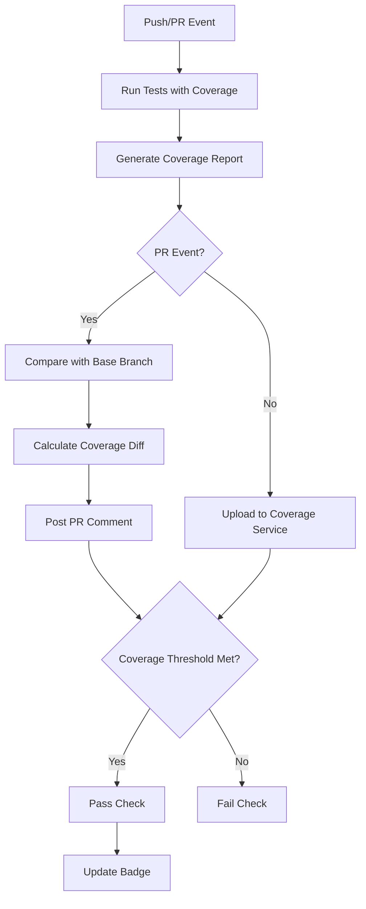

# How to Set Up Code Coverage Reports in GitHub Actions

Author: [nawazdhandala](https://www.github.com/nawazdhandala)

Tags: GitHub Actions, CI/CD, Code Coverage, Testing, DevOps, Quality Assurance

Description: Learn how to set up comprehensive code coverage reports in GitHub Actions with PR comments, badges, and coverage tracking over time.

> What gets measured gets improved. Code coverage gives you a quantifiable metric for test quality.

Code coverage measures how much of your codebase is exercised by tests. While high coverage does not guarantee quality tests, low coverage guarantees blind spots. This guide shows you how to generate coverage reports in GitHub Actions, display them on pull requests, enforce coverage thresholds, and track coverage trends over time.

## Code Coverage Pipeline Overview



## Basic Coverage Workflow

Here is a foundational workflow for JavaScript/TypeScript projects using Jest:

```yaml
# .github/workflows/coverage.yml
name: Code Coverage

on:
  push:
    branches: [main]
  pull_request:
    branches: [main]

jobs:
  coverage:
    runs-on: ubuntu-latest
    steps:
      - name: Checkout code
        uses: actions/checkout@v4

      - name: Setup Node.js
        uses: actions/setup-node@v4
        with:
          node-version: '20'
          cache: 'npm'

      - name: Install dependencies
        run: npm ci

      - name: Run tests with coverage
        run: npm test -- --coverage --coverageReporters=text --coverageReporters=lcov

      - name: Upload coverage report
        uses: actions/upload-artifact@v4
        with:
          name: coverage-report
          path: coverage/
```

## Coverage Report with PR Comments

Display coverage results directly on pull requests:

```yaml
name: Coverage with PR Comment

on:
  pull_request:
    branches: [main]

jobs:
  coverage:
    runs-on: ubuntu-latest
    permissions:
      contents: read
      pull-requests: write

    steps:
      - name: Checkout PR branch
        uses: actions/checkout@v4

      - name: Setup Node.js
        uses: actions/setup-node@v4
        with:
          node-version: '20'
          cache: 'npm'

      - name: Install dependencies
        run: npm ci

      - name: Run tests with coverage
        run: npm test -- --coverage --coverageReporters=json-summary --coverageReporters=lcov

      - name: Extract coverage summary
        id: coverage
        run: |
          COVERAGE=$(cat coverage/coverage-summary.json | jq '.total.lines.pct')
          STATEMENTS=$(cat coverage/coverage-summary.json | jq '.total.statements.pct')
          BRANCHES=$(cat coverage/coverage-summary.json | jq '.total.branches.pct')
          FUNCTIONS=$(cat coverage/coverage-summary.json | jq '.total.functions.pct')

          echo "lines=$COVERAGE" >> $GITHUB_OUTPUT
          echo "statements=$STATEMENTS" >> $GITHUB_OUTPUT
          echo "branches=$BRANCHES" >> $GITHUB_OUTPUT
          echo "functions=$FUNCTIONS" >> $GITHUB_OUTPUT

      - name: Post coverage comment
        uses: actions/github-script@v7
        with:
          script: |
            const lines = ${{ steps.coverage.outputs.lines }};
            const statements = ${{ steps.coverage.outputs.statements }};
            const branches = ${{ steps.coverage.outputs.branches }};
            const functions = ${{ steps.coverage.outputs.functions }};

            const getEmoji = (pct) => {
              if (pct >= 80) return ':white_check_mark:';
              if (pct >= 60) return ':warning:';
              return ':x:';
            };

            const body = `## Code Coverage Report

            | Metric | Coverage | Status |
            |--------|----------|--------|
            | Lines | ${lines.toFixed(2)}% | ${getEmoji(lines)} |
            | Statements | ${statements.toFixed(2)}% | ${getEmoji(statements)} |
            | Branches | ${branches.toFixed(2)}% | ${getEmoji(branches)} |
            | Functions | ${functions.toFixed(2)}% | ${getEmoji(functions)} |

            > Coverage threshold: 80%

            *Generated by GitHub Actions*`;

            // Find existing comment
            const comments = await github.rest.issues.listComments({
              owner: context.repo.owner,
              repo: context.repo.repo,
              issue_number: context.issue.number
            });

            const botComment = comments.data.find(c =>
              c.user.type === 'Bot' && c.body.includes('Code Coverage Report')
            );

            if (botComment) {
              await github.rest.issues.updateComment({
                owner: context.repo.owner,
                repo: context.repo.repo,
                comment_id: botComment.id,
                body: body
              });
            } else {
              await github.rest.issues.createComment({
                owner: context.repo.owner,
                repo: context.repo.repo,
                issue_number: context.issue.number,
                body: body
              });
            }
```

## Coverage Diff Between PR and Base

Show how a PR affects coverage compared to the base branch:

```yaml
name: Coverage Diff

on:
  pull_request:
    branches: [main]

jobs:
  coverage-base:
    runs-on: ubuntu-latest
    steps:
      - name: Checkout base branch
        uses: actions/checkout@v4
        with:
          ref: ${{ github.base_ref }}

      - uses: actions/setup-node@v4
        with:
          node-version: '20'
          cache: 'npm'

      - run: npm ci

      - name: Run coverage on base
        run: npm test -- --coverage --coverageReporters=json-summary

      - name: Upload base coverage
        uses: actions/upload-artifact@v4
        with:
          name: base-coverage
          path: coverage/coverage-summary.json

  coverage-pr:
    runs-on: ubuntu-latest
    steps:
      - uses: actions/checkout@v4

      - uses: actions/setup-node@v4
        with:
          node-version: '20'
          cache: 'npm'

      - run: npm ci

      - name: Run coverage on PR
        run: npm test -- --coverage --coverageReporters=json-summary

      - name: Upload PR coverage
        uses: actions/upload-artifact@v4
        with:
          name: pr-coverage
          path: coverage/coverage-summary.json

  compare:
    needs: [coverage-base, coverage-pr]
    runs-on: ubuntu-latest
    permissions:
      pull-requests: write
    steps:
      - name: Download base coverage
        uses: actions/download-artifact@v4
        with:
          name: base-coverage
          path: base/

      - name: Download PR coverage
        uses: actions/download-artifact@v4
        with:
          name: pr-coverage
          path: pr/

      - name: Compare coverage
        id: compare
        run: |
          BASE_COV=$(cat base/coverage-summary.json | jq '.total.lines.pct')
          PR_COV=$(cat pr/coverage-summary.json | jq '.total.lines.pct')
          DIFF=$(echo "$PR_COV - $BASE_COV" | bc)

          echo "base=$BASE_COV" >> $GITHUB_OUTPUT
          echo "pr=$PR_COV" >> $GITHUB_OUTPUT
          echo "diff=$DIFF" >> $GITHUB_OUTPUT

      - name: Post comparison comment
        uses: actions/github-script@v7
        with:
          script: |
            const base = ${{ steps.compare.outputs.base }};
            const pr = ${{ steps.compare.outputs.pr }};
            const diff = ${{ steps.compare.outputs.diff }};

            const diffIcon = diff >= 0 ? ':arrow_up:' : ':arrow_down:';
            const diffColor = diff >= 0 ? 'green' : 'red';

            const body = `## Coverage Comparison

            | Branch | Coverage |
            |--------|----------|
            | Base (\`${{ github.base_ref }}\`) | ${base.toFixed(2)}% |
            | PR (\`${{ github.head_ref }}\`) | ${pr.toFixed(2)}% |
            | **Difference** | ${diffIcon} ${diff >= 0 ? '+' : ''}${diff.toFixed(2)}% |

            ${diff < 0 ? ':warning: This PR decreases code coverage.' : ':white_check_mark: Coverage maintained or improved.'}`;

            await github.rest.issues.createComment({
              owner: context.repo.owner,
              repo: context.repo.repo,
              issue_number: context.issue.number,
              body: body
            });
```

## Enforcing Coverage Thresholds

Fail the build if coverage drops below a threshold:

```yaml
name: Coverage Gate

on:
  pull_request:
    branches: [main]

jobs:
  coverage:
    runs-on: ubuntu-latest
    steps:
      - uses: actions/checkout@v4

      - uses: actions/setup-node@v4
        with:
          node-version: '20'
          cache: 'npm'

      - run: npm ci

      - name: Run tests with coverage
        run: npm test -- --coverage --coverageReporters=json-summary

      - name: Check coverage threshold
        run: |
          THRESHOLD=80
          COVERAGE=$(cat coverage/coverage-summary.json | jq '.total.lines.pct')

          echo "Current coverage: $COVERAGE%"
          echo "Threshold: $THRESHOLD%"

          if (( $(echo "$COVERAGE < $THRESHOLD" | bc -l) )); then
            echo "::error::Coverage $COVERAGE% is below threshold $THRESHOLD%"
            exit 1
          fi

          echo "Coverage meets threshold!"
```

## Multi-Language Coverage

Handle projects with multiple languages:

```yaml
name: Multi-Language Coverage

on:
  push:
    branches: [main]
  pull_request:
    branches: [main]

jobs:
  javascript:
    runs-on: ubuntu-latest
    steps:
      - uses: actions/checkout@v4

      - uses: actions/setup-node@v4
        with:
          node-version: '20'

      - run: npm ci
      - run: npm test -- --coverage

      - name: Upload JS coverage
        uses: actions/upload-artifact@v4
        with:
          name: js-coverage
          path: coverage/lcov.info

  python:
    runs-on: ubuntu-latest
    steps:
      - uses: actions/checkout@v4

      - uses: actions/setup-python@v5
        with:
          python-version: '3.12'

      - name: Install dependencies
        run: |
          pip install pytest pytest-cov
          pip install -r requirements.txt

      - name: Run tests with coverage
        run: pytest --cov=src --cov-report=lcov

      - name: Upload Python coverage
        uses: actions/upload-artifact@v4
        with:
          name: python-coverage
          path: coverage.lcov

  golang:
    runs-on: ubuntu-latest
    steps:
      - uses: actions/checkout@v4

      - uses: actions/setup-go@v5
        with:
          go-version: '1.22'

      - name: Run tests with coverage
        run: go test -coverprofile=coverage.out ./...

      - name: Convert to lcov
        run: |
          go install github.com/jandelgado/gcov2lcov@latest
          gcov2lcov -infile=coverage.out -outfile=coverage.lcov

      - name: Upload Go coverage
        uses: actions/upload-artifact@v4
        with:
          name: go-coverage
          path: coverage.lcov

  aggregate:
    needs: [javascript, python, golang]
    runs-on: ubuntu-latest
    steps:
      - uses: actions/checkout@v4

      - name: Download all coverage reports
        uses: actions/download-artifact@v4

      - name: Merge coverage reports
        run: |
          # Install lcov
          sudo apt-get install -y lcov

          # Merge all lcov files
          lcov -a js-coverage/lcov.info \
               -a python-coverage/coverage.lcov \
               -a go-coverage/coverage.lcov \
               -o merged-coverage.lcov

          # Generate summary
          lcov --summary merged-coverage.lcov
```

## Coverage with Codecov

Integrate with Codecov for advanced reporting:

```yaml
name: Codecov Integration

on:
  push:
    branches: [main]
  pull_request:
    branches: [main]

jobs:
  test:
    runs-on: ubuntu-latest
    steps:
      - uses: actions/checkout@v4

      - uses: actions/setup-node@v4
        with:
          node-version: '20'
          cache: 'npm'

      - run: npm ci

      - name: Run tests with coverage
        run: npm test -- --coverage

      - name: Upload to Codecov
        uses: codecov/codecov-action@v4
        with:
          token: ${{ secrets.CODECOV_TOKEN }}
          files: ./coverage/lcov.info
          flags: unittests
          name: codecov-umbrella
          fail_ci_if_error: true
```

## Coverage Badges

Generate and update coverage badges:

```yaml
name: Coverage Badge

on:
  push:
    branches: [main]

jobs:
  coverage:
    runs-on: ubuntu-latest
    steps:
      - uses: actions/checkout@v4

      - uses: actions/setup-node@v4
        with:
          node-version: '20'
          cache: 'npm'

      - run: npm ci

      - name: Run tests with coverage
        run: npm test -- --coverage --coverageReporters=json-summary

      - name: Generate badge
        run: |
          COVERAGE=$(cat coverage/coverage-summary.json | jq '.total.lines.pct' | xargs printf "%.0f")

          if [ $COVERAGE -ge 80 ]; then
            COLOR="brightgreen"
          elif [ $COVERAGE -ge 60 ]; then
            COLOR="yellow"
          else
            COLOR="red"
          fi

          # Create badge JSON for shields.io
          echo "{\"schemaVersion\":1,\"label\":\"coverage\",\"message\":\"${COVERAGE}%\",\"color\":\"${COLOR}\"}" > coverage-badge.json

      - name: Update Gist badge
        uses: actions/github-script@v7
        with:
          github-token: ${{ secrets.GIST_TOKEN }}
          script: |
            const fs = require('fs');
            const badge = fs.readFileSync('coverage-badge.json', 'utf8');

            await github.rest.gists.update({
              gist_id: '${{ secrets.GIST_ID }}',
              files: {
                'coverage-badge.json': {
                  content: badge
                }
              }
            });
```

Use the badge in your README:

```markdown

```

## Jest Configuration for Coverage

Optimize Jest configuration for CI coverage:

```javascript
// jest.config.js
module.exports = {
  collectCoverage: true,
  collectCoverageFrom: [
    'src/**/*.{js,jsx,ts,tsx}',
    '!src/**/*.d.ts',
    '!src/**/*.test.{js,jsx,ts,tsx}',
    '!src/**/*.stories.{js,jsx,ts,tsx}',
    '!src/index.{js,ts}',
  ],
  coverageThreshold: {
    global: {
      branches: 80,
      functions: 80,
      lines: 80,
      statements: 80,
    },
  },
  coverageReporters: ['text', 'lcov', 'json-summary'],
  coverageDirectory: 'coverage',
};
```

## Python Coverage Configuration

Configure pytest-cov for Python projects:

```ini
# pytest.ini
[pytest]
addopts = --cov=src --cov-report=term-missing --cov-report=lcov --cov-fail-under=80
```

```yaml
# In workflow
- name: Run Python tests
  run: pytest
  env:
    COVERAGE_FILE: .coverage
```

## Best Practices

1. **Set realistic thresholds** - Start at current coverage, increase gradually
2. **Exclude generated code** - Do not measure coverage on auto-generated files
3. **Track trends** - Coverage should increase or stay stable over time
4. **Focus on critical paths** - High coverage on critical business logic matters most
5. **Review uncovered lines** - Low coverage might indicate dead code
6. **Fail builds only on regressions** - Allow PRs that maintain coverage

## Conclusion

Code coverage reports provide valuable insights into test quality and help teams maintain standards. Start with basic coverage reporting, then add PR comments, threshold enforcement, and trend tracking. Remember that coverage is a means to an end - the goal is confidence in your code, not just a number.

The most effective coverage strategy combines automated threshold enforcement with regular review of uncovered code paths.
