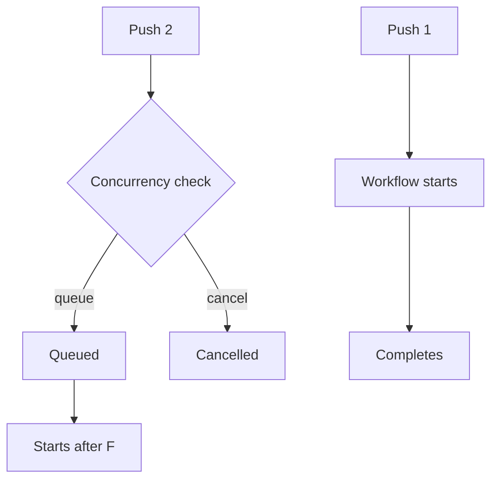

# How to Use Concurrency Control in GitHub Actions

Author: [nawazdhandala](https://www.github.com/nawazdhandala)

Tags: GitHub Actions, Concurrency, CI/CD, DevOps, Workflow Optimization, Automation

Description: Learn how to control workflow concurrency in GitHub Actions to prevent race conditions, manage resource usage, and ensure safe deployments.

---

Concurrent workflow runs can cause problems - duplicate deployments, race conditions on shared resources, or wasted compute on outdated commits. GitHub Actions concurrency controls let you manage which workflows run and when.

## Concurrency Concepts



## Basic Concurrency Group

Limit to one workflow per branch:

```yaml
name: CI

on:
  push:
    branches: [main, develop]
  pull_request:

concurrency:
  group: ${{ github.workflow }}-${{ github.ref }}

jobs:
  build:
    runs-on: ubuntu-latest
    steps:
      - uses: actions/checkout@v4
      - run: npm ci && npm test
```

The `group` creates a unique key - workflows with the same key wait in queue.

## Cancel In-Progress Runs

Cancel older runs when new commits arrive:

```yaml
concurrency:
  group: ${{ github.workflow }}-${{ github.ref }}
  cancel-in-progress: true
```

This is ideal for PR workflows where only the latest commit matters:

```yaml
name: PR Tests

on:
  pull_request:

concurrency:
  group: pr-${{ github.event.pull_request.number }}
  cancel-in-progress: true

jobs:
  test:
    runs-on: ubuntu-latest
    steps:
      - uses: actions/checkout@v4
      - run: npm test
```

## Environment-Specific Concurrency

Prevent concurrent deployments to the same environment:

```yaml
name: Deploy

on:
  push:
    branches: [main]

concurrency:
  group: deploy-production
  cancel-in-progress: false  # Don't cancel active deployments

jobs:
  deploy:
    runs-on: ubuntu-latest
    environment: production
    steps:
      - uses: actions/checkout@v4
      - run: ./deploy.sh
```

## Different Strategies Per Branch

Use different concurrency rules for different branches:

```yaml
name: CI/CD

on:
  push:
    branches: [main, develop, 'feature/**']
  pull_request:

concurrency:
  # PRs: cancel old runs
  # main/develop: queue (don't cancel deployments)
  group: ${{ github.workflow }}-${{ github.event_name == 'pull_request' && github.event.pull_request.number || github.ref }}
  cancel-in-progress: ${{ github.event_name == 'pull_request' }}

jobs:
  build:
    runs-on: ubuntu-latest
    steps:
      - uses: actions/checkout@v4
      - run: npm ci && npm build
```

## Job-Level Concurrency

Control concurrency at the job level:

```yaml
name: Pipeline

on: push

jobs:
  test:
    runs-on: ubuntu-latest
    # Tests can run concurrently
    steps:
      - uses: actions/checkout@v4
      - run: npm test

  deploy-staging:
    needs: test
    runs-on: ubuntu-latest
    concurrency:
      group: deploy-staging
      cancel-in-progress: false
    steps:
      - run: ./deploy.sh staging

  deploy-production:
    needs: deploy-staging
    runs-on: ubuntu-latest
    concurrency:
      group: deploy-production
      cancel-in-progress: false
    steps:
      - run: ./deploy.sh production
```

## Matrix Jobs with Concurrency

Limit concurrent matrix jobs:

```yaml
jobs:
  test:
    runs-on: ubuntu-latest
    strategy:
      max-parallel: 2  # Only 2 matrix jobs at once
      matrix:
        node: [18, 20, 22]
        os: [ubuntu-latest, macos-latest]
    steps:
      - uses: actions/checkout@v4
      - uses: actions/setup-node@v4
        with:
          node-version: ${{ matrix.node }}
      - run: npm test
```

## Shared Resource Protection

Protect shared resources like databases:

```yaml
name: Integration Tests

on: pull_request

concurrency:
  group: integration-tests  # Only one integration test run at a time
  cancel-in-progress: false

jobs:
  test:
    runs-on: ubuntu-latest
    steps:
      - uses: actions/checkout@v4

      - name: Setup test database
        run: ./scripts/setup-test-db.sh

      - name: Run integration tests
        run: npm run test:integration

      - name: Cleanup
        if: always()
        run: ./scripts/cleanup-test-db.sh
```

## Multi-Workflow Concurrency

Coordinate across workflows with shared group names:

```yaml
# deploy-api.yml
name: Deploy API

concurrency:
  group: production-deploy  # Shared with other deploy workflows
  cancel-in-progress: false

# deploy-web.yml
name: Deploy Web

concurrency:
  group: production-deploy  # Same group prevents simultaneous deploys
  cancel-in-progress: false
```

## Conditional Concurrency

Apply concurrency only in certain conditions:

```yaml
name: Release

on:
  push:
    tags: ['v*']

jobs:
  release:
    runs-on: ubuntu-latest
    # Only limit concurrency for production releases
    concurrency:
      group: ${{ startsWith(github.ref, 'refs/tags/v') && 'release-production' || format('release-{0}', github.ref) }}
      cancel-in-progress: false
    steps:
      - uses: actions/checkout@v4
      - run: ./release.sh
```

## Handling Cancellation

React to workflow cancellation:

```yaml
jobs:
  deploy:
    runs-on: ubuntu-latest
    steps:
      - uses: actions/checkout@v4

      - name: Deploy
        id: deploy
        run: ./deploy.sh

      - name: Rollback on cancellation
        if: cancelled()
        run: ./rollback.sh

      - name: Notify on cancellation
        if: cancelled()
        run: |
          curl -X POST ${{ secrets.SLACK_WEBHOOK }} \
            -d '{"text":"Deployment cancelled for ${{ github.ref }}"}'
```

## Queue Management

Monitor and manage queued runs:

```yaml
jobs:
  check-queue:
    runs-on: ubuntu-latest
    steps:
      - name: Check pending runs
        uses: actions/github-script@v7
        with:
          script: |
            const runs = await github.rest.actions.listWorkflowRuns({
              owner: context.repo.owner,
              repo: context.repo.repo,
              workflow_id: 'deploy.yml',
              status: 'queued'
            });

            console.log(`Queued runs: ${runs.data.total_count}`);

            if (runs.data.total_count > 5) {
              core.warning('Many runs queued - consider reviewing concurrency settings');
            }
```

## Complete Example

```yaml
name: CI/CD Pipeline

on:
  push:
    branches: [main, develop]
  pull_request:
    branches: [main]

# Workflow-level concurrency for PRs
concurrency:
  group: ${{ github.workflow }}-${{ github.event.pull_request.number || github.ref }}
  cancel-in-progress: ${{ github.event_name == 'pull_request' }}

jobs:
  lint:
    runs-on: ubuntu-latest
    steps:
      - uses: actions/checkout@v4
      - run: npm ci
      - run: npm run lint

  test:
    runs-on: ubuntu-latest
    strategy:
      max-parallel: 3
      matrix:
        shard: [1, 2, 3]
    steps:
      - uses: actions/checkout@v4
      - run: npm ci
      - run: npm test -- --shard=${{ matrix.shard }}/3

  build:
    needs: [lint, test]
    runs-on: ubuntu-latest
    steps:
      - uses: actions/checkout@v4
      - run: npm ci
      - run: npm run build
      - uses: actions/upload-artifact@v4
        with:
          name: build
          path: dist/

  deploy-staging:
    if: github.ref == 'refs/heads/develop'
    needs: build
    runs-on: ubuntu-latest
    concurrency:
      group: deploy-staging
      cancel-in-progress: false
    environment:
      name: staging
      url: https://staging.example.com
    steps:
      - uses: actions/download-artifact@v4
        with:
          name: build
          path: dist/
      - run: ./deploy.sh staging

  deploy-production:
    if: github.ref == 'refs/heads/main'
    needs: build
    runs-on: ubuntu-latest
    concurrency:
      group: deploy-production
      cancel-in-progress: false
    environment:
      name: production
      url: https://example.com
    steps:
      - uses: actions/download-artifact@v4
        with:
          name: build
          path: dist/
      - name: Deploy
        run: ./deploy.sh production
      - name: Rollback on failure
        if: failure()
        run: ./rollback.sh production
```

## Best Practices

1. **PR workflows**: Use `cancel-in-progress: true` to save resources
2. **Deployments**: Use `cancel-in-progress: false` to avoid partial deploys
3. **Shared resources**: Create dedicated concurrency groups
4. **Matrix jobs**: Use `max-parallel` to limit concurrent jobs
5. **Cross-workflow**: Use shared group names for coordination

---

Concurrency control prevents race conditions and resource conflicts. Use it to cancel stale PR checks, serialize deployments, and protect shared resources. Choose `cancel-in-progress` based on whether incomplete runs are safe - cancel tests freely, but never cancel active deployments.
