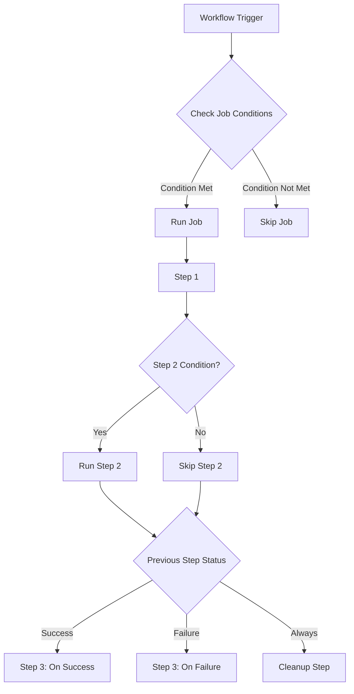

# How to Use Conditional Steps in GitHub Actions

Author: [nawazdhandala](https://www.github.com/nawazdhandala)

Tags: GitHub Actions, CI/CD, Conditional Logic, Workflow Automation, DevOps

Description: Learn how to use conditional steps in GitHub Actions to control workflow execution based on branch, event type, file changes, previous step results, and custom expressions.

> Smart workflows know when to run and when to skip. Conditional logic makes your CI/CD efficient and responsive.

Not every step should run every time. Deploy only on main branch. Skip tests if only documentation changed. Run cleanup even when previous steps fail. GitHub Actions provides powerful conditional expressions through the `if` keyword. This guide covers all the conditional patterns you need for sophisticated workflow control.

## Conditional Logic Flow



## Basic Conditional Syntax

The `if` keyword controls whether a step runs:

```yaml
name: Conditional Basics

on: [push, pull_request]

jobs:
  build:
    runs-on: ubuntu-latest
    steps:
      - uses: actions/checkout@v4

      # Run only on push events
      - name: Deploy on push
        if: github.event_name == 'push'
        run: echo "This runs only on push"

      # Run only on pull requests
      - name: PR checks
        if: github.event_name == 'pull_request'
        run: echo "This runs only on PRs"

      # Run on main branch only
      - name: Main branch only
        if: github.ref == 'refs/heads/main'
        run: echo "This runs only on main"
```

## Branch-Based Conditions

Control execution based on branch names:

```yaml
name: Branch Conditions

on:
  push:
    branches: ['**']

jobs:
  build:
    runs-on: ubuntu-latest
    steps:
      - uses: actions/checkout@v4

      # Main branch
      - name: Production deploy
        if: github.ref == 'refs/heads/main'
        run: ./deploy.sh production

      # Develop branch
      - name: Staging deploy
        if: github.ref == 'refs/heads/develop'
        run: ./deploy.sh staging

      # Feature branches
      - name: Feature preview
        if: startsWith(github.ref, 'refs/heads/feature/')
        run: ./deploy.sh preview

      # Release branches
      - name: Release build
        if: startsWith(github.ref, 'refs/heads/release/')
        run: ./build-release.sh

      # Any branch except main
      - name: Non-production tasks
        if: github.ref != 'refs/heads/main'
        run: echo "Not on main branch"
```

## Event-Based Conditions

Different actions for different event types:

```yaml
name: Event Conditions

on:
  push:
    branches: [main]
  pull_request:
    branches: [main]
  release:
    types: [published]
  workflow_dispatch:
    inputs:
      environment:
        description: 'Deploy environment'
        required: true
        default: 'staging'

jobs:
  build:
    runs-on: ubuntu-latest
    steps:
      - uses: actions/checkout@v4

      # Push to main
      - name: Auto deploy on push
        if: github.event_name == 'push'
        run: ./deploy.sh auto

      # Pull request
      - name: PR validation
        if: github.event_name == 'pull_request'
        run: ./validate.sh

      # Release published
      - name: Release deploy
        if: github.event_name == 'release'
        run: ./deploy.sh release

      # Manual trigger
      - name: Manual deploy
        if: github.event_name == 'workflow_dispatch'
        run: ./deploy.sh ${{ github.event.inputs.environment }}
```

## Status-Based Conditions

React to previous step outcomes:

```yaml
name: Status Conditions

on: push

jobs:
  build:
    runs-on: ubuntu-latest
    steps:
      - uses: actions/checkout@v4

      - name: Run tests
        id: tests
        run: npm test
        continue-on-error: true

      # Run only if tests succeeded
      - name: Deploy on test success
        if: steps.tests.outcome == 'success'
        run: ./deploy.sh

      # Run only if tests failed
      - name: Notify on test failure
        if: steps.tests.outcome == 'failure'
        run: ./notify-failure.sh

      # Run on any failure in the job
      - name: Cleanup on failure
        if: failure()
        run: ./cleanup.sh

      # Run on success
      - name: Success notification
        if: success()
        run: echo "All steps succeeded"

      # Always run, even if cancelled
      - name: Always cleanup
        if: always()
        run: ./final-cleanup.sh

      # Run if job was cancelled
      - name: Handle cancellation
        if: cancelled()
        run: ./handle-cancel.sh
```

## Complex Expressions

Combine conditions with logical operators:

```yaml
name: Complex Conditions

on:
  push:
    branches: [main, develop]
  pull_request:
    branches: [main]

jobs:
  build:
    runs-on: ubuntu-latest
    steps:
      - uses: actions/checkout@v4

      # AND condition
      - name: Deploy to prod
        if: github.ref == 'refs/heads/main' && github.event_name == 'push'
        run: ./deploy.sh production

      # OR condition
      - name: Run on main or develop
        if: github.ref == 'refs/heads/main' || github.ref == 'refs/heads/develop'
        run: ./build.sh

      # NOT condition
      - name: Skip on forks
        if: "!github.event.pull_request.head.repo.fork"
        run: ./internal-checks.sh

      # Combined conditions
      - name: Complex condition
        if: |
          github.event_name == 'push' &&
          github.ref == 'refs/heads/main' &&
          !contains(github.event.head_commit.message, '[skip ci]')
        run: ./full-pipeline.sh
```

## File Change Conditions

Run steps based on which files changed:

```yaml
name: File Change Conditions

on:
  pull_request:
    branches: [main]

jobs:
  detect:
    runs-on: ubuntu-latest
    outputs:
      frontend: ${{ steps.filter.outputs.frontend }}
      backend: ${{ steps.filter.outputs.backend }}
      docs: ${{ steps.filter.outputs.docs }}

    steps:
      - uses: actions/checkout@v4

      - uses: dorny/paths-filter@v3
        id: filter
        with:
          filters: |
            frontend:
              - 'src/frontend/**'
              - 'package.json'
            backend:
              - 'src/backend/**'
              - 'requirements.txt'
            docs:
              - 'docs/**'
              - '*.md'

  frontend-tests:
    needs: detect
    if: needs.detect.outputs.frontend == 'true'
    runs-on: ubuntu-latest
    steps:
      - uses: actions/checkout@v4
      - run: npm test

  backend-tests:
    needs: detect
    if: needs.detect.outputs.backend == 'true'
    runs-on: ubuntu-latest
    steps:
      - uses: actions/checkout@v4
      - run: pytest

  docs-build:
    needs: detect
    if: needs.detect.outputs.docs == 'true'
    runs-on: ubuntu-latest
    steps:
      - uses: actions/checkout@v4
      - run: ./build-docs.sh
```

## Environment Variables in Conditions

Use environment context in conditions:

```yaml
name: Environment Conditions

on: push

env:
  ENABLE_DEPLOY: 'true'
  TARGET_ENV: 'staging'

jobs:
  build:
    runs-on: ubuntu-latest
    steps:
      - uses: actions/checkout@v4

      # Check environment variable
      - name: Deploy if enabled
        if: env.ENABLE_DEPLOY == 'true'
        run: ./deploy.sh

      # Check secrets existence (secrets are masked)
      - name: Use optional integration
        if: env.HAS_API_KEY == 'true'
        env:
          HAS_API_KEY: ${{ secrets.API_KEY != '' }}
        run: ./integration-tests.sh
```

## Job-Level Conditions

Control entire jobs with conditions:

```yaml
name: Job Conditions

on:
  push:
    branches: [main, develop]

jobs:
  test:
    runs-on: ubuntu-latest
    steps:
      - uses: actions/checkout@v4
      - run: npm test

  deploy-staging:
    needs: test
    if: github.ref == 'refs/heads/develop'
    runs-on: ubuntu-latest
    steps:
      - run: ./deploy.sh staging

  deploy-production:
    needs: test
    if: github.ref == 'refs/heads/main'
    runs-on: ubuntu-latest
    steps:
      - run: ./deploy.sh production

  notify:
    needs: [deploy-staging, deploy-production]
    if: always() && (needs.deploy-staging.result == 'success' || needs.deploy-production.result == 'success')
    runs-on: ubuntu-latest
    steps:
      - run: ./notify.sh "Deployment completed"
```

## Actor-Based Conditions

Control access based on who triggered the workflow:

```yaml
name: Actor Conditions

on: [push, pull_request]

jobs:
  build:
    runs-on: ubuntu-latest
    steps:
      - uses: actions/checkout@v4

      # Skip for bots
      - name: Human-only step
        if: "!contains(github.actor, '[bot]')"
        run: ./human-verification.sh

      # Specific users
      - name: Admin-only deploy
        if: contains('["admin1","admin2","admin3"]', github.actor)
        run: ./admin-deploy.sh

      # Dependabot PRs
      - name: Auto-merge dependabot
        if: github.actor == 'dependabot[bot]'
        run: ./auto-merge.sh

      # Repository owner
      - name: Owner-only action
        if: github.actor == github.repository_owner
        run: ./owner-action.sh
```

## Commit Message Conditions

React to commit message content:

```yaml
name: Commit Message Conditions

on: push

jobs:
  build:
    runs-on: ubuntu-latest
    steps:
      - uses: actions/checkout@v4

      # Skip CI
      - name: Normal build
        if: "!contains(github.event.head_commit.message, '[skip ci]')"
        run: npm run build

      # Force full rebuild
      - name: Full rebuild
        if: contains(github.event.head_commit.message, '[full rebuild]')
        run: npm run build:full

      # Deploy flag
      - name: Deploy if flagged
        if: contains(github.event.head_commit.message, '[deploy]')
        run: ./deploy.sh

      # WIP detection
      - name: Block WIP merge
        if: startsWith(github.event.head_commit.message, 'WIP')
        run: |
          echo "::error::Cannot merge WIP commits"
          exit 1
```

## Output-Based Conditions

Use step outputs in conditions:

```yaml
name: Output Conditions

on: push

jobs:
  build:
    runs-on: ubuntu-latest
    steps:
      - uses: actions/checkout@v4

      - name: Check version
        id: version
        run: |
          VERSION=$(cat package.json | jq -r .version)
          echo "version=$VERSION" >> $GITHUB_OUTPUT

          if [[ "$VERSION" == *"-beta"* ]]; then
            echo "is_beta=true" >> $GITHUB_OUTPUT
          else
            echo "is_beta=false" >> $GITHUB_OUTPUT
          fi

      - name: Beta deployment
        if: steps.version.outputs.is_beta == 'true'
        run: ./deploy.sh beta

      - name: Production deployment
        if: steps.version.outputs.is_beta == 'false'
        run: ./deploy.sh production

      - name: Version-specific action
        if: startsWith(steps.version.outputs.version, '2.')
        run: echo "Major version 2"
```

## Combining Multiple Conditions

Complex real-world scenarios:

```yaml
name: Production Pipeline

on:
  push:
    branches: [main]
  pull_request:
    branches: [main]

jobs:
  test:
    runs-on: ubuntu-latest
    steps:
      - uses: actions/checkout@v4
      - run: npm test

  security-scan:
    runs-on: ubuntu-latest
    steps:
      - uses: actions/checkout@v4
      - run: npm audit

  deploy:
    needs: [test, security-scan]
    runs-on: ubuntu-latest
    # Only deploy on push to main, not PRs
    if: |
      github.event_name == 'push' &&
      github.ref == 'refs/heads/main' &&
      needs.test.result == 'success' &&
      needs.security-scan.result == 'success'
    steps:
      - uses: actions/checkout@v4
      - run: ./deploy.sh production

  rollback:
    needs: deploy
    runs-on: ubuntu-latest
    # Rollback if deploy failed
    if: failure() && needs.deploy.result == 'failure'
    steps:
      - run: ./rollback.sh

  notify:
    needs: [deploy, rollback]
    runs-on: ubuntu-latest
    if: always()
    steps:
      - name: Success notification
        if: needs.deploy.result == 'success'
        run: ./notify.sh "Deploy succeeded"

      - name: Failure notification
        if: needs.deploy.result == 'failure'
        run: ./notify.sh "Deploy failed, rollback initiated"
```

## Best Practices

1. **Use quotes for complex expressions** - Prevents YAML parsing issues
2. **Prefer explicit conditions** - Clear intent over clever shortcuts
3. **Always handle failures** - Use `if: always()` for cleanup steps
4. **Test conditions locally** - Use `act` to test workflow conditions
5. **Document complex conditions** - Add comments explaining the logic
6. **Use outputs over parsing** - Structured data is more reliable

## Conclusion

Conditional steps transform workflows from rigid sequences into intelligent pipelines. Start with simple branch and event conditions, then add file change detection and complex expressions as needed. The goal is workflows that do exactly what is needed for each situation - no more, no less.

Well-designed conditions make CI/CD faster, cheaper, and more reliable by running only what needs to run.
