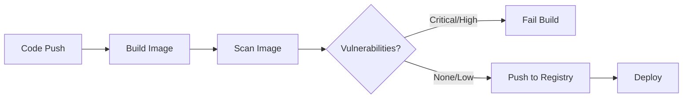

# How to Set Up Container Scanning in GitHub Actions

Author: [nawazdhandala](https://www.github.com/nawazdhandala)

Tags: GitHub Actions, CI/CD, Security, Container Scanning, Docker, DevSecOps

Description: Learn how to set up automated container scanning in GitHub Actions to detect vulnerabilities in your Docker images before they reach production using Trivy, Grype, and native GitHub security features.

---

Container security starts before deployment. Every base image, dependency, and package you include in your Docker images can introduce vulnerabilities. Container scanning integrates security checks directly into your CI/CD pipeline, catching issues before they reach production.

## Why Container Scanning Matters

Container images often inherit vulnerabilities from their base images and installed packages. A single outdated library can expose your entire application to known exploits. Manual security audits do not scale - you need automated scanning on every build.



## Setting Up Trivy Scanner

Trivy is a comprehensive vulnerability scanner that detects issues in container images, filesystems, and git repositories. It maintains an updated vulnerability database and runs quickly in CI environments.

### Basic Trivy Configuration

```yaml
# .github/workflows/container-scan.yml
name: Container Security Scan

on:
  push:
    branches: [main]
  pull_request:
    branches: [main]

jobs:
  build-and-scan:
    runs-on: ubuntu-latest

    steps:
      - name: Checkout code
        uses: actions/checkout@v4

      - name: Build Docker image
        run: |
          docker build -t myapp:${{ github.sha }} .

      - name: Run Trivy vulnerability scanner
        uses: aquasecurity/trivy-action@master
        with:
          image-ref: 'myapp:${{ github.sha }}'
          format: 'table'
          exit-code: '1'
          ignore-unfixed: true
          vuln-type: 'os,library'
          severity: 'CRITICAL,HIGH'
```

The `exit-code: '1'` setting fails the workflow when vulnerabilities are found. The `severity` filter focuses on critical and high-severity issues, preventing alert fatigue from low-priority findings.

### Generating SARIF Reports for GitHub Security

GitHub's security tab can display vulnerability findings directly in your repository. Export Trivy results in SARIF format for native integration.

```yaml
jobs:
  scan:
    runs-on: ubuntu-latest
    permissions:
      security-events: write
      contents: read

    steps:
      - name: Checkout
        uses: actions/checkout@v4

      - name: Build image
        run: docker build -t myapp:scan .

      - name: Run Trivy and output SARIF
        uses: aquasecurity/trivy-action@master
        with:
          image-ref: 'myapp:scan'
          format: 'sarif'
          output: 'trivy-results.sarif'
          severity: 'CRITICAL,HIGH,MEDIUM'

      - name: Upload Trivy scan results to GitHub Security
        uses: github/codeql-action/upload-sarif@v3
        with:
          sarif_file: 'trivy-results.sarif'
```

After uploading, findings appear in the Security tab under "Code scanning alerts." Each vulnerability links to its CVE entry with remediation guidance.

## Using Grype for Alternative Scanning

Grype from Anchore provides another option for container scanning with different detection capabilities. Running multiple scanners catches issues that one might miss.

```yaml
jobs:
  grype-scan:
    runs-on: ubuntu-latest

    steps:
      - name: Checkout
        uses: actions/checkout@v4

      - name: Build image
        run: docker build -t myapp:${{ github.sha }} .

      - name: Scan image with Grype
        uses: anchore/scan-action@v3
        id: scan
        with:
          image: 'myapp:${{ github.sha }}'
          fail-build: true
          severity-cutoff: high

      - name: Upload SARIF report
        uses: github/codeql-action/upload-sarif@v3
        if: always()
        with:
          sarif_file: ${{ steps.scan.outputs.sarif }}
```

The `if: always()` condition ensures the SARIF upload runs even when the scan fails, preserving visibility into what vulnerabilities were found.

## Scanning During Image Build

For faster feedback, scan the image layers as they build rather than waiting for the complete image.

```yaml
jobs:
  build-scan-push:
    runs-on: ubuntu-latest

    steps:
      - name: Checkout
        uses: actions/checkout@v4

      - name: Set up Docker Buildx
        uses: docker/setup-buildx-action@v3

      - name: Build and export to Docker
        uses: docker/build-push-action@v5
        with:
          context: .
          load: true
          tags: myapp:test
          cache-from: type=gha
          cache-to: type=gha,mode=max

      - name: Scan built image
        uses: aquasecurity/trivy-action@master
        with:
          image-ref: 'myapp:test'
          exit-code: '1'
          severity: 'CRITICAL,HIGH'

      - name: Login to Container Registry
        if: github.event_name != 'pull_request'
        uses: docker/login-action@v3
        with:
          registry: ghcr.io
          username: ${{ github.actor }}
          password: ${{ secrets.GITHUB_TOKEN }}

      - name: Push to registry
        if: github.event_name != 'pull_request'
        uses: docker/build-push-action@v5
        with:
          context: .
          push: true
          tags: ghcr.io/${{ github.repository }}:${{ github.sha }}
```

This workflow only pushes images that pass the security scan, preventing vulnerable images from reaching your registry.

## Creating an Allowlist for Known Issues

Some vulnerabilities cannot be immediately fixed due to upstream dependencies or compatibility requirements. Create an allowlist to acknowledge these while still catching new issues.

```yaml
# .trivyignore file in repository root
# Acknowledged vulnerabilities with justification

# CVE-2023-12345: Fixed in next major version, upgrade scheduled Q1
CVE-2023-12345

# CVE-2023-67890: Not exploitable in our configuration
CVE-2023-67890
```

Reference the ignore file in your workflow:

```yaml
- name: Scan with ignore file
  uses: aquasecurity/trivy-action@master
  with:
    image-ref: 'myapp:${{ github.sha }}'
    exit-code: '1'
    severity: 'CRITICAL,HIGH'
    trivyignores: '.trivyignore'
```

Document why each vulnerability is allowlisted. Review the list quarterly to remove entries for vulnerabilities that can now be fixed.

## Scanning Multiple Images in a Matrix

Monorepos with multiple services need to scan each image. Use a matrix strategy to parallelize scanning.

```yaml
jobs:
  scan-images:
    runs-on: ubuntu-latest
    strategy:
      fail-fast: false
      matrix:
        service:
          - name: api
            dockerfile: ./services/api/Dockerfile
            context: ./services/api
          - name: worker
            dockerfile: ./services/worker/Dockerfile
            context: ./services/worker
          - name: web
            dockerfile: ./services/web/Dockerfile
            context: ./services/web

    steps:
      - name: Checkout
        uses: actions/checkout@v4

      - name: Build ${{ matrix.service.name }}
        run: |
          docker build \
            -f ${{ matrix.service.dockerfile }} \
            -t ${{ matrix.service.name }}:scan \
            ${{ matrix.service.context }}

      - name: Scan ${{ matrix.service.name }}
        uses: aquasecurity/trivy-action@master
        with:
          image-ref: '${{ matrix.service.name }}:scan'
          format: 'sarif'
          output: '${{ matrix.service.name }}-results.sarif'
          severity: 'CRITICAL,HIGH'

      - name: Upload results for ${{ matrix.service.name }}
        uses: github/codeql-action/upload-sarif@v3
        with:
          sarif_file: '${{ matrix.service.name }}-results.sarif'
          category: '${{ matrix.service.name }}'
```

The `fail-fast: false` setting ensures all images get scanned even if one fails, giving you complete visibility across all services.

## Scheduling Regular Scans

Vulnerability databases update daily. An image that passed scanning last week might have newly discovered vulnerabilities today. Schedule periodic rescans.

```yaml
name: Scheduled Security Scan

on:
  schedule:
    # Run every day at 6 AM UTC
    - cron: '0 6 * * *'
  workflow_dispatch:

jobs:
  scan-production-images:
    runs-on: ubuntu-latest

    steps:
      - name: Checkout
        uses: actions/checkout@v4

      - name: Login to registry
        uses: docker/login-action@v3
        with:
          registry: ghcr.io
          username: ${{ github.actor }}
          password: ${{ secrets.GITHUB_TOKEN }}

      - name: Pull production image
        run: |
          docker pull ghcr.io/${{ github.repository }}:latest

      - name: Scan production image
        uses: aquasecurity/trivy-action@master
        with:
          image-ref: 'ghcr.io/${{ github.repository }}:latest'
          format: 'sarif'
          output: 'production-scan.sarif'

      - name: Upload scan results
        uses: github/codeql-action/upload-sarif@v3
        with:
          sarif_file: 'production-scan.sarif'

      - name: Notify on critical vulnerabilities
        if: failure()
        run: |
          curl -X POST ${{ secrets.SLACK_WEBHOOK }} \
            -H 'Content-Type: application/json' \
            -d '{"text":"Critical vulnerabilities found in production image. Check GitHub Security tab."}'
```

## Best Practices for Container Scanning

### Use Minimal Base Images

Smaller images have fewer packages and smaller attack surfaces. Alpine and distroless images typically have fewer vulnerabilities than full OS images.

```dockerfile
# Instead of
FROM node:20

# Use
FROM node:20-alpine

# Or for production
FROM gcr.io/distroless/nodejs20-debian12
```

### Pin Base Image Versions

Floating tags like `latest` or `20` can unexpectedly change. Pin to specific digests for reproducible builds.

```dockerfile
FROM node:20.10.0-alpine3.18@sha256:abc123...
```

### Scan Both Build and Runtime Stages

Multi-stage builds separate build dependencies from runtime. Scan the final stage that actually ships.

```yaml
- name: Build multi-stage image
  run: |
    docker build --target production -t myapp:prod .

- name: Scan production stage only
  uses: aquasecurity/trivy-action@master
  with:
    image-ref: 'myapp:prod'
```

Container scanning is not a one-time setup. Treat it as an ongoing practice that evolves with your applications and the threat landscape. Automate where possible, but review findings regularly to ensure your security posture matches your risk tolerance.
