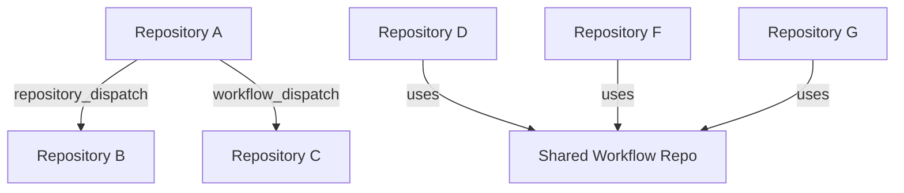

# How to Set Up Cross-Repository Workflows in GitHub Actions

Author: [nawazdhandala](https://www.github.com/nawazdhandala)

Tags: GitHub Actions, CI/CD, Cross-Repository, Workflows, Automation, DevOps, Monorepo

Description: Learn how to trigger and coordinate GitHub Actions workflows across multiple repositories for dependent builds, shared libraries, and organization-wide automation using repository dispatch, workflow dispatch, and reusable workflows.

---

Modern software architectures span multiple repositories. A shared library update needs to trigger dependent application builds. A deployment in one repository requires coordination with another. Cross-repository workflows connect these pieces into cohesive automation.

## Cross-Repository Patterns

Several patterns exist for triggering workflows across repositories:



## Repository Dispatch Events

Repository dispatch sends custom webhook events to trigger workflows in other repositories.

### Triggering Repository

Send a dispatch event when your library publishes a new version.

```yaml
# shared-library/.github/workflows/publish.yml
name: Publish Library

on:
  push:
    tags: ['v*']

jobs:
  publish:
    runs-on: ubuntu-latest

    steps:
      - name: Checkout
        uses: actions/checkout@v4

      - name: Publish to npm
        run: npm publish
        env:
          NPM_TOKEN: ${{ secrets.NPM_TOKEN }}

      - name: Trigger dependent builds
        run: |
          # Trigger builds in dependent repositories
          for repo in "myorg/app-frontend" "myorg/app-backend" "myorg/app-mobile"; do
            curl -X POST \
              -H "Accept: application/vnd.github+json" \
              -H "Authorization: Bearer ${{ secrets.DISPATCH_TOKEN }}" \
              "https://api.github.com/repos/${repo}/dispatches" \
              -d "{
                \"event_type\": \"library-updated\",
                \"client_payload\": {
                  \"library\": \"shared-library\",
                  \"version\": \"${{ github.ref_name }}\",
                  \"sha\": \"${{ github.sha }}\"
                }
              }"
          done
```

The `DISPATCH_TOKEN` needs `repo` scope to trigger workflows in other repositories.

### Receiving Repository

Configure the dependent repository to respond to dispatch events.

```yaml
# app-frontend/.github/workflows/dependency-update.yml
name: Dependency Update

on:
  repository_dispatch:
    types: [library-updated]

jobs:
  update-and-test:
    runs-on: ubuntu-latest

    steps:
      - name: Checkout
        uses: actions/checkout@v4

      - name: Log trigger information
        run: |
          echo "Triggered by: ${{ github.event.client_payload.library }}"
          echo "New version: ${{ github.event.client_payload.version }}"
          echo "Commit SHA: ${{ github.event.client_payload.sha }}"

      - name: Update dependency
        run: |
          npm install ${{ github.event.client_payload.library }}@${{ github.event.client_payload.version }}

      - name: Run tests
        run: npm test

      - name: Create PR if tests pass
        if: success()
        run: |
          git config user.name "github-actions[bot]"
          git config user.email "github-actions[bot]@users.noreply.github.com"

          BRANCH="deps/update-${{ github.event.client_payload.library }}-${{ github.event.client_payload.version }}"
          git checkout -b "$BRANCH"
          git add package.json package-lock.json
          git commit -m "Update ${{ github.event.client_payload.library }} to ${{ github.event.client_payload.version }}"
          git push origin "$BRANCH"

          gh pr create \
            --title "Update ${{ github.event.client_payload.library }} to ${{ github.event.client_payload.version }}" \
            --body "Automated PR triggered by library update." \
            --base main \
            --head "$BRANCH"
        env:
          GH_TOKEN: ${{ secrets.GITHUB_TOKEN }}
```

## Workflow Dispatch for Manual Triggers

Use workflow dispatch when you want explicit control over cross-repository triggers.

### Callable Workflow

```yaml
# deployment-service/.github/workflows/deploy.yml
name: Deploy Service

on:
  workflow_dispatch:
    inputs:
      environment:
        description: 'Target environment'
        required: true
        type: choice
        options:
          - staging
          - production
      version:
        description: 'Version to deploy'
        required: true
        type: string
      triggered_by:
        description: 'Repository that triggered this deployment'
        required: false
        type: string

jobs:
  deploy:
    runs-on: ubuntu-latest
    environment: ${{ inputs.environment }}

    steps:
      - name: Checkout version
        uses: actions/checkout@v4
        with:
          ref: ${{ inputs.version }}

      - name: Deploy
        run: |
          echo "Deploying ${{ inputs.version }} to ${{ inputs.environment }}"
          echo "Triggered by: ${{ inputs.triggered_by || 'manual' }}"
          ./scripts/deploy.sh ${{ inputs.environment }}
```

### Triggering from Another Repository

```yaml
# orchestrator/.github/workflows/release.yml
name: Release All Services

on:
  workflow_dispatch:
    inputs:
      version:
        description: 'Release version'
        required: true

jobs:
  trigger-deployments:
    runs-on: ubuntu-latest
    strategy:
      matrix:
        service:
          - repo: myorg/api-service
            workflow: deploy.yml
          - repo: myorg/web-service
            workflow: deploy.yml
          - repo: myorg/worker-service
            workflow: deploy.yml

    steps:
      - name: Trigger ${{ matrix.service.repo }} deployment
        run: |
          gh workflow run ${{ matrix.service.workflow }} \
            --repo ${{ matrix.service.repo }} \
            --field environment=staging \
            --field version=${{ inputs.version }} \
            --field triggered_by=${{ github.repository }}
        env:
          GH_TOKEN: ${{ secrets.DISPATCH_TOKEN }}
```

## Reusable Workflows Across Repositories

Reusable workflows let repositories share workflow logic without duplication.

### Shared Workflow Repository

Create a central repository for organization-wide workflows.

```yaml
# myorg/.github/.github/workflows/node-ci.yml
name: Reusable Node.js CI

on:
  workflow_call:
    inputs:
      node-version:
        description: 'Node.js version'
        type: string
        default: '20'
      working-directory:
        description: 'Working directory'
        type: string
        default: '.'
    secrets:
      NPM_TOKEN:
        required: false

jobs:
  build-and-test:
    runs-on: ubuntu-latest
    defaults:
      run:
        working-directory: ${{ inputs.working-directory }}

    steps:
      - name: Checkout
        uses: actions/checkout@v4

      - name: Setup Node.js
        uses: actions/setup-node@v4
        with:
          node-version: ${{ inputs.node-version }}
          cache: 'npm'
          cache-dependency-path: ${{ inputs.working-directory }}/package-lock.json

      - name: Install dependencies
        run: npm ci
        env:
          NPM_TOKEN: ${{ secrets.NPM_TOKEN }}

      - name: Lint
        run: npm run lint --if-present

      - name: Test
        run: npm test

      - name: Build
        run: npm run build --if-present
```

### Calling the Shared Workflow

```yaml
# any-repo/.github/workflows/ci.yml
name: CI

on:
  push:
    branches: [main]
  pull_request:
    branches: [main]

jobs:
  ci:
    uses: myorg/.github/.github/workflows/node-ci.yml@main
    with:
      node-version: '20'
    secrets:
      NPM_TOKEN: ${{ secrets.NPM_TOKEN }}
```

## Coordinating Multi-Repository Deployments

Deploy multiple services in a specific order with dependencies.

```yaml
# orchestrator/.github/workflows/coordinated-deploy.yml
name: Coordinated Deployment

on:
  workflow_dispatch:
    inputs:
      environment:
        type: choice
        options: [staging, production]

jobs:
  deploy-database-migrations:
    runs-on: ubuntu-latest
    steps:
      - name: Trigger migrations
        run: |
          gh workflow run migrate.yml \
            --repo myorg/database-migrations \
            --field environment=${{ inputs.environment }}

          # Wait for completion
          sleep 10
          RUN_ID=$(gh run list --repo myorg/database-migrations --workflow migrate.yml --limit 1 --json databaseId -q '.[0].databaseId')
          gh run watch $RUN_ID --repo myorg/database-migrations
        env:
          GH_TOKEN: ${{ secrets.DISPATCH_TOKEN }}

  deploy-api:
    needs: deploy-database-migrations
    runs-on: ubuntu-latest
    steps:
      - name: Trigger API deployment
        run: |
          gh workflow run deploy.yml \
            --repo myorg/api-service \
            --field environment=${{ inputs.environment }}

          sleep 10
          RUN_ID=$(gh run list --repo myorg/api-service --workflow deploy.yml --limit 1 --json databaseId -q '.[0].databaseId')
          gh run watch $RUN_ID --repo myorg/api-service
        env:
          GH_TOKEN: ${{ secrets.DISPATCH_TOKEN }}

  deploy-frontend:
    needs: deploy-api
    runs-on: ubuntu-latest
    steps:
      - name: Trigger frontend deployment
        run: |
          gh workflow run deploy.yml \
            --repo myorg/web-frontend \
            --field environment=${{ inputs.environment }}
        env:
          GH_TOKEN: ${{ secrets.DISPATCH_TOKEN }}

  notify:
    needs: [deploy-database-migrations, deploy-api, deploy-frontend]
    if: always()
    runs-on: ubuntu-latest
    steps:
      - name: Send notification
        run: |
          curl -X POST ${{ secrets.SLACK_WEBHOOK }} \
            -d "{\"text\": \"Coordinated deployment to ${{ inputs.environment }} completed\"}"
```

## Sharing Artifacts Across Repositories

Pass build artifacts between repositories using artifact upload/download or package registries.

### Upload Artifact in Source Repository

```yaml
# shared-library/.github/workflows/build.yml
name: Build

on:
  push:
    branches: [main]

jobs:
  build:
    runs-on: ubuntu-latest

    steps:
      - name: Checkout
        uses: actions/checkout@v4

      - name: Build
        run: npm run build

      - name: Upload to GitHub Packages
        run: |
          npm version prerelease --preid=${{ github.sha }}
          npm publish --tag=next
        env:
          NPM_TOKEN: ${{ secrets.GITHUB_TOKEN }}

      - name: Trigger dependent builds
        run: |
          curl -X POST \
            -H "Authorization: Bearer ${{ secrets.DISPATCH_TOKEN }}" \
            "https://api.github.com/repos/myorg/dependent-app/dispatches" \
            -d "{
              \"event_type\": \"dependency-built\",
              \"client_payload\": {
                \"package\": \"@myorg/shared-library\",
                \"version\": \"$(npm pkg get version | tr -d '\"')\"
              }
            }"
```

### Consume in Dependent Repository

```yaml
# dependent-app/.github/workflows/integration.yml
name: Integration Test

on:
  repository_dispatch:
    types: [dependency-built]

jobs:
  test:
    runs-on: ubuntu-latest

    steps:
      - name: Checkout
        uses: actions/checkout@v4

      - name: Install with latest dependency
        run: |
          npm install ${{ github.event.client_payload.package }}@${{ github.event.client_payload.version }}

      - name: Run integration tests
        run: npm run test:integration
```

## Security Considerations

### Token Permissions

Create a dedicated Personal Access Token or GitHub App for cross-repository operations.

```yaml
# Use minimal permissions
- name: Trigger workflow
  run: gh workflow run deploy.yml --repo myorg/other-repo
  env:
    # PAT with only 'actions:write' permission for the target repo
    GH_TOKEN: ${{ secrets.CROSS_REPO_TOKEN }}
```

### Validating Dispatch Events

Verify the source of repository dispatch events.

```yaml
jobs:
  validate:
    runs-on: ubuntu-latest
    outputs:
      valid: ${{ steps.check.outputs.valid }}

    steps:
      - name: Validate source
        id: check
        run: |
          ALLOWED_REPOS="myorg/trusted-repo myorg/another-trusted"
          SOURCE="${{ github.event.client_payload.source_repo || 'unknown' }}"

          if echo "$ALLOWED_REPOS" | grep -q "$SOURCE"; then
            echo "valid=true" >> $GITHUB_OUTPUT
          else
            echo "Untrusted source: $SOURCE"
            echo "valid=false" >> $GITHUB_OUTPUT
          fi

  deploy:
    needs: validate
    if: needs.validate.outputs.valid == 'true'
    runs-on: ubuntu-latest
    steps:
      - name: Deploy
        run: ./scripts/deploy.sh
```

### Workflow Permissions

Use `workflow_call` with explicit secret passing instead of `secrets: inherit`.

```yaml
# Explicit is better than implicit
jobs:
  ci:
    uses: myorg/.github/.github/workflows/ci.yml@main
    secrets:
      NPM_TOKEN: ${{ secrets.NPM_TOKEN }}
      # Only pass what's needed
```

Cross-repository workflows transform isolated repositories into coordinated systems. Start with simple dispatch events for notifications, then build up to fully orchestrated multi-repository deployments as your automation needs grow.
