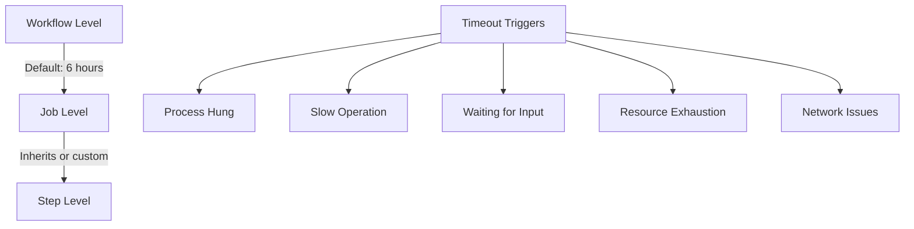

# How to Debug "Action timed out" Issues in GitHub Actions

Author: [nawazdhandala](https://www.github.com/nawazdhandala)

Tags: GitHub Actions, CI/CD, Debugging, Timeout, Performance, DevOps, Troubleshooting

Description: Learn how to diagnose and fix timeout issues in GitHub Actions workflows, from identifying slow steps and hung processes to optimizing build times and setting appropriate timeout limits.

---

The dreaded "Action timed out" message appears when a workflow step exceeds its time limit. GitHub Actions has a default timeout of 6 hours per job, but many issues cause steps to hang indefinitely or run far longer than expected. This guide covers systematic approaches to finding and fixing timeout causes.

## Understanding Timeout Behavior

Timeouts can occur at multiple levels:



## Setting Appropriate Timeouts

Always set explicit timeouts. Catching issues early is better than waiting 6 hours.

### Job-Level Timeout

```yaml
jobs:
  build:
    runs-on: ubuntu-latest
    timeout-minutes: 30  # Fail fast if build takes too long

    steps:
      - name: Checkout
        uses: actions/checkout@v4

      - name: Build
        run: npm run build
```

### Step-Level Timeout

```yaml
steps:
  - name: Run tests
    run: npm test
    timeout-minutes: 15  # Tests should complete in 15 minutes

  - name: Deploy
    run: ./scripts/deploy.sh
    timeout-minutes: 10
```

### Different Timeouts for Different Scenarios

```yaml
jobs:
  quick-check:
    runs-on: ubuntu-latest
    timeout-minutes: 10  # Linting and type checking
    steps:
      - run: npm run lint

  test:
    runs-on: ubuntu-latest
    timeout-minutes: 30  # Unit and integration tests
    steps:
      - run: npm test

  e2e:
    runs-on: ubuntu-latest
    timeout-minutes: 60  # End-to-end tests are slower
    steps:
      - run: npm run test:e2e
```

## Identifying Slow Steps

When a workflow times out, first identify which step is the culprit.

### Using Workflow Timing

GitHub Actions shows timing for each step. Check the workflow run UI or use the API:

```yaml
steps:
  - name: Get workflow timing
    if: always()
    run: |
      gh api \
        repos/${{ github.repository }}/actions/runs/${{ github.run_id }}/jobs \
        --jq '.jobs[] | {name: .name, steps: [.steps[] | {name: .name, duration: ((.completed_at | fromdateiso8601) - (.started_at | fromdateiso8601))}]}'
    env:
      GH_TOKEN: ${{ secrets.GITHUB_TOKEN }}
```

### Adding Timing to Commands

Wrap commands to see timing breakdown:

```yaml
steps:
  - name: Timed build
    run: |
      echo "::group::Install dependencies"
      time npm ci
      echo "::endgroup::"

      echo "::group::Build"
      time npm run build
      echo "::endgroup::"

      echo "::group::Test"
      time npm test
      echo "::endgroup::"
```

## Common Timeout Causes and Solutions

### 1. Hung Processes

Processes waiting for input or stuck in infinite loops cause most timeouts.

**Symptom:** Step runs indefinitely with no output.

**Debug:**

```yaml
steps:
  - name: Run with timeout and debug
    run: |
      # Run command with explicit timeout
      timeout 300 npm test || {
        echo "Command timed out, gathering diagnostics"
        ps aux
        echo "---"
        cat /proc/loadavg
        exit 1
      }
```

**Solutions:**

```yaml
# Disable interactive prompts
- name: Install dependencies
  run: npm ci
  env:
    CI: true  # Many tools check this to disable prompts

# Use yes to auto-confirm
- name: Command with prompts
  run: yes | ./script-that-prompts.sh

# Redirect stdin from /dev/null
- name: Non-interactive
  run: ./script.sh < /dev/null
```

### 2. Network Timeouts

Downloading dependencies or connecting to services can hang.

**Debug:**

```yaml
steps:
  - name: Check network
    run: |
      echo "DNS resolution:"
      nslookup registry.npmjs.org

      echo "Connectivity:"
      curl -v --connect-timeout 10 https://registry.npmjs.org/ || true

      echo "Route:"
      traceroute -m 10 registry.npmjs.org || true
```

**Solutions:**

```yaml
# Use retry logic
- name: Install with retry
  run: |
    for i in 1 2 3; do
      npm ci && break
      echo "Attempt $i failed, retrying in 30s..."
      sleep 30
    done

# Increase timeouts for slow networks
- name: npm with extended timeout
  run: npm ci --fetch-timeout=300000

# Use caching to reduce network dependency
- name: Cache node modules
  uses: actions/cache@v4
  with:
    path: ~/.npm
    key: npm-${{ hashFiles('package-lock.json') }}
```

### 3. Resource Exhaustion

Running out of memory or disk causes processes to hang or crash slowly.

**Debug:**

```yaml
steps:
  - name: Monitor resources
    run: |
      echo "Memory:"
      free -h

      echo "Disk:"
      df -h

      echo "Running processes:"
      ps aux --sort=-%mem | head -20

  - name: Build with resource monitoring
    run: |
      # Monitor in background
      while true; do
        echo "$(date): $(free -h | grep Mem | awk '{print $3"/"$2}')"
        sleep 10
      done &
      MONITOR_PID=$!

      npm run build

      kill $MONITOR_PID
```

**Solutions:**

```yaml
# Increase Node.js memory
- name: Build with more memory
  run: npm run build
  env:
    NODE_OPTIONS: '--max-old-space-size=4096'

# Clean up before resource-intensive steps
- name: Free disk space
  run: |
    sudo rm -rf /usr/share/dotnet
    sudo rm -rf /opt/ghc
    docker system prune -af

    df -h

# Use swap for memory-constrained operations
- name: Add swap
  run: |
    sudo fallocate -l 4G /swapfile
    sudo chmod 600 /swapfile
    sudo mkswap /swapfile
    sudo swapon /swapfile
```

### 4. Deadlocks in Tests

Tests waiting for resources or services can deadlock.

**Debug:**

```yaml
steps:
  - name: Run tests with verbose output
    run: npm test -- --verbose --detectOpenHandles
    timeout-minutes: 10

  - name: Dump test state on timeout
    if: failure()
    run: |
      echo "Node processes:"
      pgrep -a node || true

      echo "Network connections:"
      netstat -tlnp || ss -tlnp
```

**Solutions:**

```yaml
# Force exit after tests
- name: Run tests with force exit
  run: npm test -- --forceExit

# Set test timeout
- name: Run tests with timeout
  run: npm test -- --testTimeout=30000

# Run tests in isolation
- name: Run tests serially
  run: npm test -- --runInBand
```

### 5. Service Container Startup

Services taking too long to start cause downstream steps to hang.

**Debug:**

```yaml
services:
  postgres:
    image: postgres:16
    options: >-
      --health-cmd pg_isready
      --health-interval 10s
      --health-timeout 5s
      --health-retries 5

steps:
  - name: Verify service health
    run: |
      echo "Container status:"
      docker ps -a

      echo "PostgreSQL logs:"
      docker logs $(docker ps -q --filter ancestor=postgres:16) || true

      echo "Connection test:"
      for i in {1..30}; do
        pg_isready -h localhost -p 5432 && break
        echo "Waiting for Postgres (attempt $i)..."
        sleep 2
      done
```

**Solutions:**

```yaml
# Explicit wait with timeout
- name: Wait for Postgres
  run: |
    timeout 60 bash -c 'until pg_isready -h localhost; do sleep 2; done'

# Use healthier base images
services:
  postgres:
    image: postgres:16-alpine  # Faster startup
```

### 6. Large File Operations

Git operations with large repos or file transfers timeout.

**Debug:**

```yaml
steps:
  - name: Check repo size
    run: |
      echo "Repository size:"
      du -sh . || true

      echo "Large files:"
      find . -type f -size +50M 2>/dev/null | head -20
```

**Solutions:**

```yaml
# Shallow clone
- name: Checkout
  uses: actions/checkout@v4
  with:
    fetch-depth: 1

# Filter large files
- name: Checkout without LFS
  uses: actions/checkout@v4
  with:
    lfs: false

# Sparse checkout
- name: Sparse checkout
  uses: actions/checkout@v4
  with:
    sparse-checkout: |
      src/
      package.json
```

## Progressive Timeout Strategy

Implement timeouts that get more aggressive over time.

```yaml
jobs:
  test:
    runs-on: ubuntu-latest
    timeout-minutes: 30

    steps:
      - name: Quick smoke test
        run: npm run test:smoke
        timeout-minutes: 2

      - name: Unit tests
        run: npm run test:unit
        timeout-minutes: 10

      - name: Integration tests
        run: npm run test:integration
        timeout-minutes: 15
```

## Automatic Timeout Reporting

Create a diagnostic report when timeouts occur.

```yaml
jobs:
  test:
    runs-on: ubuntu-latest
    timeout-minutes: 30

    steps:
      - name: Run tests
        id: tests
        run: npm test
        continue-on-error: true

      - name: Collect diagnostics on timeout
        if: failure() && steps.tests.outcome == 'failure'
        run: |
          echo "## Diagnostic Report" >> $GITHUB_STEP_SUMMARY
          echo "### System State" >> $GITHUB_STEP_SUMMARY
          echo '```' >> $GITHUB_STEP_SUMMARY
          echo "Memory: $(free -h | grep Mem)" >> $GITHUB_STEP_SUMMARY
          echo "Disk: $(df -h / | tail -1)" >> $GITHUB_STEP_SUMMARY
          echo "Load: $(cat /proc/loadavg)" >> $GITHUB_STEP_SUMMARY
          echo '```' >> $GITHUB_STEP_SUMMARY

          echo "### Running Processes" >> $GITHUB_STEP_SUMMARY
          echo '```' >> $GITHUB_STEP_SUMMARY
          ps aux --sort=-%cpu | head -10 >> $GITHUB_STEP_SUMMARY
          echo '```' >> $GITHUB_STEP_SUMMARY

      - name: Fail if tests failed
        if: steps.tests.outcome == 'failure'
        run: exit 1
```

## Preventing Future Timeouts

### Monitor Trends

Track build times to catch regressions before they become timeouts.

```yaml
- name: Record timing
  if: always()
  run: |
    END_TIME=$(date +%s)
    DURATION=$((END_TIME - ${{ github.event.workflow_run.run_started_at }}))

    # Alert if duration increased significantly
    if [ $DURATION -gt 1800 ]; then
      echo "::warning::Build time exceeded 30 minutes"
    fi
```

### Set Buffer Timeouts

Set timeouts at 150-200% of expected duration.

```yaml
# If tests typically take 10 minutes
- name: Run tests
  run: npm test
  timeout-minutes: 20  # 2x buffer
```

Timeouts are symptoms, not root causes. When you fix a timeout, document what caused it and how you fixed it. The next timeout might have the same root cause in a different context.
