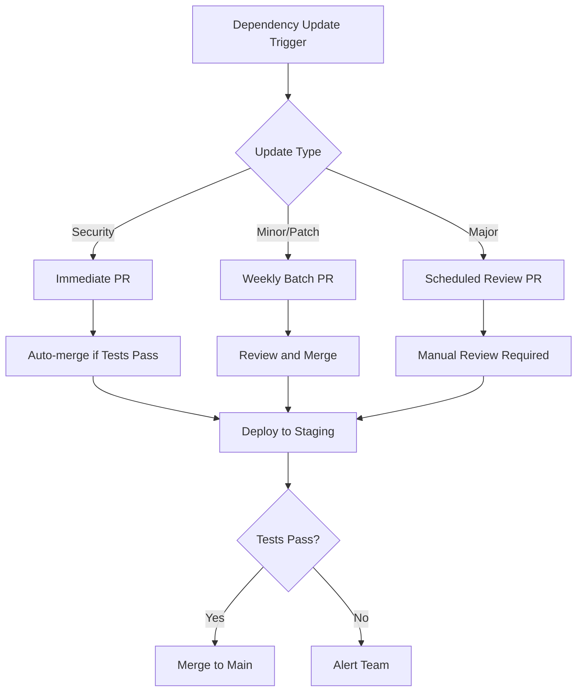

# How to Set Up Dependency Updates in GitHub Actions

Author: [nawazdhandala](https://www.github.com/nawazdhandala)

Tags: GitHub Actions, CI/CD, Dependabot, Dependencies, Security, DevOps

Description: Learn how to set up automated dependency updates in GitHub Actions using Dependabot, Renovate, and custom workflows to keep your projects secure and up-to-date.

> Outdated dependencies are security vulnerabilities waiting to happen. Automation keeps them fresh without manual effort.

Keeping dependencies up-to-date is essential for security and stability. Manual updates are tedious and often neglected until a vulnerability forces action. This guide covers setting up automated dependency updates using GitHub's native Dependabot, the powerful Renovate bot, and custom GitHub Actions workflows for specialized requirements.

## Dependency Update Strategy



## GitHub Dependabot Configuration

Dependabot is built into GitHub. Create a configuration file to enable it:

```yaml
# .github/dependabot.yml
version: 2
updates:
  # npm dependencies
  - package-ecosystem: "npm"
    directory: "/"
    schedule:
      interval: "weekly"
      day: "monday"
      time: "09:00"
      timezone: "America/New_York"
    open-pull-requests-limit: 10
    reviewers:
      - "myteam/maintainers"
    labels:
      - "dependencies"
      - "automated"
    commit-message:
      prefix: "chore(deps)"
    groups:
      development-dependencies:
        dependency-type: "development"
        update-types:
          - "minor"
          - "patch"
      production-dependencies:
        dependency-type: "production"
        patterns:
          - "*"

  # GitHub Actions
  - package-ecosystem: "github-actions"
    directory: "/"
    schedule:
      interval: "weekly"
    labels:
      - "ci"
      - "dependencies"

  # Docker
  - package-ecosystem: "docker"
    directory: "/"
    schedule:
      interval: "weekly"
    labels:
      - "docker"
      - "dependencies"

  # Python pip
  - package-ecosystem: "pip"
    directory: "/backend"
    schedule:
      interval: "weekly"
```

## Dependabot with Auto-merge

Automatically merge Dependabot PRs that pass tests:

```yaml
# .github/workflows/dependabot-automerge.yml
name: Dependabot Auto-merge

on: pull_request

permissions:
  contents: write
  pull-requests: write

jobs:
  dependabot:
    runs-on: ubuntu-latest
    if: github.actor == 'dependabot[bot]'
    steps:
      - name: Dependabot metadata
        id: metadata
        uses: dependabot/fetch-metadata@v2
        with:
          github-token: "${{ secrets.GITHUB_TOKEN }}"

      - name: Auto-merge minor and patch updates
        if: steps.metadata.outputs.update-type == 'version-update:semver-minor' || steps.metadata.outputs.update-type == 'version-update:semver-patch'
        run: gh pr merge --auto --squash "$PR_URL"
        env:
          PR_URL: ${{ github.event.pull_request.html_url }}
          GH_TOKEN: ${{ secrets.GITHUB_TOKEN }}

      - name: Approve PR
        if: steps.metadata.outputs.update-type == 'version-update:semver-minor' || steps.metadata.outputs.update-type == 'version-update:semver-patch'
        run: gh pr review --approve "$PR_URL"
        env:
          PR_URL: ${{ github.event.pull_request.html_url }}
          GH_TOKEN: ${{ secrets.GITHUB_TOKEN }}
```

## Renovate Configuration

Renovate offers more flexibility than Dependabot. Add it via GitHub App or self-hosted:

```json
// renovate.json
{
  "$schema": "https://docs.renovatebot.com/renovate-schema.json",
  "extends": [
    "config:base",
    ":preserveSemverRanges",
    "group:recommended"
  ],
  "schedule": ["before 9am on monday"],
  "timezone": "America/New_York",
  "prHourlyLimit": 5,
  "prConcurrentLimit": 10,
  "labels": ["dependencies", "automated"],
  "reviewers": ["team:maintainers"],
  "packageRules": [
    {
      "matchUpdateTypes": ["minor", "patch"],
      "matchCurrentVersion": "!/^0/",
      "automerge": true,
      "automergeType": "pr",
      "platformAutomerge": true
    },
    {
      "matchDepTypes": ["devDependencies"],
      "automerge": true
    },
    {
      "matchPackagePatterns": ["eslint"],
      "groupName": "eslint packages"
    },
    {
      "matchPackagePatterns": ["jest", "@types/jest"],
      "groupName": "jest packages"
    },
    {
      "matchUpdateTypes": ["major"],
      "labels": ["major-update"],
      "automerge": false
    },
    {
      "matchPackageNames": ["node"],
      "enabled": false
    }
  ],
  "vulnerabilityAlerts": {
    "labels": ["security"],
    "automerge": true
  }
}
```

## Custom Dependency Update Workflow

For specialized requirements, create custom update workflows:

```yaml
# .github/workflows/update-dependencies.yml
name: Update Dependencies

on:
  schedule:
    - cron: '0 9 * * 1'  # Every Monday at 9 AM
  workflow_dispatch:

jobs:
  update-npm:
    runs-on: ubuntu-latest
    steps:
      - uses: actions/checkout@v4

      - uses: actions/setup-node@v4
        with:
          node-version: '20'

      - name: Check for updates
        id: check
        run: |
          npm outdated --json > outdated.json || true

          if [ -s outdated.json ] && [ "$(cat outdated.json)" != "{}" ]; then
            echo "has_updates=true" >> $GITHUB_OUTPUT

            # Create summary
            echo "## Outdated Packages" >> $GITHUB_STEP_SUMMARY
            cat outdated.json | jq -r 'to_entries[] | "- \(.key): \(.value.current) -> \(.value.latest)"' >> $GITHUB_STEP_SUMMARY
          else
            echo "has_updates=false" >> $GITHUB_OUTPUT
            echo "All packages are up to date" >> $GITHUB_STEP_SUMMARY
          fi

      - name: Update packages
        if: steps.check.outputs.has_updates == 'true'
        run: |
          # Update all packages
          npm update

          # Run audit fix for security updates
          npm audit fix || true

      - name: Run tests
        if: steps.check.outputs.has_updates == 'true'
        run: npm test

      - name: Create Pull Request
        if: steps.check.outputs.has_updates == 'true'
        uses: peter-evans/create-pull-request@v6
        with:
          token: ${{ secrets.GITHUB_TOKEN }}
          commit-message: 'chore(deps): update dependencies'
          title: 'chore(deps): weekly dependency updates'
          body: |
            ## Automated Dependency Updates

            This PR updates npm dependencies to their latest compatible versions.

            ### Changes
            See the outdated packages summary in the workflow run.

            ### Testing
            All tests passed in the update workflow.
          branch: automated/dependency-updates
          delete-branch: true
          labels: |
            dependencies
            automated
```

## Security-Focused Updates

Prioritize security updates with immediate action:

```yaml
name: Security Updates

on:
  schedule:
    - cron: '0 */6 * * *'  # Every 6 hours
  workflow_dispatch:

jobs:
  check-vulnerabilities:
    runs-on: ubuntu-latest
    steps:
      - uses: actions/checkout@v4

      - uses: actions/setup-node@v4
        with:
          node-version: '20'

      - name: Install dependencies
        run: npm ci

      - name: Check for vulnerabilities
        id: audit
        run: |
          npm audit --json > audit.json || true

          CRITICAL=$(cat audit.json | jq '.metadata.vulnerabilities.critical // 0')
          HIGH=$(cat audit.json | jq '.metadata.vulnerabilities.high // 0')

          echo "critical=$CRITICAL" >> $GITHUB_OUTPUT
          echo "high=$HIGH" >> $GITHUB_OUTPUT

          if [ "$CRITICAL" -gt 0 ] || [ "$HIGH" -gt 0 ]; then
            echo "has_vulnerabilities=true" >> $GITHUB_OUTPUT
          else
            echo "has_vulnerabilities=false" >> $GITHUB_OUTPUT
          fi

      - name: Fix vulnerabilities
        if: steps.audit.outputs.has_vulnerabilities == 'true'
        run: |
          npm audit fix

          # Force fix if regular fix fails
          npm audit fix --force || true

      - name: Test after fix
        if: steps.audit.outputs.has_vulnerabilities == 'true'
        run: npm test

      - name: Create urgent PR
        if: steps.audit.outputs.has_vulnerabilities == 'true'
        uses: peter-evans/create-pull-request@v6
        with:
          token: ${{ secrets.GITHUB_TOKEN }}
          commit-message: 'fix(security): patch vulnerable dependencies'
          title: 'URGENT: Security vulnerability fixes'
          body: |
            ## Security Vulnerability Fixes

            Found vulnerabilities:
            - Critical: ${{ steps.audit.outputs.critical }}
            - High: ${{ steps.audit.outputs.high }}

            This PR applies `npm audit fix` to patch known vulnerabilities.

            Please review and merge promptly.
          branch: security/vulnerability-fixes
          labels: |
            security
            urgent

      - name: Notify on critical vulnerabilities
        if: steps.audit.outputs.critical > 0
        uses: actions/github-script@v7
        with:
          script: |
            await github.rest.issues.create({
              owner: context.repo.owner,
              repo: context.repo.repo,
              title: 'CRITICAL: Security vulnerabilities detected',
              body: `Found ${{ steps.audit.outputs.critical }} critical vulnerabilities.\n\nA PR has been created to fix these issues.`,
              labels: ['security', 'critical']
            });
```

## Multi-Language Dependency Updates

Handle projects with multiple language ecosystems:

```yaml
name: Multi-Language Updates

on:
  schedule:
    - cron: '0 9 * * 1'
  workflow_dispatch:

jobs:
  update-javascript:
    runs-on: ubuntu-latest
    steps:
      - uses: actions/checkout@v4
      - uses: actions/setup-node@v4
        with:
          node-version: '20'
      - run: npm update
      - uses: peter-evans/create-pull-request@v6
        with:
          token: ${{ secrets.GITHUB_TOKEN }}
          commit-message: 'chore(deps): update npm dependencies'
          branch: deps/npm-updates
          title: 'chore(deps): npm dependency updates'

  update-python:
    runs-on: ubuntu-latest
    steps:
      - uses: actions/checkout@v4
      - uses: actions/setup-python@v5
        with:
          python-version: '3.12'

      - name: Update Python dependencies
        run: |
          pip install pip-tools
          pip-compile --upgrade requirements.in

      - uses: peter-evans/create-pull-request@v6
        with:
          token: ${{ secrets.GITHUB_TOKEN }}
          commit-message: 'chore(deps): update Python dependencies'
          branch: deps/python-updates
          title: 'chore(deps): Python dependency updates'

  update-go:
    runs-on: ubuntu-latest
    steps:
      - uses: actions/checkout@v4
      - uses: actions/setup-go@v5
        with:
          go-version: '1.22'

      - name: Update Go dependencies
        run: |
          go get -u ./...
          go mod tidy

      - uses: peter-evans/create-pull-request@v6
        with:
          token: ${{ secrets.GITHUB_TOKEN }}
          commit-message: 'chore(deps): update Go dependencies'
          branch: deps/go-updates
          title: 'chore(deps): Go dependency updates'
```

## Lock File Maintenance

Keep lock files clean with regular maintenance:

```yaml
name: Lock File Maintenance

on:
  schedule:
    - cron: '0 3 * * 0'  # Weekly on Sunday at 3 AM
  workflow_dispatch:

jobs:
  refresh-lockfile:
    runs-on: ubuntu-latest
    steps:
      - uses: actions/checkout@v4

      - uses: actions/setup-node@v4
        with:
          node-version: '20'

      - name: Delete and regenerate lock file
        run: |
          rm -f package-lock.json
          npm install

      - name: Test with fresh lock file
        run: npm test

      - uses: peter-evans/create-pull-request@v6
        with:
          token: ${{ secrets.GITHUB_TOKEN }}
          commit-message: 'chore: refresh package-lock.json'
          branch: maintenance/refresh-lockfile
          title: 'chore: weekly lock file refresh'
          body: |
            This PR refreshes the package-lock.json by deleting and regenerating it.

            This helps resolve:
            - Accumulated resolution conflicts
            - Orphaned dependencies
            - Outdated integrity hashes
```

## Dependency Update Dashboard

Create a summary of dependency status:

```yaml
name: Dependency Dashboard

on:
  schedule:
    - cron: '0 8 * * 1'  # Weekly Monday at 8 AM
  workflow_dispatch:

jobs:
  generate-dashboard:
    runs-on: ubuntu-latest
    steps:
      - uses: actions/checkout@v4

      - uses: actions/setup-node@v4
        with:
          node-version: '20'

      - name: Generate dependency report
        run: |
          npm ci

          # Outdated packages
          echo "## Outdated Packages" > report.md
          npm outdated --long >> report.md 2>&1 || true
          echo "" >> report.md

          # Security audit
          echo "## Security Audit" >> report.md
          npm audit >> report.md 2>&1 || true
          echo "" >> report.md

          # License check
          echo "## Licenses" >> report.md
          npx license-checker --summary >> report.md 2>&1 || true

      - name: Update dashboard issue
        uses: actions/github-script@v7
        with:
          script: |
            const fs = require('fs');
            const report = fs.readFileSync('report.md', 'utf8');

            const title = 'Dependency Dashboard';

            // Find existing dashboard issue
            const issues = await github.rest.issues.listForRepo({
              owner: context.repo.owner,
              repo: context.repo.repo,
              labels: 'dependency-dashboard',
              state: 'open'
            });

            const body = `# Dependency Dashboard

            Last updated: ${new Date().toISOString()}

            ${report}

            ---
            *This issue is automatically updated weekly.*`;

            if (issues.data.length > 0) {
              await github.rest.issues.update({
                owner: context.repo.owner,
                repo: context.repo.repo,
                issue_number: issues.data[0].number,
                body: body
              });
            } else {
              await github.rest.issues.create({
                owner: context.repo.owner,
                repo: context.repo.repo,
                title: title,
                body: body,
                labels: ['dependency-dashboard']
              });
            }
```

## Best Practices

1. **Group related updates** - Combine eslint packages, test packages, etc.
2. **Auto-merge cautiously** - Only for minor/patch of stable packages
3. **Run full test suite** - Before merging any dependency update
4. **Review major updates** - Major versions require manual review
5. **Security first** - Process security updates immediately
6. **Schedule wisely** - Run updates when team can review
7. **Lock file hygiene** - Periodically refresh lock files

## Conclusion

Automated dependency updates balance security needs with development workflow. Start with Dependabot for its simplicity, graduate to Renovate for advanced control, or build custom workflows for specialized requirements. The goal is keeping dependencies current without drowning in update PRs.

The best dependency update strategy is one that runs automatically, merges safe updates without intervention, and surfaces important changes for human review.
