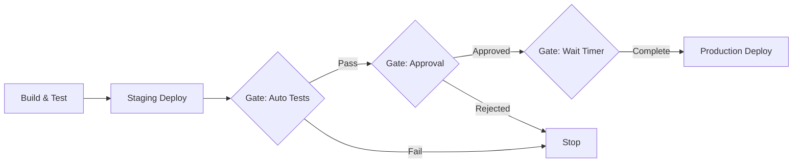

# How to Set Up Deployment Gates in GitHub Actions

Author: [nawazdhandala](https://www.github.com/nawazdhandala)

Tags: GitHub Actions, CI/CD, Deployment, Gates, Approvals, Environments, DevOps

Description: Learn how to implement deployment gates in GitHub Actions using environments, required reviewers, wait timers, and custom protection rules to ensure safe, controlled deployments to production.

---

Deployment gates add checkpoints between your CI pipeline and production. They prevent accidental deployments, enforce approval workflows, and give teams control over when and how changes reach users. GitHub Actions provides multiple mechanisms for implementing these safety controls.

## Understanding Deployment Gates

Gates are conditions that must be satisfied before a deployment proceeds. They can be manual approvals, automated checks, or time-based delays.



## Configuring Environments

Environments are the foundation of deployment gates in GitHub Actions. They represent deployment targets like staging, production, or regional deployments.

### Creating an Environment

Navigate to your repository Settings > Environments and create environments for each deployment target.

```yaml
# .github/workflows/deploy.yml
name: Deploy

on:
  push:
    branches: [main]

jobs:
  deploy-staging:
    runs-on: ubuntu-latest
    environment: staging

    steps:
      - name: Checkout
        uses: actions/checkout@v4

      - name: Deploy to staging
        run: ./scripts/deploy.sh staging
        env:
          DEPLOY_TOKEN: ${{ secrets.STAGING_DEPLOY_TOKEN }}

  deploy-production:
    runs-on: ubuntu-latest
    needs: deploy-staging
    environment: production

    steps:
      - name: Checkout
        uses: actions/checkout@v4

      - name: Deploy to production
        run: ./scripts/deploy.sh production
        env:
          DEPLOY_TOKEN: ${{ secrets.PRODUCTION_DEPLOY_TOKEN }}
```

Environment-specific secrets are only available to jobs targeting that environment, adding a layer of security.

## Required Reviewers

The most common gate is requiring human approval before deployment. Configure required reviewers in the environment settings.

### Setting Up Approval Requirements

1. Go to Settings > Environments > production
2. Check "Required reviewers"
3. Add individuals or teams who can approve deployments
4. Set how many approvals are needed (1-6)

When a workflow reaches a job targeting this environment, it pauses and notifies the reviewers. The deployment URL and changes are visible in the review interface.

### Approval Workflow

```yaml
jobs:
  deploy-production:
    runs-on: ubuntu-latest
    environment:
      name: production
      url: https://myapp.example.com

    steps:
      - name: Checkout
        uses: actions/checkout@v4

      - name: Deploy
        run: |
          echo "Deploying to production..."
          ./scripts/deploy.sh production

      - name: Verify deployment
        run: |
          curl -f https://myapp.example.com/health || exit 1
```

The `url` field displays in the GitHub UI, giving reviewers quick access to verify the deployment.

## Wait Timers

Wait timers add a delay before deployment proceeds, even after approval. This provides a window to catch issues or cancel deployments during off-hours.

### Configuring Wait Timers

In environment settings, set "Wait timer" to the desired minutes (0-43200, which is 30 days).

Common patterns:

- **Production**: 15-minute wait after approval for final verification
- **Critical infrastructure**: 30-minute wait during business hours only
- **Canary deployments**: 60-minute wait to observe metrics

```yaml
jobs:
  deploy-production:
    runs-on: ubuntu-latest
    environment:
      name: production  # Has 15-minute wait timer configured

    steps:
      - name: Pre-deployment notification
        run: |
          curl -X POST ${{ secrets.SLACK_WEBHOOK }} \
            -d '{"text":"Production deployment approved. Deploying in 15 minutes..."}'

      - name: Deploy
        run: ./scripts/deploy.sh production
```

## Branch Protection Rules

Limit which branches can deploy to specific environments. This prevents feature branches from accidentally deploying to production.

### Configuring Deployment Branches

1. In environment settings, select "Deployment branches"
2. Choose "Selected branches"
3. Add branch name patterns:
   - `main` - only main branch
   - `release/*` - release branches
   - `hotfix/*` - emergency fixes

```yaml
jobs:
  deploy:
    runs-on: ubuntu-latest
    # This job only runs if the branch matches environment rules
    environment: production
    if: github.ref == 'refs/heads/main'

    steps:
      - name: Deploy
        run: ./scripts/deploy.sh production
```

## Custom Protection Rules

For more complex gates, implement custom protection rules using the Deployments API.

### Integration Testing Gate

Run integration tests in staging and only proceed if they pass.

```yaml
jobs:
  deploy-staging:
    runs-on: ubuntu-latest
    environment: staging
    outputs:
      deployment-url: ${{ steps.deploy.outputs.url }}

    steps:
      - name: Checkout
        uses: actions/checkout@v4

      - name: Deploy to staging
        id: deploy
        run: |
          URL=$(./scripts/deploy.sh staging)
          echo "url=$URL" >> $GITHUB_OUTPUT

  integration-tests:
    runs-on: ubuntu-latest
    needs: deploy-staging

    steps:
      - name: Checkout
        uses: actions/checkout@v4

      - name: Run integration tests
        run: |
          npm run test:integration
        env:
          TEST_URL: ${{ needs.deploy-staging.outputs.deployment-url }}

  deploy-production:
    runs-on: ubuntu-latest
    needs: integration-tests
    environment: production

    steps:
      - name: Deploy to production
        run: ./scripts/deploy.sh production
```

### Metrics-Based Gate

Check production metrics before proceeding with a full rollout.

```yaml
jobs:
  canary-deploy:
    runs-on: ubuntu-latest
    environment: production-canary

    steps:
      - name: Deploy canary
        run: ./scripts/deploy.sh production --canary 5%

  verify-metrics:
    runs-on: ubuntu-latest
    needs: canary-deploy

    steps:
      - name: Wait for metrics
        run: sleep 300  # 5 minutes

      - name: Check error rate
        id: metrics
        run: |
          ERROR_RATE=$(curl -s "https://metrics.example.com/api/error-rate?last=5m" | jq '.rate')
          echo "error_rate=$ERROR_RATE" >> $GITHUB_OUTPUT

          if (( $(echo "$ERROR_RATE > 0.01" | bc -l) )); then
            echo "Error rate too high: $ERROR_RATE"
            exit 1
          fi

      - name: Check latency
        run: |
          P99=$(curl -s "https://metrics.example.com/api/latency?percentile=99&last=5m" | jq '.ms')

          if (( $(echo "$P99 > 500" | bc -l) )); then
            echo "P99 latency too high: ${P99}ms"
            exit 1
          fi

  full-deploy:
    runs-on: ubuntu-latest
    needs: verify-metrics
    environment: production

    steps:
      - name: Full production deploy
        run: ./scripts/deploy.sh production --percentage 100
```

## Manual Triggers with Inputs

Add manual gates using workflow dispatch inputs for critical deployments.

```yaml
name: Production Deploy

on:
  workflow_dispatch:
    inputs:
      confirm_deployment:
        description: 'Type "deploy-production" to confirm'
        required: true
        type: string
      skip_canary:
        description: 'Skip canary deployment (emergency only)'
        required: false
        type: boolean
        default: false

jobs:
  validate:
    runs-on: ubuntu-latest
    steps:
      - name: Validate confirmation
        if: github.event.inputs.confirm_deployment != 'deploy-production'
        run: |
          echo "Invalid confirmation. Expected 'deploy-production'"
          exit 1

  deploy:
    needs: validate
    runs-on: ubuntu-latest
    environment: production

    steps:
      - name: Checkout
        uses: actions/checkout@v4

      - name: Canary deploy
        if: github.event.inputs.skip_canary != 'true'
        run: ./scripts/deploy.sh production --canary 10%

      - name: Full deploy
        run: ./scripts/deploy.sh production
```

## Rollback Gates

Implement automatic rollback when deployments fail health checks.

```yaml
jobs:
  deploy:
    runs-on: ubuntu-latest
    environment: production

    steps:
      - name: Checkout
        uses: actions/checkout@v4

      - name: Get current version
        id: current
        run: |
          VERSION=$(curl -s https://myapp.example.com/version | jq -r '.version')
          echo "version=$VERSION" >> $GITHUB_OUTPUT

      - name: Deploy new version
        run: ./scripts/deploy.sh production

      - name: Health check
        id: health
        run: |
          for i in {1..10}; do
            if curl -sf https://myapp.example.com/health; then
              echo "Health check passed"
              exit 0
            fi
            echo "Attempt $i failed, retrying..."
            sleep 30
          done
          echo "Health check failed after 10 attempts"
          exit 1
        continue-on-error: true

      - name: Rollback on failure
        if: steps.health.outcome == 'failure'
        run: |
          echo "Rolling back to version ${{ steps.current.outputs.version }}"
          ./scripts/deploy.sh production --version ${{ steps.current.outputs.version }}
          exit 1  # Fail the job to indicate rollback occurred
```

## Time-Based Deployment Windows

Restrict deployments to specific hours using conditional logic.

```yaml
jobs:
  check-deploy-window:
    runs-on: ubuntu-latest
    outputs:
      in-window: ${{ steps.check.outputs.in_window }}

    steps:
      - name: Check deployment window
        id: check
        run: |
          HOUR=$(TZ="America/New_York" date +%H)
          DAY=$(TZ="America/New_York" date +%u)

          # Allow deployments Mon-Thu, 9 AM - 4 PM ET
          if [[ $DAY -ge 1 && $DAY -le 4 && $HOUR -ge 9 && $HOUR -lt 16 ]]; then
            echo "in_window=true" >> $GITHUB_OUTPUT
          else
            echo "in_window=false" >> $GITHUB_OUTPUT
            echo "::warning::Outside deployment window (Mon-Thu 9AM-4PM ET)"
          fi

  deploy:
    needs: check-deploy-window
    if: needs.check-deploy-window.outputs.in-window == 'true' || github.event_name == 'workflow_dispatch'
    runs-on: ubuntu-latest
    environment: production

    steps:
      - name: Deploy
        run: ./scripts/deploy.sh production
```

The `workflow_dispatch` exception allows manual overrides for emergencies.

## Combining Multiple Gates

Production deployments often need multiple gates working together.

```yaml
jobs:
  build:
    runs-on: ubuntu-latest
    steps:
      - name: Build and test
        run: ./scripts/build.sh

  staging:
    needs: build
    runs-on: ubuntu-latest
    environment: staging
    steps:
      - name: Deploy staging
        run: ./scripts/deploy.sh staging

  integration-tests:
    needs: staging
    runs-on: ubuntu-latest
    steps:
      - name: Run integration tests
        run: npm run test:integration

  production:
    needs: integration-tests
    runs-on: ubuntu-latest
    environment:
      name: production
      url: https://myapp.example.com
    # Environment has: required reviewers, 10-minute wait, main branch only

    steps:
      - name: Deploy production
        run: ./scripts/deploy.sh production
```

This pipeline enforces: successful build, staging deployment, passing integration tests, manual approval, 10-minute wait, and main branch restriction - all before production deployment.

Deployment gates are not bureaucracy - they are guardrails that let you move fast with confidence. Start with simple approval requirements and add more sophisticated gates as your deployment process matures.
