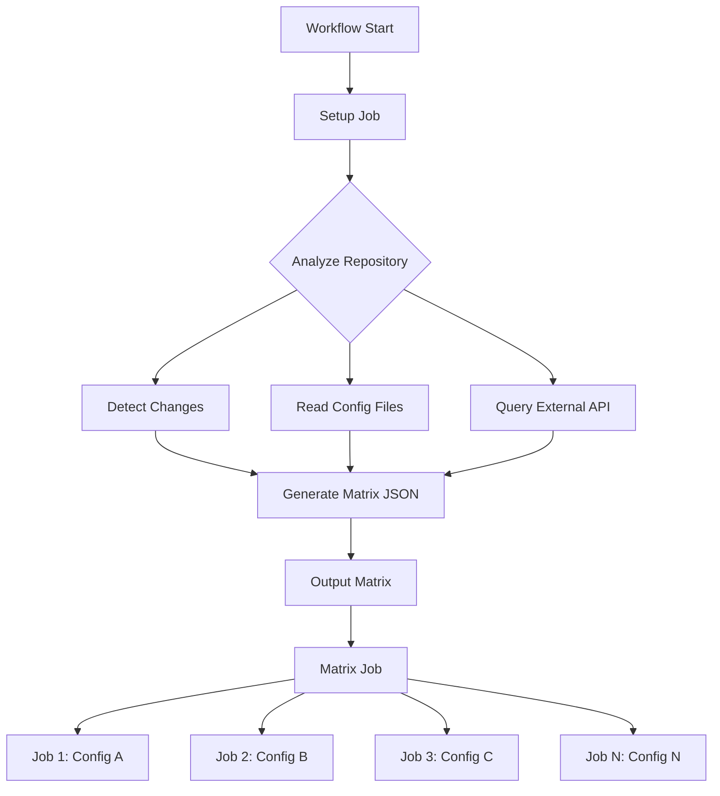

# How to Use Dynamic Matrix in GitHub Actions

Author: [nawazdhandala](https://www.github.com/nawazdhandala)

Tags: GitHub Actions, CI/CD, Matrix Builds, Dynamic Configuration, DevOps, Automation

Description: Learn how to use dynamic matrix strategies in GitHub Actions to generate build configurations at runtime based on file changes, API responses, or custom logic.

> Static matrices are limited. Dynamic matrices adapt to your repository's current state.

GitHub Actions matrix strategies are powerful for running jobs across multiple configurations. But static matrices defined in YAML cannot adapt to changing requirements. Dynamic matrices let you generate configurations at runtime - test only changed packages in a monorepo, build for detected platforms, or run jobs based on API responses. This guide shows you how to build flexible, efficient CI/CD pipelines with dynamic matrices.

## Static vs Dynamic Matrix

A static matrix is defined in YAML:

```yaml
strategy:
  matrix:
    node: [18, 20, 22]
    os: [ubuntu-latest, windows-latest]
```

A dynamic matrix is generated at runtime:

```yaml
jobs:
  setup:
    outputs:
      matrix: ${{ steps.generate.outputs.matrix }}
    steps:
      - id: generate
        run: echo "matrix=$(./generate-matrix.sh)" >> $GITHUB_OUTPUT

  build:
    needs: setup
    strategy:
      matrix: ${{ fromJson(needs.setup.outputs.matrix) }}
```

## Dynamic Matrix Architecture



## Basic Dynamic Matrix

Generate a matrix based on changed files:

```yaml
name: Dynamic Matrix Example

on:
  push:
    branches: [main]
  pull_request:
    branches: [main]

jobs:
  detect-changes:
    runs-on: ubuntu-latest
    outputs:
      matrix: ${{ steps.set-matrix.outputs.matrix }}
      has_changes: ${{ steps.set-matrix.outputs.has_changes }}

    steps:
      - uses: actions/checkout@v4
        with:
          fetch-depth: 0

      - name: Detect changed packages
        id: set-matrix
        run: |
          # Get changed files
          if [ "${{ github.event_name }}" == "pull_request" ]; then
            CHANGED=$(git diff --name-only origin/${{ github.base_ref }}...HEAD)
          else
            CHANGED=$(git diff --name-only HEAD~1)
          fi

          # Find affected packages
          PACKAGES=()
          for file in $CHANGED; do
            if [[ $file == packages/* ]]; then
              PKG=$(echo $file | cut -d'/' -f2)
              PACKAGES+=("$PKG")
            fi
          done

          # Remove duplicates and create JSON
          UNIQUE_PACKAGES=($(echo "${PACKAGES[@]}" | tr ' ' '\n' | sort -u))

          if [ ${#UNIQUE_PACKAGES[@]} -eq 0 ]; then
            echo "has_changes=false" >> $GITHUB_OUTPUT
            echo "matrix={\"package\":[]}" >> $GITHUB_OUTPUT
          else
            MATRIX_JSON=$(printf '%s\n' "${UNIQUE_PACKAGES[@]}" | jq -R . | jq -s '{package: .}')
            echo "has_changes=true" >> $GITHUB_OUTPUT
            echo "matrix=$MATRIX_JSON" >> $GITHUB_OUTPUT
          fi

  build:
    needs: detect-changes
    if: needs.detect-changes.outputs.has_changes == 'true'
    runs-on: ubuntu-latest
    strategy:
      matrix: ${{ fromJson(needs.detect-changes.outputs.matrix) }}
      fail-fast: false

    steps:
      - uses: actions/checkout@v4

      - name: Build package
        run: |
          echo "Building package: ${{ matrix.package }}"
          cd packages/${{ matrix.package }}
          npm ci
          npm run build
```

## Multi-Dimensional Dynamic Matrix

Generate matrices with multiple dimensions:

```yaml
name: Multi-Dimensional Matrix

on: push

jobs:
  generate-matrix:
    runs-on: ubuntu-latest
    outputs:
      matrix: ${{ steps.generate.outputs.matrix }}

    steps:
      - uses: actions/checkout@v4

      - name: Generate matrix
        id: generate
        run: |
          # Read configuration from file
          SERVICES=$(cat services.json | jq -c '.services')
          ENVIRONMENTS=$(cat environments.json | jq -c '.environments')

          # Create matrix combining services and environments
          MATRIX=$(jq -n \
            --argjson services "$SERVICES" \
            --argjson envs "$ENVIRONMENTS" \
            '{service: $services, environment: $envs}')

          echo "matrix=$MATRIX" >> $GITHUB_OUTPUT

  deploy:
    needs: generate-matrix
    runs-on: ubuntu-latest
    strategy:
      matrix: ${{ fromJson(needs.generate-matrix.outputs.matrix) }}

    steps:
      - name: Deploy
        run: |
          echo "Deploying ${{ matrix.service }} to ${{ matrix.environment }}"
```

## Matrix from Configuration File

Read matrix configuration from a JSON or YAML file:

```json
// .github/matrix-config.json
{
  "include": [
    {
      "name": "api",
      "path": "services/api",
      "node": "20",
      "test_command": "npm test"
    },
    {
      "name": "web",
      "path": "services/web",
      "node": "20",
      "test_command": "npm run test:ci"
    },
    {
      "name": "worker",
      "path": "services/worker",
      "node": "18",
      "test_command": "npm test"
    }
  ]
}
```

```yaml
name: Config-Based Matrix

on: push

jobs:
  load-matrix:
    runs-on: ubuntu-latest
    outputs:
      matrix: ${{ steps.load.outputs.matrix }}

    steps:
      - uses: actions/checkout@v4

      - name: Load matrix from config
        id: load
        run: |
          MATRIX=$(cat .github/matrix-config.json)
          echo "matrix=$MATRIX" >> $GITHUB_OUTPUT

  test:
    needs: load-matrix
    runs-on: ubuntu-latest
    strategy:
      matrix: ${{ fromJson(needs.load-matrix.outputs.matrix) }}

    steps:
      - uses: actions/checkout@v4

      - uses: actions/setup-node@v4
        with:
          node-version: ${{ matrix.node }}

      - name: Test ${{ matrix.name }}
        working-directory: ${{ matrix.path }}
        run: |
          npm ci
          ${{ matrix.test_command }}
```

## Matrix from API Response

Generate matrix from external API data:

```yaml
name: API-Driven Matrix

on:
  workflow_dispatch:
  schedule:
    - cron: '0 0 * * *'

jobs:
  fetch-targets:
    runs-on: ubuntu-latest
    outputs:
      matrix: ${{ steps.fetch.outputs.matrix }}

    steps:
      - name: Fetch deployment targets
        id: fetch
        run: |
          # Fetch active servers from API
          RESPONSE=$(curl -s \
            -H "Authorization: Bearer ${{ secrets.API_TOKEN }}" \
            "https://api.example.com/servers?status=active")

          # Transform API response to matrix format
          MATRIX=$(echo "$RESPONSE" | jq '{
            include: [.[] | {
              server_id: .id,
              hostname: .hostname,
              region: .region
            }]
          }')

          echo "matrix=$MATRIX" >> $GITHUB_OUTPUT

  deploy:
    needs: fetch-targets
    runs-on: ubuntu-latest
    strategy:
      matrix: ${{ fromJson(needs.fetch-targets.outputs.matrix) }}
      max-parallel: 5

    steps:
      - name: Deploy to ${{ matrix.hostname }}
        run: |
          echo "Deploying to server ${{ matrix.server_id }} in ${{ matrix.region }}"
```

## Conditional Matrix Generation

Generate different matrices based on conditions:

```yaml
name: Conditional Matrix

on:
  push:
    branches: [main, develop]

jobs:
  setup:
    runs-on: ubuntu-latest
    outputs:
      matrix: ${{ steps.generate.outputs.matrix }}

    steps:
      - name: Generate matrix based on branch
        id: generate
        run: |
          if [[ "${{ github.ref }}" == "refs/heads/main" ]]; then
            # Production: full matrix
            MATRIX='{"os":["ubuntu-latest","windows-latest","macos-latest"],"node":["18","20","22"]}'
          else
            # Development: minimal matrix
            MATRIX='{"os":["ubuntu-latest"],"node":["20"]}'
          fi

          echo "matrix=$MATRIX" >> $GITHUB_OUTPUT

  test:
    needs: setup
    runs-on: ${{ matrix.os }}
    strategy:
      matrix: ${{ fromJson(needs.setup.outputs.matrix) }}

    steps:
      - uses: actions/checkout@v4

      - uses: actions/setup-node@v4
        with:
          node-version: ${{ matrix.node }}

      - run: npm test
```

## Monorepo Change Detection

Efficient testing in monorepos with dynamic matrices:

```yaml
name: Monorepo CI

on:
  pull_request:
    branches: [main]

jobs:
  changes:
    runs-on: ubuntu-latest
    outputs:
      matrix: ${{ steps.detect.outputs.matrix }}
      should_run: ${{ steps.detect.outputs.should_run }}

    steps:
      - uses: actions/checkout@v4
        with:
          fetch-depth: 0

      - name: Detect package changes
        id: detect
        run: |
          # Get list of packages
          PACKAGES=$(ls -d packages/*/ | xargs -n1 basename)

          # Check which packages have changes
          CHANGED_PACKAGES=()
          for pkg in $PACKAGES; do
            if git diff --quiet origin/${{ github.base_ref }}...HEAD -- packages/$pkg; then
              echo "No changes in $pkg"
            else
              echo "Changes detected in $pkg"
              CHANGED_PACKAGES+=("$pkg")
            fi
          done

          # Also check for root changes that affect all packages
          if ! git diff --quiet origin/${{ github.base_ref }}...HEAD -- package.json package-lock.json; then
            echo "Root dependency changes - testing all packages"
            CHANGED_PACKAGES=($PACKAGES)
          fi

          # Generate matrix
          if [ ${#CHANGED_PACKAGES[@]} -eq 0 ]; then
            echo "should_run=false" >> $GITHUB_OUTPUT
            echo "matrix={\"package\":[]}" >> $GITHUB_OUTPUT
          else
            MATRIX=$(printf '%s\n' "${CHANGED_PACKAGES[@]}" | jq -R . | jq -s '{package: .}')
            echo "should_run=true" >> $GITHUB_OUTPUT
            echo "matrix=$MATRIX" >> $GITHUB_OUTPUT
          fi

  test:
    needs: changes
    if: needs.changes.outputs.should_run == 'true'
    runs-on: ubuntu-latest
    strategy:
      matrix: ${{ fromJson(needs.changes.outputs.matrix) }}
      fail-fast: false

    steps:
      - uses: actions/checkout@v4

      - uses: actions/setup-node@v4
        with:
          node-version: '20'
          cache: 'npm'

      - name: Install root dependencies
        run: npm ci

      - name: Test ${{ matrix.package }}
        run: npm test --workspace=packages/${{ matrix.package }}
```

## Matrix with Include/Exclude

Dynamically add include and exclude rules:

```yaml
name: Matrix with Includes

on: push

jobs:
  setup:
    runs-on: ubuntu-latest
    outputs:
      matrix: ${{ steps.generate.outputs.matrix }}

    steps:
      - name: Generate complex matrix
        id: generate
        run: |
          MATRIX=$(cat <<'EOF'
          {
            "os": ["ubuntu-latest", "windows-latest"],
            "node": ["18", "20"],
            "include": [
              {
                "os": "ubuntu-latest",
                "node": "22",
                "experimental": true
              }
            ],
            "exclude": [
              {
                "os": "windows-latest",
                "node": "18"
              }
            ]
          }
          EOF
          )

          echo "matrix=$(echo $MATRIX | jq -c .)" >> $GITHUB_OUTPUT

  build:
    needs: setup
    runs-on: ${{ matrix.os }}
    continue-on-error: ${{ matrix.experimental || false }}
    strategy:
      matrix: ${{ fromJson(needs.setup.outputs.matrix) }}

    steps:
      - uses: actions/checkout@v4

      - uses: actions/setup-node@v4
        with:
          node-version: ${{ matrix.node }}

      - run: npm test
```

## Dynamic Matrix from Directory Structure

Generate matrix based on directory contents:

```yaml
name: Directory-Based Matrix

on: push

jobs:
  discover:
    runs-on: ubuntu-latest
    outputs:
      matrix: ${{ steps.discover.outputs.matrix }}

    steps:
      - uses: actions/checkout@v4

      - name: Discover services
        id: discover
        run: |
          # Find all directories with Dockerfile
          SERVICES=$(find services -name Dockerfile -printf '%h\n' | xargs -n1 basename | sort -u)

          # Create matrix
          MATRIX=$(echo "$SERVICES" | jq -R . | jq -s '{service: .}')
          echo "matrix=$MATRIX" >> $GITHUB_OUTPUT

  build:
    needs: discover
    runs-on: ubuntu-latest
    strategy:
      matrix: ${{ fromJson(needs.discover.outputs.matrix) }}

    steps:
      - uses: actions/checkout@v4

      - name: Build Docker image
        run: |
          docker build -t ${{ matrix.service }}:${{ github.sha }} services/${{ matrix.service }}
```

## Best Practices

1. **Validate matrix JSON** - Invalid JSON causes cryptic errors
2. **Handle empty matrices** - Use conditionals to skip jobs when matrix is empty
3. **Set fail-fast appropriately** - Usually `false` for testing, `true` for deployments
4. **Limit parallelism** - Use `max-parallel` to avoid overwhelming resources
5. **Cache setup jobs** - Matrix generation should be fast
6. **Use descriptive names** - Include matrix values in job names for clarity

## Debugging Dynamic Matrices

```yaml
- name: Debug matrix output
  run: |
    echo "Matrix JSON:"
    echo '${{ needs.setup.outputs.matrix }}' | jq .

    echo "Parsed values:"
    echo '${{ toJson(matrix) }}'
```

## Conclusion

Dynamic matrices transform GitHub Actions from a static build tool into an adaptive automation platform. Start with simple change detection, then expand to configuration-driven and API-driven matrices. The key is generating valid JSON that represents your build requirements accurately.

The most powerful CI/CD pipelines are those that automatically adapt to your repository's structure and changes, running exactly what needs to run - no more, no less.
