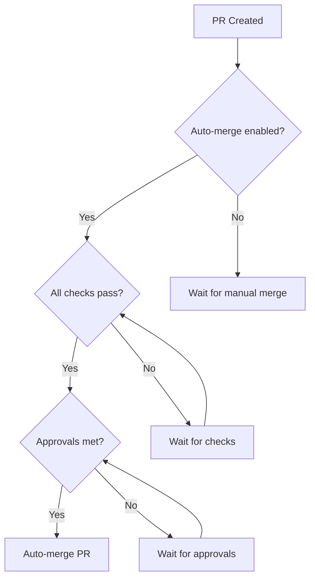

# How to Set Up Auto-Merge in GitHub Actions

Author: [nawazdhandala](https://www.github.com/nawazdhandala)

Tags: GitHub Actions, CI/CD, Auto-Merge, Pull Requests, Automation, DevOps

Description: Learn how to implement automatic pull request merging in GitHub Actions, including dependency update automation, required checks, approval requirements, and safe merge strategies for different scenarios.

---

Auto-merge eliminates the manual step of clicking "merge" after all checks pass. For dependency updates, documentation changes, and approved PRs, automatic merging accelerates your workflow while maintaining quality gates. Here's how to set it up safely.

## GitHub Native Auto-Merge

GitHub has built-in auto-merge functionality. Enable it on a PR, and it merges automatically when all requirements are met.

### Enable in Repository Settings

1. Go to Settings > General
2. Scroll to "Pull Requests"
3. Check "Allow auto-merge"

### Enable on Individual PRs

```yaml
name: Enable Auto-Merge

on:
  pull_request:
    types: [opened, synchronize]

jobs:
  auto-merge:
    runs-on: ubuntu-latest
    if: github.actor == 'dependabot[bot]'
    permissions:
      contents: write
      pull-requests: write
    steps:
      - name: Enable auto-merge for Dependabot PRs
        run: gh pr merge --auto --squash "$PR_URL"
        env:
          PR_URL: ${{ github.event.pull_request.html_url }}
          GITHUB_TOKEN: ${{ secrets.GITHUB_TOKEN }}
```



## Dependabot Auto-Merge

Automatically merge minor and patch dependency updates:

```yaml
name: Dependabot Auto-Merge

on: pull_request

permissions:
  contents: write
  pull-requests: write

jobs:
  auto-merge:
    runs-on: ubuntu-latest
    if: github.actor == 'dependabot[bot]'
    steps:
      - name: Dependabot metadata
        id: metadata
        uses: dependabot/fetch-metadata@v2
        with:
          github-token: ${{ secrets.GITHUB_TOKEN }}

      - name: Auto-merge minor and patch updates
        if: steps.metadata.outputs.update-type == 'version-update:semver-minor' || steps.metadata.outputs.update-type == 'version-update:semver-patch'
        run: gh pr merge --auto --squash "$PR_URL"
        env:
          PR_URL: ${{ github.event.pull_request.html_url }}
          GITHUB_TOKEN: ${{ secrets.GITHUB_TOKEN }}

      - name: Approve patch updates
        if: steps.metadata.outputs.update-type == 'version-update:semver-patch'
        run: gh pr review --approve "$PR_URL"
        env:
          PR_URL: ${{ github.event.pull_request.html_url }}
          GITHUB_TOKEN: ${{ secrets.GITHUB_TOKEN }}
```

For development dependencies only:

```yaml
      - name: Auto-merge dev dependencies
        if: steps.metadata.outputs.dependency-type == 'direct:development'
        run: gh pr merge --auto --squash "$PR_URL"
        env:
          PR_URL: ${{ github.event.pull_request.html_url }}
          GITHUB_TOKEN: ${{ secrets.GITHUB_TOKEN }}
```

## Label-Based Auto-Merge

Merge PRs when a specific label is added:

```yaml
name: Auto-Merge on Label

on:
  pull_request:
    types: [labeled]

jobs:
  auto-merge:
    runs-on: ubuntu-latest
    if: github.event.label.name == 'automerge'
    permissions:
      contents: write
      pull-requests: write
    steps:
      - name: Enable auto-merge
        run: gh pr merge --auto --squash "$PR_URL"
        env:
          PR_URL: ${{ github.event.pull_request.html_url }}
          GITHUB_TOKEN: ${{ secrets.GITHUB_TOKEN }}
```

## Auto-Merge After Approval

Merge immediately after receiving required approvals:

```yaml
name: Auto-Merge Approved PRs

on:
  pull_request_review:
    types: [submitted]

jobs:
  auto-merge:
    runs-on: ubuntu-latest
    if: github.event.review.state == 'approved'
    permissions:
      contents: write
      pull-requests: write
    steps:
      - name: Check for automerge label
        id: check-label
        run: |
          LABELS=$(gh pr view "$PR_URL" --json labels --jq '.labels[].name')
          if echo "$LABELS" | grep -q "automerge"; then
            echo "should_merge=true" >> $GITHUB_OUTPUT
          else
            echo "should_merge=false" >> $GITHUB_OUTPUT
          fi
        env:
          PR_URL: ${{ github.event.pull_request.html_url }}
          GITHUB_TOKEN: ${{ secrets.GITHUB_TOKEN }}

      - name: Enable auto-merge
        if: steps.check-label.outputs.should_merge == 'true'
        run: gh pr merge --auto --squash "$PR_URL"
        env:
          PR_URL: ${{ github.event.pull_request.html_url }}
          GITHUB_TOKEN: ${{ secrets.GITHUB_TOKEN }}
```

## Merge After All Checks Pass

Wait for CI to complete before merging:

```yaml
name: Merge When Ready

on:
  check_suite:
    types: [completed]
  workflow_run:
    workflows: ["CI"]
    types: [completed]

jobs:
  merge:
    runs-on: ubuntu-latest
    if: github.event.workflow_run.conclusion == 'success'
    permissions:
      contents: write
      pull-requests: write
    steps:
      - name: Get PR number
        id: pr
        run: |
          PR_NUMBER=$(gh run view ${{ github.event.workflow_run.id }} \
            --repo ${{ github.repository }} \
            --json headBranch \
            --jq '.headBranch' | \
            xargs -I {} gh pr list --head {} --json number --jq '.[0].number')
          echo "number=$PR_NUMBER" >> $GITHUB_OUTPUT
        env:
          GITHUB_TOKEN: ${{ secrets.GITHUB_TOKEN }}

      - name: Merge if auto-merge enabled
        if: steps.pr.outputs.number
        run: |
          gh pr merge ${{ steps.pr.outputs.number }} \
            --auto \
            --squash \
            --repo ${{ github.repository }}
        env:
          GITHUB_TOKEN: ${{ secrets.GITHUB_TOKEN }}
```

## Branch Protection Requirements

Configure branch protection for safe auto-merge:

```yaml
# .github/branch-protection.yml (for reference)
branches:
  main:
    protection:
      required_status_checks:
        strict: true
        contexts:
          - "CI / test"
          - "CI / lint"
          - "Security Scan"
      required_pull_request_reviews:
        required_approving_review_count: 1
        dismiss_stale_reviews: true
      enforce_admins: true
```

Auto-merge respects these settings - PRs won't merge until all requirements are met.

## Merge Strategies

Choose the right merge strategy:

```yaml
      # Squash - combines all commits into one
      - run: gh pr merge --auto --squash "$PR_URL"

      # Merge commit - preserves all commits with merge commit
      - run: gh pr merge --auto --merge "$PR_URL"

      # Rebase - applies commits on top of base branch
      - run: gh pr merge --auto --rebase "$PR_URL"
```

Conditional strategy based on PR size:

```yaml
      - name: Choose merge strategy
        run: |
          COMMITS=$(gh pr view "$PR_URL" --json commits --jq '.commits | length')
          if [ "$COMMITS" -eq 1 ]; then
            gh pr merge --auto --rebase "$PR_URL"
          else
            gh pr merge --auto --squash "$PR_URL"
          fi
        env:
          PR_URL: ${{ github.event.pull_request.html_url }}
          GITHUB_TOKEN: ${{ secrets.GITHUB_TOKEN }}
```

## Auto-Merge for Specific Paths

Merge documentation or config changes automatically:

```yaml
name: Auto-Merge Docs

on:
  pull_request:
    paths:
      - 'docs/**'
      - '*.md'
      - '.github/**'

jobs:
  auto-merge:
    runs-on: ubuntu-latest
    permissions:
      contents: write
      pull-requests: write
    steps:
      - uses: actions/checkout@v4

      - name: Check if only docs changed
        id: check
        run: |
          FILES=$(gh pr diff "$PR_URL" --name-only)
          ONLY_DOCS=true
          while IFS= read -r file; do
            if [[ ! "$file" =~ ^(docs/|.*\.md$|\.github/) ]]; then
              ONLY_DOCS=false
              break
            fi
          done <<< "$FILES"
          echo "only_docs=$ONLY_DOCS" >> $GITHUB_OUTPUT
        env:
          PR_URL: ${{ github.event.pull_request.html_url }}
          GITHUB_TOKEN: ${{ secrets.GITHUB_TOKEN }}

      - name: Enable auto-merge for docs
        if: steps.check.outputs.only_docs == 'true'
        run: |
          gh pr review --approve "$PR_URL"
          gh pr merge --auto --squash "$PR_URL"
        env:
          PR_URL: ${{ github.event.pull_request.html_url }}
          GITHUB_TOKEN: ${{ secrets.GITHUB_TOKEN }}
```

## Disable Auto-Merge

Allow canceling auto-merge:

```yaml
name: Disable Auto-Merge

on:
  pull_request:
    types: [unlabeled]

jobs:
  disable:
    runs-on: ubuntu-latest
    if: github.event.label.name == 'automerge'
    permissions:
      contents: write
      pull-requests: write
    steps:
      - name: Disable auto-merge
        run: gh pr merge --disable-auto "$PR_URL"
        env:
          PR_URL: ${{ github.event.pull_request.html_url }}
          GITHUB_TOKEN: ${{ secrets.GITHUB_TOKEN }}
```

## Safety Checks Before Merge

Add pre-merge validation:

```yaml
      - name: Pre-merge checks
        run: |
          # Check PR is not a draft
          DRAFT=$(gh pr view "$PR_URL" --json isDraft --jq '.isDraft')
          if [ "$DRAFT" = "true" ]; then
            echo "Cannot auto-merge draft PRs"
            exit 1
          fi

          # Check PR has no merge conflicts
          MERGEABLE=$(gh pr view "$PR_URL" --json mergeable --jq '.mergeable')
          if [ "$MERGEABLE" != "MERGEABLE" ]; then
            echo "PR has merge conflicts"
            exit 1
          fi

          # Check all checks passed
          CHECKS=$(gh pr checks "$PR_URL" --json state --jq '.[] | select(.state != "SUCCESS" and .state != "SKIPPED")')
          if [ -n "$CHECKS" ]; then
            echo "Not all checks passed"
            exit 1
          fi
        env:
          PR_URL: ${{ github.event.pull_request.html_url }}
          GITHUB_TOKEN: ${{ secrets.GITHUB_TOKEN }}

      - name: Enable auto-merge
        run: gh pr merge --auto --squash "$PR_URL"
        env:
          PR_URL: ${{ github.event.pull_request.html_url }}
          GITHUB_TOKEN: ${{ secrets.GITHUB_TOKEN }}
```

## Best Practices

1. **Always use branch protection**: Never auto-merge without required checks
2. **Be selective**: Auto-merge specific PR types, not everything
3. **Use squash merging**: Keeps history clean for automated PRs
4. **Log merge decisions**: Track why PRs were auto-merged
5. **Have escape hatches**: Allow disabling auto-merge when needed

```yaml
      - name: Log auto-merge
        run: |
          echo "Auto-merging PR #${{ github.event.pull_request.number }}" >> $GITHUB_STEP_SUMMARY
          echo "- Author: ${{ github.event.pull_request.user.login }}" >> $GITHUB_STEP_SUMMARY
          echo "- Title: ${{ github.event.pull_request.title }}" >> $GITHUB_STEP_SUMMARY
          echo "- Reason: Dependabot patch update" >> $GITHUB_STEP_SUMMARY
```

---

Auto-merge removes friction from your development workflow while maintaining safety through branch protection. Start with low-risk PRs like dependency patches and documentation, then expand as confidence grows. The goal is faster iteration without compromising quality.
