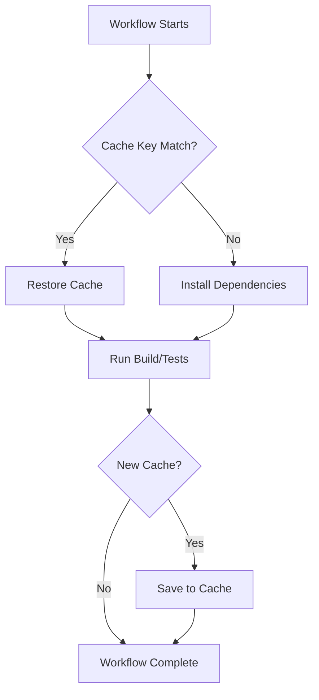

# How to Cache Dependencies in GitHub Actions

Author: [nawazdhandala](https://www.github.com/nawazdhandala)

Tags: GitHub Actions, CI/CD, Caching, Performance, npm, pip, DevOps

Description: Learn how to implement effective dependency caching in GitHub Actions to dramatically reduce build times, lower costs, and improve developer productivity with practical examples for npm, pip, Maven, and more.

---

Dependency installation is often the slowest part of CI pipelines. Running `npm install` or `pip install` on every build wastes time and money. GitHub Actions provides a robust caching mechanism that stores dependencies between runs, cutting build times from minutes to seconds.

## How GitHub Actions Caching Works

The cache action stores and retrieves files based on a key. When the key matches, cached files are restored. When it doesn't match, the workflow installs fresh dependencies and saves them for future runs.



## Basic Cache Configuration

Here's a straightforward npm caching setup:

```yaml
name: Build with Cache

on: [push, pull_request]

jobs:
  build:
    runs-on: ubuntu-latest
    steps:
      - uses: actions/checkout@v4

      - name: Cache node modules
        uses: actions/cache@v4
        with:
          path: ~/.npm
          key: ${{ runner.os }}-node-${{ hashFiles('**/package-lock.json') }}
          restore-keys: |
            ${{ runner.os }}-node-

      - uses: actions/setup-node@v4
        with:
          node-version: 20

      - run: npm ci
      - run: npm test
```

The `hashFiles` function creates a unique key based on your lockfile. When `package-lock.json` changes, the cache key changes, triggering a fresh install.

## Built-in Setup Action Caching

Many setup actions include built-in caching. This is the simplest approach:

```yaml
jobs:
  build:
    runs-on: ubuntu-latest
    steps:
      - uses: actions/checkout@v4

      - uses: actions/setup-node@v4
        with:
          node-version: 20
          cache: 'npm'  # Automatically caches ~/.npm

      - run: npm ci
      - run: npm test
```

For Python:

```yaml
      - uses: actions/setup-python@v5
        with:
          python-version: '3.12'
          cache: 'pip'  # Caches pip packages

      - run: pip install -r requirements.txt
```

For Go:

```yaml
      - uses: actions/setup-go@v5
        with:
          go-version: '1.22'
          cache: true  # Caches Go modules

      - run: go build ./...
```

## Caching node_modules Directly

For faster restores, cache `node_modules` instead of the npm cache:

```yaml
jobs:
  build:
    runs-on: ubuntu-latest
    steps:
      - uses: actions/checkout@v4

      - name: Cache node_modules
        id: cache-modules
        uses: actions/cache@v4
        with:
          path: node_modules
          key: ${{ runner.os }}-modules-${{ hashFiles('**/package-lock.json') }}

      - uses: actions/setup-node@v4
        with:
          node-version: 20

      # Skip npm ci if cache hit
      - name: Install dependencies
        if: steps.cache-modules.outputs.cache-hit != 'true'
        run: npm ci

      - run: npm test
```

This approach skips installation entirely on cache hits, saving even more time.

## Multi-Path Caching

Cache multiple directories in a single action:

```yaml
      - name: Cache dependencies
        uses: actions/cache@v4
        with:
          path: |
            ~/.npm
            ~/.cache/Cypress
            node_modules
          key: ${{ runner.os }}-deps-${{ hashFiles('**/package-lock.json') }}
          restore-keys: |
            ${{ runner.os }}-deps-
```

## Python Virtual Environment Caching

Cache entire virtual environments for Python projects:

```yaml
jobs:
  test:
    runs-on: ubuntu-latest
    steps:
      - uses: actions/checkout@v4

      - uses: actions/setup-python@v5
        with:
          python-version: '3.12'

      - name: Cache virtualenv
        uses: actions/cache@v4
        id: cache-venv
        with:
          path: .venv
          key: ${{ runner.os }}-venv-${{ hashFiles('**/requirements.txt') }}

      - name: Create virtualenv
        if: steps.cache-venv.outputs.cache-hit != 'true'
        run: |
          python -m venv .venv
          source .venv/bin/activate
          pip install -r requirements.txt

      - name: Run tests
        run: |
          source .venv/bin/activate
          pytest
```

## Maven and Gradle Caching

For Java projects using Maven:

```yaml
jobs:
  build:
    runs-on: ubuntu-latest
    steps:
      - uses: actions/checkout@v4

      - uses: actions/setup-java@v4
        with:
          java-version: '21'
          distribution: 'temurin'
          cache: 'maven'  # Built-in Maven caching

      - run: mvn -B package
```

Manual Maven cache configuration:

```yaml
      - name: Cache Maven packages
        uses: actions/cache@v4
        with:
          path: ~/.m2/repository
          key: ${{ runner.os }}-maven-${{ hashFiles('**/pom.xml') }}
          restore-keys: |
            ${{ runner.os }}-maven-
```

For Gradle:

```yaml
      - uses: actions/setup-java@v4
        with:
          java-version: '21'
          distribution: 'temurin'
          cache: 'gradle'

      - run: ./gradlew build
```

## Docker Layer Caching

Cache Docker build layers for faster image builds:

```yaml
jobs:
  build:
    runs-on: ubuntu-latest
    steps:
      - uses: actions/checkout@v4

      - uses: docker/setup-buildx-action@v3

      - name: Cache Docker layers
        uses: actions/cache@v4
        with:
          path: /tmp/.buildx-cache
          key: ${{ runner.os }}-buildx-${{ github.sha }}
          restore-keys: |
            ${{ runner.os }}-buildx-

      - uses: docker/build-push-action@v5
        with:
          context: .
          push: false
          cache-from: type=local,src=/tmp/.buildx-cache
          cache-to: type=local,dest=/tmp/.buildx-cache-new,mode=max

      # Prevent cache from growing indefinitely
      - name: Move cache
        run: |
          rm -rf /tmp/.buildx-cache
          mv /tmp/.buildx-cache-new /tmp/.buildx-cache
```

## Restore Keys Strategy

Restore keys provide fallback options when exact matches fail:

```yaml
      - uses: actions/cache@v4
        with:
          path: ~/.npm
          key: ${{ runner.os }}-node-${{ matrix.node }}-${{ hashFiles('**/package-lock.json') }}
          restore-keys: |
            ${{ runner.os }}-node-${{ matrix.node }}-
            ${{ runner.os }}-node-
            ${{ runner.os }}-
```

The cache action tries keys in order, using the first match. More specific keys get priority, with broader fallbacks available.

## Cache Limits and Cleanup

GitHub Actions cache has limits:

- 10 GB total per repository
- Individual caches evicted after 7 days of no access
- Oldest caches removed when limit reached

Monitor cache usage:

```yaml
      - name: Check cache size
        run: |
          du -sh ~/.npm 2>/dev/null || echo "Cache empty"
          du -sh node_modules 2>/dev/null || echo "No node_modules"
```

## Conditional Caching

Save cache only on specific branches:

```yaml
      - uses: actions/cache@v4
        with:
          path: node_modules
          key: ${{ runner.os }}-modules-${{ hashFiles('**/package-lock.json') }}
          save-always: false  # Only save on success
```

Or use conditional logic:

```yaml
      - name: Save cache
        if: github.ref == 'refs/heads/main' && steps.cache.outputs.cache-hit != 'true'
        uses: actions/cache/save@v4
        with:
          path: node_modules
          key: ${{ runner.os }}-modules-${{ hashFiles('**/package-lock.json') }}
```

## Measuring Cache Effectiveness

Track cache performance to ensure it's working:

```yaml
      - name: Report cache metrics
        if: always()
        run: |
          echo "Cache hit: ${{ steps.cache.outputs.cache-hit }}"
          echo "Install time: ${{ steps.install.outputs.duration }}"
```

Compare build times with and without cache hits. A well-configured cache should reduce dependency installation from minutes to seconds.

## Best Practices

1. **Use lockfiles for keys**: `package-lock.json`, `requirements.txt`, `go.sum`
2. **Include OS and runtime version**: Prevents cross-platform cache corruption
3. **Provide restore-keys**: Fall back to partial matches
4. **Cache at the right level**: node_modules for speed, ~/.npm for flexibility
5. **Monitor cache sizes**: Large caches may slow restore times
6. **Consider matrix builds**: Each matrix combination may need separate caches

---

Effective caching transforms CI pipelines from slow, expensive processes into fast feedback loops. Start with built-in setup action caching, then optimize with direct node_modules or virtualenv caching as your builds mature. The time saved compounds with every commit.
