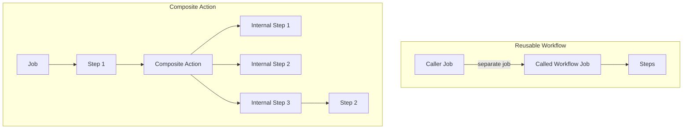

# How to Use Composite Actions in GitHub Actions

Author: [nawazdhandala](https://www.github.com/nawazdhandala)

Tags: GitHub Actions, CI/CD, Composite Actions, Reusability, DRY, DevOps

Description: Learn how to create and use composite actions in GitHub Actions to encapsulate reusable workflow logic, reduce duplication, and build a library of standardized CI/CD components for your organization.

---

Composite actions bundle multiple steps into a single reusable unit. Unlike reusable workflows that run as separate jobs, composite actions run inline within your existing job. They're perfect for encapsulating common patterns like setup procedures, build steps, or deployment logic.

## Composite Actions vs Reusable Workflows



- **Composite actions**: Run within the same job, share runner context
- **Reusable workflows**: Run as separate jobs, isolated context

## Creating a Basic Composite Action

Create an action in your repository or a dedicated actions repository:

```yaml
# .github/actions/setup-node-pnpm/action.yml
name: 'Setup Node.js with pnpm'
description: 'Sets up Node.js and pnpm with caching'

inputs:
  node-version:
    description: 'Node.js version'
    required: false
    default: '20'

runs:
  using: 'composite'
  steps:
    - name: Setup pnpm
      uses: pnpm/action-setup@v2
      with:
        version: 8

    - name: Setup Node.js
      uses: actions/setup-node@v4
      with:
        node-version: ${{ inputs.node-version }}
        cache: 'pnpm'

    - name: Install dependencies
      shell: bash
      run: pnpm install --frozen-lockfile
```

Use it in your workflow:

```yaml
jobs:
  build:
    runs-on: ubuntu-latest
    steps:
      - uses: actions/checkout@v4

      - name: Setup environment
        uses: ./.github/actions/setup-node-pnpm
        with:
          node-version: '20'

      - run: pnpm run build
```

## Composite Action with Outputs

Return values from composite actions:

```yaml
# .github/actions/get-version/action.yml
name: 'Get Version'
description: 'Extracts version from package.json'

outputs:
  version:
    description: 'The package version'
    value: ${{ steps.version.outputs.version }}
  major:
    description: 'Major version number'
    value: ${{ steps.version.outputs.major }}
  minor:
    description: 'Minor version number'
    value: ${{ steps.version.outputs.minor }}

runs:
  using: 'composite'
  steps:
    - name: Extract version
      id: version
      shell: bash
      run: |
        VERSION=$(jq -r '.version' package.json)
        echo "version=$VERSION" >> $GITHUB_OUTPUT
        echo "major=$(echo $VERSION | cut -d. -f1)" >> $GITHUB_OUTPUT
        echo "minor=$(echo $VERSION | cut -d. -f2)" >> $GITHUB_OUTPUT
```

Use the outputs:

```yaml
jobs:
  release:
    runs-on: ubuntu-latest
    steps:
      - uses: actions/checkout@v4

      - name: Get version
        id: version
        uses: ./.github/actions/get-version

      - name: Create release
        run: |
          echo "Creating release v${{ steps.version.outputs.version }}"
          echo "Major: ${{ steps.version.outputs.major }}"
```

## Complex Composite Action

Build a comprehensive action with multiple steps:

```yaml
# .github/actions/docker-build-push/action.yml
name: 'Docker Build and Push'
description: 'Builds and pushes Docker images with caching'

inputs:
  registry:
    description: 'Container registry'
    required: true
  image-name:
    description: 'Image name'
    required: true
  dockerfile:
    description: 'Path to Dockerfile'
    required: false
    default: 'Dockerfile'
  context:
    description: 'Build context'
    required: false
    default: '.'
  push:
    description: 'Push the image'
    required: false
    default: 'true'
  platforms:
    description: 'Target platforms'
    required: false
    default: 'linux/amd64'

outputs:
  image:
    description: 'Full image reference'
    value: ${{ steps.meta.outputs.tags }}
  digest:
    description: 'Image digest'
    value: ${{ steps.build.outputs.digest }}

runs:
  using: 'composite'
  steps:
    - name: Set up QEMU
      uses: docker/setup-qemu-action@v3

    - name: Set up Docker Buildx
      uses: docker/setup-buildx-action@v3

    - name: Extract metadata
      id: meta
      uses: docker/metadata-action@v5
      with:
        images: ${{ inputs.registry }}/${{ inputs.image-name }}
        tags: |
          type=ref,event=branch
          type=ref,event=pr
          type=semver,pattern={{version}}
          type=sha

    - name: Build and push
      id: build
      uses: docker/build-push-action@v5
      with:
        context: ${{ inputs.context }}
        file: ${{ inputs.dockerfile }}
        platforms: ${{ inputs.platforms }}
        push: ${{ inputs.push }}
        tags: ${{ steps.meta.outputs.tags }}
        labels: ${{ steps.meta.outputs.labels }}
        cache-from: type=gha
        cache-to: type=gha,mode=max
```

## Composite Action with Conditionals

Handle different scenarios within the action:

```yaml
# .github/actions/deploy/action.yml
name: 'Deploy Application'
description: 'Deploys to various environments'

inputs:
  environment:
    description: 'Target environment'
    required: true
  version:
    description: 'Version to deploy'
    required: true

runs:
  using: 'composite'
  steps:
    - name: Deploy to staging
      if: inputs.environment == 'staging'
      shell: bash
      run: |
        echo "Deploying ${{ inputs.version }} to staging"
        kubectl apply -f k8s/staging/

    - name: Deploy to production
      if: inputs.environment == 'production'
      shell: bash
      run: |
        echo "Deploying ${{ inputs.version }} to production"
        kubectl apply -f k8s/production/
        kubectl rollout status deployment/app

    - name: Verify deployment
      shell: bash
      run: |
        echo "Verifying ${{ inputs.environment }} deployment"
        curl -f https://${{ inputs.environment }}.example.com/health
```

## Using External Actions in Composite Actions

Combine third-party actions:

```yaml
# .github/actions/security-scan/action.yml
name: 'Security Scan'
description: 'Runs multiple security scans'

inputs:
  scan-type:
    description: 'Type of scan: full, quick'
    required: false
    default: 'quick'

runs:
  using: 'composite'
  steps:
    - name: Run Trivy vulnerability scanner
      uses: aquasecurity/trivy-action@master
      with:
        scan-type: 'fs'
        scan-ref: '.'
        severity: 'CRITICAL,HIGH'

    - name: Run Snyk
      if: inputs.scan-type == 'full'
      uses: snyk/actions/node@master
      continue-on-error: true
      env:
        SNYK_TOKEN: ${{ env.SNYK_TOKEN }}

    - name: Run CodeQL
      if: inputs.scan-type == 'full'
      uses: github/codeql-action/analyze@v3
```

## Local vs Remote Composite Actions

### Local Action (same repository)

```yaml
      - uses: ./.github/actions/my-action
```

### Remote Action (separate repository)

```yaml
      - uses: myorg/actions/my-action@v1
```

### Action from subdirectory

```yaml
      - uses: myorg/actions/nodejs/setup@v1
```

## Composite Action Repository Structure

Organize multiple actions in a single repository:

```
actions-repo/
  nodejs/
    setup/
      action.yml
    test/
      action.yml
  docker/
    build/
      action.yml
    scan/
      action.yml
  deploy/
    kubernetes/
      action.yml
    aws/
      action.yml
```

Use them:

```yaml
jobs:
  build:
    runs-on: ubuntu-latest
    steps:
      - uses: myorg/actions/nodejs/setup@v1
      - uses: myorg/actions/docker/build@v1
      - uses: myorg/actions/deploy/kubernetes@v1
```

## Versioning Composite Actions

Use tags for stable references:

```bash
# Create version tag
git tag -a v1.0.0 -m "Release v1.0.0"
git push origin v1.0.0

# Create major version tag
git tag -fa v1 -m "Update v1 to latest"
git push origin v1 --force
```

Reference in workflows:

```yaml
      # Specific version (most stable)
      - uses: myorg/actions/setup@v1.0.0

      # Major version (gets updates)
      - uses: myorg/actions/setup@v1

      # Branch (development)
      - uses: myorg/actions/setup@main
```

## Testing Composite Actions

Create a test workflow:

```yaml
# .github/workflows/test-actions.yml
name: Test Actions

on:
  push:
    paths:
      - '.github/actions/**'
  pull_request:
    paths:
      - '.github/actions/**'

jobs:
  test-setup-action:
    runs-on: ubuntu-latest
    steps:
      - uses: actions/checkout@v4

      - name: Test setup action
        uses: ./.github/actions/setup-node-pnpm
        with:
          node-version: '20'

      - name: Verify setup
        run: |
          node --version | grep -q "v20"
          pnpm --version

  test-version-action:
    runs-on: ubuntu-latest
    steps:
      - uses: actions/checkout@v4

      - name: Test version action
        id: version
        uses: ./.github/actions/get-version

      - name: Verify output
        run: |
          if [ -z "${{ steps.version.outputs.version }}" ]; then
            echo "Version output is empty"
            exit 1
          fi
```

## Best Practices

### 1. Always Specify Shell

```yaml
    - name: Run script
      shell: bash
      run: echo "Always specify shell for run steps"
```

### 2. Provide Good Defaults

```yaml
inputs:
  timeout:
    description: 'Timeout in minutes'
    required: false
    default: '10'
```

### 3. Document Inputs and Outputs

```yaml
inputs:
  api-key:
    description: |
      API key for authentication.
      Create one at https://example.com/settings/api
    required: true
```

### 4. Handle Errors Gracefully

```yaml
    - name: Fallback on error
      shell: bash
      run: |
        if ! command -v tool &> /dev/null; then
          echo "Tool not found, installing..."
          ./install-tool.sh
        fi
        tool --version
```

### 5. Use Branding

```yaml
name: 'My Action'
description: 'Does something useful'
branding:
  icon: 'package'
  color: 'blue'
```

---

Composite actions are the building blocks of maintainable CI/CD. They encapsulate complexity, enforce standards, and reduce duplication. Start by identifying repeated step sequences in your workflows, extract them into composite actions, and share them across your organization. The result is cleaner workflows and consistent automation.
