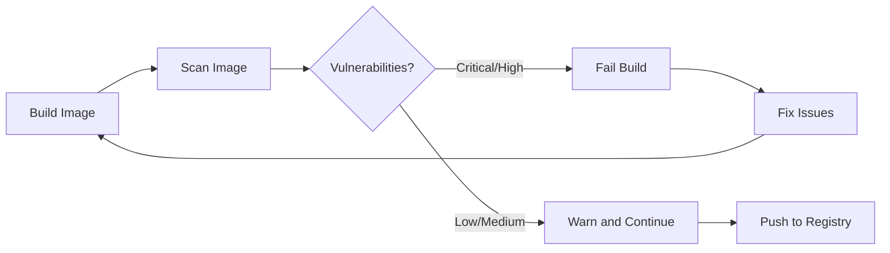

# How to Set Up Container Scanning in GitHub Actions

Author: [nawazdhandala](https://www.github.com/nawazdhandala)

Tags: GitHub Actions, CI/CD, Security, Container Scanning, Docker, DevSecOps

Description: Learn how to implement automated container vulnerability scanning in GitHub Actions using Trivy, Grype, and other security tools to catch CVEs before deployment.

---

Container images often inherit vulnerabilities from base images and dependencies. Automated scanning in your CI pipeline catches these issues before they reach production. This guide shows you how to set up comprehensive container scanning in GitHub Actions.

## Why Container Scanning Matters

Every container image consists of layers - base OS, runtime, dependencies, and your application code. Each layer can introduce security vulnerabilities. A single unpatched CVE in your base image can expose your entire infrastructure. Scanning catches these issues early in the development cycle when they're cheapest to fix.



## Setting Up Trivy Scanner

Trivy is one of the most popular open-source vulnerability scanners. It scans container images, filesystems, and Git repositories for known vulnerabilities.

### Basic Trivy Integration

```yaml
name: Container Security Scan

on:
  push:
    branches: [main]
  pull_request:
    branches: [main]

jobs:
  scan:
    runs-on: ubuntu-latest
    steps:
      - name: Checkout code
        uses: actions/checkout@v4

      - name: Build Docker image
        run: docker build -t myapp:${{ github.sha }} .

      - name: Run Trivy vulnerability scanner
        uses: aquasecurity/trivy-action@master
        with:
          image-ref: myapp:${{ github.sha }}
          format: table
          exit-code: 1
          ignore-unfixed: true
          vuln-type: os,library
          severity: CRITICAL,HIGH
```

The `exit-code: 1` setting fails the build when vulnerabilities are found. The `ignore-unfixed` option skips vulnerabilities without available patches.

### Advanced Trivy Configuration

For more control, use a Trivy configuration file:

```yaml
# trivy.yaml
severity:
  - CRITICAL
  - HIGH
  - MEDIUM

vulnerability:
  ignore-unfixed: true

scan:
  skip-dirs:
    - /usr/local/share/.cache
    - /root/.cache
```

Reference it in your workflow:

```yaml
      - name: Run Trivy with config
        uses: aquasecurity/trivy-action@master
        with:
          image-ref: myapp:${{ github.sha }}
          trivy-config: trivy.yaml
          format: sarif
          output: trivy-results.sarif

      - name: Upload Trivy results to GitHub Security
        uses: github/codeql-action/upload-sarif@v3
        with:
          sarif_file: trivy-results.sarif
```

The SARIF output integrates with GitHub's Security tab, giving you a centralized view of all vulnerabilities.

## Using Grype as an Alternative Scanner

Grype by Anchore offers another excellent scanning option with different detection capabilities.

```yaml
  scan-grype:
    runs-on: ubuntu-latest
    steps:
      - name: Checkout code
        uses: actions/checkout@v4

      - name: Build image
        run: docker build -t myapp:${{ github.sha }} .

      - name: Scan with Grype
        uses: anchore/scan-action@v3
        id: scan
        with:
          image: myapp:${{ github.sha }}
          fail-build: true
          severity-cutoff: high

      - name: Upload Grype SARIF report
        uses: github/codeql-action/upload-sarif@v3
        if: always()
        with:
          sarif_file: ${{ steps.scan.outputs.sarif }}
```

## Multi-Scanner Strategy

Running multiple scanners increases detection coverage since each tool has different vulnerability databases and detection methods.

```yaml
jobs:
  build:
    runs-on: ubuntu-latest
    outputs:
      image-tag: ${{ steps.meta.outputs.tags }}
    steps:
      - uses: actions/checkout@v4

      - name: Build and export
        uses: docker/build-push-action@v5
        with:
          context: .
          tags: myapp:${{ github.sha }}
          outputs: type=docker,dest=/tmp/image.tar

      - name: Upload image artifact
        uses: actions/upload-artifact@v4
        with:
          name: docker-image
          path: /tmp/image.tar

  scan-trivy:
    needs: build
    runs-on: ubuntu-latest
    steps:
      - name: Download image
        uses: actions/download-artifact@v4
        with:
          name: docker-image
          path: /tmp

      - name: Load image
        run: docker load -i /tmp/image.tar

      - name: Trivy scan
        uses: aquasecurity/trivy-action@master
        with:
          image-ref: myapp:${{ github.sha }}
          exit-code: 1
          severity: CRITICAL,HIGH

  scan-grype:
    needs: build
    runs-on: ubuntu-latest
    steps:
      - name: Download image
        uses: actions/download-artifact@v4
        with:
          name: docker-image
          path: /tmp

      - name: Load image
        run: docker load -i /tmp/image.tar

      - name: Grype scan
        uses: anchore/scan-action@v3
        with:
          image: myapp:${{ github.sha }}
          fail-build: true
          severity-cutoff: high
```

## Scanning Base Images Separately

Scan your base images independently to catch issues before they propagate:

```yaml
  scan-base-image:
    runs-on: ubuntu-latest
    steps:
      - name: Scan base image
        uses: aquasecurity/trivy-action@master
        with:
          image-ref: node:20-alpine
          format: table
          exit-code: 0
          severity: CRITICAL,HIGH

      - name: Create base image report
        if: always()
        run: |
          echo "## Base Image Vulnerabilities" >> $GITHUB_STEP_SUMMARY
          echo "Scanned: node:20-alpine" >> $GITHUB_STEP_SUMMARY
```

## Generating Software Bill of Materials (SBOM)

An SBOM provides a complete inventory of components in your image:

```yaml
      - name: Generate SBOM with Syft
        uses: anchore/sbom-action@v0
        with:
          image: myapp:${{ github.sha }}
          artifact-name: sbom.spdx.json
          output-file: sbom.spdx.json

      - name: Scan SBOM for vulnerabilities
        uses: aquasecurity/trivy-action@master
        with:
          scan-type: sbom
          scan-ref: sbom.spdx.json
          exit-code: 1
          severity: CRITICAL,HIGH
```

## Handling False Positives

Create an ignore file for known false positives:

```yaml
# .trivyignore
# CVE with no fix available and low risk in our context
CVE-2023-12345

# Already mitigated through other controls
CVE-2023-67890
```

For Grype, use a similar configuration:

```yaml
# .grype.yaml
ignore:
  - vulnerability: CVE-2023-12345
    reason: "No fix available, mitigated by network policy"
```

## Scheduled Scanning for Existing Images

Scan your registry periodically to catch newly discovered vulnerabilities:

```yaml
name: Scheduled Registry Scan

on:
  schedule:
    - cron: '0 6 * * *'  # Daily at 6 AM UTC

jobs:
  scan-registry:
    runs-on: ubuntu-latest
    strategy:
      matrix:
        image:
          - ghcr.io/myorg/api:latest
          - ghcr.io/myorg/worker:latest
          - ghcr.io/myorg/frontend:latest
    steps:
      - name: Scan ${{ matrix.image }}
        uses: aquasecurity/trivy-action@master
        with:
          image-ref: ${{ matrix.image }}
          format: sarif
          output: results.sarif
          severity: CRITICAL,HIGH

      - name: Upload results
        uses: github/codeql-action/upload-sarif@v3
        with:
          sarif_file: results.sarif
          category: ${{ matrix.image }}
```

## Summary

Container scanning is essential for maintaining secure deployments. Key practices include:

- Scan on every build with tools like Trivy or Grype
- Use multiple scanners for better coverage
- Integrate results with GitHub Security via SARIF
- Generate SBOMs for compliance and audit trails
- Run scheduled scans to catch new vulnerabilities
- Document false positives in ignore files

Automated scanning catches vulnerabilities early when they're cheapest to fix. Integrate these checks into your CI pipeline to maintain a strong security posture.
