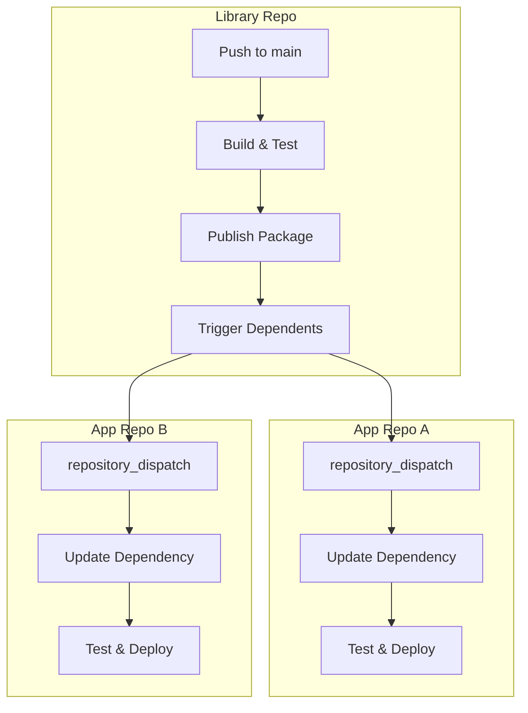

# How to Set Up Cross-Repository Workflows in GitHub Actions

Author: [nawazdhandala](https://www.github.com/nawazdhandala)

Tags: GitHub Actions, CI/CD, Cross-Repository, Automation, DevOps, Monorepo

Description: Learn how to trigger and coordinate GitHub Actions workflows across multiple repositories using repository dispatch, workflow dispatch, and reusable workflows for complex CI/CD pipelines.

---

Modern software often spans multiple repositories - microservices, shared libraries, infrastructure configs, and deployment manifests. Cross-repository workflows let you coordinate CI/CD across these boundaries. This guide covers the patterns and techniques for building cross-repo automation.

## Cross-Repository Workflow Patterns



## Using Repository Dispatch

Repository dispatch lets one repository trigger workflows in another.

### Sending a Dispatch Event

In the source repository:

```yaml
name: Publish and Notify

on:
  push:
    tags:
      - 'v*'

jobs:
  publish:
    runs-on: ubuntu-latest
    steps:
      - uses: actions/checkout@v4

      - name: Build and publish package
        run: |
          npm ci
          npm run build
          npm publish

      - name: Trigger dependent repositories
        run: |
          # Trigger app-frontend repo
          curl -X POST \
            -H "Accept: application/vnd.github+json" \
            -H "Authorization: Bearer ${{ secrets.CROSS_REPO_TOKEN }}" \
            https://api.github.com/repos/myorg/app-frontend/dispatches \
            -d '{
              "event_type": "dependency-update",
              "client_payload": {
                "package": "shared-components",
                "version": "${{ github.ref_name }}",
                "sha": "${{ github.sha }}"
              }
            }'

          # Trigger app-backend repo
          curl -X POST \
            -H "Accept: application/vnd.github+json" \
            -H "Authorization: Bearer ${{ secrets.CROSS_REPO_TOKEN }}" \
            https://api.github.com/repos/myorg/app-backend/dispatches \
            -d '{
              "event_type": "dependency-update",
              "client_payload": {
                "package": "shared-utils",
                "version": "${{ github.ref_name }}"
              }
            }'
```

### Receiving a Dispatch Event

In the target repository:

```yaml
name: Handle Dependency Update

on:
  repository_dispatch:
    types: [dependency-update]

jobs:
  update:
    runs-on: ubuntu-latest
    steps:
      - uses: actions/checkout@v4

      - name: Update dependency version
        run: |
          PACKAGE="${{ github.event.client_payload.package }}"
          VERSION="${{ github.event.client_payload.version }}"

          echo "Updating $PACKAGE to $VERSION"
          npm install "$PACKAGE@$VERSION"

      - name: Run tests
        run: npm test

      - name: Create pull request
        uses: peter-evans/create-pull-request@v5
        with:
          token: ${{ secrets.GITHUB_TOKEN }}
          commit-message: "chore: update ${{ github.event.client_payload.package }} to ${{ github.event.client_payload.version }}"
          title: "Update ${{ github.event.client_payload.package }} to ${{ github.event.client_payload.version }}"
          branch: "deps/${{ github.event.client_payload.package }}-${{ github.event.client_payload.version }}"
          body: |
            Automated dependency update triggered by upstream release.

            - Package: ${{ github.event.client_payload.package }}
            - Version: ${{ github.event.client_payload.version }}
            - Source commit: ${{ github.event.client_payload.sha }}
```

## Using Workflow Dispatch

Workflow dispatch allows manual or programmatic triggering with inputs.

### Defining Dispatchable Workflow

```yaml
name: Deploy Service

on:
  workflow_dispatch:
    inputs:
      environment:
        description: 'Deployment environment'
        required: true
        type: choice
        options:
          - staging
          - production
      version:
        description: 'Version to deploy'
        required: true
        type: string
      skip-tests:
        description: 'Skip integration tests'
        required: false
        type: boolean
        default: false

jobs:
  deploy:
    runs-on: ubuntu-latest
    environment: ${{ inputs.environment }}
    steps:
      - uses: actions/checkout@v4
        with:
          ref: ${{ inputs.version }}

      - name: Run integration tests
        if: ${{ !inputs.skip-tests }}
        run: npm run test:integration

      - name: Deploy to ${{ inputs.environment }}
        run: ./deploy.sh ${{ inputs.environment }}
```

### Triggering from Another Repository

```yaml
name: Orchestrate Deployment

on:
  push:
    branches: [main]

jobs:
  deploy-services:
    runs-on: ubuntu-latest
    steps:
      - name: Deploy API service
        run: |
          gh workflow run deploy.yml \
            --repo myorg/api-service \
            --field environment=staging \
            --field version=${{ github.sha }}
        env:
          GH_TOKEN: ${{ secrets.CROSS_REPO_TOKEN }}

      - name: Deploy Worker service
        run: |
          gh workflow run deploy.yml \
            --repo myorg/worker-service \
            --field environment=staging \
            --field version=${{ github.sha }}
        env:
          GH_TOKEN: ${{ secrets.CROSS_REPO_TOKEN }}

      - name: Wait for deployments
        run: |
          # Poll for workflow completion
          for repo in api-service worker-service; do
            echo "Waiting for $repo deployment..."
            while true; do
              STATUS=$(gh run list --repo myorg/$repo --workflow=deploy.yml --limit=1 --json status --jq '.[0].status')
              if [ "$STATUS" = "completed" ]; then
                break
              fi
              sleep 30
            done
          done
        env:
          GH_TOKEN: ${{ secrets.CROSS_REPO_TOKEN }}
```

## Reusable Workflows Across Repositories

Reusable workflows allow sharing entire workflow definitions.

### Defining a Reusable Workflow

In `myorg/shared-workflows` repository:

```yaml
# .github/workflows/docker-build.yml
name: Reusable Docker Build

on:
  workflow_call:
    inputs:
      image-name:
        required: true
        type: string
      dockerfile:
        required: false
        type: string
        default: Dockerfile
      context:
        required: false
        type: string
        default: .
    secrets:
      registry-username:
        required: true
      registry-password:
        required: true
    outputs:
      image-tag:
        description: "The built image tag"
        value: ${{ jobs.build.outputs.tag }}

jobs:
  build:
    runs-on: ubuntu-latest
    outputs:
      tag: ${{ steps.meta.outputs.tags }}
    steps:
      - uses: actions/checkout@v4

      - name: Set up Docker Buildx
        uses: docker/setup-buildx-action@v3

      - name: Log in to registry
        uses: docker/login-action@v3
        with:
          registry: ghcr.io
          username: ${{ secrets.registry-username }}
          password: ${{ secrets.registry-password }}

      - name: Extract metadata
        id: meta
        uses: docker/metadata-action@v5
        with:
          images: ghcr.io/${{ inputs.image-name }}
          tags: |
            type=sha
            type=ref,event=branch
            type=semver,pattern={{version}}

      - name: Build and push
        uses: docker/build-push-action@v5
        with:
          context: ${{ inputs.context }}
          file: ${{ inputs.dockerfile }}
          push: true
          tags: ${{ steps.meta.outputs.tags }}
          cache-from: type=gha
          cache-to: type=gha,mode=max
```

### Calling a Reusable Workflow

In any repository that needs Docker builds:

```yaml
name: CI

on:
  push:
    branches: [main]

jobs:
  build:
    uses: myorg/shared-workflows/.github/workflows/docker-build.yml@main
    with:
      image-name: myorg/my-service
      dockerfile: Dockerfile.prod
    secrets:
      registry-username: ${{ github.actor }}
      registry-password: ${{ secrets.GITHUB_TOKEN }}

  deploy:
    needs: build
    runs-on: ubuntu-latest
    steps:
      - name: Deploy image
        run: |
          echo "Deploying ${{ needs.build.outputs.image-tag }}"
          kubectl set image deployment/my-service app=${{ needs.build.outputs.image-tag }}
```

## Cross-Repository Artifact Sharing

Share build artifacts between repositories:

### Uploading Artifacts for Cross-Repo Use

```yaml
name: Build Library

on:
  push:
    branches: [main]

jobs:
  build:
    runs-on: ubuntu-latest
    steps:
      - uses: actions/checkout@v4

      - name: Build library
        run: npm run build

      - name: Upload to releases
        run: |
          gh release create "build-${{ github.sha }}" \
            --title "Build ${{ github.sha }}" \
            --notes "Automated build" \
            ./dist/*
        env:
          GH_TOKEN: ${{ secrets.GITHUB_TOKEN }}

      - name: Notify dependent repos
        run: |
          curl -X POST \
            -H "Authorization: Bearer ${{ secrets.CROSS_REPO_TOKEN }}" \
            https://api.github.com/repos/myorg/consumer-app/dispatches \
            -d '{
              "event_type": "library-build",
              "client_payload": {
                "release": "build-${{ github.sha }}",
                "repo": "${{ github.repository }}"
              }
            }'
```

### Downloading Artifacts from Another Repository

```yaml
name: Use Library Build

on:
  repository_dispatch:
    types: [library-build]

jobs:
  integrate:
    runs-on: ubuntu-latest
    steps:
      - uses: actions/checkout@v4

      - name: Download library artifact
        run: |
          gh release download "${{ github.event.client_payload.release }}" \
            --repo "${{ github.event.client_payload.repo }}" \
            --dir ./vendor/lib
        env:
          GH_TOKEN: ${{ secrets.CROSS_REPO_TOKEN }}

      - name: Build with library
        run: npm run build
```

## Coordinated Multi-Repo Deployments

Orchestrate deployments across multiple services:

```yaml
name: Coordinated Release

on:
  workflow_dispatch:
    inputs:
      version:
        description: 'Release version'
        required: true

jobs:
  validate:
    runs-on: ubuntu-latest
    steps:
      - name: Validate all services are ready
        run: |
          for repo in api-service worker-service web-app; do
            # Check that the tag exists in each repo
            gh api repos/myorg/$repo/git/refs/tags/v${{ inputs.version }} || {
              echo "Tag v${{ inputs.version }} not found in $repo"
              exit 1
            }
          done
        env:
          GH_TOKEN: ${{ secrets.CROSS_REPO_TOKEN }}

  deploy-infrastructure:
    needs: validate
    runs-on: ubuntu-latest
    steps:
      - name: Deploy infrastructure changes
        run: |
          gh workflow run deploy.yml \
            --repo myorg/infrastructure \
            --field version=v${{ inputs.version }}
        env:
          GH_TOKEN: ${{ secrets.CROSS_REPO_TOKEN }}

  deploy-services:
    needs: deploy-infrastructure
    runs-on: ubuntu-latest
    strategy:
      matrix:
        service: [api-service, worker-service]
      max-parallel: 1
    steps:
      - name: Deploy ${{ matrix.service }}
        run: |
          gh workflow run deploy.yml \
            --repo myorg/${{ matrix.service }} \
            --field environment=production \
            --field version=v${{ inputs.version }}

          # Wait for completion
          sleep 10
          RUN_ID=$(gh run list --repo myorg/${{ matrix.service }} --workflow=deploy.yml --limit=1 --json databaseId --jq '.[0].databaseId')
          gh run watch $RUN_ID --repo myorg/${{ matrix.service }}
        env:
          GH_TOKEN: ${{ secrets.CROSS_REPO_TOKEN }}

  deploy-frontend:
    needs: deploy-services
    runs-on: ubuntu-latest
    steps:
      - name: Deploy frontend
        run: |
          gh workflow run deploy.yml \
            --repo myorg/web-app \
            --field version=v${{ inputs.version }}
        env:
          GH_TOKEN: ${{ secrets.CROSS_REPO_TOKEN }}
```

## Security Considerations

### Token Permissions

Create a fine-grained Personal Access Token (PAT) or GitHub App token with minimal permissions:

- `actions: write` - to trigger workflows
- `contents: read` - to access repository contents
- `metadata: read` - required for API access

### Storing Cross-Repo Tokens

Use organization secrets for tokens shared across repos:

1. Go to Organization Settings - Secrets and variables - Actions
2. Create a new organization secret
3. Select which repositories can access it

## Summary

Cross-repository workflows enable sophisticated CI/CD pipelines:

- **Repository dispatch** sends events between repositories with custom payloads
- **Workflow dispatch** allows triggering workflows with inputs programmatically
- **Reusable workflows** share entire workflow definitions across repositories
- **Coordinated deployments** orchestrate releases across multiple services

Use these patterns to build maintainable automation for multi-repository architectures while keeping security tight with minimal token permissions.
