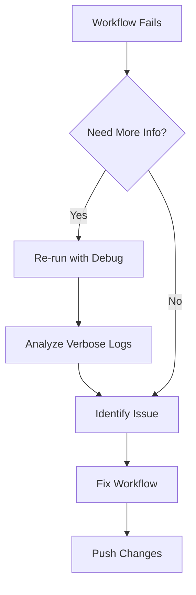

# How to Debug GitHub Actions Workflow Failures

Author: [nawazdhandala](https://www.github.com/nawazdhandala)

Tags: GitHub Actions, CI/CD, Debugging, Troubleshooting, DevOps, Logging

Description: Learn effective techniques for debugging failed GitHub Actions workflows, including enabling debug logging, using artifacts, SSH access, step debugging, and common failure patterns with their solutions.

---

Workflow failures are inevitable. Tests pass locally but fail in CI. Builds break mysteriously. Deployments time out. Debugging these issues requires different strategies than local development. Here's how to efficiently diagnose and fix GitHub Actions failures.

## Enable Debug Logging

GitHub Actions provides two levels of debug logging:

### Step Debug Logging

Enable verbose output for all steps:

1. Go to Settings > Secrets and variables > Actions
2. Add repository variable: `ACTIONS_STEP_DEBUG` = `true`

Or enable for a single run:

```yaml
env:
  ACTIONS_STEP_DEBUG: true
```

### Runner Diagnostic Logging

Get detailed runner-level logs:

1. Add secret: `ACTIONS_RUNNER_DEBUG` = `true`

Re-run the workflow to see enhanced logging.

## Re-run with Debug Logging

For quick debugging without changing settings:

1. Go to the failed workflow run
2. Click "Re-run jobs"
3. Check "Enable debug logging"
4. Click "Re-run jobs"



## Dump Context Information

Print GitHub context for debugging:

```yaml
      - name: Dump GitHub context
        env:
          GITHUB_CONTEXT: ${{ toJson(github) }}
        run: echo "$GITHUB_CONTEXT"

      - name: Dump job context
        env:
          JOB_CONTEXT: ${{ toJson(job) }}
        run: echo "$JOB_CONTEXT"

      - name: Dump steps context
        env:
          STEPS_CONTEXT: ${{ toJson(steps) }}
        run: echo "$STEPS_CONTEXT"

      - name: Dump runner context
        env:
          RUNNER_CONTEXT: ${{ toJson(runner) }}
        run: echo "$RUNNER_CONTEXT"
```

## Upload Artifacts for Analysis

Save logs, reports, and state for post-run analysis:

```yaml
      - name: Run tests
        id: test
        continue-on-error: true
        run: npm test 2>&1 | tee test-output.log

      - name: Upload test logs
        if: always()
        uses: actions/upload-artifact@v4
        with:
          name: test-logs
          path: |
            test-output.log
            coverage/
            junit-report.xml
          retention-days: 5

      - name: Fail if tests failed
        if: steps.test.outcome == 'failure'
        run: exit 1
```

Upload screenshots on E2E failure:

```yaml
      - name: Run E2E tests
        continue-on-error: true
        run: npm run test:e2e

      - name: Upload screenshots
        if: failure()
        uses: actions/upload-artifact@v4
        with:
          name: e2e-screenshots
          path: |
            test-results/
            playwright-report/
```

## SSH Debug Access

For complex issues, SSH into the runner:

```yaml
      - name: Setup tmate session
        if: failure()
        uses: mxschmitt/action-tmate@v3
        timeout-minutes: 15
```

This pauses the workflow and provides SSH access. Connect with the displayed command and debug interactively.

For security, limit who can connect:

```yaml
      - uses: mxschmitt/action-tmate@v3
        if: failure()
        with:
          limit-access-to-actor: true
```

## Common Failure Patterns

### 1. Environment Differences

Tests pass locally but fail in CI:

```yaml
      - name: Debug environment
        run: |
          echo "Node version: $(node --version)"
          echo "npm version: $(npm --version)"
          echo "OS: $(uname -a)"
          echo "Working directory: $(pwd)"
          echo "Files: $(ls -la)"
          env | sort
```

### 2. Timing Issues

Tests that depend on timing:

```yaml
      - name: Run flaky test with retries
        uses: nick-fields/retry@v2
        with:
          timeout_minutes: 10
          max_attempts: 3
          command: npm test -- --testNamePattern="flaky test"
```

### 3. Resource Exhaustion

Out of memory or disk space:

```yaml
      - name: Check resources before
        run: |
          echo "Memory:"
          free -h
          echo "Disk:"
          df -h

      - name: Build with memory limit
        run: NODE_OPTIONS="--max-old-space-size=4096" npm run build

      - name: Check resources after
        if: always()
        run: |
          free -h
          df -h
```

### 4. Network Failures

External services unavailable:

```yaml
      - name: Test with retry on network failure
        run: |
          for i in 1 2 3; do
            npm test && break
            echo "Attempt $i failed, retrying..."
            sleep 10
          done
```

### 5. Permission Issues

```yaml
      - name: Check permissions
        run: |
          echo "Current user: $(whoami)"
          echo "Script permissions: $(ls -la ./scripts/)"

      - name: Fix permissions
        run: chmod +x ./scripts/*.sh
```

## Step-Level Debugging

Add debugging to specific steps:

```yaml
      - name: Install dependencies
        id: install
        run: |
          echo "::group::npm ci output"
          npm ci 2>&1
          echo "::endgroup::"

          echo "::group::Installed packages"
          npm list --depth=0
          echo "::endgroup::"
```

Use `::group::` and `::endgroup::` to organize output.

## Conditional Debug Steps

Run debug steps only on failure:

```yaml
      - name: Run tests
        id: test
        run: npm test

      - name: Debug on failure
        if: failure() && steps.test.outcome == 'failure'
        run: |
          echo "Test failed, gathering debug info..."
          cat npm-debug.log 2>/dev/null || echo "No npm debug log"
          cat test-results.json 2>/dev/null || echo "No test results"
```

## Workflow Annotations

Add warnings and errors visible in PR checks:

```yaml
      - name: Lint with annotations
        run: |
          npm run lint 2>&1 | while read line; do
            if [[ "$line" == *"error"* ]]; then
              echo "::error::$line"
            elif [[ "$line" == *"warning"* ]]; then
              echo "::warning::$line"
            fi
          done
```

## Job Summaries

Create detailed summaries for failed runs:

```yaml
      - name: Create failure summary
        if: failure()
        run: |
          echo "## Test Failure Summary" >> $GITHUB_STEP_SUMMARY
          echo "" >> $GITHUB_STEP_SUMMARY
          echo "### Failed Tests" >> $GITHUB_STEP_SUMMARY
          echo "\`\`\`" >> $GITHUB_STEP_SUMMARY
          cat test-failures.txt >> $GITHUB_STEP_SUMMARY
          echo "\`\`\`" >> $GITHUB_STEP_SUMMARY
          echo "" >> $GITHUB_STEP_SUMMARY
          echo "### Environment" >> $GITHUB_STEP_SUMMARY
          echo "- Node: $(node --version)" >> $GITHUB_STEP_SUMMARY
          echo "- npm: $(npm --version)" >> $GITHUB_STEP_SUMMARY
```

## Debug Matrix Builds

Identify which matrix combination failed:

```yaml
jobs:
  test:
    runs-on: ${{ matrix.os }}
    strategy:
      fail-fast: false
      matrix:
        os: [ubuntu-latest, windows-latest]
        node: [18, 20]

    steps:
      - name: Debug matrix info
        run: |
          echo "OS: ${{ matrix.os }}"
          echo "Node: ${{ matrix.node }}"
          echo "Runner: ${{ runner.os }}"

      - name: Run tests
        run: npm test

      - name: Upload failure artifact
        if: failure()
        uses: actions/upload-artifact@v4
        with:
          name: failure-${{ matrix.os }}-node${{ matrix.node }}
          path: test-output/
```

## Timeout Debugging

Identify stuck steps:

```yaml
      - name: Long running step
        timeout-minutes: 10
        run: |
          echo "Starting at $(date)"
          npm run build
          echo "Finished at $(date)"
```

Add periodic status output:

```yaml
      - name: Build with progress
        run: |
          npm run build &
          PID=$!
          while kill -0 $PID 2>/dev/null; do
            echo "Still building... $(date)"
            sleep 30
          done
          wait $PID
```

## Best Practices

1. **Always use `if: always()` for artifact uploads**: Ensure debug info is captured
2. **Set appropriate timeouts**: Prevent stuck workflows from running forever
3. **Use `continue-on-error` strategically**: Capture more information before failing
4. **Add context to error messages**: Include matrix values, step names
5. **Clean up debug settings**: Remove verbose logging after fixing issues

```yaml
      - name: Test with comprehensive debugging
        id: test
        continue-on-error: true
        run: |
          echo "Starting tests at $(date)"
          npm test 2>&1 | tee test.log
          echo "Exit code: $?"

      - name: Upload debug artifacts
        if: always()
        uses: actions/upload-artifact@v4
        with:
          name: debug-${{ github.run_id }}
          path: |
            test.log
            *.log
            coverage/

      - name: Check test result
        if: steps.test.outcome == 'failure'
        run: |
          echo "::error::Tests failed. Check uploaded artifacts for details."
          exit 1
```

---

Effective debugging transforms frustrating CI failures into solvable problems. Start with debug logging, use artifacts to preserve evidence, and SSH in for complex issues. Most failures fall into predictable patterns - environment differences, timing, resources, or permissions. Recognize the pattern and you're halfway to the fix.
