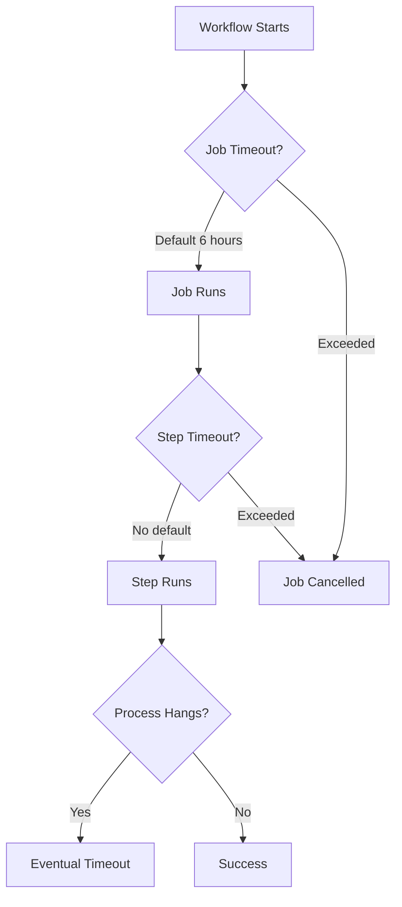

# How to Debug 'Action timed out' Issues in GitHub Actions

Author: [nawazdhandala](https://www.github.com/nawazdhandala)

Tags: GitHub Actions, CI/CD, Debugging, Troubleshooting, Performance, DevOps

Description: Learn how to diagnose and fix timeout issues in GitHub Actions, from identifying slow steps to optimizing workflows and handling hung processes.

---

Workflow timeouts are frustrating - your CI fails without useful error messages, and you're left guessing what went wrong. This guide helps you diagnose timeout causes and implement fixes to keep your workflows fast and reliable.

## Understanding Timeout Types

GitHub Actions has multiple timeout levels:



Default timeouts:
- **Workflow**: No default (can run indefinitely until job limit)
- **Job**: 6 hours (360 minutes)
- **Step**: No default (inherits from job)

## Setting Explicit Timeouts

Always set explicit timeouts to fail fast:

```yaml
jobs:
  build:
    runs-on: ubuntu-latest
    timeout-minutes: 30  # Job timeout

    steps:
      - uses: actions/checkout@v4

      - name: Install dependencies
        timeout-minutes: 5  # Step timeout
        run: npm ci

      - name: Run tests
        timeout-minutes: 15
        run: npm test

      - name: Build
        timeout-minutes: 10
        run: npm run build
```

## Identifying Slow Steps

### Using Workflow Timing

GitHub shows duration for each step in the Actions UI. For programmatic analysis:

```yaml
      - name: Capture timing
        run: |
          echo "Step started at $(date -u +%Y-%m-%dT%H:%M:%SZ)"
          # Your actual command
          npm test
          echo "Step ended at $(date -u +%Y-%m-%dT%H:%M:%SZ)"
```

### Profiling Long-Running Commands

```yaml
      - name: Profile test execution
        run: |
          # Use time to measure command duration
          time npm test

          # For more detail, use timing per test file
          npm test -- --verbose --reporter=spec 2>&1 | tee test-output.log

      - name: Upload timing analysis
        if: always()
        uses: actions/upload-artifact@v4
        with:
          name: test-timing
          path: test-output.log
```

## Common Timeout Causes and Fixes

### 1. Hung Processes

Processes waiting for input or stuck in infinite loops:

```yaml
      - name: Run command with timeout
        run: |
          # Use timeout command to kill hung processes
          timeout 300 npm test || {
            echo "Test command timed out after 5 minutes"
            # Capture diagnostic information
            ps aux
            exit 1
          }
```

### 2. Network Operations Hanging

External services timing out or being unreachable:

```yaml
      - name: Download with retry and timeout
        run: |
          # Use curl with timeouts
          curl --connect-timeout 10 \
               --max-time 60 \
               --retry 3 \
               --retry-delay 5 \
               -o file.zip \
               https://example.com/large-file.zip

      - name: npm install with timeout
        run: |
          # Set npm timeouts
          npm config set fetch-timeout 60000
          npm config set fetch-retries 3
          npm ci
```

### 3. Docker Operations

Docker pulls and builds can hang:

```yaml
      - name: Pull image with timeout
        timeout-minutes: 10
        run: |
          # Add timeout to docker pull
          timeout 300 docker pull large-image:latest || {
            echo "Docker pull timed out"
            docker images
            exit 1
          }

      - name: Build with progress
        run: |
          # Use --progress=plain to see what's happening
          docker build --progress=plain -t myapp .
```

### 4. Service Container Startup

Services not becoming healthy:

```yaml
    services:
      postgres:
        image: postgres:15
        options: >-
          --health-cmd pg_isready
          --health-interval 5s
          --health-timeout 5s
          --health-retries 10
          --health-start-period 30s

    steps:
      - name: Wait for services with timeout
        timeout-minutes: 2
        run: |
          until pg_isready -h localhost -p 5432; do
            echo "Waiting for postgres..."
            sleep 2
          done
          echo "PostgreSQL is ready"
```

### 5. Interactive Prompts

Commands waiting for user input:

```yaml
      - name: Run non-interactively
        run: |
          # Force non-interactive mode
          export DEBIAN_FRONTEND=noninteractive
          sudo apt-get install -y package-name

          # For npm, use --yes flag
          npm init -y

          # For git, configure to not prompt
          git config --global user.email "ci@example.com"
          git config --global user.name "CI"
```

## Debugging Hung Workflows

### Adding Debug Output

```yaml
      - name: Debug step
        if: runner.debug == '1'
        run: |
          echo "Environment variables:"
          env | sort
          echo "---"
          echo "Disk space:"
          df -h
          echo "---"
          echo "Memory:"
          free -m
          echo "---"
          echo "Running processes:"
          ps aux --sort=-%mem | head -20
```

### Using SSH Debug Access

For interactive debugging, use tmate:

```yaml
      - name: Setup tmate session
        if: failure()
        uses: mxschmitt/action-tmate@v3
        timeout-minutes: 15
        with:
          limit-access-to-actor: true
```

This gives you SSH access to inspect the runner state.

### Capturing State on Timeout

```yaml
      - name: Run tests
        id: tests
        timeout-minutes: 10
        continue-on-error: true
        run: npm test

      - name: Capture debug info on failure
        if: steps.tests.outcome == 'failure'
        run: |
          echo "=== Process List ===" >> debug.log
          ps aux >> debug.log
          echo "=== Network Connections ===" >> debug.log
          netstat -an >> debug.log 2>/dev/null || ss -an >> debug.log
          echo "=== Disk Usage ===" >> debug.log
          df -h >> debug.log
          echo "=== Memory ===" >> debug.log
          free -m >> debug.log

      - name: Upload debug info
        if: steps.tests.outcome == 'failure'
        uses: actions/upload-artifact@v4
        with:
          name: debug-info
          path: debug.log

      - name: Fail if tests failed
        if: steps.tests.outcome == 'failure'
        run: exit 1
```

## Optimizing Slow Workflows

### Parallelizing Jobs

Split work across parallel jobs:

```yaml
jobs:
  test-unit:
    runs-on: ubuntu-latest
    timeout-minutes: 10
    steps:
      - uses: actions/checkout@v4
      - run: npm test -- --grep "unit"

  test-integration:
    runs-on: ubuntu-latest
    timeout-minutes: 15
    steps:
      - uses: actions/checkout@v4
      - run: npm test -- --grep "integration"

  test-e2e:
    runs-on: ubuntu-latest
    timeout-minutes: 20
    steps:
      - uses: actions/checkout@v4
      - run: npm run test:e2e
```

### Caching Dependencies

```yaml
      - name: Cache node modules
        uses: actions/cache@v4
        with:
          path: ~/.npm
          key: ${{ runner.os }}-npm-${{ hashFiles('package-lock.json') }}
          restore-keys: |
            ${{ runner.os }}-npm-

      - name: Install dependencies
        timeout-minutes: 5
        run: npm ci
```

### Using Larger Runners

For compute-intensive tasks:

```yaml
jobs:
  build:
    runs-on: ubuntu-latest-4-cores  # Larger runner
    timeout-minutes: 15
    steps:
      - uses: actions/checkout@v4
      - run: npm run build
```

## Handling Flaky Timeouts

### Retry Logic

```yaml
      - name: Run flaky command with retry
        uses: nick-fields/retry@v2
        with:
          timeout_minutes: 5
          max_attempts: 3
          retry_wait_seconds: 30
          command: npm test
```

### Conditional Timeout Extension

```yaml
      - name: Run tests
        timeout-minutes: ${{ github.event_name == 'schedule' ? 30 : 15 }}
        run: npm test
```

## Monitoring and Alerting

Track timeout trends:

```yaml
      - name: Report workflow timing
        if: always()
        run: |
          curl -X POST ${{ secrets.METRICS_WEBHOOK }} \
            -H 'Content-type: application/json' \
            -d '{
              "workflow": "${{ github.workflow }}",
              "job": "${{ github.job }}",
              "status": "${{ job.status }}",
              "duration_seconds": "${{ github.run_attempt }}",
              "repository": "${{ github.repository }}"
            }'
```

## Prevention Checklist

1. **Set explicit timeouts** on jobs and long-running steps
2. **Use timeout command** for shell commands that might hang
3. **Configure network timeouts** for curl, wget, npm, etc.
4. **Add health checks** to service containers with reasonable timeouts
5. **Avoid interactive commands** - use non-interactive flags
6. **Cache dependencies** to reduce download times
7. **Parallelize** where possible
8. **Monitor trends** to catch degradation early

## Summary

Timeout issues in GitHub Actions typically stem from:

- Processes waiting for input
- Network operations hanging
- Service containers not starting
- Inefficient test suites
- Resource exhaustion

Debug by adding explicit timeouts, capturing diagnostic information on failure, and using tools like tmate for interactive debugging. Prevent future issues by setting appropriate timeouts, caching dependencies, and parallelizing work across multiple jobs.
