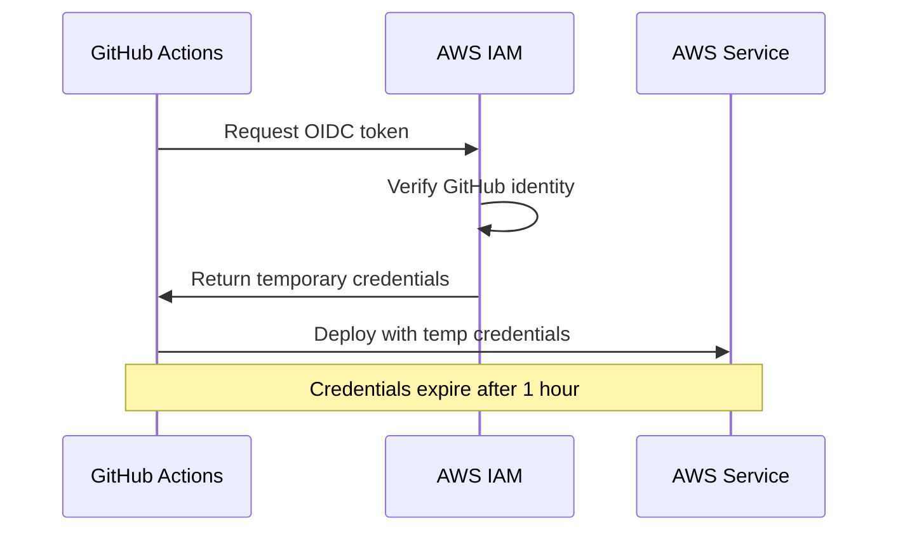

# How to Deploy to AWS from GitHub Actions

Author: [nawazdhandala](https://www.github.com/nawazdhandala)

Tags: GitHub Actions, AWS, CI/CD, Deployment, OIDC, CloudFormation, ECS, S3

Description: Learn how to deploy applications to AWS from GitHub Actions using OIDC authentication, including deployments to S3, ECS, Lambda, and EC2 with best practices for secure, automated cloud deployments.

---

Deploying to AWS from GitHub Actions enables fully automated cloud deployments. The key is secure authentication without storing long-lived credentials. AWS and GitHub support OpenID Connect (OIDC), letting your workflows assume IAM roles without access keys.

## OIDC vs Access Keys

Traditional approach (avoid this):

```yaml
# DON'T DO THIS - stores long-lived credentials
- uses: aws-actions/configure-aws-credentials@v4
  with:
    aws-access-key-id: ${{ secrets.AWS_ACCESS_KEY_ID }}
    aws-secret-access-key: ${{ secrets.AWS_SECRET_ACCESS_KEY }}
```

Modern OIDC approach (recommended):

```yaml
# DO THIS - no stored credentials
- uses: aws-actions/configure-aws-credentials@v4
  with:
    role-to-assume: arn:aws:iam::123456789012:role/GitHubActionsRole
    aws-region: us-east-1
```



## Setting Up OIDC in AWS

### 1. Create Identity Provider

```bash
aws iam create-open-id-connect-provider \
  --url https://token.actions.githubusercontent.com \
  --client-id-list sts.amazonaws.com \
  --thumbprint-list 6938fd4d98bab03faadb97b34396831e3780aea1
```

### 2. Create IAM Role

Create a trust policy:

```json
{
  "Version": "2012-10-17",
  "Statement": [
    {
      "Effect": "Allow",
      "Principal": {
        "Federated": "arn:aws:iam::123456789012:oidc-provider/token.actions.githubusercontent.com"
      },
      "Action": "sts:AssumeRoleWithWebIdentity",
      "Condition": {
        "StringEquals": {
          "token.actions.githubusercontent.com:aud": "sts.amazonaws.com"
        },
        "StringLike": {
          "token.actions.githubusercontent.com:sub": "repo:your-org/your-repo:*"
        }
      }
    }
  ]
}
```

Create the role:

```bash
aws iam create-role \
  --role-name GitHubActionsRole \
  --assume-role-policy-document file://trust-policy.json
```

### 3. Attach Permissions

```bash
aws iam attach-role-policy \
  --role-name GitHubActionsRole \
  --policy-arn arn:aws:iam::aws:policy/AmazonS3FullAccess
```

## Deploy to S3

Deploy a static website to S3:

```yaml
name: Deploy to S3

on:
  push:
    branches: [main]

permissions:
  id-token: write
  contents: read

jobs:
  deploy:
    runs-on: ubuntu-latest
    steps:
      - uses: actions/checkout@v4

      - name: Configure AWS credentials
        uses: aws-actions/configure-aws-credentials@v4
        with:
          role-to-assume: arn:aws:iam::123456789012:role/GitHubActionsRole
          aws-region: us-east-1

      - name: Build site
        run: npm ci && npm run build

      - name: Sync to S3
        run: |
          aws s3 sync ./dist s3://my-website-bucket \
            --delete \
            --cache-control "max-age=31536000"

      - name: Invalidate CloudFront
        run: |
          aws cloudfront create-invalidation \
            --distribution-id ${{ vars.CLOUDFRONT_DIST_ID }} \
            --paths "/*"
```

## Deploy to ECS

Deploy a containerized application to ECS:

```yaml
name: Deploy to ECS

on:
  push:
    branches: [main]

permissions:
  id-token: write
  contents: read

env:
  AWS_REGION: us-east-1
  ECR_REPOSITORY: my-app
  ECS_SERVICE: my-service
  ECS_CLUSTER: my-cluster
  CONTAINER_NAME: my-container

jobs:
  deploy:
    runs-on: ubuntu-latest
    steps:
      - uses: actions/checkout@v4

      - name: Configure AWS credentials
        uses: aws-actions/configure-aws-credentials@v4
        with:
          role-to-assume: arn:aws:iam::123456789012:role/GitHubActionsECSRole
          aws-region: ${{ env.AWS_REGION }}

      - name: Login to ECR
        id: login-ecr
        uses: aws-actions/amazon-ecr-login@v2

      - name: Build and push image
        id: build-image
        env:
          ECR_REGISTRY: ${{ steps.login-ecr.outputs.registry }}
          IMAGE_TAG: ${{ github.sha }}
        run: |
          docker build -t $ECR_REGISTRY/$ECR_REPOSITORY:$IMAGE_TAG .
          docker push $ECR_REGISTRY/$ECR_REPOSITORY:$IMAGE_TAG
          echo "image=$ECR_REGISTRY/$ECR_REPOSITORY:$IMAGE_TAG" >> $GITHUB_OUTPUT

      - name: Download task definition
        run: |
          aws ecs describe-task-definition \
            --task-definition my-task \
            --query taskDefinition > task-definition.json

      - name: Update task definition
        id: task-def
        uses: aws-actions/amazon-ecs-render-task-definition@v1
        with:
          task-definition: task-definition.json
          container-name: ${{ env.CONTAINER_NAME }}
          image: ${{ steps.build-image.outputs.image }}

      - name: Deploy to ECS
        uses: aws-actions/amazon-ecs-deploy-task-definition@v1
        with:
          task-definition: ${{ steps.task-def.outputs.task-definition }}
          service: ${{ env.ECS_SERVICE }}
          cluster: ${{ env.ECS_CLUSTER }}
          wait-for-service-stability: true
```

## Deploy Lambda Function

Deploy a serverless function:

```yaml
name: Deploy Lambda

on:
  push:
    branches: [main]

permissions:
  id-token: write
  contents: read

jobs:
  deploy:
    runs-on: ubuntu-latest
    steps:
      - uses: actions/checkout@v4

      - name: Setup Node.js
        uses: actions/setup-node@v4
        with:
          node-version: 20

      - name: Install and build
        run: |
          npm ci
          npm run build

      - name: Configure AWS credentials
        uses: aws-actions/configure-aws-credentials@v4
        with:
          role-to-assume: arn:aws:iam::123456789012:role/GitHubActionsLambdaRole
          aws-region: us-east-1

      - name: Package Lambda
        run: |
          cd dist
          zip -r ../lambda.zip .

      - name: Deploy Lambda
        run: |
          aws lambda update-function-code \
            --function-name my-function \
            --zip-file fileb://lambda.zip

      - name: Wait for update
        run: |
          aws lambda wait function-updated \
            --function-name my-function
```

## Deploy with CloudFormation

Infrastructure as code deployment:

```yaml
name: Deploy Infrastructure

on:
  push:
    branches: [main]
    paths:
      - 'infrastructure/**'

permissions:
  id-token: write
  contents: read

jobs:
  deploy:
    runs-on: ubuntu-latest
    steps:
      - uses: actions/checkout@v4

      - name: Configure AWS credentials
        uses: aws-actions/configure-aws-credentials@v4
        with:
          role-to-assume: arn:aws:iam::123456789012:role/GitHubActionsCloudFormationRole
          aws-region: us-east-1

      - name: Deploy CloudFormation stack
        uses: aws-actions/aws-cloudformation-github-deploy@v1
        with:
          name: my-stack
          template: infrastructure/template.yaml
          parameter-overrides: |
            Environment=production
            InstanceType=t3.medium
          capabilities: CAPABILITY_IAM,CAPABILITY_NAMED_IAM
          no-fail-on-empty-changeset: true
```

## Environment-Based Deployments

Deploy to different environments:

```yaml
name: Deploy

on:
  push:
    branches: [main, develop]

jobs:
  deploy:
    runs-on: ubuntu-latest
    permissions:
      id-token: write
      contents: read

    environment: ${{ github.ref == 'refs/heads/main' && 'production' || 'staging' }}

    steps:
      - uses: actions/checkout@v4

      - name: Configure AWS credentials
        uses: aws-actions/configure-aws-credentials@v4
        with:
          role-to-assume: ${{ vars.AWS_ROLE_ARN }}
          aws-region: ${{ vars.AWS_REGION }}

      - name: Deploy
        run: |
          echo "Deploying to ${{ github.ref == 'refs/heads/main' && 'production' || 'staging' }}"
          aws s3 sync ./dist s3://${{ vars.S3_BUCKET }}
```

## Blue-Green Deployment

Zero-downtime deployment pattern:

```yaml
      - name: Deploy green environment
        run: |
          aws ecs update-service \
            --cluster my-cluster \
            --service my-service-green \
            --task-definition my-task:${{ steps.task-def.outputs.revision }}

          aws ecs wait services-stable \
            --cluster my-cluster \
            --services my-service-green

      - name: Run smoke tests
        run: |
          curl -f https://green.myapp.com/health || exit 1

      - name: Switch traffic
        run: |
          aws elbv2 modify-listener \
            --listener-arn ${{ vars.LISTENER_ARN }} \
            --default-actions Type=forward,TargetGroupArn=${{ vars.GREEN_TG_ARN }}
```

## Rollback on Failure

Implement automatic rollback:

```yaml
      - name: Deploy
        id: deploy
        continue-on-error: true
        run: |
          aws ecs update-service \
            --cluster my-cluster \
            --service my-service \
            --task-definition my-task:${{ steps.task-def.outputs.revision }}

          aws ecs wait services-stable \
            --cluster my-cluster \
            --services my-service

      - name: Rollback on failure
        if: steps.deploy.outcome == 'failure'
        run: |
          PREVIOUS_TASK=$(aws ecs describe-services \
            --cluster my-cluster \
            --services my-service \
            --query 'services[0].deployments[1].taskDefinition' \
            --output text)

          aws ecs update-service \
            --cluster my-cluster \
            --service my-service \
            --task-definition $PREVIOUS_TASK
```

## Security Best Practices

1. **Use OIDC**: Never store long-lived AWS credentials
2. **Least privilege**: Grant only needed permissions
3. **Restrict role assumption**: Limit by repo, branch, and environment
4. **Use environments**: Require approval for production
5. **Audit deployments**: Enable CloudTrail logging

Restrict role to specific branch:

```json
{
  "Condition": {
    "StringEquals": {
      "token.actions.githubusercontent.com:sub": "repo:your-org/your-repo:ref:refs/heads/main"
    }
  }
}
```

---

AWS deployments from GitHub Actions combine security with automation. OIDC eliminates credential management risks while enabling deployments to any AWS service. Start with S3 for static sites, then expand to ECS, Lambda, or full CloudFormation infrastructure as your needs grow.
