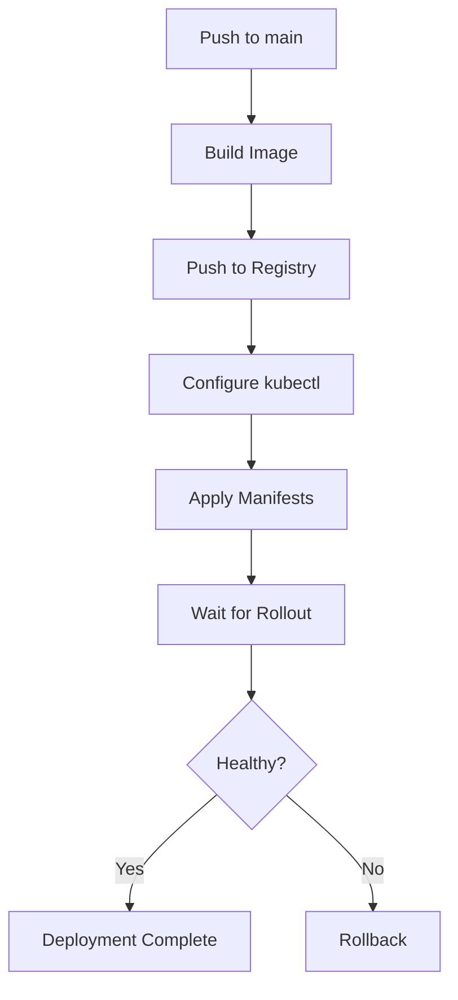

# How to Deploy to Kubernetes from GitHub Actions

Author: [nawazdhandala](https://www.github.com/nawazdhandala)

Tags: GitHub Actions, Kubernetes, CI/CD, Deployment, GitOps, Helm, kubectl

Description: Learn how to deploy applications to Kubernetes clusters from GitHub Actions, including kubectl configuration, Helm deployments, GitOps with ArgoCD, and best practices for secure, reliable Kubernetes CI/CD.

---

Kubernetes deployments from GitHub Actions enable automated, consistent releases. Whether you're deploying to a managed cluster like GKE, EKS, or AKS, or a self-hosted cluster, the fundamentals are the same: authenticate, apply manifests, and verify the rollout.

## Basic kubectl Deployment

The simplest approach uses kubectl directly:

```yaml
name: Deploy to Kubernetes

on:
  push:
    branches: [main]

jobs:
  deploy:
    runs-on: ubuntu-latest
    steps:
      - uses: actions/checkout@v4

      - name: Set up kubectl
        uses: azure/setup-kubectl@v3
        with:
          version: 'v1.29.0'

      - name: Configure kubectl
        run: |
          mkdir -p ~/.kube
          echo "${{ secrets.KUBECONFIG }}" | base64 -d > ~/.kube/config

      - name: Deploy
        run: |
          kubectl apply -f k8s/
          kubectl rollout status deployment/myapp -n production
```



## Deploy to GKE (Google Kubernetes Engine)

Use OIDC authentication with GKE:

```yaml
name: Deploy to GKE

on:
  push:
    branches: [main]

permissions:
  id-token: write
  contents: read

jobs:
  deploy:
    runs-on: ubuntu-latest
    steps:
      - uses: actions/checkout@v4

      - name: Authenticate to Google Cloud
        uses: google-github-actions/auth@v2
        with:
          workload_identity_provider: projects/123456789/locations/global/workloadIdentityPools/github-pool/providers/github-provider
          service_account: github-actions@myproject.iam.gserviceaccount.com

      - name: Set up Cloud SDK
        uses: google-github-actions/setup-gcloud@v2

      - name: Get GKE credentials
        uses: google-github-actions/get-gke-credentials@v2
        with:
          cluster_name: my-cluster
          location: us-central1

      - name: Deploy to GKE
        run: |
          kubectl apply -f k8s/
          kubectl rollout status deployment/myapp
```

## Deploy to EKS (Amazon Elastic Kubernetes Service)

Configure AWS and EKS access:

```yaml
name: Deploy to EKS

on:
  push:
    branches: [main]

permissions:
  id-token: write
  contents: read

jobs:
  deploy:
    runs-on: ubuntu-latest
    steps:
      - uses: actions/checkout@v4

      - name: Configure AWS credentials
        uses: aws-actions/configure-aws-credentials@v4
        with:
          role-to-assume: arn:aws:iam::123456789012:role/GitHubActionsEKS
          aws-region: us-east-1

      - name: Update kubeconfig
        run: |
          aws eks update-kubeconfig \
            --region us-east-1 \
            --name my-cluster

      - name: Deploy
        run: |
          kubectl apply -f k8s/
          kubectl rollout status deployment/myapp
```

## Deploy to AKS (Azure Kubernetes Service)

Azure authentication and AKS deployment:

```yaml
name: Deploy to AKS

on:
  push:
    branches: [main]

permissions:
  id-token: write
  contents: read

jobs:
  deploy:
    runs-on: ubuntu-latest
    steps:
      - uses: actions/checkout@v4

      - name: Azure login
        uses: azure/login@v2
        with:
          client-id: ${{ secrets.AZURE_CLIENT_ID }}
          tenant-id: ${{ secrets.AZURE_TENANT_ID }}
          subscription-id: ${{ secrets.AZURE_SUBSCRIPTION_ID }}

      - name: Set AKS context
        uses: azure/aks-set-context@v3
        with:
          resource-group: my-resource-group
          cluster-name: my-aks-cluster

      - name: Deploy
        run: |
          kubectl apply -f k8s/
          kubectl rollout status deployment/myapp
```

## Helm Deployments

Use Helm for templated deployments:

```yaml
name: Helm Deploy

on:
  push:
    branches: [main]

jobs:
  deploy:
    runs-on: ubuntu-latest
    steps:
      - uses: actions/checkout@v4

      - name: Set up Helm
        uses: azure/setup-helm@v3
        with:
          version: 'v3.14.0'

      - name: Configure kubectl
        run: |
          mkdir -p ~/.kube
          echo "${{ secrets.KUBECONFIG }}" | base64 -d > ~/.kube/config

      - name: Deploy with Helm
        run: |
          helm upgrade --install myapp ./helm/myapp \
            --namespace production \
            --set image.tag=${{ github.sha }} \
            --set replicas=3 \
            --wait \
            --timeout 5m
```

With values files per environment:

```yaml
      - name: Deploy to environment
        run: |
          helm upgrade --install myapp ./helm/myapp \
            --namespace ${{ github.ref == 'refs/heads/main' && 'production' || 'staging' }} \
            --values ./helm/myapp/values-${{ github.ref == 'refs/heads/main' && 'prod' || 'staging' }}.yaml \
            --set image.tag=${{ github.sha }} \
            --wait
```

## Kustomize Deployments

Use Kustomize for environment-specific overlays:

```yaml
name: Kustomize Deploy

on:
  push:
    branches: [main, develop]

jobs:
  deploy:
    runs-on: ubuntu-latest
    steps:
      - uses: actions/checkout@v4

      - name: Set up kubectl
        uses: azure/setup-kubectl@v3

      - name: Configure kubectl
        run: |
          mkdir -p ~/.kube
          echo "${{ secrets.KUBECONFIG }}" | base64 -d > ~/.kube/config

      - name: Set environment
        id: env
        run: |
          if [ "${{ github.ref }}" == "refs/heads/main" ]; then
            echo "overlay=production" >> $GITHUB_OUTPUT
          else
            echo "overlay=staging" >> $GITHUB_OUTPUT
          fi

      - name: Deploy with Kustomize
        run: |
          kubectl apply -k k8s/overlays/${{ steps.env.outputs.overlay }}
          kubectl rollout status deployment/myapp -n ${{ steps.env.outputs.overlay }}
```

## GitOps with ArgoCD

Trigger ArgoCD sync from GitHub Actions:

```yaml
name: GitOps Deploy

on:
  push:
    branches: [main]

jobs:
  update-manifests:
    runs-on: ubuntu-latest
    steps:
      - uses: actions/checkout@v4
        with:
          repository: myorg/k8s-manifests
          token: ${{ secrets.MANIFEST_REPO_TOKEN }}

      - name: Update image tag
        run: |
          cd apps/myapp/production
          kustomize edit set image myapp=ghcr.io/myorg/myapp:${{ github.sha }}

      - name: Commit and push
        run: |
          git config user.name "GitHub Actions"
          git config user.email "actions@github.com"
          git add .
          git commit -m "Update myapp to ${{ github.sha }}"
          git push

  sync-argocd:
    needs: update-manifests
    runs-on: ubuntu-latest
    steps:
      - name: Trigger ArgoCD sync
        run: |
          argocd app sync myapp --server ${{ secrets.ARGOCD_SERVER }} \
            --auth-token ${{ secrets.ARGOCD_TOKEN }} \
            --grpc-web
```

## Blue-Green Deployment

Implement blue-green deployments:

```yaml
      - name: Deploy green version
        run: |
          # Update green deployment
          kubectl set image deployment/myapp-green \
            myapp=ghcr.io/myorg/myapp:${{ github.sha }} \
            -n production

          # Wait for green to be ready
          kubectl rollout status deployment/myapp-green -n production

      - name: Test green deployment
        run: |
          GREEN_IP=$(kubectl get svc myapp-green -n production -o jsonpath='{.status.loadBalancer.ingress[0].ip}')
          curl -f http://$GREEN_IP/health

      - name: Switch traffic to green
        run: |
          kubectl patch svc myapp -n production \
            -p '{"spec":{"selector":{"version":"green"}}}'

      - name: Scale down blue
        run: |
          kubectl scale deployment/myapp-blue --replicas=0 -n production
```

## Canary Deployments

Gradual rollout with canary:

```yaml
      - name: Deploy canary
        run: |
          # Deploy canary with 10% traffic
          kubectl apply -f k8s/canary.yaml
          kubectl set image deployment/myapp-canary \
            myapp=ghcr.io/myorg/myapp:${{ github.sha }}

      - name: Monitor canary
        run: |
          # Wait and check error rates
          sleep 300
          ERROR_RATE=$(kubectl top pods -l version=canary --no-headers | awk '{print $3}')
          if [ "$ERROR_RATE" -gt "5" ]; then
            echo "Canary error rate too high, rolling back"
            kubectl delete -f k8s/canary.yaml
            exit 1
          fi

      - name: Promote canary
        run: |
          kubectl set image deployment/myapp \
            myapp=ghcr.io/myorg/myapp:${{ github.sha }}
          kubectl rollout status deployment/myapp
          kubectl delete -f k8s/canary.yaml
```

## Rollback on Failure

Automatic rollback when deployment fails:

```yaml
      - name: Deploy
        id: deploy
        continue-on-error: true
        run: |
          kubectl set image deployment/myapp \
            myapp=ghcr.io/myorg/myapp:${{ github.sha }}
          kubectl rollout status deployment/myapp --timeout=5m

      - name: Rollback on failure
        if: steps.deploy.outcome == 'failure'
        run: |
          echo "Deployment failed, rolling back..."
          kubectl rollout undo deployment/myapp
          kubectl rollout status deployment/myapp
          exit 1
```

## Multi-Cluster Deployment

Deploy to multiple clusters:

```yaml
jobs:
  deploy:
    runs-on: ubuntu-latest
    strategy:
      matrix:
        cluster:
          - name: us-east
            kubeconfig: KUBECONFIG_US_EAST
          - name: us-west
            kubeconfig: KUBECONFIG_US_WEST
          - name: eu-west
            kubeconfig: KUBECONFIG_EU_WEST

    steps:
      - uses: actions/checkout@v4

      - name: Configure kubectl for ${{ matrix.cluster.name }}
        run: |
          mkdir -p ~/.kube
          echo "${{ secrets[matrix.cluster.kubeconfig] }}" | base64 -d > ~/.kube/config

      - name: Deploy to ${{ matrix.cluster.name }}
        run: |
          kubectl apply -f k8s/
          kubectl rollout status deployment/myapp
```

## Security Best Practices

1. **Use OIDC authentication**: Avoid storing long-lived kubeconfig secrets
2. **Limit RBAC permissions**: Create service accounts with minimal access
3. **Use namespaces**: Isolate environments
4. **Scan manifests**: Check for security issues before applying

```yaml
      - name: Scan manifests
        uses: kubesec/kubesec-action@v1
        with:
          manifest: k8s/deployment.yaml

      - name: Check policies
        run: |
          kubectl apply --dry-run=server -f k8s/
```

---

Kubernetes deployment from GitHub Actions combines automation with flexibility. Start with simple kubectl deployments, graduate to Helm for complex applications, and consider GitOps for multi-cluster scenarios. The key is reliable authentication, proper rollout monitoring, and automatic rollback on failure.
