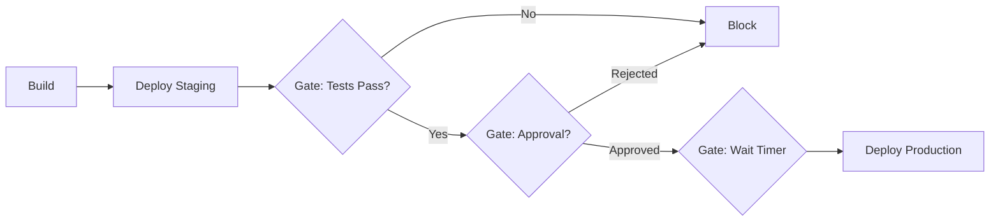

# How to Set Up Deployment Gates in GitHub Actions

Author: [nawazdhandala](https://www.github.com/nawazdhandala)

Tags: GitHub Actions, CI/CD, Deployment Gates, Environments, DevOps, Security

Description: Learn how to implement deployment gates in GitHub Actions using environments, required reviewers, wait timers, and custom protection rules for safe and controlled deployments.

---

Deployment gates add checkpoints before code reaches production. They can require manual approvals, enforce wait periods, or run automated checks. This guide shows you how to implement comprehensive deployment gates in GitHub Actions.

## Understanding Deployment Gates

Deployment gates are control mechanisms that pause or validate deployments before proceeding. They help prevent accidents, ensure compliance, and maintain quality.



## Setting Up Environments

GitHub Environments are the foundation for deployment gates. Create them through repository settings.

### Creating Environments via UI

1. Go to Settings - Environments
2. Click "New environment"
3. Name it (e.g., "staging", "production")
4. Configure protection rules

### Environment Configuration in Workflows

```yaml
name: Deploy Application

on:
  push:
    branches: [main]

jobs:
  build:
    runs-on: ubuntu-latest
    steps:
      - uses: actions/checkout@v4
      - name: Build application
        run: npm run build
      - name: Upload artifact
        uses: actions/upload-artifact@v4
        with:
          name: build-output
          path: dist/

  deploy-staging:
    needs: build
    runs-on: ubuntu-latest
    environment:
      name: staging
      url: https://staging.example.com
    steps:
      - name: Download artifact
        uses: actions/download-artifact@v4
        with:
          name: build-output
          path: dist/
      - name: Deploy to staging
        run: ./deploy.sh staging

  deploy-production:
    needs: deploy-staging
    runs-on: ubuntu-latest
    environment:
      name: production
      url: https://example.com
    steps:
      - name: Download artifact
        uses: actions/download-artifact@v4
        with:
          name: build-output
          path: dist/
      - name: Deploy to production
        run: ./deploy.sh production
```

## Required Reviewers Gate

Configure required reviewers for an environment:

### Via Repository Settings

1. Navigate to Settings - Environments - production
2. Check "Required reviewers"
3. Add team members or teams
4. Save protection rules

### Workflow Behavior with Reviewers

When a workflow reaches a job with required reviewers, it pauses and notifies the reviewers. The workflow resumes only after approval.

```yaml
  deploy-production:
    needs: [deploy-staging, integration-tests]
    runs-on: ubuntu-latest
    environment:
      name: production  # Requires approval
    steps:
      - name: Deploy
        run: echo "Deploying to production"
```

Reviewers receive notifications and can approve or reject from:
- The workflow run page
- Email notifications
- GitHub Mobile

## Wait Timer Gate

Add a mandatory delay before deployment:

1. Go to Settings - Environments - production
2. Enable "Wait timer"
3. Set minutes (0-43200, which is 30 days)

This creates a cooling-off period useful for:
- Allowing time for rollback if issues emerge in staging
- Scheduling deployments during specific windows
- Compliance requirements for change management

```yaml
  deploy-production:
    needs: deploy-staging
    runs-on: ubuntu-latest
    environment:
      name: production  # Has 15-minute wait timer configured
    steps:
      - name: Announce deployment
        run: echo "Production deployment starting after wait period"
      - name: Deploy
        run: ./deploy.sh production
```

## Branch Protection Gates

Restrict which branches can deploy to environments:

1. Go to Settings - Environments - production
2. Enable "Deployment branches"
3. Select "Selected branches"
4. Add patterns like `main`, `release/*`

```yaml
  # This job only runs for allowed branches
  deploy-production:
    if: github.ref == 'refs/heads/main'
    runs-on: ubuntu-latest
    environment: production
    steps:
      - name: Deploy
        run: ./deploy.sh production
```

## Custom Deployment Protection Rules

GitHub Actions supports custom deployment protection rules via webhooks. This enables integration with external systems.

### Setting Up Custom Rules

1. Create a GitHub App with deployment protection rule permissions
2. Register it as a custom deployment protection rule
3. Your app receives webhooks for deployment requests
4. Respond to approve or reject

### Example: External Change Management Integration

```yaml
  deploy-production:
    runs-on: ubuntu-latest
    environment: production  # Custom rule checks ServiceNow
    steps:
      - name: Verify change ticket
        run: |
          # Check if change request is approved
          STATUS=$(curl -s "https://servicenow.example.com/api/changes/${{ github.run_id }}")
          if [ "$STATUS" != "approved" ]; then
            echo "Change request not approved"
            exit 1
          fi
      - name: Deploy
        run: ./deploy.sh production
```

## Implementing Manual Gates with workflow_dispatch

Create on-demand deployments with manual triggers:

```yaml
name: Manual Production Deploy

on:
  workflow_dispatch:
    inputs:
      version:
        description: 'Version to deploy'
        required: true
        type: string
      confirm:
        description: 'Type "deploy" to confirm'
        required: true
        type: string

jobs:
  validate:
    runs-on: ubuntu-latest
    steps:
      - name: Validate confirmation
        if: inputs.confirm != 'deploy'
        run: |
          echo "Confirmation failed. You must type 'deploy' to proceed."
          exit 1

  deploy:
    needs: validate
    runs-on: ubuntu-latest
    environment: production
    steps:
      - name: Deploy version ${{ inputs.version }}
        run: ./deploy.sh ${{ inputs.version }}
```

## Automated Quality Gates

Implement automated gates that must pass before deployment:

```yaml
name: Deploy with Quality Gates

on:
  push:
    branches: [main]

jobs:
  build:
    runs-on: ubuntu-latest
    outputs:
      version: ${{ steps.version.outputs.version }}
    steps:
      - uses: actions/checkout@v4
      - name: Get version
        id: version
        run: echo "version=$(cat VERSION)" >> $GITHUB_OUTPUT
      - name: Build
        run: npm run build

  quality-gates:
    needs: build
    runs-on: ubuntu-latest
    steps:
      - uses: actions/checkout@v4

      - name: Run unit tests
        run: npm test

      - name: Run integration tests
        run: npm run test:integration

      - name: Security scan
        uses: aquasecurity/trivy-action@master
        with:
          scan-type: fs
          exit-code: 1
          severity: CRITICAL,HIGH

      - name: Performance benchmark
        run: |
          RESULT=$(npm run benchmark --silent)
          if [ "$RESULT" -gt 100 ]; then
            echo "Performance regression detected"
            exit 1
          fi

  deploy-staging:
    needs: quality-gates
    runs-on: ubuntu-latest
    environment: staging
    steps:
      - name: Deploy to staging
        run: ./deploy.sh staging

  smoke-tests:
    needs: deploy-staging
    runs-on: ubuntu-latest
    steps:
      - uses: actions/checkout@v4
      - name: Run smoke tests against staging
        run: npm run test:smoke
        env:
          TARGET_URL: https://staging.example.com

  deploy-production:
    needs: smoke-tests
    runs-on: ubuntu-latest
    environment: production
    steps:
      - name: Deploy to production
        run: ./deploy.sh production
```

## Rollback Gates

Implement gates for rollback procedures:

```yaml
name: Rollback Production

on:
  workflow_dispatch:
    inputs:
      target-version:
        description: 'Version to rollback to'
        required: true
      reason:
        description: 'Reason for rollback'
        required: true

jobs:
  validate-rollback:
    runs-on: ubuntu-latest
    steps:
      - name: Verify version exists
        run: |
          if ! docker manifest inspect ghcr.io/myorg/app:${{ inputs.target-version }}; then
            echo "Version ${{ inputs.target-version }} not found"
            exit 1
          fi

  notify-stakeholders:
    needs: validate-rollback
    runs-on: ubuntu-latest
    steps:
      - name: Send Slack notification
        run: |
          curl -X POST ${{ secrets.SLACK_WEBHOOK }} \
            -H 'Content-type: application/json' \
            -d '{
              "text": "Production rollback initiated",
              "attachments": [{
                "color": "warning",
                "fields": [
                  {"title": "Target Version", "value": "${{ inputs.target-version }}"},
                  {"title": "Reason", "value": "${{ inputs.reason }}"},
                  {"title": "Initiated By", "value": "${{ github.actor }}"}
                ]
              }]
            }'

  rollback:
    needs: notify-stakeholders
    runs-on: ubuntu-latest
    environment: production  # Still requires approval
    steps:
      - name: Execute rollback
        run: |
          kubectl set image deployment/app \
            app=ghcr.io/myorg/app:${{ inputs.target-version }}
          kubectl rollout status deployment/app
```

## Environment Secrets and Variables

Gates can also control access to sensitive credentials:

```yaml
  deploy-production:
    runs-on: ubuntu-latest
    environment: production  # Unlocks production secrets
    steps:
      - name: Deploy
        run: ./deploy.sh
        env:
          # These secrets are only available after environment approval
          AWS_ACCESS_KEY_ID: ${{ secrets.AWS_ACCESS_KEY_ID }}
          AWS_SECRET_ACCESS_KEY: ${{ secrets.AWS_SECRET_ACCESS_KEY }}
          DATABASE_URL: ${{ secrets.DATABASE_URL }}
```

## Summary

Deployment gates provide essential control over your release process:

- **Required reviewers** ensure human oversight for critical deployments
- **Wait timers** add cooling-off periods for safety
- **Branch protection** restricts which code can reach environments
- **Custom rules** integrate with external approval systems
- **Quality gates** enforce automated checks before proceeding

Combine these mechanisms to create a deployment pipeline that balances speed with safety, ensuring code reaches production only when it's truly ready.
