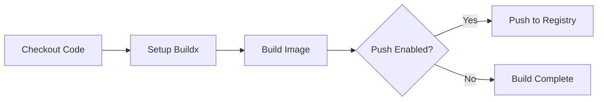

# How to Set Up Docker Builds in GitHub Actions

Author: [nawazdhandala](https://www.github.com/nawazdhandala)

Tags: GitHub Actions, Docker, CI/CD, Container Registry, BuildKit, Multi-Architecture

Description: Learn how to build, tag, and push Docker images using GitHub Actions with BuildKit, multi-architecture support, layer caching, and integration with container registries like Docker Hub and GitHub Container Registry.

---

Docker builds in GitHub Actions give you reproducible container images for every commit. With BuildKit, multi-arch support, and intelligent caching, you can build production-ready images faster than ever. Here's how to set up a complete Docker build pipeline.

## Basic Docker Build

Start with a simple build workflow:

```yaml
name: Docker Build

on:
  push:
    branches: [main]
  pull_request:
    branches: [main]

jobs:
  build:
    runs-on: ubuntu-latest
    steps:
      - uses: actions/checkout@v4

      - name: Build Docker image
        run: docker build -t myapp:latest .
```

This works but lacks caching, registry push, and multi-arch support. Let's improve it.

## Using Docker Build Push Action

The official Docker actions provide a better experience:

```yaml
name: Docker Build and Push

on:
  push:
    branches: [main]
    tags: ['v*']

jobs:
  build:
    runs-on: ubuntu-latest
    steps:
      - uses: actions/checkout@v4

      - name: Set up Docker Buildx
        uses: docker/setup-buildx-action@v3

      - name: Build image
        uses: docker/build-push-action@v5
        with:
          context: .
          push: false
          tags: myapp:latest
```



## Push to GitHub Container Registry

GitHub Container Registry (ghcr.io) integrates seamlessly:

```yaml
name: Build and Push to GHCR

on:
  push:
    branches: [main]
    tags: ['v*']

jobs:
  build:
    runs-on: ubuntu-latest
    permissions:
      contents: read
      packages: write

    steps:
      - uses: actions/checkout@v4

      - name: Set up Docker Buildx
        uses: docker/setup-buildx-action@v3

      - name: Log in to GHCR
        uses: docker/login-action@v3
        with:
          registry: ghcr.io
          username: ${{ github.actor }}
          password: ${{ secrets.GITHUB_TOKEN }}

      - name: Extract metadata
        id: meta
        uses: docker/metadata-action@v5
        with:
          images: ghcr.io/${{ github.repository }}
          tags: |
            type=ref,event=branch
            type=ref,event=pr
            type=semver,pattern={{version}}
            type=sha

      - name: Build and push
        uses: docker/build-push-action@v5
        with:
          context: .
          push: ${{ github.event_name != 'pull_request' }}
          tags: ${{ steps.meta.outputs.tags }}
          labels: ${{ steps.meta.outputs.labels }}
```

The metadata action generates smart tags based on git context.

## Push to Docker Hub

For Docker Hub, use repository secrets:

```yaml
      - name: Log in to Docker Hub
        uses: docker/login-action@v3
        with:
          username: ${{ secrets.DOCKER_USERNAME }}
          password: ${{ secrets.DOCKER_PASSWORD }}

      - name: Build and push
        uses: docker/build-push-action@v5
        with:
          context: .
          push: true
          tags: ${{ secrets.DOCKER_USERNAME }}/myapp:latest
```

## Multi-Architecture Builds

Build for multiple CPU architectures:

```yaml
jobs:
  build:
    runs-on: ubuntu-latest
    steps:
      - uses: actions/checkout@v4

      - name: Set up QEMU
        uses: docker/setup-qemu-action@v3

      - name: Set up Docker Buildx
        uses: docker/setup-buildx-action@v3

      - name: Build multi-arch
        uses: docker/build-push-action@v5
        with:
          context: .
          platforms: linux/amd64,linux/arm64,linux/arm/v7
          push: true
          tags: ghcr.io/${{ github.repository }}:latest
```

QEMU enables cross-platform emulation on x86 runners. The resulting image manifest includes all architectures.

## Build Caching

Speed up builds with layer caching:

### Registry Cache

```yaml
      - name: Build with registry cache
        uses: docker/build-push-action@v5
        with:
          context: .
          push: true
          tags: ghcr.io/${{ github.repository }}:latest
          cache-from: type=registry,ref=ghcr.io/${{ github.repository }}:buildcache
          cache-to: type=registry,ref=ghcr.io/${{ github.repository }}:buildcache,mode=max
```

### GitHub Actions Cache

```yaml
      - name: Build with GHA cache
        uses: docker/build-push-action@v5
        with:
          context: .
          push: true
          tags: ghcr.io/${{ github.repository }}:latest
          cache-from: type=gha
          cache-to: type=gha,mode=max
```

### Local Cache

```yaml
      - name: Cache Docker layers
        uses: actions/cache@v4
        with:
          path: /tmp/.buildx-cache
          key: ${{ runner.os }}-buildx-${{ github.sha }}
          restore-keys: |
            ${{ runner.os }}-buildx-

      - name: Build with local cache
        uses: docker/build-push-action@v5
        with:
          context: .
          push: true
          tags: myapp:latest
          cache-from: type=local,src=/tmp/.buildx-cache
          cache-to: type=local,dest=/tmp/.buildx-cache-new,mode=max

      - name: Move cache
        run: |
          rm -rf /tmp/.buildx-cache
          mv /tmp/.buildx-cache-new /tmp/.buildx-cache
```

## Build Arguments and Secrets

Pass build-time variables:

```yaml
      - name: Build with args
        uses: docker/build-push-action@v5
        with:
          context: .
          build-args: |
            NODE_VERSION=20
            BUILD_DATE=${{ github.event.head_commit.timestamp }}
            GIT_SHA=${{ github.sha }}
          push: true
          tags: myapp:latest
```

Pass secrets securely:

```yaml
      - name: Build with secrets
        uses: docker/build-push-action@v5
        with:
          context: .
          secrets: |
            npm_token=${{ secrets.NPM_TOKEN }}
          push: true
          tags: myapp:latest
```

In your Dockerfile:

```dockerfile
# syntax=docker/dockerfile:1
FROM node:20
RUN --mount=type=secret,id=npm_token \
    NPM_TOKEN=$(cat /run/secrets/npm_token) npm ci
```

## Matrix Builds for Multiple Images

Build multiple Docker images in parallel:

```yaml
jobs:
  build:
    runs-on: ubuntu-latest
    strategy:
      matrix:
        include:
          - context: ./api
            image: myorg/api
          - context: ./web
            image: myorg/web
          - context: ./worker
            image: myorg/worker

    steps:
      - uses: actions/checkout@v4

      - uses: docker/setup-buildx-action@v3

      - uses: docker/login-action@v3
        with:
          registry: ghcr.io
          username: ${{ github.actor }}
          password: ${{ secrets.GITHUB_TOKEN }}

      - uses: docker/build-push-action@v5
        with:
          context: ${{ matrix.context }}
          push: true
          tags: ghcr.io/${{ matrix.image }}:${{ github.sha }}
```

## Security Scanning

Scan images for vulnerabilities before pushing:

```yaml
      - name: Build for scanning
        uses: docker/build-push-action@v5
        with:
          context: .
          load: true
          tags: myapp:scan

      - name: Scan image
        uses: aquasecurity/trivy-action@master
        with:
          image-ref: myapp:scan
          format: 'sarif'
          output: 'trivy-results.sarif'
          severity: 'CRITICAL,HIGH'

      - name: Upload scan results
        uses: github/codeql-action/upload-sarif@v3
        with:
          sarif_file: 'trivy-results.sarif'
```

## SBOM and Provenance

Generate software bill of materials:

```yaml
      - name: Build with attestations
        uses: docker/build-push-action@v5
        with:
          context: .
          push: true
          tags: ghcr.io/${{ github.repository }}:latest
          sbom: true
          provenance: true
```

## Conditional Build and Push

Build on all events, push only on main:

```yaml
      - name: Build and conditionally push
        uses: docker/build-push-action@v5
        with:
          context: .
          push: ${{ github.ref == 'refs/heads/main' }}
          tags: |
            ghcr.io/${{ github.repository }}:${{ github.sha }}
            ghcr.io/${{ github.repository }}:latest
```

## Complete Production Workflow

Here's a comprehensive workflow:

```yaml
name: Docker CI/CD

on:
  push:
    branches: [main]
    tags: ['v*']
  pull_request:
    branches: [main]

env:
  REGISTRY: ghcr.io
  IMAGE_NAME: ${{ github.repository }}

jobs:
  build:
    runs-on: ubuntu-latest
    permissions:
      contents: read
      packages: write
      security-events: write

    steps:
      - uses: actions/checkout@v4

      - name: Set up QEMU
        uses: docker/setup-qemu-action@v3

      - name: Set up Docker Buildx
        uses: docker/setup-buildx-action@v3

      - name: Log in to registry
        if: github.event_name != 'pull_request'
        uses: docker/login-action@v3
        with:
          registry: ${{ env.REGISTRY }}
          username: ${{ github.actor }}
          password: ${{ secrets.GITHUB_TOKEN }}

      - name: Extract metadata
        id: meta
        uses: docker/metadata-action@v5
        with:
          images: ${{ env.REGISTRY }}/${{ env.IMAGE_NAME }}
          tags: |
            type=ref,event=branch
            type=ref,event=pr
            type=semver,pattern={{version}}
            type=semver,pattern={{major}}.{{minor}}
            type=sha

      - name: Build and push
        uses: docker/build-push-action@v5
        with:
          context: .
          platforms: linux/amd64,linux/arm64
          push: ${{ github.event_name != 'pull_request' }}
          tags: ${{ steps.meta.outputs.tags }}
          labels: ${{ steps.meta.outputs.labels }}
          cache-from: type=gha
          cache-to: type=gha,mode=max
          sbom: true
          provenance: true
```

---

Docker builds in GitHub Actions combine reproducibility with speed. Use BuildKit for caching, multi-arch for broad compatibility, and registry integration for seamless deployment. With security scanning and SBOM generation, your images are production-ready from the first build.
