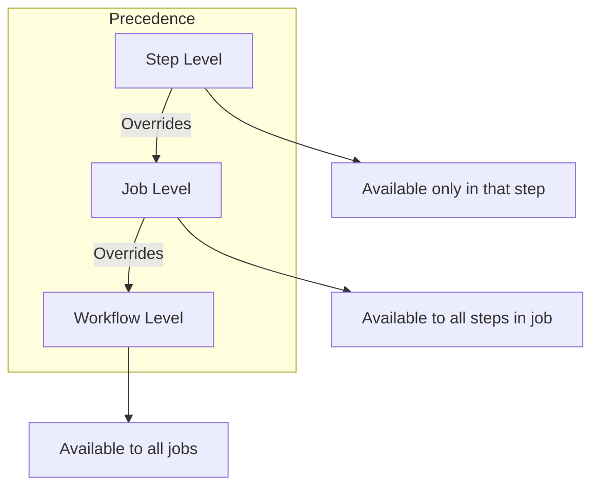

# How to Use Environment Variables in GitHub Actions

Author: [nawazdhandala](https://www.github.com/nawazdhandala)

Tags: GitHub Actions, CI/CD, Environment Variables, Configuration, DevOps, Automation

Description: Learn how to effectively use environment variables in GitHub Actions workflows, including workflow-level, job-level, and step-level variables, dynamic values, and best practices for configuration management.

---

Environment variables are the backbone of configurable CI/CD pipelines. They let you parameterize workflows, pass data between steps, and adapt behavior based on context. GitHub Actions provides multiple ways to define and use environment variables - here's how to leverage them effectively.

## Variable Scope Levels

GitHub Actions supports environment variables at three levels:



### Workflow-Level Variables

Available to all jobs in the workflow:

```yaml
name: Build and Deploy

env:
  NODE_VERSION: '20'
  REGISTRY: ghcr.io
  IMAGE_NAME: ${{ github.repository }}

jobs:
  build:
    runs-on: ubuntu-latest
    steps:
      - run: echo "Using Node $NODE_VERSION"
      - run: echo "Pushing to $REGISTRY/$IMAGE_NAME"

  deploy:
    runs-on: ubuntu-latest
    steps:
      - run: echo "Deploying $IMAGE_NAME"
```

### Job-Level Variables

Available to all steps in a specific job:

```yaml
jobs:
  test:
    runs-on: ubuntu-latest
    env:
      CI: true
      DATABASE_URL: postgresql://localhost/test
    steps:
      - run: echo "CI=$CI"
      - run: npm test

  build:
    runs-on: ubuntu-latest
    env:
      NODE_ENV: production
    steps:
      - run: npm run build
```

### Step-Level Variables

Available only within a single step:

```yaml
      - name: Build for staging
        env:
          API_URL: https://api.staging.example.com
          DEBUG: true
        run: npm run build

      - name: Build for production
        env:
          API_URL: https://api.example.com
          DEBUG: false
        run: npm run build
```

## Default Environment Variables

GitHub provides many built-in variables:

```yaml
      - name: Show default variables
        run: |
          echo "Repository: $GITHUB_REPOSITORY"
          echo "Ref: $GITHUB_REF"
          echo "SHA: $GITHUB_SHA"
          echo "Actor: $GITHUB_ACTOR"
          echo "Workflow: $GITHUB_WORKFLOW"
          echo "Run ID: $GITHUB_RUN_ID"
          echo "Run Number: $GITHUB_RUN_NUMBER"
          echo "Event: $GITHUB_EVENT_NAME"
          echo "Workspace: $GITHUB_WORKSPACE"
```

Common default variables:

| Variable | Description |
|----------|-------------|
| `GITHUB_REPOSITORY` | Owner/repo name |
| `GITHUB_REF` | Branch or tag ref |
| `GITHUB_SHA` | Commit SHA |
| `GITHUB_ACTOR` | User who triggered workflow |
| `GITHUB_WORKSPACE` | Working directory |
| `GITHUB_RUN_ID` | Unique run identifier |
| `RUNNER_OS` | Operating system |

## Dynamic Environment Variables

Set variables dynamically using `$GITHUB_ENV`:

```yaml
      - name: Set dynamic variables
        run: |
          echo "BUILD_TIME=$(date -u +"%Y-%m-%dT%H:%M:%SZ")" >> $GITHUB_ENV
          echo "SHORT_SHA=${GITHUB_SHA::7}" >> $GITHUB_ENV
          echo "BRANCH_NAME=${GITHUB_REF#refs/heads/}" >> $GITHUB_ENV

      - name: Use dynamic variables
        run: |
          echo "Built at: $BUILD_TIME"
          echo "Short SHA: $SHORT_SHA"
          echo "Branch: $BRANCH_NAME"
```

Multi-line values:

```yaml
      - name: Set multi-line variable
        run: |
          echo "CHANGELOG<<EOF" >> $GITHUB_ENV
          git log -5 --oneline >> $GITHUB_ENV
          echo "EOF" >> $GITHUB_ENV

      - name: Use multi-line variable
        run: |
          echo "Recent changes:"
          echo "$CHANGELOG"
```

## Step Outputs vs Environment Variables

Use outputs for passing data between steps in a structured way:

```yaml
      - name: Generate version
        id: version
        run: |
          VERSION="1.0.${{ github.run_number }}"
          echo "version=$VERSION" >> $GITHUB_OUTPUT
          echo "Generated version: $VERSION"

      - name: Use version
        run: |
          echo "Building version ${{ steps.version.outputs.version }}"
```

The difference:

- **Environment variables**: Available to shell commands, shell-native
- **Step outputs**: Available in expressions, passed between steps/jobs

## Repository Variables

Define reusable variables at the repository level:

1. Go to Settings > Secrets and variables > Actions
2. Click "Variables" tab
3. Add new variable

Use in workflows:

```yaml
jobs:
  deploy:
    runs-on: ubuntu-latest
    steps:
      - name: Deploy to environment
        env:
          API_URL: ${{ vars.API_URL }}
          FEATURE_FLAGS: ${{ vars.FEATURE_FLAGS }}
        run: ./deploy.sh
```

## Environment-Specific Variables

Use environments for per-environment configuration:

```yaml
jobs:
  deploy-staging:
    runs-on: ubuntu-latest
    environment: staging
    steps:
      - run: echo "API URL: ${{ vars.API_URL }}"
      # Uses staging environment's API_URL variable

  deploy-production:
    runs-on: ubuntu-latest
    environment: production
    steps:
      - run: echo "API URL: ${{ vars.API_URL }}"
      # Uses production environment's API_URL variable
```

## Conditional Environment Variables

Set variables based on conditions:

```yaml
jobs:
  build:
    runs-on: ubuntu-latest
    env:
      NODE_ENV: ${{ github.ref == 'refs/heads/main' && 'production' || 'development' }}
    steps:
      - run: echo "Building for $NODE_ENV"
```

Using matrix values:

```yaml
jobs:
  test:
    runs-on: ubuntu-latest
    strategy:
      matrix:
        include:
          - environment: staging
            api_url: https://api.staging.example.com
          - environment: production
            api_url: https://api.example.com
    env:
      API_URL: ${{ matrix.api_url }}
    steps:
      - run: echo "Testing against $API_URL"
```

## Path-Based Variables

Set PATH for custom tools:

```yaml
      - name: Add to PATH
        run: echo "$HOME/.local/bin" >> $GITHUB_PATH

      - name: Use custom tool
        run: my-custom-tool --version
```

## Variables from Files

Load configuration from files:

```yaml
      - name: Load config
        run: |
          # Load from .env file
          while IFS='=' read -r key value; do
            if [[ ! "$key" =~ ^# && -n "$key" ]]; then
              echo "$key=$value" >> $GITHUB_ENV
            fi
          done < .env.ci

      - name: Load from JSON
        run: |
          CONFIG=$(cat config.json)
          echo "APP_NAME=$(echo $CONFIG | jq -r '.app.name')" >> $GITHUB_ENV
          echo "APP_VERSION=$(echo $CONFIG | jq -r '.app.version')" >> $GITHUB_ENV
```

## Masking Sensitive Values

Mark values as sensitive to hide in logs:

```yaml
      - name: Generate token
        run: |
          TOKEN=$(./generate-token.sh)
          echo "::add-mask::$TOKEN"
          echo "AUTH_TOKEN=$TOKEN" >> $GITHUB_ENV

      - name: Use token
        run: |
          # Token value will be masked as *** in logs
          curl -H "Authorization: $AUTH_TOKEN" https://api.example.com
```

## Variable Substitution in Strings

Combine variables with static text:

```yaml
env:
  REGISTRY: ghcr.io
  IMAGE_NAME: ${{ github.repository }}

jobs:
  build:
    runs-on: ubuntu-latest
    steps:
      - name: Build image
        run: |
          docker build -t $REGISTRY/$IMAGE_NAME:$GITHUB_SHA .
          docker build -t $REGISTRY/$IMAGE_NAME:latest .
```

## Debugging Environment Variables

Print all available variables:

```yaml
      - name: Debug environment
        run: |
          echo "=== GitHub Context ==="
          echo "Repository: $GITHUB_REPOSITORY"
          echo "Ref: $GITHUB_REF"
          echo "SHA: $GITHUB_SHA"
          echo ""
          echo "=== Custom Variables ==="
          echo "NODE_ENV: $NODE_ENV"
          echo "API_URL: $API_URL"
          echo ""
          echo "=== All Environment Variables ==="
          env | sort
```

## Best Practices

### 1. Use Descriptive Names

```yaml
env:
  # Good
  DATABASE_CONNECTION_STRING: postgres://...
  FEATURE_FLAG_NEW_UI: true

  # Bad
  DB: postgres://...
  FLAG1: true
```

### 2. Group Related Variables

```yaml
env:
  # Database
  DB_HOST: localhost
  DB_PORT: 5432
  DB_NAME: myapp

  # Redis
  REDIS_HOST: localhost
  REDIS_PORT: 6379
```

### 3. Document Variable Purpose

```yaml
env:
  # Maximum concurrent API requests (prevents rate limiting)
  API_MAX_CONCURRENT: 10

  # Feature toggle for beta features
  ENABLE_BETA_FEATURES: false
```

### 4. Use Repository Variables for Shared Config

Store common configuration in repository variables rather than hardcoding in workflows.

### 5. Secrets for Sensitive Data

Never put passwords, tokens, or keys in environment variables - use secrets instead:

```yaml
      - name: Deploy
        env:
          # Configuration - use variable
          API_URL: ${{ vars.API_URL }}
          # Credentials - use secret
          API_KEY: ${{ secrets.API_KEY }}
        run: ./deploy.sh
```

---

Environment variables make workflows flexible and maintainable. Use workflow-level variables for shared configuration, step-level for specific needs, and repository variables for values that don't belong in code. Combined with GitHub's context variables, you have all the building blocks for dynamic, configurable CI/CD pipelines.
