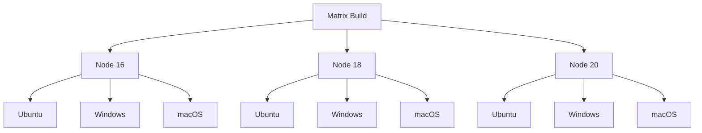

# How to Use Matrix Include/Exclude in GitHub Actions

Author: [nawazdhandala](https://www.github.com/nawazdhandala)

Tags: GitHub Actions, CI/CD, Matrix Builds, Testing, DevOps, Automation

Description: Master GitHub Actions matrix strategies with include and exclude options to create flexible test matrices, handle special cases, and optimize CI pipeline efficiency.

---

Matrix builds let you run jobs across multiple configurations - different OS versions, language versions, or custom parameters. The `include` and `exclude` options give you fine-grained control over which combinations run. This guide shows you how to use them effectively.

## Basic Matrix Strategy

A simple matrix creates jobs for all combinations:

```yaml
name: Test Matrix

on: [push, pull_request]

jobs:
  test:
    runs-on: ubuntu-latest
    strategy:
      matrix:
        node-version: [16, 18, 20]
        os: [ubuntu-latest, windows-latest, macos-latest]

    steps:
      - uses: actions/checkout@v4
      - uses: actions/setup-node@v4
        with:
          node-version: ${{ matrix.node-version }}
      - run: npm test
```

This creates 9 jobs (3 Node versions x 3 operating systems).



## Using Exclude to Remove Combinations

The `exclude` keyword removes specific combinations from the matrix:

```yaml
jobs:
  test:
    runs-on: ${{ matrix.os }}
    strategy:
      matrix:
        node-version: [16, 18, 20]
        os: [ubuntu-latest, windows-latest, macos-latest]
        exclude:
          # Node 16 is EOL, skip on Windows and macOS
          - node-version: 16
            os: windows-latest
          - node-version: 16
            os: macos-latest

    steps:
      - uses: actions/checkout@v4
      - uses: actions/setup-node@v4
        with:
          node-version: ${{ matrix.node-version }}
      - run: npm test
```

Now you have 7 jobs instead of 9 - Node 16 only runs on Ubuntu.

### Partial Exclude Matching

You can exclude based on partial matches:

```yaml
strategy:
  matrix:
    os: [ubuntu-latest, windows-latest, macos-latest]
    python: ['3.9', '3.10', '3.11', '3.12']
    exclude:
      # Exclude all Python 3.9 jobs (on any OS)
      - python: '3.9'
      # Exclude all macOS jobs (any Python version)
      - os: macos-latest
```

This removes all Python 3.9 jobs and all macOS jobs.

## Using Include to Add Special Cases

The `include` keyword adds specific combinations or extra parameters:

### Adding Extra Variables to Specific Combinations

```yaml
jobs:
  test:
    runs-on: ${{ matrix.os }}
    strategy:
      matrix:
        os: [ubuntu-latest, windows-latest]
        node-version: [18, 20]
        include:
          # Add experimental flag only for Node 20 on Ubuntu
          - os: ubuntu-latest
            node-version: 20
            experimental: true
          # Add coverage flag for Node 18 on Ubuntu
          - os: ubuntu-latest
            node-version: 18
            coverage: true

    steps:
      - uses: actions/checkout@v4
      - uses: actions/setup-node@v4
        with:
          node-version: ${{ matrix.node-version }}

      - name: Run tests
        run: npm test

      - name: Run with experimental features
        if: matrix.experimental
        run: npm test -- --experimental

      - name: Upload coverage
        if: matrix.coverage
        run: npm run coverage
```

### Adding New Combinations

Include can add combinations not in the original matrix:

```yaml
jobs:
  test:
    runs-on: ${{ matrix.os }}
    strategy:
      matrix:
        os: [ubuntu-latest]
        node-version: [18, 20]
        include:
          # Add a Windows + Node 20 job even though Windows isn't in os list
          - os: windows-latest
            node-version: 20
          # Add a nightly Node build job
          - os: ubuntu-latest
            node-version: 21
            experimental: true

    steps:
      - uses: actions/checkout@v4
      - uses: actions/setup-node@v4
        with:
          node-version: ${{ matrix.node-version }}
      - run: npm test
```

## Combining Include and Exclude

Use both together for precise control:

```yaml
jobs:
  test:
    runs-on: ${{ matrix.os }}
    strategy:
      fail-fast: false
      matrix:
        os: [ubuntu-latest, windows-latest, macos-latest]
        python: ['3.9', '3.10', '3.11', '3.12']
        exclude:
          # Windows + Python 3.9 has known issues
          - os: windows-latest
            python: '3.9'
          # macOS runners are expensive, limit versions
          - os: macos-latest
            python: '3.9'
          - os: macos-latest
            python: '3.10'
        include:
          # Add PyPy test on Ubuntu only
          - os: ubuntu-latest
            python: pypy-3.9
          # Mark Python 3.12 as experimental on all platforms
          - python: '3.12'
            experimental: true

    steps:
      - uses: actions/checkout@v4
      - uses: actions/setup-python@v5
        with:
          python-version: ${{ matrix.python }}

      - name: Install dependencies
        run: pip install -r requirements.txt

      - name: Run tests
        run: pytest
        continue-on-error: ${{ matrix.experimental || false }}
```

## Dynamic Matrix Generation

Generate matrix values dynamically using a preceding job:

```yaml
jobs:
  prepare:
    runs-on: ubuntu-latest
    outputs:
      matrix: ${{ steps.set-matrix.outputs.matrix }}
    steps:
      - uses: actions/checkout@v4

      - name: Determine test matrix
        id: set-matrix
        run: |
          # Generate matrix based on changed files
          if git diff --name-only HEAD~1 | grep -q "^packages/api/"; then
            echo 'matrix={"service":["api"],"node":["18","20"]}' >> $GITHUB_OUTPUT
          elif git diff --name-only HEAD~1 | grep -q "^packages/web/"; then
            echo 'matrix={"service":["web"],"node":["18","20"]}' >> $GITHUB_OUTPUT
          else
            echo 'matrix={"service":["api","web"],"node":["18","20"]}' >> $GITHUB_OUTPUT
          fi

  test:
    needs: prepare
    runs-on: ubuntu-latest
    strategy:
      matrix: ${{ fromJSON(needs.prepare.outputs.matrix) }}
    steps:
      - uses: actions/checkout@v4
      - uses: actions/setup-node@v4
        with:
          node-version: ${{ matrix.node }}
      - run: npm test --workspace=${{ matrix.service }}
```

## Practical Examples

### Database Compatibility Testing

```yaml
jobs:
  test:
    runs-on: ubuntu-latest
    strategy:
      matrix:
        database: [postgres, mysql, sqlite]
        database-version: ['13', '14', '15']
        exclude:
          # SQLite doesn't have versions in this context
          - database: sqlite
            database-version: '13'
          - database: sqlite
            database-version: '14'
          # MySQL uses different version numbers
          - database: mysql
            database-version: '13'
          - database: mysql
            database-version: '14'
          - database: mysql
            database-version: '15'
        include:
          # Add correct MySQL versions
          - database: mysql
            database-version: '8.0'
          - database: mysql
            database-version: '5.7'
          # SQLite just needs one entry
          - database: sqlite
            database-version: '3'

    services:
      database:
        image: ${{ matrix.database }}:${{ matrix.database-version }}
        # ... service configuration

    steps:
      - uses: actions/checkout@v4
      - run: npm test
        env:
          DATABASE_TYPE: ${{ matrix.database }}
```

### Browser Testing Matrix

```yaml
jobs:
  e2e:
    runs-on: ${{ matrix.os }}
    strategy:
      fail-fast: false
      matrix:
        os: [ubuntu-latest, windows-latest, macos-latest]
        browser: [chromium, firefox, webkit]
        exclude:
          # WebKit on Windows has limited support
          - os: windows-latest
            browser: webkit
        include:
          # Add mobile viewport tests
          - os: ubuntu-latest
            browser: chromium
            viewport: mobile
          - os: ubuntu-latest
            browser: chromium
            viewport: tablet

    steps:
      - uses: actions/checkout@v4
      - uses: actions/setup-node@v4
        with:
          node-version: 20

      - name: Install Playwright
        run: npx playwright install ${{ matrix.browser }}

      - name: Run E2E tests
        run: npx playwright test --project=${{ matrix.browser }}
        env:
          VIEWPORT: ${{ matrix.viewport || 'desktop' }}
```

### Architecture-Specific Builds

```yaml
jobs:
  build:
    runs-on: ${{ matrix.runner }}
    strategy:
      matrix:
        include:
          - os: linux
            arch: amd64
            runner: ubuntu-latest
          - os: linux
            arch: arm64
            runner: ubuntu-latest
            use-qemu: true
          - os: darwin
            arch: amd64
            runner: macos-13
          - os: darwin
            arch: arm64
            runner: macos-14
          - os: windows
            arch: amd64
            runner: windows-latest

    steps:
      - uses: actions/checkout@v4

      - name: Set up QEMU
        if: matrix.use-qemu
        uses: docker/setup-qemu-action@v3

      - name: Build for ${{ matrix.os }}-${{ matrix.arch }}
        run: |
          GOOS=${{ matrix.os }} GOARCH=${{ matrix.arch }} go build -o dist/app-${{ matrix.os }}-${{ matrix.arch }}
```

## Matrix Strategy Options

Control matrix behavior with these options:

```yaml
strategy:
  fail-fast: false     # Don't cancel other jobs if one fails
  max-parallel: 4      # Run at most 4 jobs simultaneously
  matrix:
    # ... matrix configuration
```

- `fail-fast: false` - Continue running other matrix jobs even if one fails
- `max-parallel` - Limit concurrent jobs to manage runner usage

## Summary

Matrix include and exclude give you powerful control over test configurations:

- **Exclude** removes unwanted combinations from the Cartesian product
- **Include** adds new combinations or extra variables to existing ones
- **Dynamic matrices** let you generate configurations at runtime
- Use **fail-fast: false** to get results from all combinations

Design your matrices to maximize coverage while minimizing redundant jobs. Focus expensive runners (macOS, Windows) on critical configurations and use Ubuntu for broader coverage.
