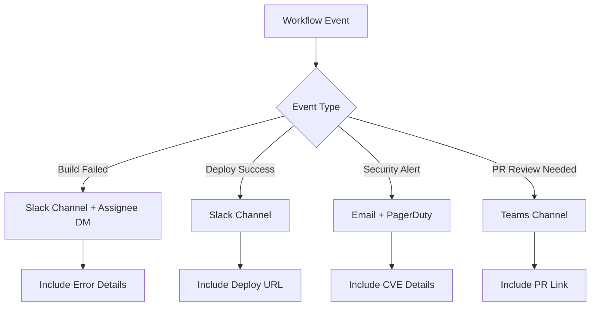

# How to Set Up Notifications in GitHub Actions

Author: [nawazdhandala](https://www.github.com/nawazdhandala)

Tags: GitHub Actions, CI/CD, Notifications, Slack, Teams, DevOps, Monitoring

Description: Learn how to configure notifications in GitHub Actions for Slack, Microsoft Teams, email, and custom webhooks to keep your team informed about build and deployment status.

---

Keeping your team informed about CI/CD pipeline status is crucial for rapid response to failures. This guide covers setting up notifications in GitHub Actions for various platforms including Slack, Microsoft Teams, email, and custom webhooks.

## Notification Strategy Overview

Different events warrant different notification channels:



## Slack Notifications

Slack is the most common notification target. You can use webhook URLs or the official Slack API.

### Using Incoming Webhooks

First, create a Slack webhook:
1. Go to api.slack.com/apps
2. Create a new app or select existing
3. Enable Incoming Webhooks
4. Add webhook to your channel
5. Copy the webhook URL to GitHub Secrets

```yaml
name: CI with Slack Notifications

on:
  push:
    branches: [main]
  pull_request:
    branches: [main]

jobs:
  build:
    runs-on: ubuntu-latest
    steps:
      - uses: actions/checkout@v4

      - name: Build application
        run: npm run build

      - name: Run tests
        run: npm test

  notify:
    needs: build
    runs-on: ubuntu-latest
    if: always()
    steps:
      - name: Notify Slack on success
        if: needs.build.result == 'success'
        run: |
          curl -X POST ${{ secrets.SLACK_WEBHOOK_URL }} \
            -H 'Content-type: application/json' \
            -d '{
              "blocks": [
                {
                  "type": "section",
                  "text": {
                    "type": "mrkdwn",
                    "text": ":white_check_mark: *Build Successful*\n*Repository:* ${{ github.repository }}\n*Branch:* ${{ github.ref_name }}\n*Commit:* `${{ github.sha }}`"
                  }
                },
                {
                  "type": "actions",
                  "elements": [
                    {
                      "type": "button",
                      "text": {"type": "plain_text", "text": "View Run"},
                      "url": "${{ github.server_url }}/${{ github.repository }}/actions/runs/${{ github.run_id }}"
                    }
                  ]
                }
              ]
            }'

      - name: Notify Slack on failure
        if: needs.build.result == 'failure'
        run: |
          curl -X POST ${{ secrets.SLACK_WEBHOOK_URL }} \
            -H 'Content-type: application/json' \
            -d '{
              "blocks": [
                {
                  "type": "section",
                  "text": {
                    "type": "mrkdwn",
                    "text": ":x: *Build Failed*\n*Repository:* ${{ github.repository }}\n*Branch:* ${{ github.ref_name }}\n*Author:* ${{ github.actor }}"
                  }
                },
                {
                  "type": "actions",
                  "elements": [
                    {
                      "type": "button",
                      "text": {"type": "plain_text", "text": "View Logs"},
                      "url": "${{ github.server_url }}/${{ github.repository }}/actions/runs/${{ github.run_id }}"
                    }
                  ]
                }
              ]
            }'
```

### Using the Slack GitHub Action

For richer formatting, use the official action:

```yaml
      - name: Slack notification
        uses: slackapi/slack-github-action@v1.25.0
        with:
          channel-id: 'C0123456789'
          payload: |
            {
              "text": "Build ${{ job.status }}",
              "blocks": [
                {
                  "type": "header",
                  "text": {
                    "type": "plain_text",
                    "text": "${{ github.workflow }} - ${{ job.status }}"
                  }
                },
                {
                  "type": "section",
                  "fields": [
                    {"type": "mrkdwn", "text": "*Repository:*\n${{ github.repository }}"},
                    {"type": "mrkdwn", "text": "*Branch:*\n${{ github.ref_name }}"},
                    {"type": "mrkdwn", "text": "*Commit:*\n${{ github.sha }}"},
                    {"type": "mrkdwn", "text": "*Author:*\n${{ github.actor }}"}
                  ]
                }
              ]
            }
        env:
          SLACK_BOT_TOKEN: ${{ secrets.SLACK_BOT_TOKEN }}
```

## Microsoft Teams Notifications

Teams uses Office 365 Connectors or Workflows for incoming webhooks.

```yaml
      - name: Notify Teams
        if: always()
        run: |
          STATUS="${{ job.status }}"
          COLOR="0078D7"
          if [ "$STATUS" == "failure" ]; then
            COLOR="FF0000"
          elif [ "$STATUS" == "success" ]; then
            COLOR="00FF00"
          fi

          curl -X POST ${{ secrets.TEAMS_WEBHOOK_URL }} \
            -H 'Content-type: application/json' \
            -d '{
              "@type": "MessageCard",
              "@context": "http://schema.org/extensions",
              "themeColor": "'"$COLOR"'",
              "summary": "GitHub Actions: ${{ github.workflow }}",
              "sections": [{
                "activityTitle": "GitHub Actions Notification",
                "facts": [
                  {"name": "Repository", "value": "${{ github.repository }}"},
                  {"name": "Branch", "value": "${{ github.ref_name }}"},
                  {"name": "Status", "value": "'"$STATUS"'"},
                  {"name": "Triggered by", "value": "${{ github.actor }}"}
                ],
                "markdown": true
              }],
              "potentialAction": [{
                "@type": "OpenUri",
                "name": "View Run",
                "targets": [{
                  "os": "default",
                  "uri": "${{ github.server_url }}/${{ github.repository }}/actions/runs/${{ github.run_id }}"
                }]
              }]
            }'
```

## Email Notifications

Use the SendGrid action or direct SMTP for email notifications:

```yaml
      - name: Send email on failure
        if: failure()
        uses: dawidd6/action-send-mail@v3
        with:
          server_address: smtp.gmail.com
          server_port: 587
          username: ${{ secrets.EMAIL_USERNAME }}
          password: ${{ secrets.EMAIL_PASSWORD }}
          subject: "Build Failed: ${{ github.repository }}"
          to: team@example.com
          from: ci-notifications@example.com
          body: |
            The build for ${{ github.repository }} has failed.

            Branch: ${{ github.ref_name }}
            Commit: ${{ github.sha }}
            Author: ${{ github.actor }}

            View the failed run: ${{ github.server_url }}/${{ github.repository }}/actions/runs/${{ github.run_id }}
```

## Discord Notifications

Discord webhooks work similarly to Slack:

```yaml
      - name: Discord notification
        if: always()
        run: |
          STATUS="${{ job.status }}"
          COLOR=3447003
          if [ "$STATUS" == "failure" ]; then
            COLOR=15158332
          elif [ "$STATUS" == "success" ]; then
            COLOR=3066993
          fi

          curl -X POST ${{ secrets.DISCORD_WEBHOOK_URL }} \
            -H 'Content-type: application/json' \
            -d '{
              "embeds": [{
                "title": "GitHub Actions: ${{ github.workflow }}",
                "description": "Build status: '"$STATUS"'",
                "color": '"$COLOR"',
                "fields": [
                  {"name": "Repository", "value": "${{ github.repository }}", "inline": true},
                  {"name": "Branch", "value": "${{ github.ref_name }}", "inline": true},
                  {"name": "Author", "value": "${{ github.actor }}", "inline": true}
                ],
                "url": "${{ github.server_url }}/${{ github.repository }}/actions/runs/${{ github.run_id }}"
              }]
            }'
```

## Conditional Notifications

Send different notifications based on context:

```yaml
jobs:
  build:
    runs-on: ubuntu-latest
    outputs:
      status: ${{ job.status }}
    steps:
      - uses: actions/checkout@v4
      - run: npm test

  notify:
    needs: build
    runs-on: ubuntu-latest
    if: always()
    steps:
      # Only notify on failure for PRs
      - name: PR failure notification
        if: github.event_name == 'pull_request' && needs.build.result == 'failure'
        run: |
          curl -X POST ${{ secrets.SLACK_WEBHOOK_URL }} \
            -d '{"text": "PR #${{ github.event.number }} build failed"}'

      # Always notify on main branch
      - name: Main branch notification
        if: github.ref == 'refs/heads/main'
        run: |
          curl -X POST ${{ secrets.SLACK_WEBHOOK_URL }} \
            -d '{"text": "Main branch build: ${{ needs.build.result }}"}'

      # Notify specific channel for releases
      - name: Release notification
        if: startsWith(github.ref, 'refs/tags/v')
        run: |
          curl -X POST ${{ secrets.SLACK_RELEASES_WEBHOOK }} \
            -d '{"text": "New release ${{ github.ref_name }} deployed!"}'
```

## Deployment Notifications

Rich notifications for deployment events:

```yaml
  deploy:
    runs-on: ubuntu-latest
    environment: production
    steps:
      - name: Deploy
        id: deploy
        run: |
          ./deploy.sh
          echo "url=https://app.example.com" >> $GITHUB_OUTPUT

      - name: Deployment success notification
        if: success()
        run: |
          curl -X POST ${{ secrets.SLACK_WEBHOOK_URL }} \
            -H 'Content-type: application/json' \
            -d '{
              "blocks": [
                {
                  "type": "header",
                  "text": {"type": "plain_text", "text": "Deployment Successful"}
                },
                {
                  "type": "section",
                  "text": {
                    "type": "mrkdwn",
                    "text": "*Environment:* production\n*Version:* ${{ github.sha }}\n*Deployed by:* ${{ github.actor }}"
                  }
                },
                {
                  "type": "actions",
                  "elements": [
                    {
                      "type": "button",
                      "text": {"type": "plain_text", "text": "View Application"},
                      "url": "${{ steps.deploy.outputs.url }}"
                    },
                    {
                      "type": "button",
                      "text": {"type": "plain_text", "text": "View Logs"},
                      "url": "${{ github.server_url }}/${{ github.repository }}/actions/runs/${{ github.run_id }}"
                    }
                  ]
                }
              ]
            }'
```

## Scheduled Summary Notifications

Send daily or weekly summaries:

```yaml
name: Weekly Build Summary

on:
  schedule:
    - cron: '0 9 * * 1'  # Every Monday at 9 AM

jobs:
  summary:
    runs-on: ubuntu-latest
    steps:
      - name: Get workflow statistics
        id: stats
        run: |
          # Fetch last week's workflow runs
          RUNS=$(gh run list --workflow=ci.yml --limit=100 --json status,conclusion,createdAt)
          TOTAL=$(echo "$RUNS" | jq length)
          SUCCESS=$(echo "$RUNS" | jq '[.[] | select(.conclusion=="success")] | length')
          FAILED=$(echo "$RUNS" | jq '[.[] | select(.conclusion=="failure")] | length')

          echo "total=$TOTAL" >> $GITHUB_OUTPUT
          echo "success=$SUCCESS" >> $GITHUB_OUTPUT
          echo "failed=$FAILED" >> $GITHUB_OUTPUT
        env:
          GH_TOKEN: ${{ github.token }}

      - name: Send summary
        run: |
          curl -X POST ${{ secrets.SLACK_WEBHOOK_URL }} \
            -H 'Content-type: application/json' \
            -d '{
              "blocks": [
                {
                  "type": "header",
                  "text": {"type": "plain_text", "text": "Weekly CI Summary"}
                },
                {
                  "type": "section",
                  "fields": [
                    {"type": "mrkdwn", "text": "*Total Runs:*\n${{ steps.stats.outputs.total }}"},
                    {"type": "mrkdwn", "text": "*Successful:*\n${{ steps.stats.outputs.success }}"},
                    {"type": "mrkdwn", "text": "*Failed:*\n${{ steps.stats.outputs.failed }}"}
                  ]
                }
              ]
            }'
```

## Custom Webhook Integration

For internal systems or monitoring tools:

```yaml
      - name: Notify monitoring system
        if: always()
        run: |
          curl -X POST ${{ secrets.MONITORING_WEBHOOK }} \
            -H 'Content-type: application/json' \
            -H 'Authorization: Bearer ${{ secrets.MONITORING_TOKEN }}' \
            -d '{
              "event": "ci_completed",
              "repository": "${{ github.repository }}",
              "branch": "${{ github.ref_name }}",
              "commit": "${{ github.sha }}",
              "status": "${{ job.status }}",
              "workflow": "${{ github.workflow }}",
              "run_id": "${{ github.run_id }}",
              "timestamp": "'$(date -u +%Y-%m-%dT%H:%M:%SZ)'"
            }'
```

## Summary

Effective notifications keep your team informed without causing alert fatigue:

- **Slack and Teams** work great for real-time team communication
- **Email** is better for summaries and critical alerts
- **Conditional logic** prevents notification spam
- **Rich formatting** makes notifications actionable
- **Scheduled summaries** provide oversight without noise

Choose notification channels based on urgency and audience. Critical failures might warrant multiple channels while successful builds might only need a Slack message.
