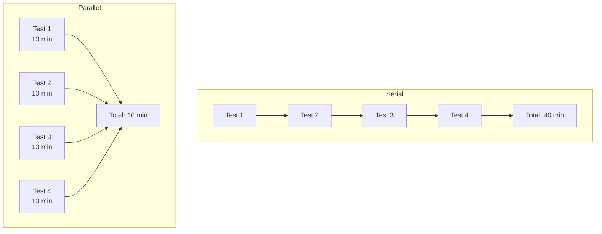
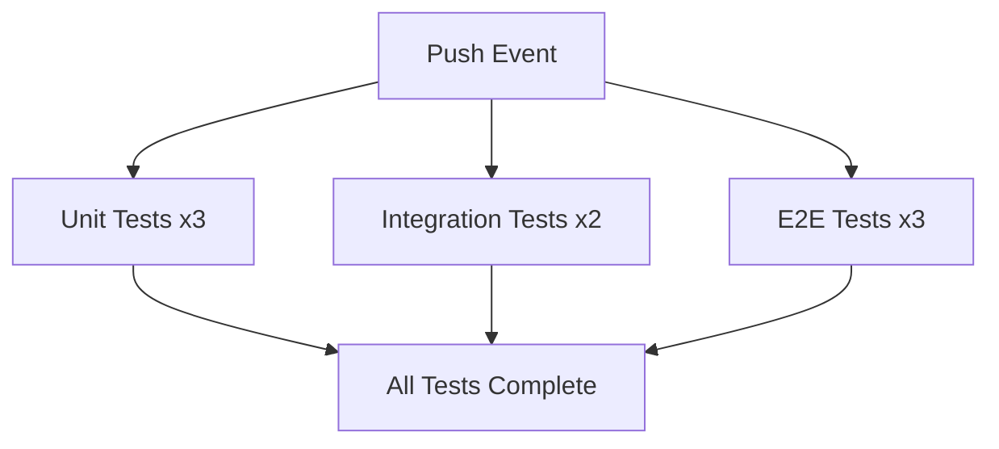

# How to Run Tests in Parallel in GitHub Actions

Author: [nawazdhandala](https://www.github.com/nawazdhandala)

Tags: GitHub Actions, CI/CD, Parallel Testing, Test Sharding, Performance, DevOps

Description: Learn how to parallelize test execution in GitHub Actions using matrix strategies, test sharding, and job splitting to dramatically reduce CI pipeline duration and get faster feedback.

---

Serial test execution is a CI bottleneck. When your test suite takes 30 minutes, developers wait too long for feedback. Parallel testing splits your tests across multiple runners, turning that 30-minute wait into 5 minutes. Here's how to implement it effectively in GitHub Actions.

## Why Parallelize Tests?



Serial: 40 minutes. Parallel across 4 runners: 10 minutes. Same tests, 75% faster.

## Matrix-Based Parallelization

Use GitHub Actions matrix to run test groups in parallel:

```yaml
name: Parallel Tests

on: [push, pull_request]

jobs:
  test:
    runs-on: ubuntu-latest
    strategy:
      fail-fast: false
      matrix:
        shard: [1, 2, 3, 4]

    steps:
      - uses: actions/checkout@v4

      - uses: actions/setup-node@v4
        with:
          node-version: 20
          cache: 'npm'

      - run: npm ci

      - name: Run shard ${{ matrix.shard }} of 4
        run: npm test -- --shard=${{ matrix.shard }}/4
```

Most test frameworks support sharding:

- **Jest**: `--shard=1/4`
- **Vitest**: `--shard=1/4`
- **pytest**: `pytest-split` or `pytest-xdist`
- **RSpec**: `--only-failures` with custom splitting

## Dynamic Shard Count

Calculate optimal shard count based on test count:

```yaml
jobs:
  setup:
    runs-on: ubuntu-latest
    outputs:
      shards: ${{ steps.shards.outputs.matrix }}
    steps:
      - uses: actions/checkout@v4

      - id: shards
        run: |
          # Count test files
          TEST_COUNT=$(find tests -name "*.test.ts" | wc -l)

          # Calculate shards (aim for ~20 tests per shard)
          SHARD_COUNT=$(( (TEST_COUNT + 19) / 20 ))
          SHARD_COUNT=$(( SHARD_COUNT > 10 ? 10 : SHARD_COUNT ))
          SHARD_COUNT=$(( SHARD_COUNT < 1 ? 1 : SHARD_COUNT ))

          # Generate matrix array [1,2,3,...]
          MATRIX=$(seq 1 $SHARD_COUNT | jq -R . | jq -s .)
          echo "matrix=$MATRIX" >> $GITHUB_OUTPUT

  test:
    needs: setup
    runs-on: ubuntu-latest
    strategy:
      fail-fast: false
      matrix:
        shard: ${{ fromJson(needs.setup.outputs.shards) }}
    steps:
      - uses: actions/checkout@v4
      - uses: actions/setup-node@v4
        with:
          node-version: 20
          cache: 'npm'
      - run: npm ci
      - run: npm test -- --shard=${{ matrix.shard }}/${{ strategy.job-total }}
```

## Playwright Parallel Testing

Playwright has built-in sharding support:

```yaml
jobs:
  test:
    runs-on: ubuntu-latest
    strategy:
      fail-fast: false
      matrix:
        shard: [1, 2, 3, 4, 5]

    steps:
      - uses: actions/checkout@v4

      - uses: actions/setup-node@v4
        with:
          node-version: 20
          cache: 'npm'

      - run: npm ci
      - run: npx playwright install --with-deps

      - name: Run Playwright tests
        run: npx playwright test --shard=${{ matrix.shard }}/5

      - name: Upload test results
        if: always()
        uses: actions/upload-artifact@v4
        with:
          name: playwright-report-${{ matrix.shard }}
          path: playwright-report/
          retention-days: 7
```

Merge reports after all shards complete:

```yaml
  merge-reports:
    needs: test
    if: always()
    runs-on: ubuntu-latest
    steps:
      - uses: actions/checkout@v4

      - uses: actions/setup-node@v4
        with:
          node-version: 20

      - run: npm ci

      - name: Download all reports
        uses: actions/download-artifact@v4
        with:
          pattern: playwright-report-*
          path: all-reports
          merge-multiple: true

      - name: Merge reports
        run: npx playwright merge-reports --reporter html ./all-reports

      - name: Upload merged report
        uses: actions/upload-artifact@v4
        with:
          name: playwright-report-merged
          path: playwright-report/
```

## Pytest Parallel Execution

For Python projects, use pytest-xdist or pytest-split:

```yaml
jobs:
  test:
    runs-on: ubuntu-latest
    strategy:
      fail-fast: false
      matrix:
        group: [1, 2, 3, 4]

    steps:
      - uses: actions/checkout@v4

      - uses: actions/setup-python@v5
        with:
          python-version: '3.12'
          cache: 'pip'

      - run: pip install -r requirements.txt

      - name: Run tests (group ${{ matrix.group }})
        run: |
          pytest --splits 4 --group ${{ matrix.group }} \
            --junitxml=results-${{ matrix.group }}.xml

      - name: Upload results
        uses: actions/upload-artifact@v4
        with:
          name: test-results-${{ matrix.group }}
          path: results-${{ matrix.group }}.xml
```

## Jest with Timing-Based Splitting

Balance test shards by execution time, not count:

```yaml
jobs:
  test:
    runs-on: ubuntu-latest
    strategy:
      fail-fast: false
      matrix:
        shard: [1, 2, 3, 4]

    steps:
      - uses: actions/checkout@v4

      - uses: actions/setup-node@v4
        with:
          node-version: 20
          cache: 'npm'

      - run: npm ci

      # Download timing data from previous runs
      - name: Download timing data
        uses: actions/cache@v4
        with:
          path: .jest-timing
          key: jest-timing-${{ github.ref }}
          restore-keys: |
            jest-timing-

      - name: Run tests
        run: |
          npm test -- \
            --shard=${{ matrix.shard }}/4 \
            --ci \
            --json \
            --outputFile=results.json

      # Save timing data for future runs
      - name: Update timing data
        if: github.ref == 'refs/heads/main'
        run: |
          mkdir -p .jest-timing
          cp results.json .jest-timing/shard-${{ matrix.shard }}.json
```

## Parallel Jobs with Dependencies

Run different test types in parallel:

```yaml
jobs:
  unit-tests:
    runs-on: ubuntu-latest
    strategy:
      matrix:
        shard: [1, 2, 3]
    steps:
      - uses: actions/checkout@v4
      - uses: actions/setup-node@v4
        with:
          node-version: 20
          cache: 'npm'
      - run: npm ci
      - run: npm run test:unit -- --shard=${{ matrix.shard }}/3

  integration-tests:
    runs-on: ubuntu-latest
    strategy:
      matrix:
        shard: [1, 2]
    services:
      postgres:
        image: postgres:16
        env:
          POSTGRES_PASSWORD: postgres
        ports:
          - 5432:5432
    steps:
      - uses: actions/checkout@v4
      - uses: actions/setup-node@v4
        with:
          node-version: 20
          cache: 'npm'
      - run: npm ci
      - run: npm run test:integration -- --shard=${{ matrix.shard }}/2

  e2e-tests:
    runs-on: ubuntu-latest
    strategy:
      matrix:
        browser: [chromium, firefox, webkit]
    steps:
      - uses: actions/checkout@v4
      - uses: actions/setup-node@v4
        with:
          node-version: 20
          cache: 'npm'
      - run: npm ci
      - run: npx playwright install --with-deps ${{ matrix.browser }}
      - run: npm run test:e2e -- --project=${{ matrix.browser }}
```



## Aggregating Test Results

Combine results from parallel runs:

```yaml
  aggregate:
    needs: [unit-tests, integration-tests, e2e-tests]
    if: always()
    runs-on: ubuntu-latest
    steps:
      - name: Download all artifacts
        uses: actions/download-artifact@v4
        with:
          path: test-results

      - name: Aggregate results
        run: |
          # Combine JUnit XML reports
          npm install -g junit-report-merger
          jrm combined.xml "test-results/**/*.xml"

      - name: Publish Test Results
        uses: dorny/test-reporter@v1
        with:
          name: Test Results
          path: combined.xml
          reporter: java-junit
```

## Resource Management

Control parallel job limits:

```yaml
jobs:
  test:
    runs-on: ubuntu-latest
    strategy:
      max-parallel: 4  # Limit concurrent jobs
      fail-fast: false
      matrix:
        shard: [1, 2, 3, 4, 5, 6, 7, 8]
```

Use `max-parallel` when:
- You have limited self-hosted runner capacity
- Tests depend on shared external resources
- You want to control costs

## Splitting by Test Type

Organize parallel runs by test characteristics:

```yaml
jobs:
  fast-tests:
    runs-on: ubuntu-latest
    steps:
      - uses: actions/checkout@v4
      - uses: actions/setup-node@v4
        with:
          node-version: 20
          cache: 'npm'
      - run: npm ci
      - run: npm test -- --testPathPattern="\.unit\."

  slow-tests:
    runs-on: ubuntu-latest
    strategy:
      matrix:
        shard: [1, 2, 3, 4]
    steps:
      - uses: actions/checkout@v4
      - uses: actions/setup-node@v4
        with:
          node-version: 20
          cache: 'npm'
      - run: npm ci
      - run: npm test -- --testPathPattern="\.integration\." --shard=${{ matrix.shard }}/4
```

## Best Practices

1. **Set fail-fast to false**: See all failures, not just the first
2. **Balance shards**: Aim for similar execution time per shard
3. **Use caching**: Each shard needs dependencies
4. **Aggregate results**: Combine reports for unified view
5. **Monitor timing**: Track which shards run longest
6. **Start conservative**: Begin with 4 shards, adjust based on data

```yaml
jobs:
  test:
    runs-on: ubuntu-latest
    strategy:
      fail-fast: false  # Don't cancel other shards on failure
      matrix:
        shard: [1, 2, 3, 4]

    steps:
      - uses: actions/checkout@v4

      - uses: actions/setup-node@v4
        with:
          node-version: 20
          cache: 'npm'

      - run: npm ci

      - name: Run tests
        run: npm test -- --shard=${{ matrix.shard }}/4

      - name: Report timing
        if: always()
        run: echo "Shard ${{ matrix.shard }} completed in $SECONDS seconds"
```

---

Parallel testing is the most impactful optimization for slow CI pipelines. Start by identifying your slowest tests, then split them across shards. Monitor execution times and rebalance as your test suite grows. The goal is fast, consistent feedback on every commit.
