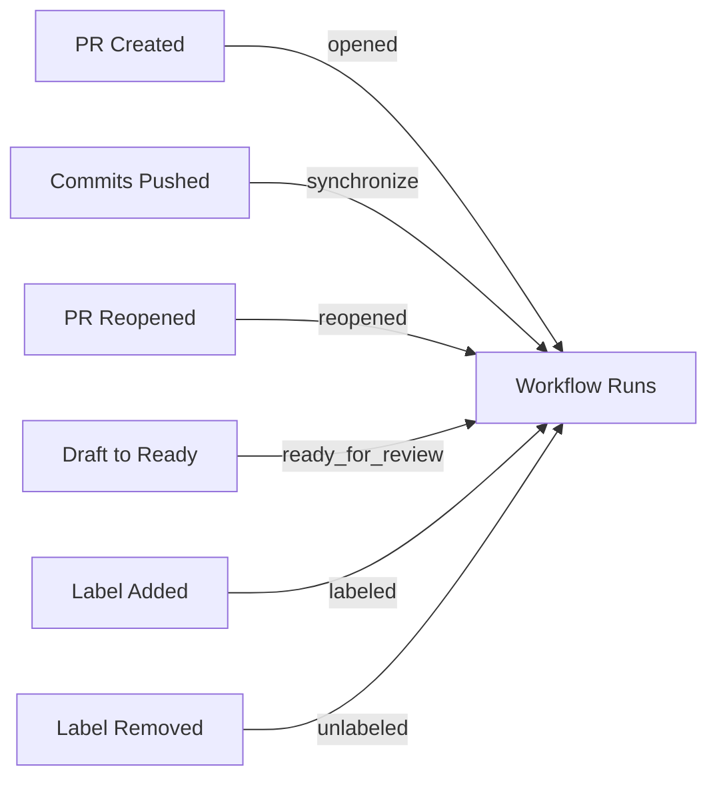

# How to Trigger Workflows on Pull Requests

Author: [nawazdhandala](https://www.github.com/nawazdhandala)

Tags: GitHub Actions, CI/CD, Pull Requests, Automation, Code Review, DevOps

Description: Learn how to configure GitHub Actions workflows to trigger on pull request events, including filtering by branches, paths, labels, and handling different PR activity types for comprehensive CI automation.

---

Pull request workflows are the backbone of CI/CD. They run tests, linting, and security scans before code reaches your main branch. GitHub Actions provides fine-grained control over when and how these workflows trigger, letting you build efficient review pipelines.

## Basic Pull Request Trigger

The simplest configuration runs on any PR:

```yaml
name: PR Checks

on: pull_request

jobs:
  test:
    runs-on: ubuntu-latest
    steps:
      - uses: actions/checkout@v4
      - run: npm ci
      - run: npm test
```

This triggers on `opened`, `synchronize` (new commits pushed), and `reopened` events by default.

## Pull Request Activity Types

Control exactly which PR activities trigger workflows:

```yaml
on:
  pull_request:
    types:
      - opened
      - synchronize
      - reopened
      - ready_for_review
      - labeled
      - unlabeled
```



Common activity types:

- `opened`: PR created
- `synchronize`: New commits pushed
- `reopened`: Closed PR reopened
- `closed`: PR closed or merged
- `ready_for_review`: Draft converted to ready
- `labeled`/`unlabeled`: Labels changed
- `assigned`/`unassigned`: Assignees changed
- `review_requested`: Review requested

## Branch Filtering

Run workflows only for PRs targeting specific branches:

```yaml
on:
  pull_request:
    branches:
      - main
      - 'release/**'
    branches-ignore:
      - 'dependabot/**'
```

Use patterns:

- `main`: Exact match
- `'release/**'`: Any branch starting with `release/`
- `'feature/*'`: Single-level wildcard

## Path Filtering

Trigger only when specific files change:

```yaml
on:
  pull_request:
    paths:
      - 'src/**'
      - 'package.json'
      - 'package-lock.json'
    paths-ignore:
      - '**.md'
      - 'docs/**'
```

This is powerful for monorepos:

```yaml
name: Frontend Tests

on:
  pull_request:
    paths:
      - 'packages/frontend/**'
      - 'packages/shared/**'

jobs:
  test-frontend:
    runs-on: ubuntu-latest
    steps:
      - uses: actions/checkout@v4
      - run: npm test --workspace=frontend
```

## Skip CI for Draft PRs

Don't waste resources on draft PRs:

```yaml
jobs:
  test:
    runs-on: ubuntu-latest
    if: github.event.pull_request.draft == false
    steps:
      - uses: actions/checkout@v4
      - run: npm test
```

Or trigger when a draft becomes ready:

```yaml
on:
  pull_request:
    types: [opened, synchronize, ready_for_review]

jobs:
  test:
    if: github.event.pull_request.draft == false
    runs-on: ubuntu-latest
    steps:
      - uses: actions/checkout@v4
      - run: npm test
```

## Label-Based Workflows

Run specific workflows based on labels:

```yaml
name: Security Scan

on:
  pull_request:
    types: [labeled]

jobs:
  security:
    if: github.event.label.name == 'security-review'
    runs-on: ubuntu-latest
    steps:
      - uses: actions/checkout@v4
      - name: Run security scan
        run: npm audit
```

Run different jobs based on multiple labels:

```yaml
jobs:
  full-test:
    if: contains(github.event.pull_request.labels.*.name, 'full-test')
    runs-on: ubuntu-latest
    steps:
      - uses: actions/checkout@v4
      - run: npm run test:full

  quick-test:
    if: "!contains(github.event.pull_request.labels.*.name, 'full-test')"
    runs-on: ubuntu-latest
    steps:
      - uses: actions/checkout@v4
      - run: npm run test:quick
```

## Fork PRs and Security

PRs from forks have restricted access:

```yaml
jobs:
  test:
    runs-on: ubuntu-latest
    steps:
      - uses: actions/checkout@v4

      # This step runs for all PRs
      - run: npm test

      # This only runs for non-fork PRs (secrets available)
      - name: Deploy preview
        if: github.event.pull_request.head.repo.full_name == github.repository
        env:
          DEPLOY_TOKEN: ${{ secrets.DEPLOY_TOKEN }}
        run: ./deploy-preview.sh
```

Use `pull_request_target` for fork PRs that need secrets:

```yaml
on:
  pull_request_target:
    types: [opened, synchronize]

jobs:
  label:
    runs-on: ubuntu-latest
    permissions:
      pull-requests: write
    steps:
      # Careful: runs in context of base repo
      - uses: actions/checkout@v4
        with:
          ref: ${{ github.event.pull_request.head.sha }}
```

**Warning**: `pull_request_target` runs with base repo permissions. Never run untrusted PR code with this trigger.

## Required Status Checks

Configure branch protection to require workflow success:

1. Go to Settings > Branches
2. Add branch protection rule for `main`
3. Enable "Require status checks to pass"
4. Select your workflow jobs

```yaml
jobs:
  test:
    name: Unit Tests  # This name appears in branch protection
    runs-on: ubuntu-latest
    steps:
      - uses: actions/checkout@v4
      - run: npm test

  lint:
    name: Linting  # Each job can be required separately
    runs-on: ubuntu-latest
    steps:
      - uses: actions/checkout@v4
      - run: npm run lint
```

## PR Metadata in Workflows

Access PR information:

```yaml
jobs:
  check:
    runs-on: ubuntu-latest
    steps:
      - name: PR Info
        run: |
          echo "PR Number: ${{ github.event.pull_request.number }}"
          echo "PR Title: ${{ github.event.pull_request.title }}"
          echo "PR Author: ${{ github.event.pull_request.user.login }}"
          echo "Base Branch: ${{ github.base_ref }}"
          echo "Head Branch: ${{ github.head_ref }}"
          echo "Changed Files: ${{ github.event.pull_request.changed_files }}"
```

## Commenting on PRs

Add automated feedback:

```yaml
jobs:
  coverage:
    runs-on: ubuntu-latest
    permissions:
      pull-requests: write
    steps:
      - uses: actions/checkout@v4

      - run: npm test -- --coverage

      - name: Comment coverage
        uses: actions/github-script@v7
        with:
          script: |
            const fs = require('fs');
            const coverage = fs.readFileSync('coverage/summary.txt', 'utf8');

            github.rest.issues.createComment({
              owner: context.repo.owner,
              repo: context.repo.repo,
              issue_number: context.issue.number,
              body: `## Coverage Report\n\`\`\`\n${coverage}\n\`\`\``
            });
```

## Multiple PR Triggers Combined

Combine triggers for comprehensive automation:

```yaml
on:
  pull_request:
    types: [opened, synchronize, reopened]
    branches: [main, develop]
    paths:
      - 'src/**'
      - 'tests/**'
      - 'package*.json'
  pull_request_review:
    types: [submitted]
  pull_request_review_comment:
    types: [created]
```

## Conditional Jobs Based on Files Changed

Use the paths-filter action for complex conditions:

```yaml
jobs:
  changes:
    runs-on: ubuntu-latest
    outputs:
      backend: ${{ steps.filter.outputs.backend }}
      frontend: ${{ steps.filter.outputs.frontend }}
    steps:
      - uses: actions/checkout@v4
      - uses: dorny/paths-filter@v3
        id: filter
        with:
          filters: |
            backend:
              - 'backend/**'
            frontend:
              - 'frontend/**'

  test-backend:
    needs: changes
    if: needs.changes.outputs.backend == 'true'
    runs-on: ubuntu-latest
    steps:
      - uses: actions/checkout@v4
      - run: cd backend && npm test

  test-frontend:
    needs: changes
    if: needs.changes.outputs.frontend == 'true'
    runs-on: ubuntu-latest
    steps:
      - uses: actions/checkout@v4
      - run: cd frontend && npm test
```

## Skip Workflow with Commit Message

Allow developers to skip CI for trivial changes:

```yaml
jobs:
  test:
    if: "!contains(github.event.head_commit.message, '[skip ci]')"
    runs-on: ubuntu-latest
    steps:
      - uses: actions/checkout@v4
      - run: npm test
```

---

Pull request triggers form the foundation of automated code review. Combine branch and path filters to run only relevant checks, use activity types to respond to review events, and leverage labels for manual control. Well-configured PR workflows catch issues early while keeping feedback fast.
