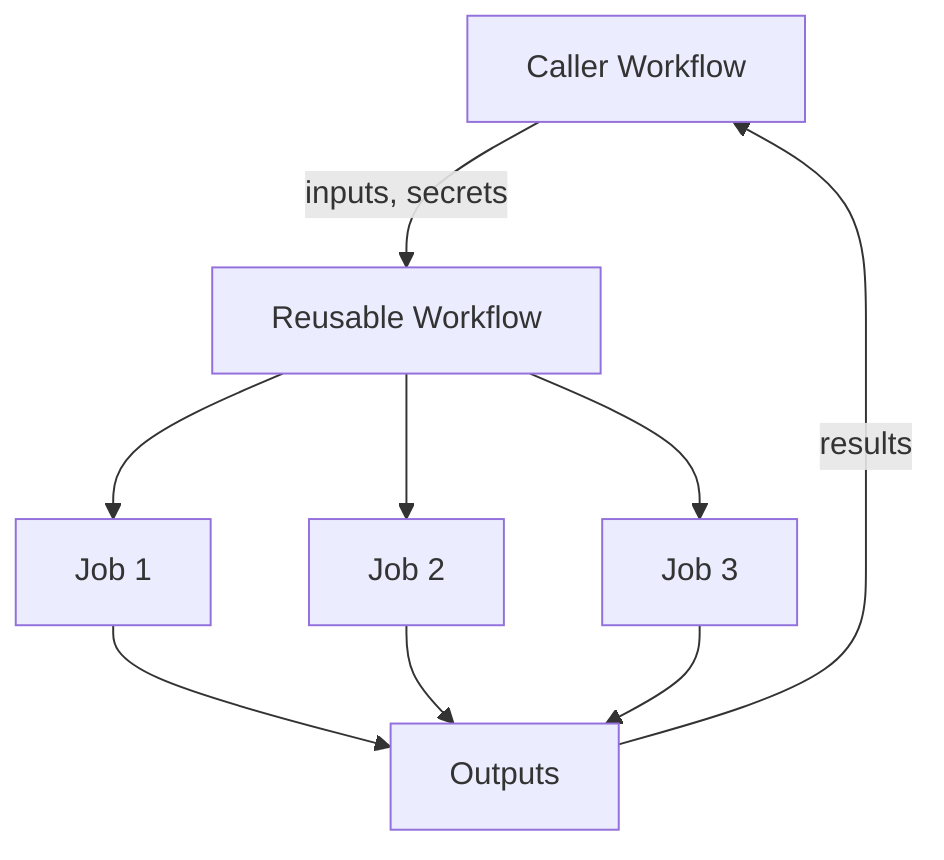

# How to Use Reusable Workflows in GitHub Actions

Author: [nawazdhandala](https://www.github.com/nawazdhandala)

Tags: GitHub Actions, CI/CD, Reusable Workflows, DRY, Automation, DevOps

Description: Learn how to create and use reusable workflows in GitHub Actions to eliminate duplication, standardize CI/CD patterns across repositories, and maintain consistent build and deployment processes organization-wide.

---

Reusable workflows are GitHub Actions' answer to code reuse. Instead of copying the same workflow across dozens of repositories, define it once and call it from anywhere. This ensures consistency, simplifies maintenance, and lets platform teams provide standardized CI/CD patterns.

## How Reusable Workflows Work

A reusable workflow is a complete workflow file that other workflows can call. The caller passes inputs and secrets; the called workflow executes and returns outputs.



## Creating a Reusable Workflow

Define a workflow with the `workflow_call` trigger:

```yaml
# .github/workflows/ci-node.yml
name: Node.js CI

on:
  workflow_call:
    inputs:
      node-version:
        description: 'Node.js version to use'
        required: false
        default: '20'
        type: string
      working-directory:
        description: 'Directory containing package.json'
        required: false
        default: '.'
        type: string
    secrets:
      NPM_TOKEN:
        description: 'NPM authentication token'
        required: false
    outputs:
      test-result:
        description: 'Test execution result'
        value: ${{ jobs.test.outputs.result }}

jobs:
  lint:
    runs-on: ubuntu-latest
    defaults:
      run:
        working-directory: ${{ inputs.working-directory }}
    steps:
      - uses: actions/checkout@v4

      - uses: actions/setup-node@v4
        with:
          node-version: ${{ inputs.node-version }}
          cache: 'npm'
          cache-dependency-path: ${{ inputs.working-directory }}/package-lock.json

      - run: npm ci
      - run: npm run lint

  test:
    runs-on: ubuntu-latest
    outputs:
      result: ${{ steps.test.outputs.result }}
    defaults:
      run:
        working-directory: ${{ inputs.working-directory }}
    steps:
      - uses: actions/checkout@v4

      - uses: actions/setup-node@v4
        with:
          node-version: ${{ inputs.node-version }}
          cache: 'npm'
          cache-dependency-path: ${{ inputs.working-directory }}/package-lock.json

      - run: npm ci

      - name: Run tests
        id: test
        run: |
          npm test
          echo "result=success" >> $GITHUB_OUTPUT
```

## Calling a Reusable Workflow

### From the Same Repository

```yaml
# .github/workflows/main.yml
name: Main CI

on:
  push:
    branches: [main]
  pull_request:

jobs:
  ci:
    uses: ./.github/workflows/ci-node.yml
    with:
      node-version: '20'
```

### From Another Repository

```yaml
name: CI Pipeline

on: [push, pull_request]

jobs:
  ci:
    uses: my-org/shared-workflows/.github/workflows/ci-node.yml@main
    with:
      node-version: '22'
    secrets: inherit
```

### With Specific Version

```yaml
jobs:
  ci:
    # Use a specific commit SHA for reproducibility
    uses: my-org/shared-workflows/.github/workflows/ci-node.yml@a1b2c3d4

  ci-tagged:
    # Use a release tag
    uses: my-org/shared-workflows/.github/workflows/ci-node.yml@v1.2.0
```

## Passing Secrets

### Inherit All Secrets

```yaml
jobs:
  deploy:
    uses: ./.github/workflows/deploy.yml
    secrets: inherit
```

### Pass Specific Secrets

```yaml
jobs:
  deploy:
    uses: ./.github/workflows/deploy.yml
    secrets:
      DEPLOY_KEY: ${{ secrets.PROD_DEPLOY_KEY }}
      AWS_ROLE_ARN: ${{ secrets.AWS_PROD_ROLE }}
```

### Define Required Secrets

In the reusable workflow:

```yaml
on:
  workflow_call:
    secrets:
      DEPLOY_KEY:
        required: true
        description: 'SSH key for deployment'
      API_TOKEN:
        required: false
        description: 'Optional API token'
```

## Workflow Outputs

Return values from reusable workflows:

```yaml
# Reusable workflow
on:
  workflow_call:
    outputs:
      image-tag:
        description: 'Docker image tag'
        value: ${{ jobs.build.outputs.tag }}
      deploy-url:
        description: 'Deployment URL'
        value: ${{ jobs.deploy.outputs.url }}

jobs:
  build:
    runs-on: ubuntu-latest
    outputs:
      tag: ${{ steps.build.outputs.tag }}
    steps:
      - id: build
        run: echo "tag=${{ github.sha }}" >> $GITHUB_OUTPUT

  deploy:
    needs: build
    runs-on: ubuntu-latest
    outputs:
      url: ${{ steps.deploy.outputs.url }}
    steps:
      - id: deploy
        run: echo "url=https://app-${{ needs.build.outputs.tag }}.example.com" >> $GITHUB_OUTPUT
```

Use outputs in the caller:

```yaml
jobs:
  build-and-deploy:
    uses: ./.github/workflows/deploy.yml
    secrets: inherit

  notify:
    needs: build-and-deploy
    runs-on: ubuntu-latest
    steps:
      - run: |
          echo "Deployed image: ${{ needs.build-and-deploy.outputs.image-tag }}"
          echo "URL: ${{ needs.build-and-deploy.outputs.deploy-url }}"
```

## Matrix with Reusable Workflows

Call reusable workflows in a matrix:

```yaml
name: Multi-Environment Deploy

on:
  workflow_dispatch:

jobs:
  deploy:
    strategy:
      matrix:
        environment: [staging, production]
    uses: ./.github/workflows/deploy.yml
    with:
      environment: ${{ matrix.environment }}
    secrets: inherit
```

## Conditional Workflow Calls

```yaml
jobs:
  changes:
    runs-on: ubuntu-latest
    outputs:
      frontend: ${{ steps.filter.outputs.frontend }}
      backend: ${{ steps.filter.outputs.backend }}
    steps:
      - uses: actions/checkout@v4
      - uses: dorny/paths-filter@v3
        id: filter
        with:
          filters: |
            frontend:
              - 'frontend/**'
            backend:
              - 'backend/**'

  frontend-ci:
    needs: changes
    if: needs.changes.outputs.frontend == 'true'
    uses: ./.github/workflows/ci-node.yml
    with:
      working-directory: frontend

  backend-ci:
    needs: changes
    if: needs.changes.outputs.backend == 'true'
    uses: ./.github/workflows/ci-python.yml
    with:
      working-directory: backend
```

## Centralized Workflow Repository

Create a shared workflows repository for your organization:

```
shared-workflows/
  .github/
    workflows/
      ci-node.yml
      ci-python.yml
      ci-go.yml
      deploy-kubernetes.yml
      deploy-aws.yml
      security-scan.yml
```

Make workflows available:

1. Set repository visibility to public or internal
2. For private repos, configure workflow permissions in repository settings

## Versioning Reusable Workflows

Use tags and branches for stable references:

```yaml
# Development - use branch
uses: my-org/shared-workflows/.github/workflows/ci.yml@main

# Stable - use tag
uses: my-org/shared-workflows/.github/workflows/ci.yml@v1.0.0

# Immutable - use commit SHA
uses: my-org/shared-workflows/.github/workflows/ci.yml@abc123def456
```

## Nesting Reusable Workflows

Reusable workflows can call other reusable workflows (up to 4 levels deep):

```yaml
# .github/workflows/full-ci-cd.yml
on:
  workflow_call:
    inputs:
      environment:
        type: string
        required: true

jobs:
  ci:
    uses: ./.github/workflows/ci.yml
    secrets: inherit

  deploy:
    needs: ci
    uses: ./.github/workflows/deploy.yml
    with:
      environment: ${{ inputs.environment }}
    secrets: inherit
```

## Permissions in Reusable Workflows

Callers must grant permissions:

```yaml
jobs:
  deploy:
    uses: ./.github/workflows/deploy.yml
    permissions:
      id-token: write
      contents: read
      packages: write
    secrets: inherit
```

## Best Practices

1. **Version workflows**: Use semantic versioning for breaking changes
2. **Document inputs**: Provide clear descriptions
3. **Set sensible defaults**: Make common cases easy
4. **Use outputs**: Return useful information
5. **Handle failures gracefully**: Provide meaningful error messages
6. **Test workflows**: Validate in a test repository before wide deployment

```yaml
on:
  workflow_call:
    inputs:
      environment:
        description: |
          Target deployment environment.
          Valid values: development, staging, production
        required: true
        type: string
      skip-tests:
        description: 'Skip test execution (use with caution)'
        required: false
        default: false
        type: boolean
```

---

Reusable workflows transform scattered CI/CD configurations into a managed platform. Define patterns once, use them everywhere, and update in a single place. Start with your most common workflows - Node.js CI, Docker builds, deployments - and watch maintenance burden disappear.
