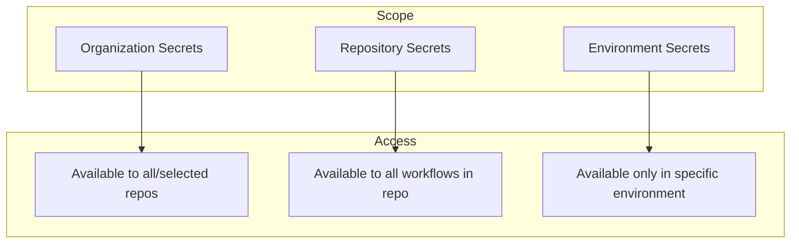

# How to Use Secrets in GitHub Actions Workflows

Author: [nawazdhandala](https://www.github.com/nawazdhandala)

Tags: GitHub Actions, CI/CD, Secrets, Security, DevOps, Environment Variables

Description: Learn how to securely manage and use secrets in GitHub Actions workflows, including repository secrets, environment secrets, organization secrets, and best practices for protecting sensitive credentials.

---

CI/CD pipelines need access to sensitive data - API keys, database passwords, deployment credentials. GitHub Actions provides a secure secrets management system that encrypts values at rest and masks them in logs. Here's how to use it effectively.

## Types of Secrets in GitHub Actions

GitHub offers three levels of secrets:



- **Repository secrets**: Available to all workflows in a single repository
- **Environment secrets**: Only available when a job targets a specific environment
- **Organization secrets**: Shared across multiple repositories

## Creating Repository Secrets

Navigate to Settings > Secrets and variables > Actions in your repository. Click "New repository secret" and add your key-value pair.

Or use the GitHub CLI:

```bash
# Set a secret from terminal input
gh secret set API_KEY

# Set from a file
gh secret set PRIVATE_KEY < private-key.pem

# Set from environment variable
gh secret set DATABASE_URL --body "$DATABASE_URL"
```

## Using Secrets in Workflows

Access secrets through the `secrets` context:

```yaml
name: Deploy Application

on:
  push:
    branches: [main]

jobs:
  deploy:
    runs-on: ubuntu-latest
    steps:
      - uses: actions/checkout@v4

      - name: Deploy to production
        env:
          API_KEY: ${{ secrets.API_KEY }}
          DATABASE_URL: ${{ secrets.DATABASE_URL }}
        run: |
          ./deploy.sh
```

Secrets are automatically masked in logs. If a secret value appears in output, GitHub replaces it with `***`.

## Environment Secrets

Environment secrets add an extra layer of protection. Define environments with approval requirements and specific secrets:

```yaml
name: Production Deploy

on:
  push:
    branches: [main]

jobs:
  deploy:
    runs-on: ubuntu-latest
    environment:
      name: production
      url: https://app.example.com
    steps:
      - uses: actions/checkout@v4

      - name: Deploy
        env:
          # This secret only exists in the production environment
          PROD_API_KEY: ${{ secrets.PROD_API_KEY }}
        run: ./deploy.sh
```

Environment secrets override repository secrets with the same name, allowing different values per environment.

## Passing Secrets to Actions

Pass secrets as inputs to actions:

```yaml
      - name: Login to Docker Hub
        uses: docker/login-action@v3
        with:
          username: ${{ secrets.DOCKER_USERNAME }}
          password: ${{ secrets.DOCKER_PASSWORD }}
```

For actions that need multiple secrets:

```yaml
      - name: Deploy to AWS
        uses: aws-actions/configure-aws-credentials@v4
        with:
          aws-access-key-id: ${{ secrets.AWS_ACCESS_KEY_ID }}
          aws-secret-access-key: ${{ secrets.AWS_SECRET_ACCESS_KEY }}
          aws-region: us-east-1
```

## Secrets in Reusable Workflows

Pass secrets to called workflows with `secrets: inherit` or explicitly:

```yaml
jobs:
  deploy:
    uses: ./.github/workflows/deploy.yml
    with:
      environment: production
    secrets: inherit  # Pass all secrets

  deploy-explicit:
    uses: ./.github/workflows/deploy.yml
    with:
      environment: staging
    secrets:
      API_KEY: ${{ secrets.STAGING_API_KEY }}
      DATABASE_URL: ${{ secrets.STAGING_DB_URL }}
```

In the called workflow, declare expected secrets:

```yaml
on:
  workflow_call:
    secrets:
      API_KEY:
        required: true
      DATABASE_URL:
        required: false

jobs:
  deploy:
    runs-on: ubuntu-latest
    steps:
      - name: Use secrets
        env:
          API_KEY: ${{ secrets.API_KEY }}
        run: echo "Deploying with API key"
```

## GITHUB_TOKEN - The Built-in Secret

Every workflow automatically receives a `GITHUB_TOKEN` with repository permissions:

```yaml
jobs:
  create-release:
    runs-on: ubuntu-latest
    permissions:
      contents: write  # Required for creating releases
    steps:
      - uses: actions/checkout@v4

      - name: Create Release
        env:
          GITHUB_TOKEN: ${{ secrets.GITHUB_TOKEN }}
        run: |
          gh release create v1.0.0 --generate-notes
```

Control token permissions with the `permissions` key:

```yaml
jobs:
  pr-comment:
    runs-on: ubuntu-latest
    permissions:
      pull-requests: write
      contents: read
    steps:
      - name: Comment on PR
        uses: actions/github-script@v7
        with:
          script: |
            github.rest.issues.createComment({
              owner: context.repo.owner,
              repo: context.repo.repo,
              issue_number: context.issue.number,
              body: 'Tests passed!'
            })
```

## Secrets in Matrix Builds

Use secrets across matrix configurations:

```yaml
jobs:
  test:
    runs-on: ubuntu-latest
    strategy:
      matrix:
        environment: [staging, production]
    steps:
      - name: Run tests
        env:
          API_KEY: ${{ matrix.environment == 'production' && secrets.PROD_API_KEY || secrets.STAGING_API_KEY }}
        run: npm test
```

## Secrets for Self-Hosted Runners

Self-hosted runners can access secrets passed to them. Use environment-level secrets to restrict which runners can access sensitive data:

```yaml
jobs:
  secure-deploy:
    runs-on: [self-hosted, production]
    environment: production  # Only runners in this env get these secrets
    steps:
      - name: Deploy
        env:
          DEPLOY_KEY: ${{ secrets.DEPLOY_KEY }}
        run: ./deploy.sh
```

## Security Best Practices

### 1. Use Least Privilege

Grant only necessary permissions:

```yaml
permissions:
  contents: read
  packages: write
```

### 2. Rotate Secrets Regularly

Set up rotation reminders:

```yaml
      - name: Check secret age
        run: |
          # Secrets should be rotated every 90 days
          echo "Remember to rotate secrets quarterly"
```

### 3. Never Log Secrets

Avoid commands that might expose secrets:

```yaml
      # BAD - might leak in logs
      - run: echo ${{ secrets.API_KEY }}

      # GOOD - use environment variables
      - run: ./script.sh
        env:
          API_KEY: ${{ secrets.API_KEY }}
```

### 4. Validate Required Secrets

Check that secrets exist before using them:

```yaml
      - name: Validate secrets
        run: |
          if [ -z "$API_KEY" ]; then
            echo "Error: API_KEY secret not set"
            exit 1
          fi
        env:
          API_KEY: ${{ secrets.API_KEY }}
```

### 5. Use OpenID Connect for Cloud Providers

Avoid storing long-lived credentials. Use OIDC authentication:

```yaml
jobs:
  deploy:
    runs-on: ubuntu-latest
    permissions:
      id-token: write
      contents: read
    steps:
      - uses: aws-actions/configure-aws-credentials@v4
        with:
          role-to-assume: arn:aws:iam::123456789012:role/GitHubActionsRole
          aws-region: us-east-1
          # No access keys needed - uses OIDC
```

### 6. Audit Secret Access

Review which workflows and jobs access secrets:

```bash
# List all secrets
gh secret list

# View workflow runs that used secrets
gh run list --workflow=deploy.yml
```

## Handling Secret Limitations

Secrets have constraints:

- Maximum 48 KB per secret
- Maximum 100 secrets per repository
- Can't be used in `if` conditions directly

For large files, encode them:

```bash
# Encode
base64 -i certificate.pem | gh secret set CERTIFICATE

# Decode in workflow
- name: Restore certificate
  run: echo "$CERTIFICATE" | base64 --decode > certificate.pem
  env:
    CERTIFICATE: ${{ secrets.CERTIFICATE }}
```

---

Secrets management is fundamental to secure CI/CD. Use environment secrets for production deployments, OIDC for cloud providers, and always follow the principle of least privilege. With proper secrets handling, your pipelines stay secure while automating sensitive operations.
