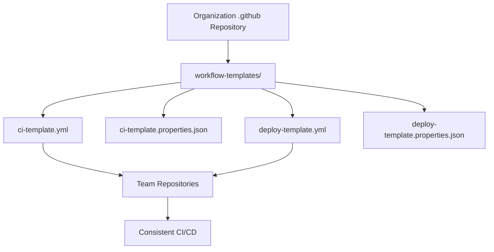

# How to Use Workflow Templates in GitHub Actions

Author: [nawazdhandala](https://www.github.com/nawazdhandala)

Tags: GitHub Actions, CI/CD, Workflow Templates, DevOps, Automation, Best Practices

Description: Learn how to create and use workflow templates in GitHub Actions to standardize CI/CD pipelines across your organization, reduce duplication, and enforce best practices.

---

Managing CI/CD workflows across multiple repositories becomes challenging as your organization grows. Workflow templates let you define standardized pipelines that teams can adopt with minimal configuration. This guide covers creating, publishing, and using workflow templates effectively.

## Understanding Workflow Templates

Workflow templates are pre-configured GitHub Actions workflows stored in a special `.github` repository. When users create new workflows, these templates appear as suggestions, making it easy to adopt organizational standards.



## Creating Your First Workflow Template

Workflow templates must be stored in an organization's `.github` repository. Each template consists of two files: the workflow YAML and a properties JSON file.

### Step 1: Set Up the Repository Structure

```
.github/
  workflow-templates/
    nodejs-ci.yml
    nodejs-ci.properties.json
    python-ci.yml
    python-ci.properties.json
    docker-build.yml
    docker-build.properties.json
```

### Step 2: Create the Workflow Template

Create a Node.js CI template:

```yaml
# workflow-templates/nodejs-ci.yml
name: Node.js CI

on:
  push:
    branches: [$default-branch]
  pull_request:
    branches: [$default-branch]

jobs:
  build:
    runs-on: ubuntu-latest

    strategy:
      matrix:
        node-version: [18.x, 20.x]

    steps:
      - name: Checkout repository
        uses: actions/checkout@v4

      - name: Set up Node.js ${{ matrix.node-version }}
        uses: actions/setup-node@v4
        with:
          node-version: ${{ matrix.node-version }}
          cache: npm

      - name: Install dependencies
        run: npm ci

      - name: Run linter
        run: npm run lint

      - name: Run tests
        run: npm test

      - name: Build application
        run: npm run build
```

The `$default-branch` placeholder automatically resolves to the repository's default branch.

### Step 3: Create the Properties File

```json
{
  "name": "Node.js CI Pipeline",
  "description": "Standard CI pipeline for Node.js applications with linting, testing, and building",
  "iconName": "nodejs",
  "categories": ["Node.js", "CI"],
  "filePatterns": ["package.json"]
}
```

Properties file fields:

- `name`: Display name in the Actions tab
- `description`: Explains what the template does
- `iconName`: Icon from GitHub's octicons or language icons
- `categories`: Helps users filter templates
- `filePatterns`: Suggests this template when these files exist

## Template Variables and Placeholders

GitHub provides several placeholders for templates:

| Placeholder | Description |
|-------------|-------------|
| `$default-branch` | Repository's default branch |
| `$protected-branches` | Protected branches |
| `$cron-daily` | Daily cron schedule |

Example using multiple placeholders:

```yaml
name: Security Scan

on:
  push:
    branches: [$default-branch, $protected-branches]
  schedule:
    - cron: $cron-daily

jobs:
  security:
    runs-on: ubuntu-latest
    steps:
      - uses: actions/checkout@v4
      - name: Run security scan
        uses: your-org/security-action@v1
```

## Creating a Python CI Template

```yaml
# workflow-templates/python-ci.yml
name: Python CI

on:
  push:
    branches: [$default-branch]
  pull_request:
    branches: [$default-branch]

jobs:
  test:
    runs-on: ubuntu-latest
    strategy:
      matrix:
        python-version: ['3.10', '3.11', '3.12']

    steps:
      - name: Checkout repository
        uses: actions/checkout@v4

      - name: Set up Python ${{ matrix.python-version }}
        uses: actions/setup-python@v5
        with:
          python-version: ${{ matrix.python-version }}
          cache: pip

      - name: Install dependencies
        run: |
          python -m pip install --upgrade pip
          pip install -r requirements.txt
          pip install pytest pytest-cov flake8

      - name: Lint with flake8
        run: flake8 . --count --select=E9,F63,F7,F82 --show-source --statistics

      - name: Run tests with coverage
        run: pytest --cov=. --cov-report=xml

      - name: Upload coverage
        uses: codecov/codecov-action@v4
        with:
          files: coverage.xml
```

Properties file:

```json
{
  "name": "Python CI Pipeline",
  "description": "Standard CI pipeline for Python applications with linting, testing, and coverage reporting",
  "iconName": "python",
  "categories": ["Python", "CI"],
  "filePatterns": ["requirements.txt", "pyproject.toml", "setup.py"]
}
```

## Docker Build and Push Template

```yaml
# workflow-templates/docker-build.yml
name: Docker Build and Push

on:
  push:
    branches: [$default-branch]
    tags: ['v*']
  pull_request:
    branches: [$default-branch]

env:
  REGISTRY: ghcr.io
  IMAGE_NAME: ${{ github.repository }}

jobs:
  build:
    runs-on: ubuntu-latest
    permissions:
      contents: read
      packages: write

    steps:
      - name: Checkout repository
        uses: actions/checkout@v4

      - name: Set up Docker Buildx
        uses: docker/setup-buildx-action@v3

      - name: Log in to Container Registry
        if: github.event_name != 'pull_request'
        uses: docker/login-action@v3
        with:
          registry: ${{ env.REGISTRY }}
          username: ${{ github.actor }}
          password: ${{ secrets.GITHUB_TOKEN }}

      - name: Extract metadata for Docker
        id: meta
        uses: docker/metadata-action@v5
        with:
          images: ${{ env.REGISTRY }}/${{ env.IMAGE_NAME }}
          tags: |
            type=ref,event=branch
            type=semver,pattern={{version}}
            type=sha

      - name: Build and push Docker image
        uses: docker/build-push-action@v5
        with:
          context: .
          push: ${{ github.event_name != 'pull_request' }}
          tags: ${{ steps.meta.outputs.tags }}
          labels: ${{ steps.meta.outputs.labels }}
          cache-from: type=gha
          cache-to: type=gha,mode=max
```

## Using Templates in Repositories

Once templates are published to your organization's `.github` repository, team members can use them:

1. Navigate to your repository's Actions tab
2. Click "New workflow"
3. Find your organization's templates under "Workflows created by [org]"
4. Click "Configure" on the desired template
5. Customize as needed and commit

## Creating Reusable Workflows

For more flexibility, create reusable workflows that can be called from other workflows:

```yaml
# .github/workflows/reusable-deploy.yml
name: Reusable Deploy Workflow

on:
  workflow_call:
    inputs:
      environment:
        required: true
        type: string
      image-tag:
        required: true
        type: string
    secrets:
      deploy-token:
        required: true

jobs:
  deploy:
    runs-on: ubuntu-latest
    environment: ${{ inputs.environment }}
    steps:
      - name: Deploy to ${{ inputs.environment }}
        run: |
          echo "Deploying ${{ inputs.image-tag }} to ${{ inputs.environment }}"
          # Your deployment script here
        env:
          DEPLOY_TOKEN: ${{ secrets.deploy-token }}
```

Call it from other repositories:

```yaml
name: Deploy Application

on:
  push:
    branches: [main]

jobs:
  deploy-staging:
    uses: your-org/.github/.github/workflows/reusable-deploy.yml@main
    with:
      environment: staging
      image-tag: ${{ github.sha }}
    secrets:
      deploy-token: ${{ secrets.DEPLOY_TOKEN }}

  deploy-production:
    needs: deploy-staging
    uses: your-org/.github/.github/workflows/reusable-deploy.yml@main
    with:
      environment: production
      image-tag: ${{ github.sha }}
    secrets:
      deploy-token: ${{ secrets.DEPLOY_TOKEN }}
```

## Template Versioning

Version your templates using Git tags:

```yaml
jobs:
  build:
    uses: your-org/.github/.github/workflows/ci.yml@v2.0.0
```

This ensures stability - teams can upgrade on their own schedule.

## Best Practices for Workflow Templates

1. **Keep templates focused** - One template per purpose (CI, deploy, scan)
2. **Use sensible defaults** - Templates should work out of the box
3. **Document customization points** - Add comments explaining what to change
4. **Version your templates** - Use tags for breaking changes
5. **Test templates** - Have a test repository that uses each template
6. **Provide escape hatches** - Allow teams to override defaults when needed

## Summary

Workflow templates standardize CI/CD practices across your organization. Key takeaways:

- Store templates in the organization's `.github` repository
- Use properties files to help users discover appropriate templates
- Leverage placeholders like `$default-branch` for flexibility
- Consider reusable workflows for more complex sharing scenarios
- Version templates to manage breaking changes

With well-designed templates, teams can adopt best practices quickly while maintaining the flexibility to customize when needed.
