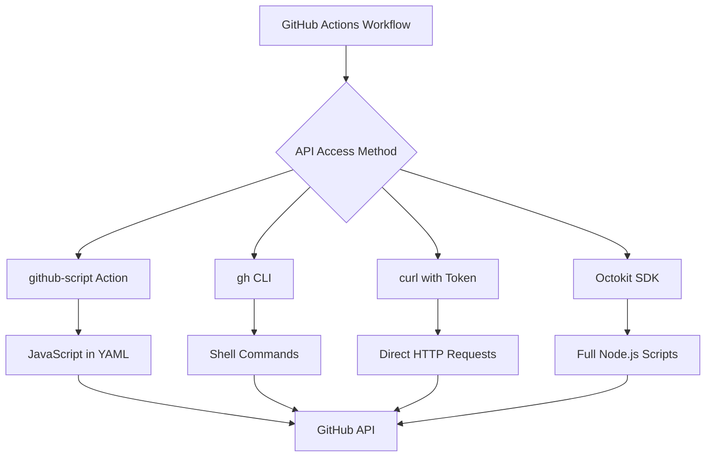

# How to Use GitHub API in GitHub Actions

Author: [nawazdhandala](https://www.github.com/nawazdhandala)

Tags: GitHub Actions, CI/CD, GitHub API, Automation, Octokit, DevOps

Description: Learn how to use the GitHub API in GitHub Actions to automate repository management, create issues, manage PRs, and build powerful integrations.

> The GitHub API turns your workflows into powerful automation engines that can manage your entire development process.

GitHub Actions can do more than run tests and deploy code. Through the GitHub API, workflows can create issues, manage pull requests, update labels, trigger other workflows, and automate nearly every aspect of repository management. This guide covers using the GitHub API effectively within your workflows.

## API Access Methods



## Using actions/github-script

The most convenient way to use the API in workflows:

```yaml
name: GitHub API Examples

on:
  issues:
    types: [opened]

jobs:
  respond:
    runs-on: ubuntu-latest
    steps:
      - name: Add comment to issue
        uses: actions/github-script@v7
        with:
          script: |
            await github.rest.issues.createComment({
              owner: context.repo.owner,
              repo: context.repo.repo,
              issue_number: context.issue.number,
              body: 'Thanks for opening this issue! We will review it soon.'
            });

      - name: Add labels
        uses: actions/github-script@v7
        with:
          script: |
            await github.rest.issues.addLabels({
              owner: context.repo.owner,
              repo: context.repo.repo,
              issue_number: context.issue.number,
              labels: ['triage', 'needs-review']
            });
```

## Using GitHub CLI (gh)

The `gh` CLI is pre-installed on GitHub-hosted runners:

```yaml
name: GitHub CLI Examples

on:
  workflow_dispatch:

jobs:
  cli-examples:
    runs-on: ubuntu-latest
    env:
      GH_TOKEN: ${{ secrets.GITHUB_TOKEN }}

    steps:
      - name: List open PRs
        run: gh pr list --state open --json number,title,author

      - name: Create an issue
        run: |
          gh issue create \
            --title "Automated Issue" \
            --body "This issue was created by a workflow" \
            --label "automated"

      - name: Get repository info
        run: gh repo view --json name,description,stargazerCount

      - name: Merge a PR
        run: gh pr merge 123 --squash --delete-branch

      - name: Create a release
        run: |
          gh release create v1.0.0 \
            --title "Release v1.0.0" \
            --notes "First release" \
            --target main
```

## Using curl with REST API

Direct API calls for maximum control:

```yaml
name: Curl API Examples

on:
  workflow_dispatch:

jobs:
  api-calls:
    runs-on: ubuntu-latest
    steps:
      - name: Get repository info
        run: |
          curl -s \
            -H "Authorization: Bearer ${{ secrets.GITHUB_TOKEN }}" \
            -H "Accept: application/vnd.github.v3+json" \
            "https://api.github.com/repos/${{ github.repository }}"

      - name: Create a label
        run: |
          curl -X POST \
            -H "Authorization: Bearer ${{ secrets.GITHUB_TOKEN }}" \
            -H "Accept: application/vnd.github.v3+json" \
            "https://api.github.com/repos/${{ github.repository }}/labels" \
            -d '{"name":"priority:high","color":"FF0000","description":"High priority issue"}'

      - name: Update issue
        run: |
          curl -X PATCH \
            -H "Authorization: Bearer ${{ secrets.GITHUB_TOKEN }}" \
            -H "Accept: application/vnd.github.v3+json" \
            "https://api.github.com/repos/${{ github.repository }}/issues/1" \
            -d '{"state":"closed"}'
```

## Managing Pull Requests

Automate PR workflows:

```yaml
name: PR Automation

on:
  pull_request:
    types: [opened, synchronize]

jobs:
  pr-automation:
    runs-on: ubuntu-latest
    steps:
      - uses: actions/checkout@v4

      - name: Auto-assign reviewers
        uses: actions/github-script@v7
        with:
          script: |
            const { data: files } = await github.rest.pulls.listFiles({
              owner: context.repo.owner,
              repo: context.repo.repo,
              pull_number: context.issue.number
            });

            const reviewers = new Set();

            // Assign based on changed files
            files.forEach(file => {
              if (file.filename.startsWith('frontend/')) {
                reviewers.add('frontend-team');
              }
              if (file.filename.startsWith('backend/')) {
                reviewers.add('backend-team');
              }
            });

            if (reviewers.size > 0) {
              await github.rest.pulls.requestReviewers({
                owner: context.repo.owner,
                repo: context.repo.repo,
                pull_number: context.issue.number,
                team_reviewers: Array.from(reviewers)
              });
            }

      - name: Check PR size
        uses: actions/github-script@v7
        with:
          script: |
            const { data: pr } = await github.rest.pulls.get({
              owner: context.repo.owner,
              repo: context.repo.repo,
              pull_number: context.issue.number
            });

            const additions = pr.additions;
            const deletions = pr.deletions;
            const total = additions + deletions;

            let sizeLabel;
            if (total < 50) sizeLabel = 'size/S';
            else if (total < 200) sizeLabel = 'size/M';
            else if (total < 500) sizeLabel = 'size/L';
            else sizeLabel = 'size/XL';

            // Remove existing size labels
            const { data: labels } = await github.rest.issues.listLabelsOnIssue({
              owner: context.repo.owner,
              repo: context.repo.repo,
              issue_number: context.issue.number
            });

            for (const label of labels) {
              if (label.name.startsWith('size/')) {
                await github.rest.issues.removeLabel({
                  owner: context.repo.owner,
                  repo: context.repo.repo,
                  issue_number: context.issue.number,
                  name: label.name
                });
              }
            }

            // Add new size label
            await github.rest.issues.addLabels({
              owner: context.repo.owner,
              repo: context.repo.repo,
              issue_number: context.issue.number,
              labels: [sizeLabel]
            });
```

## Managing Issues

Automate issue triage and management:

```yaml
name: Issue Management

on:
  issues:
    types: [opened, labeled]

jobs:
  triage:
    runs-on: ubuntu-latest
    steps:
      - name: Auto-label based on content
        if: github.event.action == 'opened'
        uses: actions/github-script@v7
        with:
          script: |
            const issue = context.payload.issue;
            const body = issue.body.toLowerCase();
            const title = issue.title.toLowerCase();
            const labels = [];

            // Detect issue type
            if (body.includes('bug') || title.includes('bug')) {
              labels.push('bug');
            }
            if (body.includes('feature') || title.includes('feature')) {
              labels.push('enhancement');
            }
            if (body.includes('documentation') || title.includes('docs')) {
              labels.push('documentation');
            }
            if (body.includes('security') || title.includes('security')) {
              labels.push('security');
            }

            if (labels.length > 0) {
              await github.rest.issues.addLabels({
                owner: context.repo.owner,
                repo: context.repo.repo,
                issue_number: issue.number,
                labels: labels
              });
            }

      - name: Assign to project
        if: contains(github.event.issue.labels.*.name, 'bug')
        uses: actions/github-script@v7
        with:
          script: |
            // Add to GitHub Project (Projects V2)
            const mutation = `
              mutation($projectId: ID!, $contentId: ID!) {
                addProjectV2ItemById(input: {
                  projectId: $projectId
                  contentId: $contentId
                }) {
                  item {
                    id
                  }
                }
              }
            `;

            await github.graphql(mutation, {
              projectId: 'PROJECT_ID',
              contentId: context.payload.issue.node_id
            });
```

## Creating and Managing Releases

Automate release management:

```yaml
name: Release Management

on:
  push:
    tags:
      - 'v*'

jobs:
  release:
    runs-on: ubuntu-latest
    steps:
      - uses: actions/checkout@v4
        with:
          fetch-depth: 0

      - name: Build release assets
        run: |
          npm ci
          npm run build
          tar -czf dist.tar.gz dist/

      - name: Create release with assets
        uses: actions/github-script@v7
        with:
          script: |
            const fs = require('fs');
            const tag = context.ref.replace('refs/tags/', '');

            // Get commits since last tag
            const { data: tags } = await github.rest.repos.listTags({
              owner: context.repo.owner,
              repo: context.repo.repo,
              per_page: 2
            });

            let releaseNotes = '';
            if (tags.length > 1) {
              const { data: comparison } = await github.rest.repos.compareCommits({
                owner: context.repo.owner,
                repo: context.repo.repo,
                base: tags[1].name,
                head: tag
              });

              releaseNotes = comparison.commits
                .map(c => `- ${c.commit.message.split('\n')[0]}`)
                .join('\n');
            }

            // Create the release
            const { data: release } = await github.rest.repos.createRelease({
              owner: context.repo.owner,
              repo: context.repo.repo,
              tag_name: tag,
              name: `Release ${tag}`,
              body: `## Changes\n\n${releaseNotes}`,
              draft: false,
              prerelease: tag.includes('-')
            });

            // Upload assets
            const asset = fs.readFileSync('dist.tar.gz');
            await github.rest.repos.uploadReleaseAsset({
              owner: context.repo.owner,
              repo: context.repo.repo,
              release_id: release.id,
              name: 'dist.tar.gz',
              data: asset
            });
```

## Cross-Repository Operations

Interact with other repositories:

```yaml
name: Cross-Repo Operations

on:
  workflow_dispatch:

jobs:
  cross-repo:
    runs-on: ubuntu-latest
    steps:
      - name: Create issue in another repo
        uses: actions/github-script@v7
        with:
          github-token: ${{ secrets.CROSS_REPO_TOKEN }}
          script: |
            await github.rest.issues.create({
              owner: 'other-org',
              repo: 'other-repo',
              title: 'Triggered from ${{ github.repository }}',
              body: 'This issue was created by a workflow in another repository.'
            });

      - name: Trigger workflow in another repo
        uses: actions/github-script@v7
        with:
          github-token: ${{ secrets.CROSS_REPO_TOKEN }}
          script: |
            await github.rest.repos.createDispatchEvent({
              owner: 'other-org',
              repo: 'other-repo',
              event_type: 'deploy',
              client_payload: {
                source: '${{ github.repository }}',
                sha: '${{ github.sha }}'
              }
            });
```

## GraphQL API Usage

For complex queries, use GraphQL:

```yaml
name: GraphQL Examples

on:
  workflow_dispatch:

jobs:
  graphql:
    runs-on: ubuntu-latest
    steps:
      - name: Query with GraphQL
        uses: actions/github-script@v7
        with:
          script: |
            const query = `
              query($owner: String!, $repo: String!) {
                repository(owner: $owner, name: $repo) {
                  issues(first: 10, states: OPEN) {
                    nodes {
                      number
                      title
                      author {
                        login
                      }
                      labels(first: 5) {
                        nodes {
                          name
                        }
                      }
                    }
                  }
                  pullRequests(first: 10, states: OPEN) {
                    nodes {
                      number
                      title
                      mergeable
                      reviews(first: 5) {
                        nodes {
                          state
                          author {
                            login
                          }
                        }
                      }
                    }
                  }
                }
              }
            `;

            const result = await github.graphql(query, {
              owner: context.repo.owner,
              repo: context.repo.repo
            });

            console.log(JSON.stringify(result, null, 2));
```

## Handling Pagination

Properly handle paginated responses:

```yaml
name: Paginated API Calls

on:
  workflow_dispatch:

jobs:
  paginate:
    runs-on: ubuntu-latest
    steps:
      - name: Get all issues
        uses: actions/github-script@v7
        with:
          script: |
            const allIssues = await github.paginate(
              github.rest.issues.listForRepo,
              {
                owner: context.repo.owner,
                repo: context.repo.repo,
                state: 'all',
                per_page: 100
              }
            );

            console.log(`Total issues: ${allIssues.length}`);

            // Filter and process
            const openBugs = allIssues.filter(issue =>
              issue.state === 'open' &&
              issue.labels.some(label => label.name === 'bug')
            );

            console.log(`Open bugs: ${openBugs.length}`);
```

## Error Handling

Robust error handling for API calls:

```yaml
name: API Error Handling

on:
  workflow_dispatch:

jobs:
  handle-errors:
    runs-on: ubuntu-latest
    steps:
      - name: API call with error handling
        uses: actions/github-script@v7
        with:
          script: |
            try {
              const { data: issue } = await github.rest.issues.get({
                owner: context.repo.owner,
                repo: context.repo.repo,
                issue_number: 99999
              });
            } catch (error) {
              if (error.status === 404) {
                console.log('Issue not found');
              } else if (error.status === 403) {
                console.log('Rate limited or forbidden');
              } else {
                throw error;
              }
            }
```

## Best Practices

1. **Use GITHUB_TOKEN** - Automatically provided, scoped to the repo
2. **Handle rate limits** - Check headers and implement backoff
3. **Paginate properly** - Never assume all results fit in one response
4. **Validate inputs** - Sanitize data before API calls
5. **Log appropriately** - Helpful for debugging, but avoid secrets
6. **Use fine-grained tokens** - Minimize permissions for cross-repo operations

## Conclusion

The GitHub API transforms workflows from simple automation into powerful repository management tools. Start with github-script for convenience, use gh CLI for quick operations, and reach for direct API calls when you need full control.

The combination of GitHub Actions triggers and API access lets you build sophisticated automation that responds to events across your development process.
